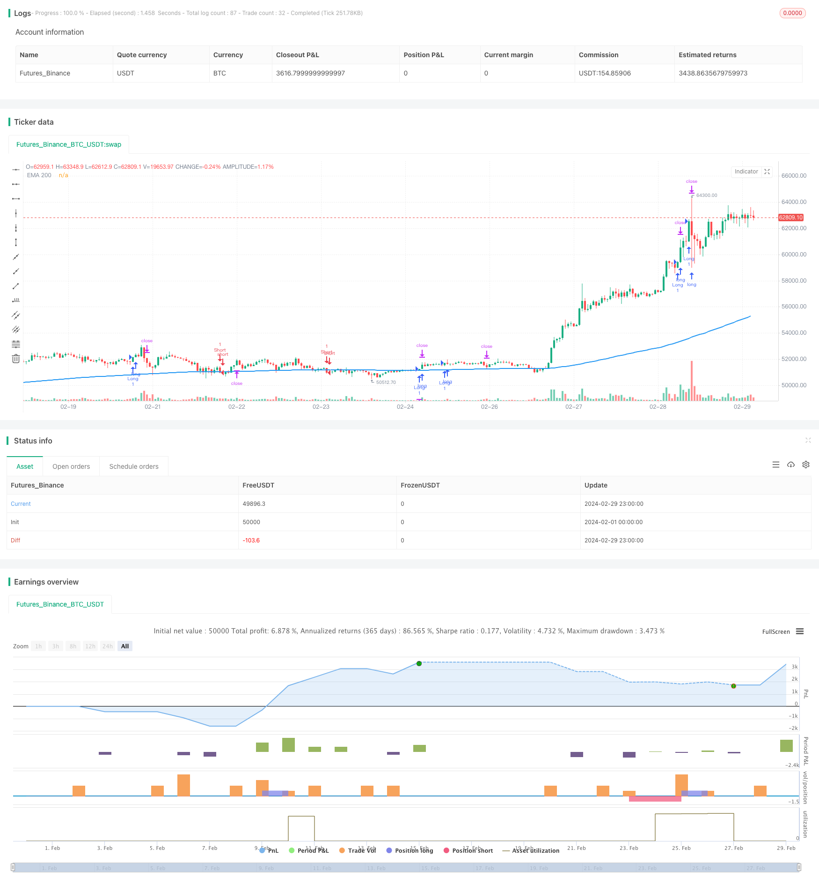

> Name

Trend-Following-Variable-Position-Grid-Strategy
> Author

ChaoZhang

> Strategy Description



[trans]
#### Overview
This strategy is a trend-following variable position grid strategy that mainly uses EMA, RSI and engulfing patterns to determine the trend direction and entry timing. The strategy adjusts the stop loss and take profit positions based on the size of the entity of the engulfing pattern, and allows users to choose to do only long, only short, or both long and short positions. In addition, the strategy also provides the option of MACD as a trend filter.
#### Strategy Principle
This strategy uses the 200-period EMA line to determine the general trend direction. When the price is above the EMA, it is considered to be in an upward trend, and when it is below the EMA, it is considered to be in a downward trend. The 9-period RSI is used to judge momentum. If the RSI is greater than 50, the bulls have stronger momentum, and if it is less than 50, the bears have stronger momentum. Also, the strategy uses bullish and bearish engulfing patterns as entry signals. When the EMA, RSI, and engulfing pattern signals are consistent, the strategy opens a position.
The positions of strategic stop loss and take profit are determined based on the size of the engulfing pattern entity. The stop loss position is twice that of the engulfing entity, and the minimum stop loss range is set to 0.3% of the entry price to avoid frequent stop losses caused by too small a stop loss distance. The stop-loss position multiplies the stop-loss range by the preset profit-loss ratio to ensure a fixed profit-loss ratio. In addition, the strategy provides the option of MACD as a trend filter condition. When the MACD main line is above the signal line, the bullish trend is considered stronger, and vice versa.
#### Strategic Advantages
1. Trend following: The strategy uses multiple indicators to jointly determine the trend, which helps to intervene in the early stage of the trend and capture the trend market.
2. Dynamic stop loss and take profit: adjust the stop loss and take profit position according to the size of the entity of the engulfing pattern, enlarge the stop loss space when the trend is strong, reduce the stop loss range when the trend is weak, and flexibly control the position.
3. Users can customize parameters such as trading direction and risk preference to adapt to different user needs.
4. Provide the option of MACD as a trend filter condition to further confirm the strength of the trend and improve the winning rate of entry.
#### Strategy Risk
1. Trend judgment errors: Although the strategy uses multiple indicators for joint judgment, in some cases, trend judgment errors may still occur, leading to losses.
2. Narrowing of amplitude: If the entity of the engulfing pattern is small, the distance between stop loss and take profit will be very close, resulting in a deterioration of the profit-loss ratio. This situation is more common in volatile markets.
3. Parameter optimization: Under different targets and different cycles, the optimal parameters may vary greatly, requiring users to continuously debug and optimize.
#### Strategy optimization direction
1. Trend judgment: You can try to introduce more trend confirmation tools such as Bollinger Bands, Average Directional Index (ADX), etc. to improve the accuracy of trend judgment.
2. Stop-loss and take-profit optimization: Consider introducing volatility-related indicators such as ATR to dynamically adjust the stop-loss and take-profit distances to reduce risks caused by too small ranges.
3. Position management: Dynamically adjust the position size according to the strength of the trend, account profitability, etc., increase the position when the trend is strong and stable profits, and reduce the costs caused by frequent transactions.
4. Multi-cycle and multi-variety collaboration: Verify trend signals across cycles and varieties, improve the winning rate of trend control, and at the same time diversify the risks of a single target or cycle.
#### Summarize
This trend following variable position grid strategy performs better in trending markets. It uses multiple indicators to jointly determine the direction and intensity of the trend, and dynamically adjusts stop loss, profit and position, so that it can better grasp the trend and obtain excess returns. However, in markets with unclear trends or frequent fluctuations, this strategy performs generally well. Therefore, when using this strategy, you need to focus on screening trend varieties and adjust parameters as the market changes. In addition, there is room for further optimization in terms of trend judgment, stop loss and profit, position management, multi-period and multi-variety collaboration, etc.
|| 

#### Overview

This strategy is a trend-following variable position grid strategy that mainly uses EMA, RSI, and engulfing patterns to determine the trend direction and entry timing. The strategy adjusts the stop-loss and take-profit positions based on the size of the engulfing pattern's body while allowing users to choose to go long only, short only, or both. Additionally, the strategy provides the option to use MACD as a trend filter.

#### Strategy Principles

The strategy uses a 200-period EMA to determine the overall trend direction. When the price is above the EMA, it is considered an uptrend, and when below the EMA, it is considered a downtrend. A 9-period RSI is used to gauge momentum, with an RSI above 50 indicating stronger bullish momentum and below 50 indicating stronger bearish momentum. The strategy also uses bullish and bearish engulfing patterns as entry signals. When the EMA, RSI, and engulfing pattern signals are in agreement, the strategy opens a position.

The stop-loss and take-profit positions are determined based on the size of the engulfing pattern's body. The stop-loss is set at twice the size of the engulfing body, with a minimum stop-loss percentage of 0.3% from the entry price to avoid frequent stop-outs due to small stop-loss distances. The take-profit position is set by multiplying the stop-loss distance by a pre-defined risk-reward ratio to ensure a fixed risk-reward ratio. Additionally, the strategy provides the option to use MACD as a trend filter, considering a stronger bullish trend when the MACD line is above the signal line and a stronger bearish trend when the MACD line is below the signal line.

#### Strategy Advantages

1. Trend following: The strategy uses multiple indicators to determine the trend, helping to enter at the early stages of a trend formation and capture trending moves.

2. Dynamic stop-loss and take-profit: By adjusting the stop-loss and take-profit positions based on the size of the engulfing pattern's body, the strategy expands the take-profit range when the trend is strong and narrows the stop-loss range when the trend is weak, allowing for flexible position management.

3. Users can customize trading direction, risk preferences, and other parameters to suit different user needs.

4. The option to use MACD as a trend filter further confirms trend strength and improves entry accuracy.

#### Strategy Risks

1. Incorrect trend identification: Although the strategy uses multiple indicators to determine the trend, there may still be instances where the trend is incorrectly identified, leading to losses.

2. Narrowing range: If the engulfing pattern's body is small, the stop-loss and take-profit distances will be very close, leading to a deterioration in the risk-reward ratio. This situation is more common in choppy markets.

3. Parameter optimization: The optimal parameters may vary significantly across different instruments and timeframes, requiring users to continuously test and optimize.

#### Strategy Optimization Directions

1. Trend identification: Consider introducing additional trend confirmation tools such as Bollinger Bands, Average Directional Index (ADX), etc., to improve the accuracy of trend identification.

2. Stop-loss and take-profit optimization: Consider incorporating volatility-related indicators such as ATR to dynamically adjust stop-loss and take-profit distances, reducing the risk associated with small ranges.

3. Position sizing: Dynamically adjust position size based on trend strength, account profitability, etc., increasing position size when the trend is strong and consistently profitable, and reducing the cost of frequent trading.

4. Multi-timeframe and multi-instrument coordination: Validate trend signals across timeframes and instruments to improve the accuracy of trend identification while diversifying the risk of a single instrument or timeframe.

#### Summary

This trend-following variable position grid strategy performs well in trending markets by using multiple indicators to determine trend direction and strength, dynamically adjusting stop-loss, take-profit, and position sizing to capture trends and achieve excess returns. However, the strategy's performance is average in unclear or frequently fluctuating markets. Therefore, when using this strategy, it is crucial to focus on selecting trending instruments and adjusting parameters as market conditions change. Furthermore, there is room for further optimization in trend identification, stop-loss and take-profit placement, position sizing, and multi-timeframe and multi-instrument coordination.
[/trans]

> Strategy Arguments


|Argument|Default|Description|
|----|----|----|
|v_input_1|200|EMA Length|
|v_input_2|9|RSI Length|
|v_input_string_1|0|Trend Direction: Both|Short Only|Long Only|
|v_input_3|2|Risk Reward Ratio|
|v_input_bool_1|true|Use MACD Filter|
|v_input_4|5|MACD Timeframe|


> Source (PineScript)

``` pinescript
/*backtest
start: 2024-02-01 00:00:00
end: 2024-02-29 23:59:59
period: 1h
basePeriod: 15m
exchanges: [{"eid":"Futures_Binance","currency":"BTC_USDT"}]
*/

// This Pine Script™ code is subject to the terms of the Mozilla Public License 2.0 at https://mozilla.org/MPL/2.0/
// © niosupetranmartinez
//@version=5
strategy("Trend Follower Scalping Strategy", overlay=true, process_orders_on_close = true)

// Inputs
emaLen = input(200, 'EMA Length')
rsiLen = input(9, 'RSI Length')
trendDirection = input.string("Both", 'Trend Direction', options=["Long Only", "Short Only", "Both"])
risk_reward_ratio = input(2, 'Risk Reward Ratio')
useMacdFilter = input.bool(true, "Use MACD Filter")
macdTimeframe = input("5", "MACD Timeframe")

// EMA and RSI
ema200 = ta.ema(close, emaLen)
customRsi = ta.rsi(close, rsiLen)

// MACD Filter
[macdLine, signalLine, _] = request.security(syminfo.tickerid, macdTimeframe, ta.macd(close, 12, 26, 9))


// Majority Body Candle Identification Function
isMajorityBodyCandle(candleOpen, candleClose, high, low) =>
    bodySize = math.abs(candleClose - candleOpen)
    fullSize = high - low
    bodySize / fullSize > 0.6

// Engulfing Patterns
isBullishEngulfing = close > open and close[1] < open[1] and (close - open) > (open[1] - close[1]) and isMajorityBodyCandle(open, close, high, low)
isBearishEngulfing = close < open and close[1] > open[1] and (open - close) > (close[1] - open[1]) and isMajorityBodyCandle(open, close, high, low)

// Entry Conditions with MACD Filter
longCondition = close > ema200 and customRsi > 50 and isBullishEngulfing and (not useMacdFilter or macdLine > signalLine)
shortCondition = close < ema200 and customRsi < 50 and isBearishEngulfing and (not useMacdFilter or macdLine < signalLine)

// Trade Execution
var float stopLossPrice = na
var float entryPrice = na

// Long Entry
if (longCondition and (trendDirection == "Long Only" or trendDirection == "Both"))
    entryPrice := close
    engulfingBodySize = math.abs(close - open)
    minimumStopLoss = entryPrice * 0.997
    calculatedStopLoss = entryPrice - (engulfingBodySize * 2)
    stopLossPrice := calculatedStopLoss < minimumStopLoss ? calculatedStopLoss : minimumStopLoss
    risk = entryPrice - stopLossPrice
    takeProfitPrice = entryPrice + (risk_reward_ratio * risk)
    strategy.entry("Long", strategy.long)
    strategy.exit("Exit Long", "Long", stop = stopLossPrice, limit = takeProfitPrice)

// Short Entry
if (shortCondition and (trendDirection == "Short Only" or trendDirection == "Both"))
    entryPrice := close
    engulfingBodySize = math.abs(open - close)
    minimumStopLoss = entryPrice * 1.003
    calculatedStopLoss = entryPrice + (engulfingBodySize * 2)
    stopLossPrice := calculatedStopLoss > minimumStopLoss ? calculatedStopLoss : minimumStopLoss
    risk = stopLossPrice - entryPrice
    takeProfitPrice = entryPrice - (risk_reward_ratio * risk)
    strategy.entry("Short", strategy.short)
    strategy.exit("Exit Short", "Short", stop = stopLossPrice, limit = takeProfitPrice)

// Plotting
plot(ema200, color=color.blue, linewidth=2, title="EMA 200")
```

> Detail

https://www.fmz.com/strategy/446547

> Last Modified

2024-03-29 15:23:23
