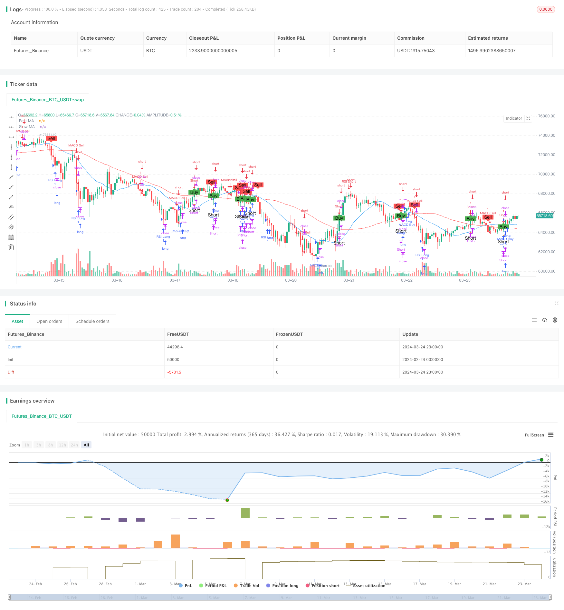

> Name

Trend-Momentum-Based-Multi-Indicator-Moving-Average-Crossover-Strategy based on trend momentum
> Author

ChaoZhang

> Strategy Description


[trans]

## Strategy Overview
The multi-indicator moving average crossover strategy based on trend momentum is a quantitative trading strategy that combines moving averages, the relative strength index (RSI) and the moving average convergence divergence indicator (MACD). This strategy uses the cross signal of two moving averages of different periods as the main trading signal, and combines two commonly used technical indicators, RSI and MACD, for auxiliary judgment to capture market trends and momentum changes and achieve a more robust trading strategy.
## Strategy Principle
The core principle of this strategy is to use the crossover signal of two moving averages of different periods (fast moving average and slow moving average) as the main buying and selling signal. When the fast moving average crosses the slow moving average from bottom to top, a buy signal is generated; conversely, when the fast moving average crosses the slow moving average from top to bottom, a sell signal is generated. This moving average crossover method can better capture changes in market trends.
In addition to moving average crossover signals, this strategy also introduces two technical indicators, RSI and MACD, as auxiliary judgments. RSI is a momentum indicator that measures the overbought and oversold state of the market. When the RSI is greater than 70, it indicates that the market is overbought, and the strategy will open a short position; when the RSI is less than 30, it indicates that the market is oversold, and the strategy will open a long position. MACD is a trend following indicator, consisting of two exponential moving averages (EMA) with different periods. When the MACD fast line crosses the slow line, a buy signal is generated; conversely, when the MACD fast line crosses below the slow line, a sell signal is generated.
In actual transaction execution, when the moving average crosses and MACD simultaneously generates a buy signal, the strategy opens a long position; when the moving average crosses and MACD generates a sell signal at the same time, the strategy closes the position. In addition, when the slow moving average crosses the closing price, the strategy will open a short position. By comprehensively using these technical indicators, this strategy can more comprehensively grasp market trends and momentum changes, and take corresponding trading operations according to different market conditions.
## Strategic Advantages
1. Strong trend tracking ability: Through moving average crossover signals and MACD indicators, this strategy can better capture market trends and trade in compliance with the main trends.
2. Accurate momentum judgment: The introduction of the RSI indicator can identify the overbought and oversold state of the market. Based on the trend judgment, the momentum signal is combined with the trading decision-making, which improves the reliability of the strategy.
3. Improved signal confirmation mechanism: Through the joint confirmation of the three indicators of moving average crossover, MACD and RSI, false signals can be effectively filtered out and the accuracy of the signal can be improved.
4. Strong adaptability: This strategy has certain adaptability to both trending markets and volatile markets, and can dynamically adjust positions in different market environments.
5. Simple implementation: The strategy logic is clear, the technical indicators used are relatively common, and easy to understand and implement.
## Strategy Risk
1. Parameter optimization risk: This strategy involves multiple parameters, such as the moving average period, parameter settings of RSI and MACD, etc. The selection of different parameters may have a greater impact on the performance of the strategy, so the parameters need to be optimized and tested to find the best parameter combination.
2. Market risk: When there are severe market fluctuations or emergencies, this strategy may cause large retracements or losses. In addition, when the market is volatile or has no clear trend, the strategy may not perform as well as in trending markets.
3. Overfitting risk: This strategy performs well on historical data, but there is no guarantee that it will be equally effective in future markets. Strategies may run the risk of overfitting, that is, performing well in-sample but performing poorly out-of-sample.
4. Transaction cost risk: Frequent transactions may generate higher transaction costs, such as slippage, handling fees, etc., which will erode the profit margin of the strategy.
## Optimization direction
1. Dynamically adjust parameters: Strategy parameters, such as moving average cycles, RSI and MACD thresholds, can be dynamically adjusted according to changes in market conditions to adapt to different market environments. This improves the adaptability and robustness of the strategy.
2. Introduce risk control measures: You can reduce the drawdown and risk exposure of the strategy by setting risk control measures such as stop loss and profit, position management, etc. For example, position sizes can be dynamically adjusted based on market volatility, reducing positions when volatility intensifies and increasing positions when volatility eases.
3. Combine with other technical indicators or methods: You can consider introducing other technical indicators or methods, such as Bollinger Bands, volatility indicators, etc., to enrich the signal sources of the strategy and improve the robustness and profitability of the strategy.
4. Optimize transaction execution: You can reduce transaction costs and market impact and improve strategy execution efficiency by optimizing transaction execution algorithms, such as using limit orders, TWAP, VWAP and other algorithms.
5. Strengthen strategy monitoring and evaluation: conduct real-time monitoring and regular evaluation of strategies, timely discover and solve problems in strategies, and timely adjust strategies according to market changes to maintain the effectiveness and stability of strategies.
## Summarize
The multi-indicator moving average crossover strategy based on trend momentum is a quantitative trading strategy that comprehensively uses technical indicators such as moving averages, RSI and MACD. This strategy uses moving average crossover signals as the main buying and selling signals, and combines RSI and MACD indicators for auxiliary judgment to capture market trends and momentum changes. The advantages of the strategy include strong trend tracking ability, accurate momentum judgment, complete signal confirmation mechanism, strong adaptability and simple implementation. However, this strategy also has certain risks, such as parameter optimization risk, market risk, over-fitting risk and transaction cost risk. In order to further improve the strategy, you can consider dynamically adjusting parameters, introducing risk control measures, combining other technical indicators or methods, optimizing transaction execution, and strengthening strategy monitoring and evaluation. In general, the multi-indicator moving average crossover strategy based on trend momentum is a relatively mature and practical quantitative trading strategy, but in practical application it needs to be appropriately adjusted and optimized according to the specific market environment and trading objectives in order to maximize the potential of the strategy and control possible risks.
|| 

## Strategy Overview

The Trend Momentum-Based Multi-Indicator Moving Average Crossover Strategy is a quantitative trading strategy that combines moving averages, the Relative Strength Index (RSI), and the Moving Average Convergence Divergence (MACD) indicator. The strategy utilizes the crossover signals of two moving averages with different periods as the primary trading signals, while also incorporating RSI and MACD, two commonly used technical indicators, for auxiliary judgment. This approach aims to capture market trends and momentum changes, resulting in a relatively robust trading strategy.

## Strategy Principles

The core principle of this strategy is to use the crossover signals of two moving averages with different periods (fast moving average and slow moving average) as the main buy and sell signals. When the fast moving average crosses above the slow moving average from below, it generates a buy signal; conversely, when the fast moving average crosses below the slow moving average from above, it generates a sell signal. This method of moving average crossover can effectively capture changes in market trends.

In addition to the moving average crossover signals, the strategy also introduces RSI and MACD as auxiliary judgment indicators. RSI is a momentum indicator that measures overbought and oversold conditions in the market. When RSI is above 70, it indicates an overbought market condition, and the strategy will open a short position. When RSI is below 30, it indicates an oversold market condition, and the strategy will open a long position. MACD, on the other hand, is a trend-following indicator consisting of two exponential moving averages (EMAs) with different periods. When the MACD fast line crosses above the slow line, it generates a buy signal; conversely, when the MACD fast line crosses below the slow line, it generates a sell signal.

In actual trade execution, when both the moving average crossover and MACD generate buy signals simultaneously, the strategy opens a long position. When both the moving average crossover and MACD generate sell signals simultaneously, the strategy closes the position. Additionally, when the slow moving average crosses below the closing price, the strategy opens a short position. By comprehensively utilizing these technical indicators, the strategy can grasp market trends and momentum changes more thoroughly and take corresponding trading actions based on different market conditions.

## Strategy Advantages

1. Strong trend-tracking capability: Through moving average crossover signals and the MACD indicator, the strategy can effectively capture market trends and trade in line with the primary trend.

2. Accurate momentum judgment: By incorporating the RSI indicator, the strategy can identify overbought and oversold market conditions. Based on trend judgment and momentum signals, it makes trading decisions, improving the reliability of the strategy.

3. Robust signal confirmation mechanism: The strategy confirms signals through the combination of moving average crossover, MACD, and RSI indicators, effectively filtering out false signals and enhancing signal accuracy.

4. Strong adaptability: The strategy has a certain level of adaptability to both trending and oscillating markets, allowing it to dynamically adjust positions in different market environments.

5. Simple implementation: The strategy logic is clear and uses common technical indicators, making it easy to understand and implement.

## Strategy Risks

1. Parameter optimization risk: The strategy involves multiple parameters, such as moving average periods and parameter settings for RSI and MACD. The choice of different parameters can have a significant impact on strategy performance. Therefore, it is necessary to optimize and test parameters to find the optimal parameter combination.

2. Market risk: When the market experiences intense fluctuations or unexpected events, the strategy may generate significant drawdowns or losses. Additionally, the strategy's performance may not be as effective in oscillating or trendless markets compared to trending markets.

3. Overfitting risk: The strategy's strong performance on historical data does not guarantee its effectiveness in future markets. The strategy may be subject to overfitting risk, where it performs exceptionally well in-sample but poorly out-of-sample.

4. Trading cost risk: Frequent trading can result in high trading costs, such as slippage and commissions, which can erode the strategy's profitability.

## Optimization Directions

1. Dynamic parameter adjustment: Based on changes in market conditions, the strategy parameters, such as moving average periods and RSI and MACD thresholds, can be dynamically adjusted to adapt to different market environments. This can improve the strategy's adaptability and robustness.

2. Introduction of risk control measures: Risk control measures, such as stop-loss and take-profit orders and position management, can be implemented to reduce the strategy's drawdowns and risk exposure. For example, position sizes can be dynamically adjusted based on market volatility, reducing positions during increased volatility and increasing positions during subdued volatility.

3. Combination with other technical indicators or methods: Other technical indicators or methods, such as Bollinger Bands and volatility indicators, can be considered to enrich the strategy's signal sources and improve its robustness and profitability.

4. Optimization of trade execution: Trade execution algorithms, such as limit orders, TWAP, and VWAP algorithms, can be optimized to reduce trading costs and market impact, improving the strategy's execution efficiency.

5. Enhanced strategy monitoring and evaluation: Real-time monitoring and periodic evaluation of the strategy can help identify and resolve issues promptly. The strategy should be adjusted based on market changes to maintain its effectiveness and stability.

## Summary

The Trend Momentum-Based Multi-Indicator Moving Average Crossover Strategy is a quantitative trading strategy that combines moving averages, RSI, and MACD technical indicators. The strategy uses moving average crossover signals as the primary buy and sell signals, while also incorporating RSI and MACD indicators for auxiliary judgment to capture market trends and momentum changes. The advantages of the strategy include strong trend-tracking capability, accurate momentum judgment, a robust signal confirmation mechanism, strong adaptability, and simple implementation. However, the strategy also faces certain risks, such as parameter optimization risk, market risk, overfitting risk, and trading cost risk. To further improve the strategy, considerations can be made in areas such as dynamic parameter adjustment, introduction of risk control measures, combination with other technical indicators or methods, optimization of trade execution, and enhanced strategy monitoring and evaluation. Overall, the Trend Momentum-Based Multi-Indicator Moving Average Crossover Strategy is a relatively mature and practical quantitative trading strategy. However, in actual application, appropriate adjustments and optimizations should be made based on specific market environments and trading objectives to maximize the strategy's potential and control potential risks.[/trans]

> Strategy Arguments


|Argument|Default|Description|
|----|----|----|
|v_input_1|20|Fast MA Length|
|v_input_2|50|Slow MA Length|
|v_input_3|14|RSI Length|
|v_input_4|70|RSI Overbought Level|
|v_input_5|30|RSI Oversold Level|


> Source (PineScript)

``` pinescript
/*backtest
start: 2024-02-24 00:00:00
end: 2024-03-25 00:00:00
period: 1h
basePeriod: 15m
exchanges: [{"eid":"Futures_Binance","currency":"BTC_USDT"}]
*/

//@version=4
strategy("Enhanced Moving Average Crossover Strategy", overlay=true)

// Define input parameters
fastLength = input(20, title="Fast MA Length")
slowLength = input(50, title="Slow MA Length")

// Calculate moving averages
fastMA = sma(close, fastLength)
slowMA = sma(close, slowLength)

// Generate buy and sell signals
buySignal = crossover(close, slowMA)
sellSignal = crossunder(close, slowMA)

// RSI (Relative Strength Index)
rsiLength = input(14, title="RSI Length")
rsiOverbought = input(70, title="RSI Overbought Level")
rsiOversold = input(30, title="RSI Oversold Level")
rsi = rsi(close, rsiLength)

// MACD (Moving Average Convergence Divergence)
[macdLine, signalLine, _] = macd(close, 12, 26, 9)
macdBuySignal = crossover(macdLine, signalLine)
macdSellSignal = crossunder(macdLine, signalLine)

// Plot moving averages
plot(fastMA, color=color.blue, title="Fast MA")
plot(slowMA, color=color.red, title="Slow MA")

// Highlight buy and sell signals
plotshape(buySignal, style=shape.labelup, color=color.green, text="Buy", title="Buy Signal")
plotshape(sellSignal, style=shape.labeldown, color=color.red, text="Sell", title="Sell Signal")

// Execute strategy based on signals
strategy.entry("Long", strategy.long, when=buySignal)
strategy.close("Long", when=sellSignal)

// Add short signals
shortSignal = crossunder(slowMA, close)
plotshape(shortSignal, style=shape.triangleup, location=location.belowbar, color=color.orange, text="Short", title="Short Signal")
strategy.entry("Short", strategy.short, when=shortSignal)
strategy.close("Short", when=buySignal)

// RSI-based conditions
if (rsi > rsiOverbought)
    strategy.entry("RSI Short", strategy.short)
if (rsi < rsiOversold)
    strategy.entry("RSI Long", strategy.long)

// MACD-based conditions
if (macdBuySignal)
    strategy.entry("MACD Buy", strategy.long)
if (macdSellSignal)
    strategy.entry("MACD Sell", strategy.short)

```

> Detail

https://www.fmz.com/strategy/446232

> Last Modified

2024-03-26 17:17:46
