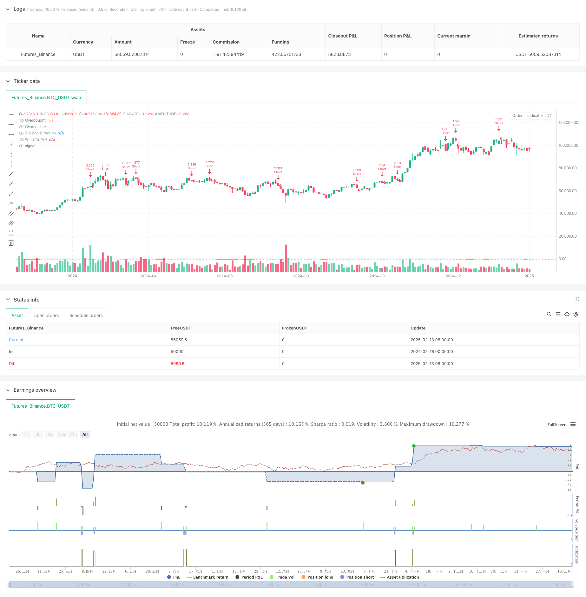

> Name

Trend-Momentum-Strategy-Multi-Period-Dynamic-ZigZag-Wave-Timing-System
> Author

ChaoZhang

> Strategy Description



[trans]
#### Overview
This strategy is a multi-dimensional trading system that combines the ZigZag indicator and the William indicator (%R). Use the ZigZag indicator to identify important swing highs and lows, while using the William indicator to confirm entry points when the market reaches overbought or oversold conditions. This combination not only captures the market's major trend turning points, but also improves trading accuracy through momentum confirmation.
#### Strategy Principle
The core logic of the strategy is based on two main components:
1. The Zigzag indicator identifies significant high and low points of the band through the set depth and deviation parameters, filters out market noise, and determines the trend direction. A new swing low indicates the beginning of an uptrend, and a new swing high indicates the beginning of a downtrend.
2. The William indicator calculates the momentum state of the market by comparing the current price with the highest price within a specific period. When the indicator value exceeds -80, it indicates oversold (potential buying opportunity), and when it exceeds -20, it indicates overbought (potential selling opportunity).
The trading rules of the strategy are as follows:
- Long conditions: The Zigzag indicator identifies a new swing low and the William indicator breaks upward from the oversold area
- Short conditions: Zigzag indicator identifies new swing high and William indicator breaks down from overbought area
- Stop loss is set to 1% and take profit is set to 2%
#### Strategic Advantages
1. Multi-dimensional confirmation: Improve the reliability of trading signals through dual confirmation of trend and momentum
2. Strong adaptability: the deviation parameter of the zigzag indicator can be dynamically adjusted according to market volatility
3. Perfect risk control: adopt a fixed percentage stop-loss and take-profit strategy to control the risk of each transaction
4. Good visualization effect: clearly display trading signals through labels and graphics, which facilitates analysis and optimization
#### Strategy Risk
1. Risk of market shock: Frequent false breakthrough signals may occur in sideways markets
2. Slippage risk: You may face larger slippage in rapid market conditions
3. Parameter sensitivity: The selection of indicator parameters has a greater impact on strategy performance
4. Signal lag: Due to the need to confirm the formation of new band points, some rapid market trends may be missed.
#### Strategy optimization direction
1. Add market environment filtering: you can add volatility indicators to identify market status, and use different parameter settings in different environments
2. Dynamic stop loss optimization: the stop loss position can be dynamically adjusted based on ATR or volatility
3. Introduce volume confirmation: add volume verification when the signal is generated
4. Time filtering: You can add trading time period filtering to avoid trading during periods of greater volatility.
#### Summary
This is a complete trading system that combines trend following and momentum trading. Through the synergy of multiple technical indicators, risks can be effectively controlled while maintaining a high winning rate. Although there is a certain lag, stable trading effects can be achieved through reasonable parameter optimization and risk management. This strategy is particularly suitable for mid- to long-term trend conditions and performs better when there are obvious directional opportunities in the market. ||
#### Overview
This strategy is a multi-dimensional trading system that combines the ZigZag indicator with the Williams %R indicator. It identifies significant swing highs and lows using the ZigZag indicator while confirming entry points with the Williams %R when the market reaches overbought or oversold conditions. This combination captures major market trend reversals while using momentum confirmation to improve trading accuracy.

#### Strategy Principles
The core logic is based on two main components:
1. The ZigZag indicator identifies significant swing points using depth and deviation parameters to filter market noise and determine trend direction. A new swing low indicates the start of an uptrend, while a new swing high indicates the start of a downtrend.
2. The Williams %R indicator calculates market momentum by comparing current price to the highest price within a specific period. Values crossing above -80 indicate oversold conditions (potential buy), while crossing below -20 indicate overbought conditions (potential sell).

Trading rules are as follows:
- Long Entry: ZigZag identifies a new swing low and Williams %R crosses up from oversold zone
- Short Entry: ZigZag identifies a new swing high and Williams %R crosses down from overbought zone
- Stop Loss is set at 1% and Take Profit at 2%

#### Strategy Advantages
1. Multi-dimensional confirmation: Improved signal reliability through trend and momentum verification
2. Strong adaptability: ZigZag deviation parameters can be dynamically adjusted based on market volatility
3. Comprehensive risk control: Fixed percentage stop-loss and take-profit strategy controls risk per trade
4. Excellent visualization: Clear display of trading signals through labels and graphics for analysis and optimization

#### Strategy Risks
1. Choppy market risk: May generate frequent false breakout signals in sideways markets
2. Slippage risk: Potentially significant slippage in fast-moving markets
3. Parameter sensitivity: Strategy performance heavily depends on indicator parameter selection
4. Signal lag: May miss some quick moves due to the need for new swing point confirmation

#### Optimization Directions
1. Add market environment filtering: Incorporate volatility indicators to identify market conditions and use different parameters accordingly
2. Dynamic stop-loss optimization: Adjust stop-loss positions based on ATR or volatility
3. Volume confirmation integration: Add volume verification when generating signals
4. Time filtering: Add trading time period filters to avoid highly volatile sessions

#### Summary
This is a complete trading system combining trend following and momentum trading. Through the synergy of multiple technical indicators, it maintains a high win rate while effectively controlling risk. Although there is some lag, stable trading results can be achieved through proper parameter optimization and risk management. The strategy is particularly suitable for medium to long-term trend markets and performs better when there are clear directional opportunities.[/trans]


> Source (PineScript)

``` pinescript
/*backtest
start: 2024-02-18 00:00:00
end: 2025-02-15 08:00:00
period: 2d
basePeriod: 2d
exchanges: [{"eid":"Futures_Binance","currency":"BTC_USDT"}]
*/

//@version=6
strategy("Zig Zag + Williams %R Strategy", overlay=true, default_qty_type=strategy.percent_of_equity, default_qty_value=300)

// ====================
// === Parameters
// ====================

// Zig Zag parameters
zigzag_depth = input.int(5, title="Zig Zag Depth", minval=1)
zigzag_deviation = input.float(1.0, title="Zig Zag Deviation (%)", minval=0.1, step=0.1)

// Williams %R parameters
williams_length = input.int(14, title="Williams %R Length", minval=1)
williams_overbought = input.int(-20, title="Williams %R Overbought", minval=-100, maxval=0)
williams_oversold = input.int(-80, title="Williams %R Oversold", minval=-100, maxval=0)

// ====================
// === Zig Zag Calculation
// ====================

// Initialize variables
var float last_pivot_high = na
var float last_pivot_low = na
var int zz_dir = 0  // 1 for uptrend, -1 for downtrend

// Calculate pivots
pivot_high = ta.pivothigh(high, zigzag_depth, zigzag_depth)
pivot_low = ta.pivotlow(low, zigzag_depth, zigzag_depth)

// Update Zig Zag direction and last pivots with deviation
if (not na(pivot_high))
    if (zz_dir != -1)  // Only change to downtrend if not already in downtrend
        if (na(last_pivot_high) or (high[zigzag_depth] > last_pivot_high * (1 + zigzag_deviation / 100)))
            last_pivot_high := high[zigzag_depth]
            zz_dir := -1
            label.new(bar_index[zigzag_depth], high[zigzag_depth], text="PH", color=color.red, style=label.style_label_down)

if (not na(pivot_low))
    if (zz_dir != 1)  // Only change to uptrend if not already in uptrend
        if (na(last_pivot_low) or (low[zigzag_depth] < last_pivot_low * (1 - zigzag_deviation / 100)))
            last_pivot_low := low[zigzag_depth]
            zz_dir := 1
            label.new(bar_index[zigzag_depth], low[zigzag_depth], text="PL", color=color.green, style=label.style_label_up)

// ====================
// === Williams %R Calculation
// ====================

// Calculate Williams %R manually
highest_high = ta.highest(high, williams_length)
lowest_low = ta.lowest(low, williams_length)
williams_r = (highest_high - close) / (highest_high - lowest_low) * -100

// ====================
// === Trade Conditions
// ====================

// Assign crossover and crossunder results to variables
crossover_williams = ta.crossover(williams_r, williams_oversold)
crossunder_williams = ta.crossunder(williams_r, williams_overbought)

// Define trade conditions
longCondition = (zz_dir == 1) and crossover_williams
shortCondition = (zz_dir == -1) and crossunder_williams

// ====================
// === Trading
// ====================

// Enter Long
if (longCondition)
    strategy.entry("Long", strategy.long)
    label.new(bar_index, low, text="BUY", color=color.green, style=label.style_label_up)

// Enter Short
if (shortCondition)
    strategy.entry("Short", strategy.short)
    label.new(bar_index, high, text="SELL", color=color.red, style=label.style_label_down)

// ====================
// === Visualization
// ====================

// Plot Zig Zag pivot shapes
plotshape(series=(not na(pivot_high) and high[zigzag_depth] == last_pivot_high), title="Swing High", location=location.abovebar, color=color.red, style=shape.triangledown, size=size.small, text="ZZ High")
plotshape(series=(not na(pivot_low) and low[zigzag_depth] == last_pivot_low), title="Swing Low", location=location.belowbar, color=color.green, style=shape.triangleup, size=size.small, text="ZZ Low")

// Plot Williams %R
hline(williams_overbought, "Overbought", color=color.red, linestyle=hline.style_dashed)
hline(williams_oversold, "Oversold", color=color.green, linestyle=hline.style_dashed)
plot(williams_r, title="Williams %R", color=color.blue)

// Debug plot for Zig Zag direction
plot(zz_dir, title="Zig Zag Direction", color=color.orange, linewidth=2)

// ====================
// === Risk Management
// ====================

// Risk parameters
stop_loss_perc = input.float(1.0, title="Stop Loss (%)") / 100
take_profit_perc = input.float(2.0, title="Take Profit (%)") / 100

// Stop Loss and Take Profit for Long
if (longCondition)
    strategy.exit("Long Exit", from_entry="Long", stop=close * (1 - stop_loss_perc), limit=close * (1 + take_profit_perc))

// Stop Loss and Take Profit for Short
if (shortCondition)
    strategy.exit("Short Exit", from_entry="Short", stop=close * (1 + stop_loss_perc), limit=close * (1 - take_profit_perc))

```

> Detail

https://www.fmz.com/strategy/482419

> Last Modified

2025-02-18 13:29:06
