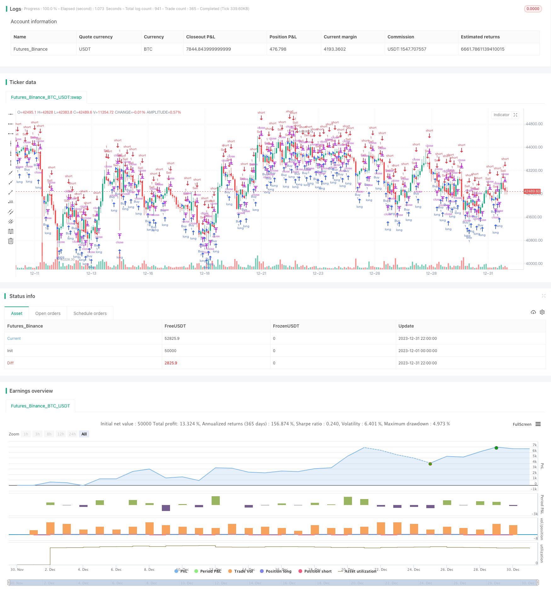

> Name

Trend-Strength-Confirm-Bars-Strategy
> Author

ChaoZhang

> Strategy Description


[trans]
Overview:
This strategy determines the trend direction through the closing prices of N consecutive K lines, and generates trading signals when the closing prices of N consecutive K lines meet the conditions. The size of N is set by the confirmBars input parameter. This strategy mainly uses the direction of the closing prices of N consecutive K lines to determine the strength of the trend. The larger N means that more K lines are needed to confirm the trend, which can filter out false breakthroughs, but it may also miss the early stage of the trend.
Principle:
The strategy determines the strength of the price increase or decrease by tracking the relationship between the closing price of the last K line and the previous K line. Specifically, it defines two variables bcount and count, which respectively record the number of consecutive closing price increases and consecutive closing price decreases.
When bcount reaches the value set by confirmBars, it means that the closing price of the K-line of consecutive confirmBars rises, generating a buy signal. When count reaches the value set by confirmBars, it means that the closing price of the K-line of consecutive confirmBars falls, generating a sell signal.
In this way, by judging the closing price direction of several consecutive K lines, the noise of short-term market fluctuations can be effectively filtered, and trading signals can only be generated under relatively strong trends.
Advantage analysis:
1. Can effectively filter noise and confirm trends
This strategy requires that trading signals be generated only when the closing prices of N consecutive K lines meet the conditions. It can filter the impact of normal market fluctuations on transactions and ensure that positions are only opened under stronger trends.
2. Parameters can adjust the filtering strength
By adjusting the parameter size of confirmBars, you can control the intensity of filtering price fluctuations. The larger the parameter, the better the noise filtering effect, but it is also easy to miss the early opportunities of the trend.
Risk analysis:
1. May miss early opportunities in the trend
The strategy requires the closing prices of multiple consecutive K lines to match before a signal is generated. Therefore, the early opportunities of the trend are often missed and the trend cannot be tracked in time.
2. Easy to break through stop loss
When the confirmBars setting is too large, it is easy to be misled by the reverse short-term in the early stage of the trend, causing the stop loss to be exceeded and exited.
Optimization direction:
1. Combine with other indicators to filter out false breakthroughs
It can be combined with other technical indicators, such as Bollinger Bands, RSI, etc., to perform secondary filtering of buying and selling signals to reduce the possibility of false breakthroughs.
2. Dynamically adjust parameters
You can also try to dynamically adjust the confirmBars parameters according to market conditions. When the market is turbulent, increase the parameter value to filter the noise; and when the trend is obvious, decrease the parameter value to track the trend.
Summary:
This strategy achieves the effect of filtering shocks and confirming trends by judging the closing price direction of several consecutive K lines. It can effectively reduce erroneous transactions caused by short-term market fluctuations and only generate trading signals when the trend is obvious. By adjusting the parameter size of confirmBars, users can balance the relationship between filtering effects and opportunities to capture trends. However, this strategy is prone to being stopped out at the early stage of the trend and cannot continue to track the trend. It is recommended to optimize in combination with other indicators, or try to dynamically adjust parameters to pursue better returns.
||

Overview:
This strategy judges the trend direction based on the closing price direction of consecutive N candlesticks. Trading signals are generated when the closing prices of N consecutive candlesticks meet the condition. The size of N is set by the confirmBars input parameter. This strategy mainly utilizes the direction of consecutive N candlestick closing prices to determine the strength of the trend. Larger N requires more candlesticks to confirm the trend, which can filter out false breakouts but may also miss the early stage of trends.

Principle:  
The strategy tracks the relationship between the closing prices of the last candlestick and the previous one to judge the strength of price rises and falls. Specifically, it defines two variables bcount and scount to record the number of consecutive candlestick closing prices that rise and fall.  

When bcount reaches the value set by confirmBars, it means that the closing prices of confirmBars consecutive candlesticks have risen, generating a buy signal. When scount reaches the value set by confirmBars, it means that the closing prices of confirmBars consecutive candlesticks have fallen, generating a sell signal.  

By judging the direction of the closing prices of consecutive multiple candlesticks, short-term market fluctuations can be effectively filtered out, and trading signals are only generated under trends of relatively large strength.

Advantage Analysis:
1. Effectively filter out noise and confirm trends  
This strategy requires consecutive N candlesticks closing prices to meet the conditions before generating trading signals. This filters out the impact of normal market fluctuations on trading and ensures that positions are opened only under strong trends.  

2. Adjustable filtering strength parameters
By adjusting the size of the confirmBars parameter, the strength of filtering price fluctuations can be controlled. Larger parameters have better filtering effects on noise, but may also miss early trend opportunities.

Risk Analysis:  
1. May miss early trend opportunities
The strategy requires multiple consecutive candlesticks closing prices to meet conditions before generating signals, so it often misses early trend opportunities and cannot track trends in a timely manner.  

2. Prone to stop loss breakout
When the number of confirmations confirmBars is set too large, it is easy to be misled by reverse short-term lines in the early stage of the trend, resulting in stop loss breakouts.

Optimization Directions:
1. Filter fake breakouts with other indicators  
Other technical indicators such as Bollinger Bands and RSI can be used to perform secondary filtering on buy and sell signals to reduce the possibility of fake breakouts.  

2. Dynamically adjust parameters
Try to dynamically adjust the confirmBars parameter based on market conditions. Increase the parameter value in volatile markets to filter out noise; decrease the parameter value when the trend is obvious to track the trend.

Summary:  
This strategy achieves the effect of filtering shocks and confirming trends by judging the direction of closing prices of multiple consecutive candlesticks. It can effectively reduce erroneous trades caused by short-term market fluctuations and only generate trading signals when trends are obvious. By adjusting the size of the confirmBars parameter, users can balance the relationship between filtering effects and capturing trend opportunities. However, this strategy is prone to being stopped out early in trend initiation and fails to continuously track trends. It is recommended to optimize with other indicators or try dynamic parameter adjustment to pursue better returns.

[/trans]

> Strategy Arguments


|Argument|Default|Description|
|----|----|----|
|v_input_1|true|confirmBars|
|v_input_int_1|2019|Backtest Start Year|
|v_input_int_2|true|Backtest Start Month|
|v_input_int_3|true|Backtest Start Day|
|v_input_int_4|2023|Backtest End Year|
|v_input_int_5|12|Backtest End Month|
|v_input_int_6|31|Backtest End Day|


> Source (PineScript)

``` pinescript
/*backtest
start: 2023-12-01 00:00:00
end: 2023-12-31 23:59:59
period: 2h
basePeriod: 15m
exchanges: [{"eid":"Futures_Binance","currency":"BTC_USDT"}]
*/

//@version=5
strategy("Confirm Bars Strategy [TS Trader]", overlay=true)

confirmBars = input(1)

// === INPUT BACKTEST RANGE ===
fromYear = input.int(2019, title="Backtest Start Year")
fromMonth = input.int(1, title="Backtest Start Month", minval=1, maxval=12)
fromDay = input.int(1, title="Backtest Start Day", minval=1, maxval=31)
toYear = input.int(2023, title="Backtest End Year")
toMonth = input.int(12, title="Backtest End Month", minval=1, maxval=12)
toDay = input.int(31, title="Backtest End Day", minval=1, maxval=31)

startTimestamp = timestamp(fromYear, fromMonth, fromDay, 00, 00)
endTimestamp = timestamp(toYear, toMonth, toDay, 23, 59)

inBacktestRange = true

// === STRATEGY LOGIC ===
bcount = 0
bcount := close[1] < close ? nz(bcount[1]) + 1 : 0
if (bcount == confirmBars and inBacktestRange)
    strategy.entry("Buy", strategy.long, comment="Long")

scount = 0
scount := close[1] > close ? nz(scount[1]) + 1 : 0
if (scount == confirmBars and inBacktestRange)
    strategy.entry("Sell", strategy.short, comment="Short")
```

> Detail

https://www.fmz.com/strategy/438946

> Last Modified

2024-01-16 15:22:53
