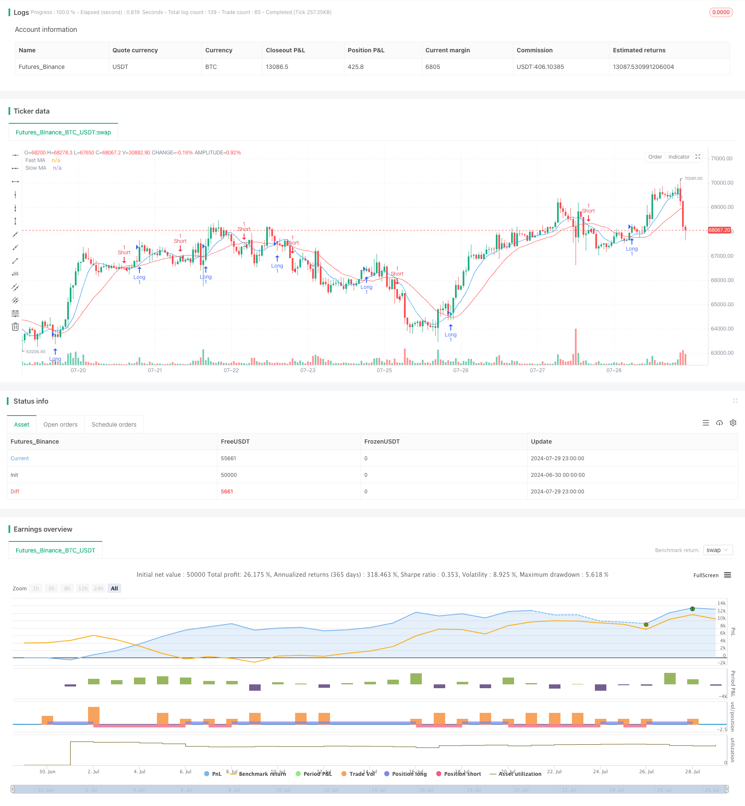

> Name

Trend-Structure-Break-with-Order-Block-and-Fair-Value-Gap-Strategy
> Author

ChaoZhang

> Strategy Description



[trans]
#### Overview
This strategy is a comprehensive trading system that combines the concepts of trend following, structural breakouts, order blocks, and fair value gaps. It uses fast and slow moving averages to determine market trends while looking for breaking points in the price structure. Additionally, the strategy identifies important order blocks and fair value gaps, which are potential areas of support and resistance. By integrating these technical analysis concepts, this strategy is designed to capture strong market moves while providing additional trading signals at key price levels.
#### Strategy Principle
1. Trend identification: Use the 9-period and 21-period simple moving averages (SMA) to identify market trends. When the fast SMA is higher than the slow SMA, it is considered a bullish trend; vice versa, it is a bearish trend.
2. Breakout of Structural (BOS): The strategy tracks the highest high and lowest low over a 10-period period. When price breaks through these levels, it is considered a structural breakout and marked with a label.
3. Order Blocks: The strategy identifies potential order blocks when a structural breakout occurs. These areas are considered important supply and demand areas that may act as support or resistance in the future.
4. Fair Value Gap (FVG): When price breaks out rapidly, the strategy identifies potential fair value gaps. These gaps are considered areas where the market may backfill.
5. Entry signals: The strategy uses the crossover of fast and slow moving averages to generate entry signals. When the fast MA crosses above the slow MA, a long signal is triggered; when the fast MA crosses below the slow MA, a short signal is triggered.
#### Strategic Advantages
1. Multi-dimensional analysis: This strategy combines multiple technical analysis concepts to provide a more comprehensive market perspective and help make more informed trading decisions.
2. Trend following and reversal: By combining moving averages and structural breakouts, the strategy can both follow the main trend and capture potential reversal opportunities.
3. Key Price Level Identification: The concepts of order blocks and fair value gaps help traders identify important support and resistance levels that may influence future price movements.
4. Visualization tools: The strategy uses labels, boxes, and lines to visualize key information, allowing traders to quickly understand market structure.
5. Flexibility: With adjustable parameters such as moving average periods and thresholds, the strategy can adapt to different market conditions and trading styles.
#### Strategy Risk
1. False breakthroughs: In volatile markets, false breakthroughs may occur, resulting in false trading signals.
2. Lagging: The moving average is essentially a lagging indicator and may not react in a timely manner in a rapidly changing market.
3. Over-reliance on technical indicators: Reliance only on technical indicators and ignoring fundamental analysis may lead to wrong decisions when important economic events or news are released.
4. Parameter sensitivity: The performance of the strategy may be very sensitive to input parameters and requires careful optimization and backtesting.
5. Lack of stop-loss mechanism: The current strategy does not have a clear stop-loss mechanism, which may lead to excessive losses in adverse market conditions.
#### Strategy optimization direction
1. Introduce dynamic stop loss: Consider adding a dynamic stop loss mechanism based on ATR or recent volatility to better manage risk.
2. Integrate volume analysis: Incorporating volume indicators into the strategy can help confirm the strength of the trend and the effectiveness of the breakthrough.
3. Optimize entry timing: Consider adding additional filtering conditions, such as RSI or MACD, on the basis of moving average crossovers to reduce false signals.
4. Backtest different timeframes: Test the strategy on different timeframes to find the best-performing setup.
5. Add a fundamental filter: Consider incorporating some fundamental indicators or an economic calendar to avoid trading around important news releases.
6. Improve order blocks and FVG logic: Consider using more complex algorithms to identify more accurate order blocks and fair value gaps.
7. Achieve partial profit acquisition: When reaching certain profit targets, consider partially closing positions to lock in profits and reduce retracement.
#### Summarize
"Trend Structure Breakout and Order Block Fair Value Gap Strategy" is a comprehensive technical analysis trading system that combines multiple advanced trading concepts. By integrating trend following, structural breakouts, order blocks and fair value gaps, this strategy provides a comprehensive market analysis framework. Its advantage lies in multi-dimensional market insights and flexible parameter settings, allowing it to adapt to different market environments. However, like all trading strategies, it is subject to the risk of false breakouts and over-reliance on technical indicators. This strategy has the potential to further improve its performance and robustness by introducing dynamic stops, integrating volume analysis and optimizing entry logic. This strategy provides a great starting point and framework for traders seeking to build a comprehensive trading system based on technical analysis.
|| 

#### Overview

This strategy is a comprehensive trading system that combines trend following, structure breakouts, order blocks, and fair value gaps. It uses fast and slow moving averages to determine market trends while looking for breakout points in price structure. Additionally, the strategy identifies significant order blocks and fair value gaps, which are potential support and resistance areas. By integrating these technical analysis concepts, the strategy aims to capture strong market movements while providing additional trading signals at key price levels.

#### Strategy Principles

1. Trend Identification: Uses 9-period and 21-period Simple Moving Averages (SMA) to determine market trends. A bullish trend is identified when the fast SMA is above the slow SMA, and vice versa for bearish trends.

2. Break of Structure (BOS): The strategy tracks the highest high and lowest low over 10 periods. When price breaks these levels, it's considered a structure break and is marked with a label.

3. Order Blocks: When a structure break occurs, the strategy identifies potential order blocks. These areas are seen as significant supply and demand zones that may act as support or resistance in the future.

4. Fair Value Gaps (FVG): When price breaks out rapidly, the strategy identifies potential fair value gaps. These gaps are considered areas where the market might retrace to fill.

5. Entry Signals: The strategy uses crossovers of the fast and slow moving averages to generate entry signals. A long signal is triggered when the fast MA crosses above the slow MA, and a short signal when the fast MA crosses below the slow MA.

#### Strategy Advantages

1. Multi-dimensional Analysis: The strategy combines multiple technical analysis concepts, providing a more comprehensive market perspective to make informed trading decisions.

2. Trend Following and Reversal: By combining moving averages and structure breaks, the strategy can both follow major trends and capture potential reversal opportunities.

3. Key Price Level Identification: The concepts of order blocks and fair value gaps help traders identify important support and resistance levels that may influence future price movements.

4. Visualization Tools: The strategy uses labels, boxes, and lines to visualize key information, allowing traders to quickly understand market structure.

5. Flexibility: With adjustable parameters such as moving average periods and thresholds, the strategy can be adapted to different market conditions and trading styles.

#### Strategy Risks

1. False Breakouts: In volatile markets, false breakouts may occur, leading to incorrect trading signals.

2. Lagging Indicators: Moving averages are inherently lagging indicators and may not react quickly enough in fast-changing markets.

3. Over-reliance on Technical Indicators: Relying solely on technical indicators while ignoring fundamental analysis may lead to poor decisions during significant economic events or news releases.

4. Parameter Sensitivity: The strategy's performance may be highly sensitive to input parameters, requiring careful optimization and backtesting.

5. Lack of Stop-Loss Mechanism: The current strategy doesn't have an explicit stop-loss mechanism, which could lead to large losses in adverse market conditions.

#### Strategy Optimization Directions

1. Introduce Dynamic Stop-Loss: Consider adding a dynamic stop-loss mechanism based on ATR or recent volatility to better manage risk.

2. Incorporate Volume Analysis: Integrating volume indicators can help confirm trend strength and breakout validity.

3. Optimize Entry Timing: Consider adding additional filter conditions, such as RSI or MACD, on top of moving average crossovers to reduce false signals.

4. Backtest Different Timeframes: Test the strategy on different timeframes to find the best-performing settings.

5. Add Fundamental Filters: Consider integrating some fundamental indicators or economic calendar to avoid trading before and after important news releases.

6. Improve Order Block and FVG Logic: More sophisticated algorithms could be employed to identify more accurate order blocks and fair value gaps.

7. Implement Partial Profit Taking: Consider partial position closing when certain profit targets are reached to lock in profits and reduce drawdowns.

#### Summary

The "Trend Structure Break with Order Block and Fair Value Gap Strategy" is a comprehensive technical analysis trading system that combines multiple advanced trading concepts. By integrating trend following, structure breakouts, order blocks, and fair value gaps, the strategy provides a holistic framework for market analysis. Its strengths lie in its multi-dimensional market insights and flexible parameter settings, allowing it to adapt to different market environments. However, like all trading strategies, it faces risks such as false breakouts and over-reliance on technical indicators. Through the introduction of dynamic stop-losses, integration of volume analysis, and optimization of entry logic, the strategy has the potential to further improve its performance and robustness. For traders looking to build a comprehensive trading system based on technical analysis, this strategy provides an excellent starting point and framework.

[/trans]


> Source (PineScript)

``` pinescript
/*backtest
start: 2024-06-30 00:00:00
end: 2024-07-30 00:00:00
period: 1h
basePeriod: 15m
exchanges: [{"eid":"Futures_Binance","currency":"BTC_USDT"}]
*/

//@version=5
strategy("Trend and Structure Break Strategy", overlay=true)

// Inputs for the moving averages to determine trend
fastLength = input.int(9, title="Fast MA Length")
slowLength = input.int(21, title="Slow MA Length")

// Inputs for the order block and fair value gap
orderBlockThreshold = input.float(0.1, title="Order Block Threshold (%)")
fvgThreshold = input.float(0.5, title="Fair Value Gap Threshold (%)")

// Calculate moving averages
fastMA = ta.sma(close, fastLength)
slowMA = ta.sma(close, slowLength)

// Determine trend
isBullishTrend = fastMA > slowMA
isBearishTrend = fastMA < slowMA

// Break of structure
var float highestHigh = na
var float lowestLow = na

if isBullishTrend
    highestHigh := ta.highest(high, 10)
    if close > highestHigh
        label.new(bar_index, high, "BOS Up", style=label.style_label_down, color=color.green)
if isBearishTrend
    lowestLow := ta.lowest(low, 10)
    if close < lowestLow
        label.new(bar_index, low, "BOS Down", style=label.style_label_up, color=color.red)

// Identify order block
var float orderBlockHigh = na
var float orderBlockLow = na

if isBullishTrend and close > highestHigh
    orderBlockHigh := highestHigh
    orderBlockLow := close * (1 - orderBlockThreshold / 100)
    box.new(left=bar_index - 1, right=bar_index, top=orderBlockHigh, bottom=orderBlockLow, bgcolor=color.new(color.green, 80))

if isBearishTrend and close < lowestLow
    orderBlockLow := lowestLow
    orderBlockHigh := close * (1 + orderBlockThreshold / 100)
    box.new(left=bar_index - 1, right=bar_index, top=orderBlockHigh, bottom=orderBlockLow, bgcolor=color.new(color.red, 80))

// Identify fair value gap
var line fvgLine1 = na
var line fvgLine2 = na
var line fvgLine3 = na

if isBullishTrend and ta.crossover(close, highestHigh)
    fvgLine1 := line.new(x1=bar_index, y1=high, x2=bar_index + 1, y2=high, color=color.blue)
    fvgLine2 := line.new(x1=bar_index, y1=high * (1 - fvgThreshold / 100), x2=bar_index + 1, y2=high * (1 - fvgThreshold / 100), color=color.blue)
    fvgLine3 := line.new(x1=bar_index, y1=high * (1 - fvgThreshold / 100 * 2), x2=bar_index + 1, y2=high * (1 - fvgThreshold / 100 * 2), color=color.blue)

if isBearishTrend and ta.crossunder(close, lowestLow)
    fvgLine1 := line.new(x1=bar_index, y1=low, x2=bar_index + 1, y2=low, color=color.blue)
    fvgLine2 := line.new(x1=bar_index, y1=low * (1 + fvgThreshold / 100), x2=bar_index + 1, y2=low * (1 + fvgThreshold / 100), color=color.blue)
    fvgLine3 := line.new(x1=bar_index, y1=low * (1 + fvgThreshold / 100 * 2), x2=bar_index + 1, y2=low * (1 + fvgThreshold / 100 * 2), color=color.blue)

// Entry and exit signals
if (ta.crossover(fastMA, slowMA))
    strategy.entry("Long", strategy.long)

if (ta.crossunder(fastMA, slowMA))
    strategy.entry("Short", strategy.short)

// Plot moving averages
plot(fastMA, color=color.blue, title="Fast MA")
plot(slowMA, color=color.red, title="Slow MA")
```

> Detail

https://www.fmz.com/strategy/458240

> Last Modified

2024-07-31 11:23:40
