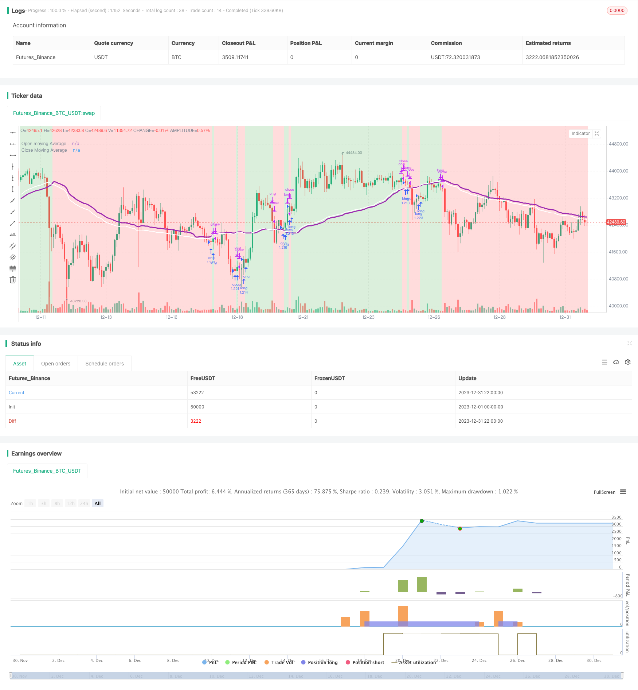

> Name

Trend-Tracking-Moving-Average-Crossover-Strategy
> Author

ChaoZhang

> Strategy Description


 [trans]
## Overview
This strategy is a simple strategy based on moving averages, which can achieve good results on different currency pairs. It plots the opening and closing averages and determines whether to enter or exit a long position when the two lines cross. The principle is to open a position when the average closing price rises, which may indicate future price increases. Closing a position when the average closing price drops may indicate lower prices in the future. This is just a guess, but sometimes it can be very accurate in predicting future prices.
## Strategy Principle
This strategy first selects the type of moving average based on the settings, including EMA, SMA, RMA, WMA and VWMA. Then set the period for moving average calculation, usually 10 to 250 K lines. Depending on the currency pair, choosing different moving average types and periods can produce completely different effects.
The specific trading logic of this strategy is:
1. Calculate the moving average of the opening price and closing price;
2. Compare the values of the average closing price and the average opening price;
3. If the closing price average line crosses the opening price average line, a long position is established;
4. If the average closing price crosses below the average opening price, close the long position.
When opening a position, it is considered to be a sign of rising prices, and when closing a position, it is considered to be a sign of falling prices.
## Strategic advantage analysis
This strategy mainly has the following advantages:
1. The parameter setting is flexible, and the optimal parameters can be selected according to different currency pairs, making it highly targeted;
2. Simple logic, easy to understand and implement;
3. Very high yields can be obtained on some currency pairs, and generally the stability is good;
4. You can choose to display different indicators according to your needs, with a high degree of customization.
## Risk Analysis
There are also some risks with this strategy:
1. Under some currency pairs and parameters, the rate of return and stability are not high;
2. Unable to effectively respond to short-term price changes, and has poor effect on highly volatile currency pairs;
3. The basis for selecting the moving average period is not scientific and reasonable, and there is a certain degree of subjectivity.
Countermeasures and optimization directions:
1. Try to choose long periods, such as 12 hours, 1 day, etc., which can reduce unnecessary transactions and improve stability;
2. Add parameter optimization function to automatically test different parameter combinations and find the optimal parameters;
3. Add the function of adaptively selecting the moving average period, allowing the system to automatically determine the best period.
## Summarize
The logic of this strategy is generally simple, using moving average indicators to determine price trends and turning points. It can achieve very good results by adjusting parameters and is an effective trend following strategy that deserves further improvement and application. However, you should also pay attention to controlling risks and choosing appropriate currency pairs and parameters to maximize their effectiveness.
||

## Overview

This is a simple moving average based strategy that works well with different coin pairs. It plots the moving average opening price and closing price, and decides to enter a long position or exit it based on whether the two lines have crossed each other. The idea is that it enters a position when the average closing price is increasing, which may indicate upward momentum in prices. It then exits the position when the average closing price decreases, which may indicate downward momentum. This is speculative, but sometimes it can predict price action very well.

## Strategy Logic

This strategy first selects the type of moving average, including EMA, SMA, RMA, WMA and VWMA. Then it sets the lookback period for the moving average, usually between 10 and 250 bars. Different combinations of moving average type and lookback period can produce very different results for different coin pairs.

The specific trading logic is:
1. Calculate the moving average of open price and close price; 
2. Compare the moving average values between close price and open price;
3. Enter a long position if close price moving average crosses above open price moving average;  
4. Close the long position if close price moving average crosses below open price moving average.

Entering the position considers it a sign of upward price movement, while exiting considers downward price movement.

## Advantage Analysis 

The main advantages of this strategy are:

1. Flexible parameter settings that can be optimized for different coin pairs for better specificity;
2. Simple logic that is easy to understand and implement;  
3. Very high returns achievable for some coin pairs, generally good stability;
4. High customizability in displaying different indicators.

## Risk Analysis

There are also some risks with this strategy:

1. For some coin pairs and parameters, returns and stability can be low;
2. Cannot respond well to short-term price fluctuations, poor performance for high volatile coins;
3. Choice of moving average lookback period not scientific enough, somewhat subjective.

Solutions and optimization:
1. Use longer timeframes like 12H, 1D to reduce unnecessary trades and improve stability;  
2. Add parameter optimization functions to automatically test different parameter combinations for best parameters;
3. Add adaptive selection of moving average lookback period to let system automatically decide optimal period.

## Conclusion

In summary, this is a simple strategy using moving average indicators to determine price trend and inflection points. It can achieve very good results by adjusting parameters, and is an effective trend tracking strategy worth further improvement and application. But risk management should be noted, choose suitable coin pairs and parameters to maximize its usefulness.

[/trans]

> Strategy Arguments


|Argument|Default|Description|
|----|----|----|
|v_input_int_1|66|(?Strategy)Moving average length (number of bars)|
|v_input_string_1|0|Moving Average type: VWMA|SMA|RMA|WMA|EMA|
|v_input_string_2|0|(?Display)Red Background Color On/Off: On|Off|
|v_input_string_3|0|Green Background Color On/Off: On|Off|
|v_input_string_4|0|Moving Average Plot On/Off: On|Off|
|v_input_int_2|true|(?Beginning of Strategy)Start Month 1-12 (set any start time to 0 for furthest date)|
|v_input_int_3|true|Start Date 1-31 (set any start time to 0 for furthest date)|
|v_input_int_4|2011|Start Year 2000-2100 (set any start time to 0 for furthest date)|
|v_input_int_5|false|(?End of Strategy)End Month 1-12 (set any end time to 0 for today's date)|
|v_input_int_6|false|End Date 1-31 (set any end time to 0 for today's date)|
|v_input_int_7|false|End Year 2000-2100 (set any end time to 0 for today's date)|


> Source (PineScript)

``` pinescript
/*backtest
start: 2023-12-01 00:00:00
end: 2023-12-31 23:59:59
period: 2h
basePeriod: 15m
exchanges: [{"eid":"Futures_Binance","currency":"BTC_USDT"}]
*/

//@version=5
//Author @divonn1994

initial_balance = 100
strategy(title='Close v Open Moving Averages Strategy', shorttitle = 'Close v Open', overlay=true, pyramiding=0, default_qty_value=100, default_qty_type=strategy.percent_of_equity, precision=7, currency=currency.USD, commission_value=0.1, commission_type=strategy.commission.percent, initial_capital=initial_balance)

//Input for number of bars for moving average, Switch to choose moving average type, Display Options and Time Frame of trading----------------------------------------------------------------

bars = input.int(66, "Moving average length (number of bars)", minval=1, group='Strategy') //66 bars and VWMA for BTCUSD on 12 Hours.. 35 bars and VWMA for BTCUSD on 1 Day
strategy = input.string("VWMA", "Moving Average type", options = ["EMA", "SMA", "RMA", "WMA", "VWMA"], group='Strategy')

redOn = input.string("On", "Red Background Color On/Off", options = ["On", "Off"], group='Display')
greenOn = input.string("On", "Green Background Color On/Off", options = ["On", "Off"], group='Display')
maOn = input.string("On", "Moving Average Plot On/Off", options = ["On", "Off"], group='Display')

startMonth = input.int(title='Start Month 1-12 (set any start time to 0 for furthest date)', defval=1, minval=0, maxval=12, group='Beginning of Strategy')
startDate = input.int(title='Start Date 1-31 (set any start time to 0 for furthest date)', defval=1, minval=0, maxval=31, group='Beginning of Strategy')
startYear = input.int(title='Start Year 2000-2100 (set any start time to 0 for furthest date)', defval=2011, minval=2000, maxval=2100, group='Beginning of Strategy')

endMonth = input.int(title='End Month 1-12 (set any end time to 0 for today\'s date)', defval=0, minval=0, maxval=12, group='End of Strategy')
endDate = input.int(title='End Date 1-31 (set any end time to 0 for today\'s date)', defval=0, minval=0, maxval=31, group='End of Strategy')
endYear = input.int(title='End Year 2000-2100 (set any end time to 0 for today\'s date)', defval=0, minval=0, maxval=2100, group='End of Strategy')

//Strategy Calculations-----------------------------------------------------------------------------------------------------------------------------------------------------------------------

inDateRange = true

maMomentum = switch strategy
    "EMA" => (ta.ema(close, bars) > ta.ema(open, bars)) ? 1 : -1
    "SMA" => (ta.sma(close, bars) > ta.sma(open, bars)) ? 1 : -1
    "RMA" => (ta.rma(close, bars) > ta.rma(open, bars)) ? 1 : -1
    "WMA" => (ta.wma(close, bars) > ta.wma(open, bars)) ? 1 : -1
    "VWMA" => (ta.vwma(close, bars) > ta.vwma(open, bars)) ? 1 : -1
    =>
        runtime.error("No matching MA type found.")
        float(na)

openMA = switch strategy
    "EMA" => ta.ema(open, bars)
    "SMA" => ta.sma(open, bars)
    "RMA" => ta.rma(open, bars)
    "WMA" => ta.wma(open, bars)
    "VWMA" => ta.vwma(open, bars)
    =>
        runtime.error("No matching MA type found.")
        float(na)
        
closeMA = switch strategy
    "EMA" => ta.ema(close, bars)
    "SMA" => ta.sma(close, bars)
    "RMA" => ta.rma(close, bars)
    "WMA" => ta.wma(close, bars)
    "VWMA" => ta.vwma(close, bars)
    =>
        runtime.error("No matching MA type found.")
        float(na)

//Enter or Exit Positions--------------------------------------------------------------------------------------------------------------------------------------------------------------------

if ta.crossover(maMomentum, 0)
    if inDateRange
        strategy.entry('long', strategy.long, comment='long')
if ta.crossunder(maMomentum, 0)
    if inDateRange
        strategy.close('long')

//Plot Strategy Behavior---------------------------------------------------------------------------------------------------------------------------------------------------------------------

plot(series = maOn == "On" ? openMA : na, title = "Open moving Average", color = color.new(color.purple,0), linewidth=3, offset=1)
plot(series = maOn == "On" ? closeMA : na, title = "Close Moving Average", color = color.new(color.white,0), linewidth=2, offset=1)
bgcolor(color = inDateRange and (greenOn == "On") and maMomentum > 0 ? color.new(color.green,75) : inDateRange and (redOn == "On") and maMomentum <= 0 ? color.new(color.red,75) : na, offset=1)
```

> Detail

https://www.fmz.com/strategy/440372

> Last Modified

2024-01-29 16:52:46
