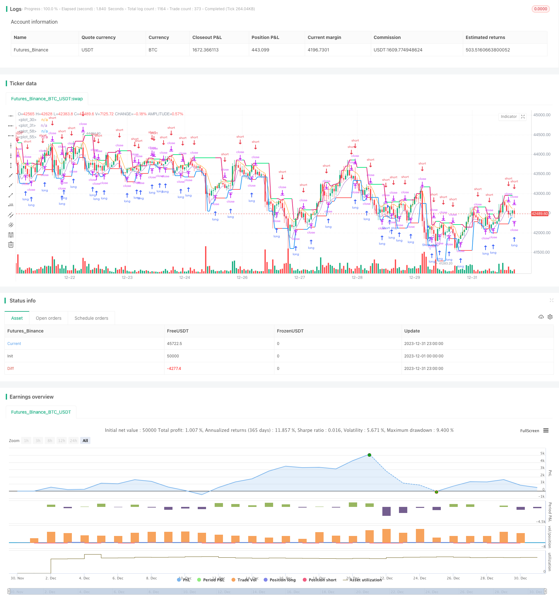

> Name

Trend-Tracking-Reversal-Strategy Trend-Tracking-Reversal-Strategy
> Author

ChaoZhang

> Strategy Description


[trans]

## Overview
The trend following reversal strategy is a trend trading strategy based on moving averages and price extremes. This strategy uses two moving averages to track price trends and open reverse positions when the trend reverses. At the same time, it will also calculate the price channel based on the highest and lowest prices of the recent K lines, and set a stop loss when the price is close to the channel boundary to further control risks.
## Strategy Principle
This strategy uses high and low moving averages hma and lma of length 3 to track price trends. When the price crosses above hma, Interpret is bullish; when the price crosses below lma, Interpret is bearish.
This strategy will also calculate the upper and lower rails uplevel and dnlevel of the price channel based on the highest and lowest prices within the recent bar K-line. Uplevel adds a callback coefficient corr based on the highest price in the most recent bar K-line; dnlevel subtracts a callback coefficient corr based on the lowest price in the most recent bar K-line. This forms the channel range for price.
When opening a long order, the stop-loss price is the upper track of the channel; when opening a short order, the stop-loss price is the lower track of the channel. This can effectively control the risk of loss caused by price reversal.
When a reversal signal appears, this strategy will immediately open a position in the opposite direction and track the new price trend. This is the tracking reversal principle.
## Strategic Advantages
- This strategy makes full use of the advantages of moving averages in tracking trends and can quickly capture price trends;
- Use price channels and reverse opening to control risks and effectively lock in profits;
- The strategy logic is simple and clear, easy to understand and implement;
- Customizable parameters such as trend judgment length, callback coefficient, etc. can be adapted to different varieties;
- Supports adding positions in the same direction to fully capture trend opportunities.
## Strategy Risk
- Periods of price shock are prone to produce false signals;
- Trend reversal may not necessarily trigger stop loss, and the maximum loss cannot be controlled;
- Improper parameter settings may lead to over sensitivity or slowness;
- You need to choose the appropriate variety and time period to achieve the best results.
Optimization method:
1. Combine with other indicators to filter invalid signals;
2. Add a trailing stop to lock in profits and reduce the maximum drawdown;
3. Conduct parameter testing and optimization for different varieties and cycles.
## Strategy optimization direction
There is room for further optimization of this strategy:
1. Other indicator combinations can be introduced to filter out some invalid signals. For example, MACD, KD, etc.
2. Adaptive stop loss logic can be added, such as trailing stop loss, balance stop loss, etc., to further control risks.
3. You can test the impact of different parameters on the strategy effect and optimize the parameter combination. For example, MA cycle length, callback coefficient size, etc.
4. The strategy is currently trading in time periods, and can also be adjusted to all-weather trading. This may require additional filtering rules.
## Summarize
Overall, this strategy is a trend reversal trading strategy that uses a combination of price channels and moving averages. By tracking trends and opening positions with timely reversals, price trends can be tracked effectively. At the same time, the risk control methods of price channel and reverse opening also enable it to effectively control single losses. The strategy idea is simple and clear, and it is worthy of further testing and optimization in real trading.
||

## Overview

The trend tracking reversal strategy is a trend trading strategy based on moving averages and price extremes. The strategy uses two moving averages to track price trends and opens reverse positions when the trends reverse. At the same time, it also calculates a price channel based on the highest and lowest prices of recent K-lines to stop loss when prices approach the channel boundaries, further controlling risks.

## Strategy Logic  

The strategy uses 3-period high and low point moving averages hma and lma to track price trends. When prices cross above hma, it is interpreted as bullish; when prices fall below lma, it is interpreted as bearish.

The strategy also calculates the upper and lower rails (uplevel and dnlevel) of the price channel based on the highest and lowest prices within the recent bars K-lines. uplevel is the highest price in recent bars K-lines plus a retracement coefficient corr upwards; dnlevel is the lowest price in recent bars K-lines minus a retracement coefficient corr downwards. This constitutes the price channel range.

When opening long positions, the stop loss price is set at the upper rail of the channel; when opening short positions, the stop loss price is set at the lower rail of the channel. This effectively controls the risk of losses from price reversals.

When a reverse signal appears, the strategy will immediately reverse open positions to track the new price trend. This is the principle behind tracking reversals.

## Advantages

- The strategy takes full advantage of moving averages to track trends and capture price moves quickly.
- It applies price channels and reverse opening positions to control risks and lock in profits effectively.  
- The strategy logic is simple and clear, easy to understand and implement.
- Customizable parameters such as trend judgment length, retracement coefficients, etc. adapt to different products.
- Support same-direction pyramiding, fully capture trend opportunities.

## Risks

- Prone to false signals during price consolidations.  
- Trend reversals may not always trigger stop loss, maximum loss cannot be controlled.
- Improper parameter settings may cause too sensitive or slow reactions.
- Proper products and time frames need to be selected for best results.

Improvements:
1. Filter out invalid signals with other indicators;
2. Add moving stop loss to lock profits and limit maximum drawdown;  
3. Test and optimize parameters for different products and cycles.

## Optimization Directions

There is room for further optimization:

1. Other indicators can be introduced to filtrate some invalid signals, such as MACD, KD, etc.

2. Adaptive stop loss logic can be added, such as moving stop loss, balance stop loss, etc. to further control risks.  

3. Test the impact of different parameters on strategy performance and optimize parameter combinations, such as MA cycle lengths, retracement coefficient sizes, etc.

4. The strategy currently trades in timed sessions. It can also be adjusted to all-day trading. This may require additional filtering rules.

## Conclusion  

In summary, this is a trend reversal trading strategy combining price channels and moving averages. By tracking trends and timely reverse opening positions, it can effectively follow price movements. At the same time, the risk control measures of price channels and reverse opening also enable it to effectively control single losses. The strategy idea is simple and clear, and is worth further testing and optimization in live trading.

[/trans]

> Strategy Arguments


|Argument|Default|Description|
|----|----|----|
|v_input_1|true|Long|
|v_input_2|true|Short|
|v_input_3|100|Capital, %|
|v_input_4|false|Correction, %|
|v_input_5|true|bars|
|v_input_6|false|revers|
|v_input_7|true|Show Levels|
|v_input_8|true|Show Levels one side|
|v_input_9|false|Show Levels continuous line|
|v_input_10|false|Show Background|
|v_input_11|false|Show Arrows|
|v_input_12|1900|From Year|
|v_input_13|2100|To Year|
|v_input_14|true|From Month|
|v_input_15|12|To Month|
|v_input_16|true|From day|
|v_input_17|31|To day|
|v_input_18|3|len|


> Source (PineScript)

``` pinescript
/*backtest
start: 2023-12-01 00:00:00
end: 2023-12-31 23:59:59
period: 1h
basePeriod: 15m
exchanges: [{"eid":"Futures_Binance","currency":"BTC_USDT"}]
*/

//Noro
//2019

//@version=3
strategy(title = "Noro's 3Bars Strategy by Larry Williams", shorttitle = "3Bars", overlay = true, default_qty_type = strategy.percent_of_equity, default_qty_value = 100, pyramiding = 0)

//Settings
needlong = input(true, defval = true, title = "Long")
needshort = input(true, defval = true, title = "Short")
capital = input(100, defval = 100, minval = 1, maxval = 10000, title = "Capital, %")
corr = input(0.0, title = "Correction, %")
bars = input(1, minval = 1)
revers = input(false, defval = false, title = "revers")
showll = input(true, defval = true, title = "Show Levels")
showos = input(true, defval = true, title = "Show Levels one side")
showcl = input(false, defval = false, title = "Show Levels continuous line")
showbg = input(false, defval = false, title = "Show Background")
showar = input(false, defval = false, title = "Show Arrows")
fromyear = input(1900, defval = 1900, minval = 1900, maxval = 2100, title = "From Year")
toyear = input(2100, defval = 2100, minval = 1900, maxval = 2100, title = "To Year")
frommonth = input(01, defval = 01, minval = 01, maxval = 12, title = "From Month")
tomonth = input(12, defval = 12, minval = 01, maxval = 12, title = "To Month")
fromday = input(01, defval = 01, minval = 01, maxval = 31, title = "From day")
today = input(31, defval = 31, minval = 01, maxval = 31, title = "To day")

len = input(3)

hma = sma(high, len)
lma = sma(low, len)
plot(hma)
plot(lma)

//Levels
hbar = 0
hbar := high > high[1] ? 1 : high < high[1] ? -1 : 0
lbar = 0
lbar := low > low[1] ? 1 : low < low[1] ? -1 : 0
uplevel = 0.0
dnlevel = 0.0
hh = highest(high, bars + 1)
ll = lowest(low, bars + 1)
uplevel := hbar == -1 and sma(hbar, bars)[1] == 1 ? hh + ((hh / 100) * corr) : uplevel[1]
dnlevel := lbar == 1 and sma(lbar, bars)[1] == -1 ? ll - ((ll / 100) * corr) : dnlevel[1]

//Background
size = strategy.position_size
trend = 0
trend := size > 0 ? 1 : size < 0 ? -1 : high >= uplevel ? 1 : low <= dnlevel ? -1 : trend[1]
col = showbg == false ? na : trend == 1 ? lime : trend == -1 ? red : na
bgcolor(col)

//Lines
upcol = na
upcol := showll == false ? na : uplevel != uplevel[1] and showcl == false ? na : showos and trend[1] == 1 ? na : lime
plot(uplevel, color = upcol, linewidth = 2)
dncol = na
dncol := showll == false ? na : dnlevel != dnlevel[1] and showcl == false ? na : showos and trend[1] == -1 ? na : red
plot(dnlevel, color = dncol, linewidth = 2)

//Arrows
longsignal = false
shortsignal = false
longsignal := size > size[1]
shortsignal := size < size[1]
plotarrow(longsignal and showar and needlong ? 1 : na, colorup = blue, colordown = blue, transp = 0)
plotarrow(shortsignal and showar and needshort ? -1 : na, colorup = blue, colordown = blue, transp = 0)

//Trading
lot = 0.0
lot := size != size[1] ? strategy.equity / close * capital / 100 : lot[1]
if uplevel > 0 and dnlevel > 0 and revers == false
    strategy.entry("Long", strategy.long, needlong == false ? 0 : lot, stop = uplevel)
    strategy.entry("Long stop", strategy.short, 0, stop = lma)
    strategy.entry("Short", strategy.short, needshort == false ? 0 : lot, stop = dnlevel)
    strategy.entry("Short stop", strategy.long, 0, stop = hma)
    
// if time > timestamp(toyear, tomonth, today, 23, 59)
//     strategy.close_all()
```

> Detail

https://www.fmz.com/strategy/437549

> Last Modified

2024-01-03 16:34:28
