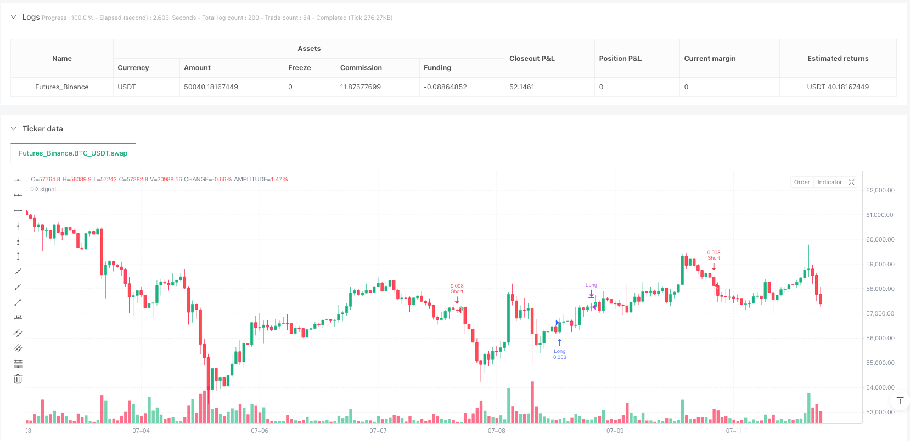
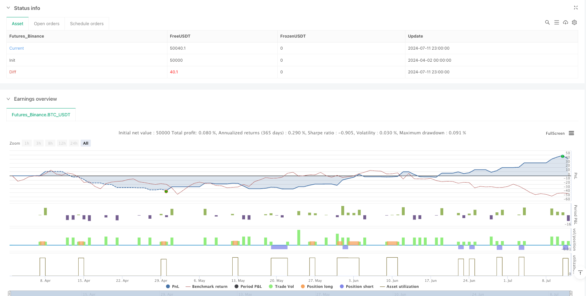

> Name

TrendSync-Pro-SMC-Multi-Timeframe Trend Following Strategy-TrendSync-Pro-SMC-Multi-Timeframe-Trend-Following-Strategy
> Author

ianzeng123

> Strategy Description





[trans]

#### Overview
TrendSync Pro (SMC) is a quantitative trading strategy based on High Time Frame (HTF) filters and trend momentum designed to capture strong market trend moves. This strategy provides traders with a systematic approach to trading by combining multi-timeframe analysis, trendline detection, and rigorous risk management.
#### Strategy Principle
The core principles of the strategy include the following key components:
1. High Time Frame (HTF) Filter: Use a higher level time frame (such as 1 hour, 4 hour or daily) to confirm the overall market trend direction and ensure that trades are consistent with the main trend.
2. Trend line detection: Dynamically identify the market trend direction by analyzing key turning points (pivot highs and lows) and draw visual trend lines.
3. Entry and exit logic:
   - Entry conditions for long position: price breaks the trend value and the high time frame is trending upward
   - Short position entry conditions: price falls below the trend value and the high time frame trend is downwards
4. Risk management:
   - Fixed stop loss: set to 1% of the entry price
   - Take profit target: set to 10% of the entry price
   - Optional dynamic stop loss using ATR (Average True Range)
#### Strategic Advantages
1. Multi-time frame confirmation: By combining different time frames, the probability of false trading signals is reduced.
2. Trend following: Focus on capturing strong trending market movements rather than frequent but low-quality trades.
3. Strict risk management:
   - Small stop loss (1%) to protect capital
   - High risk to reward ratio (1:10)
   - Even if the winning rate is only 50%, you can still make a profit
4. Flexibility: High time frame settings can be adjusted for different trading types (zoom, day trading, swing trading).
5. Visual aid: Provide trend line drawing to help traders intuitively understand market trends.
#### Strategy Risk
1. Market condition restrictions:
   - Poor performance in markets that are volatile or have no clear trend
   - Trading does not work well in a low volatility environment
2. Parameter sensitivity:
   - Trend period and high time frame selection directly affects strategy performance
   - Parameters need to be adjusted for different markets and trading types
3. Stop loss risk:
   - A fixed stop loss of 1% may be too tight in highly volatile markets
   - May increase transaction costs and the probability of being "stopped"
#### Strategy optimization direction
1. Dynamic stop loss:
   -Introduction of dynamic stop loss method based on ATR
   - Adjust stop loss range based on market volatility
2. Filter enhancement:
   - Combined with trading volume analysis
   - Integrated liquidity scanning
   - Add Order Block confirmation
3. Multi-strategy combination:
   - Integrated with ICT Power of 3 approach
   - Integrate VWAP and market pattern analysis
   - Incorporate liquidation heatmaps (especially cryptocurrency markets)
4. Machine learning optimization:
   - Use machine learning algorithms to optimize parameter selection
   - Develop adaptive parameter adjustment mechanism
#### Summarize
TrendSync Pro (SMC) is a trading strategy that focuses on quality over quantity. Through multiple time frame confirmations, strict risk management and trend following logic, this strategy provides traders with a systematic trading framework. The key is selective trading, that is, only capturing 1-2 high-quality trading opportunities every day, rather than frequent but inefficient trading.
|| 

#### Overview

TrendSync Pro (SMC) is a quantitative trading strategy based on a Higher Timeframe (HTF) filter and trend momentum, designed to capture strong market trend movements. The strategy provides traders with a systematic trading approach by combining multi-timeframe analysis, trend line detection, and strict risk management.

#### Strategy Principles

The core principles of the strategy include the following key components:

1. Higher Timeframe (HTF) Filter: Use higher-level timeframes (such as 1-hour, 4-hour, or daily) to confirm the overall market trend direction, ensuring trades align with the primary trend.

2. Trend Line Detection: Dynamically identify market trend direction by analyzing key turning points (pivot highs and lows) and visualize trend lines.

3. Entry and Exit Logic:
   - Long Entry Conditions: Price breaks above trend value with HTF trend upward
   - Short Entry Conditions: Price breaks below trend value with HTF trend downward

4. Risk Management:
   - Fixed Stop Loss: Set at 1% of entry price
   - Take Profit Target: Set at 10% of entry price
   - Optional dynamic stop loss using ATR (Average True Range)

#### Strategy Advantages

1. Multi-Timeframe Confirmation: Combining different timeframes reduces the probability of false signals.

2. Trend Following: Focus on capturing strong trending market movements rather than frequent, low-quality trades.

3. Strict Risk Management:
   - Small stop loss (1%) protects capital
   - High risk-reward ratio (1:10)
   - Profitable even with a 50% win rate

4. Flexibility: Adjustable higher timeframe settings for different trading types (scalping, day trading, swing trading)

5. Visual Assistance: Provides trend line drawing to help traders intuitively understand market trends.

#### Strategy Risks

1. Market Condition Limitations:
   - Poor performance in ranging or non-trending markets
   - Ineffective in low volatility environments

2. Parameter Sensitivity:
   - Trend period and higher timeframe selection directly impact strategy performance
   - Requires parameter adjustments for different markets and trading instruments

3. Stop Loss Risks:
   - Fixed 1% stop loss might be too tight in high volatility markets
   - Increased likelihood of being "stopped out"

#### Strategy Optimization Directions

1. Dynamic Stop Loss:
   - Introduce ATR-based dynamic stop loss methods
   - Adjust stop loss range based on market volatility

2. Filter Enhancement:
   - Integrate volume analysis
   - Incorporate liquidity sweeps
   - Add order block confirmation

3. Multi-Strategy Combination:
   - Combine with ICT Power of 3 method
   - Integrate VWAP and market profile analysis
   - Incorporate liquidation heatmap (especially in crypto markets)

4. Machine Learning Optimization:
   - Use machine learning algorithms to optimize parameter selection
   - Develop adaptive parameter adjustment mechanisms

#### Summary

TrendSync Pro (SMC) is a strategy that prioritizes quality over quantity. By providing multi-timeframe confirmation, strict risk management, and trend-following logic, the strategy offers traders a systematic trading framework. The key is selective trading - capturing just 1-2 high-quality trade opportunities per day, rather than frequent but inefficient trading.[/trans]


> Source (PineScript)

``` pinescript
/*backtest
start: 2024-04-02 00:00:00
end: 2024-07-12 00:00:00
period: 1h
basePeriod: 1h
exchanges: [{"eid":"Futures_Binance","currency":"BTC_USDT"}]
*/

//@version=6
strategy('TrendSync Pro (SMC)', overlay=true, default_qty_type=strategy.percent_of_equity, default_qty_value=1)

// Created by Shubham Singh

// Inputs
bool show_trendlines = input.bool(true, "Show Trendlines", group="Visual Settings")
int trend_period = input(20, 'Trend Period', group="Strategy Settings")
string htf = input.timeframe("60", "Higher Timeframe", group="Strategy Settings")

// Risk Management
float sl_percent = input.float(1.0, "Stop Loss (%)", minval=0.1, maxval=10, step=0.1, group="Risk Management")
float tp_percent = input.float(2.0, "Take Profit (%)", minval=0.1, maxval=10, step=0.1, group="Risk Management")

// Created by Shubham Singh

// Trendline Detection
var line trendline = na
var float trend_value = na
var bool trend_direction_up = false  // Initialize with default value

pivot_high = ta.pivothigh(high, trend_period, trend_period)
pivot_low = ta.pivotlow(low, trend_period, trend_period)

if not na(pivot_high)
    trend_value := pivot_high
    trend_direction_up := false


if not na(pivot_low)
    trend_value := pivot_low
    trend_direction_up := true


// Created by Shubham Singh

// Higher Timeframe Filter
htf_close = request.security(syminfo.tickerid, htf, close)
htf_trend_up = htf_close > htf_close[1]
htf_trend_down = htf_close < htf_close[1]

// Trading Logic
long_condition = ta.crossover(close, trend_value) and htf_trend_up and trend_direction_up
short_condition = ta.crossunder(close, trend_value) and htf_trend_down and not trend_direction_up
// Created by Shubham Singh

// Entry/Exit with SL/TP
if strategy.position_size == 0
    if long_condition
        strategy.entry("Long", strategy.long)
        strategy.exit("Long Exit", "Long", stop=close*(1-sl_percent/100), limit=close*(1+tp_percent/100))
    
    if short_condition
        strategy.entry("Short", strategy.short)
        strategy.exit("Short Exit", "Short", stop=close*(1+sl_percent/100), limit=close*(1-tp_percent/100))
// Created by Shubham Singh

// Manual Trendline Exit
if strategy.position_size > 0 and ta.crossunder(close, trend_value)
    strategy.close("Long")
if strategy.position_size < 0 and ta.crossover(close, trend_value)
    strategy.close("Short")
```

> Detail

https://www.fmz.com/strategy/489189

> Last Modified

2025-04-02 15:42:17
