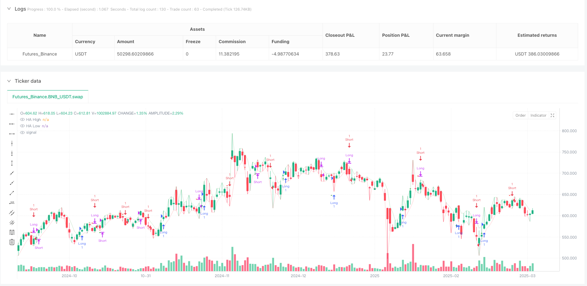
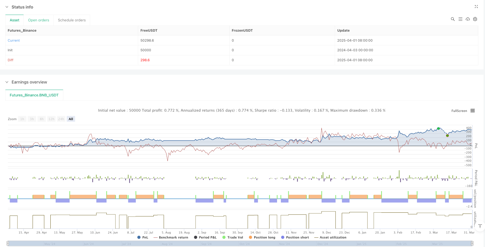

> Name

Triple-Candle-Breakout-Momentum-Heikin-Ashi-Trading-System
> Author

ianzeng123

> Strategy Description





[trans]

## Overview
The Three Candle Breakout Momentum Smoothed Average Trading Strategy is a trend following system based on Heikin-Ashi candlestick charts that identifies continuous market trends and enters trades upon confirmation of momentum. The core idea is to observe three consecutive Heikin-Ashi candle patterns of the same color, then wait for the reverse candle to appear, and enter the market when the high or low of this reverse candle is broken. This method aims to capture momentum breakthroughs after trend reversals, improve the accuracy of entry timing, and reduce the interference of false signals. This strategy is particularly effective for mid- to long-term trend tracking because it uses Heikin-Ashi candles to smooth price data and filter market noise, while designing strict entry and exit conditions to ensure that trading signals are sufficiently reliable.
## Strategy Principle
At the heart of the strategy is the Heikin-Ashi candle technique, a modified candle chart originating from Japan that smoothes price movements by averaging the open, close, high, and low prices. Unlike traditional K-lines, Heikin-Ashi candles can show the trend direction more clearly and reduce the impact of market noise.
The strategy works as follows:
1. **Calculate Heikin-Ashi value**:
   - HA closing price = (opening price + highest price + lowest price + closing price) / 4
   - HA opening price = (opening price + closing price) of the previous HA candle / 2
   - HA highest price = the maximum of the highest price, HA opening price and HA closing price
   - HA lowest price = the minimum of the lowest price, HA opening price and HA closing price
2. **Bull entry logic**:
   - Identify three consecutive red (down) HA candles followed by a green (up) candle
   - Record the highest price of this green candle
   - When the next candle breaks through the highest price of the green candle, a long entry signal is triggered
3. **Bull entry logic**:
   - After entering the long position, wait for the first red HA candle to form
   - Record the lowest price of this red candle
   - When the price breaks through the lowest price of the red candle, a long exit signal is triggered
4. **Short entry logic**:
   - Identify three consecutive green (up) HA candles followed by a red (down) candle
   - Record the lowest price of this red candle
   - When the next candle breaks through the lowest price of the red candle, a short entry signal is triggered
5. **Short exit logic**:
   - After short entry, wait for the first green HA candle to form
   - Record the highest price of this green candle
   - When the price breaks through the highest price of this green candle, a short exit signal is triggered
This design ensures that traders only enter the trade after confirming trend momentum, increasing the probability of successful trades.
## Strategic Advantages
By deeply analyzing the code, we can conclude that this strategy has the following significant advantages:
1. **Noise Filtering**: The Heikin-Ashi candle technique smoothes price data, reducing the impact of market noise and false signals, making the trend direction clearer.
2. **Momentum Confirmation**: The strategy requires a reversal candle after three consecutive candles of the same color, and the signal needs to break through the key price level. This multiple confirmation mechanism improves the reliability of the signal.
3. **Precise entry timing**: By waiting for price to break through key levels, the strategy ensures that you only enter the market after the trend momentum is clear, avoiding the risk of entering too early and suffering a false trend breakout.
4. **Clear Exit Rules**: The strategy sets clear stop-loss conditions and automatically exits when the market forms a reverse candle and breaks through its key level, which reduces position risks and protects profits.
5. **Visual Feedback**: The strategy provides clear visual signals, including graphical markers of trading signals and visualization of Heikin-Ashi high and low points, allowing traders to intuitively understand market conditions.
6. **Flexible alert system**: Built-in alert conditions can help traders obtain potential trading opportunities in a timely manner and improve operational efficiency.
7. **Strong adaptability**: Although there are no clear parameter settings in the code, the basic logic of the strategy can be easily adapted to different time periods and market conditions, enhancing its practicality.
## Strategy Risk
While this strategy has many advantages, there are also some potential risks and limitations:
1. **Lagging risk**: Although Heikin-Ashi candles can smooth prices, they will also introduce a certain lag. This can result in missing the best entry or exit points in a rapidly reversing market.   
**Solution**: Potential reversal signals can be identified in advance by combining more sensitive technical indicators such as RSI or MACD.
2. **Poor performance in volatile markets**: Trend following strategies usually perform poorly in sideways volatile markets and may generate frequent false breakthrough signals, leading to continuous losses.   
**Solution**: Add market structure judgment logic, such as using the ADX indicator to filter out low-volatility environments, or temporarily disabling the strategy in volatile markets.
3. **Fixed Parameter Risk**: The strategy uses a fixed three candle rule, which may not be optimal under different market conditions.   
**Workaround**: Parameterize the number of consecutive candles, allowing adjustment for different markets and timeframes.
4. **Lack of stop loss mechanism**: Although the strategy has clear exit rules, it does not set a hard stop loss, which may lead to large losses under extreme market conditions.   
**Solution**: Add a stop-loss mechanism based on ATR or a fixed percentage to limit the maximum loss on a single trade.
5. **Backtesting Overfitting Risk**: A strategy may perform well under certain market conditions, but it may not be suitable for all market environments.   
**Solution**: Conduct backtests under different time periods and market conditions to ensure the robustness of the strategy.
## Strategy optimization direction
Based on an in-depth analysis of the code, here are several possible optimization directions:
1. **Parameter optimization**:
   Make the number of consecutive candles an adjustable parameter instead of a fixed three. Different markets and time periods may require different confirmation amounts, which can be parameterized to optimize for specific asset classes. The advantage of this is to increase the adaptability of the strategy so that it can maintain good performance in different market environments.
2. **Add volatility filter**:
   Integrate the ATR (Average True Range) indicator to evaluate market volatility and adjust entry conditions accordingly. Stricter confirmations may be required in high-volatility environments, while conditions may be relaxed appropriately in low-volatility environments. This helps reduce false breakout trades in low volatility environments.
3. **Add trend filter**:
   Introduce ADX (Average Directional Index) or moving average system to confirm the overall market trend direction, and only consider signals when the trend is clear. For example, only considering trend trades when ADX>25 can significantly improve the performance of the strategy in trending markets.
4. **Improve stop loss mechanism**:
   Add dynamic stop loss based on ATR, or introduce a trailing stop loss function to make profit protection more flexible. For example, one could set an initial stop loss of 1.5 times the ATR distance from the entry price and adjust the stop loss level as the price moves in a favorable direction.
5. **Add transaction volume confirmation**:
   A breakout signal is required to be accompanied by an increase in trading volume to enhance the reliability of the signal. Trading volume confirmation can help distinguish real breakthroughs from false breakthroughs and improve entry accuracy.
6. **Risk Management Optimization**:
   Add a position management function to automatically calculate the appropriate transaction size based on market volatility and account size. This can be achieved by setting the risk of each transaction to no more than 1-2% of the account, effectively controlling drawdowns.
7. **Multiple time period analysis**:
   Combined with trend confirmation on longer time periods, enter the market only when the trends across multiple time periods are consistent. For example, only consider entering when the daily line and the 4-hour period show the same trend, which can improve your winning rate.
## Summarize
The Three Candle Breakout Momentum Smoothed Average Trading Strategy is a trading system that combines the Heikin-Ashi candle smoothing technique with the trend breakout concept. It provides high-quality trading signals by identifying patterns formed by three consecutive candles of the same color and waiting for price to break through key levels to confirm trend momentum. The main advantage of this strategy is that it can effectively filter market noise, provide clear entry and exit conditions, and improve the reliability of trading signals through a multiple confirmation mechanism.
However, the strategy also has some potential risks, such as Heikin-Ashi lag, poor performance in volatile markets, and lack of adaptive parameters. By adding trend filters, volatility adjustments, improving stop loss mechanisms, adding volume confirmation and other optimization measures, the performance and robustness of the strategy can be further improved.
Overall, this is a well-designed trend following system that is particularly suitable for medium to long-term traders. Through reasonable parameter optimization and risk management, this strategy can provide stable trading opportunities in various market environments. For traders looking for a trend following approach, this is a basic strategy framework worth considering that can be further customized and optimized based on personal trading style and market preferences. ||
## Overview

The Triple Candle Breakout Momentum Heikin-Ashi Trading System is a trend-following strategy based on Heikin-Ashi candlestick charts that identifies consecutive market trends and enters trades after momentum confirmation. The core concept involves observing three consecutive Heikin-Ashi candles of the same color, waiting for a reversal candle to appear, and then entering the market when price breaks through the high or low of that reversal candle. This approach aims to capture momentum breakouts following trend reversals, improving entry timing precision and reducing false signals. The strategy is particularly effective for medium to long-term trend following, as it uses Heikin-Ashi candles to smooth price data, filter market noise, and incorporates strict entry and exit conditions to ensure reliable trading signals.

## Strategy Principles

The core of this strategy is the Heikin-Ashi candlestick technique, a modified candlestick chart originating from Japan that smooths price fluctuations by calculating averages of open, close, high, and low prices. Unlike traditional candlesticks, Heikin-Ashi candles more clearly display trend direction while reducing the impact of market noise.

The strategy operates as follows:

1. **Calculating Heikin-Ashi Values**:
   - HA Close = (Open + High + Low + Close) / 4
   - HA Open = (Previous HA Open + Previous HA Close) / 2
   - HA High = Maximum value among High, HA Open, and HA Close
   - HA Low = Minimum value among Low, HA Open, and HA Close

2. **Long Entry Logic**:
   - Identify three consecutive red (bearish) HA candles, followed by a green (bullish) candle
   - Record the high of this green candle
   - Trigger a long entry signal when the next candle breaks above the high of that green candle

3. **Long Exit Logic**:
   - After a long entry, wait for the first red HA candle to form
   - Record the low of this red candle
   - Trigger a long exit signal when price breaks below the low of that red candle

4. **Short Entry Logic**:
   - Identify three consecutive green (bullish) HA candles, followed by a red (bearish) candle
   - Record the low of this red candle
   - Trigger a short entry signal when the next candle breaks below the low of that red candle

5. **Short Exit Logic**:
   - After a short entry, wait for the first green HA candle to form
   - Record the high of this green candle
   - Trigger a short exit signal when price breaks above the high of that green candle

This design ensures that traders only enter the market after confirming trend momentum, increasing the probability of successful trades.

## Strategy Advantages

Through in-depth code analysis, the following significant advantages can be identified:

1. **Noise Filtering**: Heikin-Ashi candlestick technique smooths price data, reducing the impact of market noise and false signals, making trend direction clearer.

2. **Momentum Confirmation**: The strategy requires three consecutive same-colored candles followed by a reversal candle, and a break of key price levels to trigger signals, creating a multi-confirmation mechanism that improves signal reliability.

3. **Precise Entry Timing**: By waiting for price to break through key levels, the strategy ensures entry only after trend momentum is clearly established, avoiding the risks of early entry during false breakouts.

4. **Clear Exit Rules**: The strategy establishes definitive stop-loss conditions, automatically exiting when the market forms a reverse candle and breaks through its key level, reducing holding risk and protecting profits.

5. **Visual Feedback**: The strategy provides clear visual signals, including graphical markers for trade signals and visualization of Heikin-Ashi highs and lows, allowing traders to intuitively understand market conditions.

6. **Flexible Alert System**: Built-in alert conditions help traders receive timely notifications of potential trading opportunities, improving operational efficiency.

7. **High Adaptability**: Although there are no explicit parameter settings in the code, the basic logic of the strategy can easily adapt to different timeframes and market conditions, enhancing its practicality.

## Strategy Risks

Despite its many advantages, the strategy also has some potential risks and limitations:

1. **Lag Risk**: While Heikin-Ashi candles smooth prices, they also introduce some lag. This may cause missed optimal entry or exit points in rapidly reversing markets.
   
   **Solution**: Combine with more sensitive technical indicators, such as RSI or MACD, to identify potential reversal signals in advance.

2. **Poor Performance in Ranging Markets**: Trend-following strategies typically perform poorly in sideways, consolidating markets, potentially generating frequent false breakout signals leading to consecutive losses.
   
   **Solution**: Add market structure assessment logic, such as using the ADX indicator to filter low-volatility environments, or temporarily disable the strategy in ranging markets.

3. **Fixed Parameter Risk**: The strategy uses a fixed three-candle rule, which may not be optimal across different market conditions.
   
   **Solution**: Parameterize the consecutive candle count, allowing adjustment based on different markets and timeframes.

4. **Lack of Stop-Loss Mechanism**: While the strategy has clear exit rules, it does not set hard stops, which may lead to larger losses under extreme market conditions.
   
   **Solution**: Add ATR-based or fixed percentage stop-loss mechanisms to limit maximum loss per trade.

5. **Backtest Overfitting Risk**: The strategy may perform well under specific market conditions but may not be applicable to all market environments.
   
   **Solution**: Backtest across different timeframes and market conditions to ensure strategy robustness.

## Strategy Optimization Directions

Based on in-depth code analysis, here are several possible optimization directions:

1. **Parameter Optimization**:
   Make the consecutive candle count an adjustable parameter rather than fixed at three. Different markets and timeframes may require different confirmation counts, and parameterization allows optimization for specific asset classes. This increases strategy adaptability, maintaining good performance across different market environments.

2. **Add Volatility Filtering**:
   Integrate the ATR (Average True Range) indicator to assess market volatility and adjust entry conditions accordingly. More stringent confirmation may be needed in high-volatility environments, while conditions can be relaxed in low-volatility environments. This helps reduce false breakout trades in low-volatility conditions.

3. **Add Trend Filters**:
   Introduce ADX (Average Directional Index) or moving average systems to confirm overall market trend direction, only considering signals when trends are clearly defined. For example, only consider trend trades when ADX > 25, significantly improving strategy performance in trending markets.

4. **Improve Stop-Loss Mechanism**:
   Add ATR-based dynamic stops or trailing stop functionality for more flexible profit protection. For instance, set initial stops at 1.5 times ATR distance from entry price, adjusting stop levels as price moves favorably.

5. **Add Volume Confirmation**:
   Require breakout signals to be accompanied by increased trading volume to enhance signal reliability. Volume confirmation helps distinguish between genuine and false breakouts, improving entry precision.

6. **Risk Management Optimization**:
   Add position sizing functionality to automatically calculate appropriate trade size based on market volatility and account size. This can be implemented by setting each trade's risk at no more than 1-2% of the account, effectively controlling drawdowns.

7. **Multi-Timeframe Analysis**:
   Incorporate longer timeframe trend confirmation, only entering when trends align across multiple timeframes. For example, only consider entries when both daily and 4-hour periods show aligned trends, increasing win rates.

## Summary

The Triple Candle Breakout Momentum Heikin-Ashi Trading System is a trading system that combines Heikin-Ashi candlestick smoothing techniques with trend breakout concepts. It identifies patterns formed by three consecutive same-colored candles and waits for price to break through key levels to confirm trend momentum, providing high-quality trading signals. The strategy's main advantages lie in its ability to effectively filter market noise, provide clear entry and exit conditions, and improve trade signal reliability through multiple confirmation mechanisms.

However, the strategy also has some potential risks, such as Heikin-Ashi lag, poor performance in ranging markets, lack of adaptive parameters, and others. Performance and robustness can be further improved through adding trend filters, volatility adjustments, improved stop-loss mechanisms, volume confirmation, and other optimization measures.

Overall, this is a well-designed trend-following system particularly suitable for medium to long-term traders. With reasonable parameter optimization and risk management, the strategy can provide stable trading opportunities across various market environments. For traders seeking trend-following methods, this represents a worthwhile basic strategy framework that can be further customized and optimized according to personal trading style and market preferences.[/trans]


> Source (PineScript)

``` pinescript
/*backtest
start: 2024-04-03 00:00:00
end: 2025-04-02 00:00:00
period: 1d
basePeriod: 1d
exchanges: [{"eid":"Futures_Binance","currency":"BNB_USDT"}]
*/

// This Pine Script™ code is subject to the terms of the Mozilla Public License 2.0 at https://mozilla.org/MPL/2.0/
// © YashEzio

//@version=6
strategy("Heikin-Ashu Strategy", overlay=true)

// Calculate Heikin-Ashi values
var float ha_open  = na
var float ha_close = na
var float ha_high  = na
var float ha_low   = na

ha_close := (open + high + low + close) / 4
ha_open  := na(ha_open[1]) ? (open + close) / 2 : (ha_open[1] + ha_close[1]) / 2
ha_high  := math.max(high, math.max(ha_open, ha_close))
ha_low   := math.min(low, math.min(ha_open, ha_close))

//---------------- Long Logic ----------------//
// Identify red/green Heikin-Ashi candles
ha_red = ha_close < ha_open
ha_green = ha_close > ha_open

// Long entry: three consecutive red candles followed by a green candle
consecutive_red = ha_red[3] and ha_red[2] and ha_red[1] and ha_green
// Capture the high of the first green candle after the red streak
var float first_green_high = na
first_green_high := consecutive_red ? ha_high : nz(first_green_high)
// Trigger long entry AFTER the next candle breaks the high of that green candle
long_breakout = not na(first_green_high) and ha_high[1] == first_green_high and high > first_green_high

// Long exit: after a long entry, exit when a red candle forms and its low is broken
var float first_red_low = na
first_red_low := long_breakout ? na : (ha_red and na(first_red_low) ? ha_low : first_red_low)
var bool long_active = false
long_active := long_breakout ? true : long_active
long_exit = long_active and not na(first_red_low) and low < first_red_low
long_active := long_exit ? false : long_active

//---------------- Short Logic ----------------//
// Short entry: three consecutive green candles followed by a red candle
consecutive_green = ha_green[3] and ha_green[2] and ha_green[1] and ha_red
// Capture the low of the first red candle after the green streak
var float first_red_entry_low = na
first_red_entry_low := consecutive_green ? ha_low : nz(first_red_entry_low)
// Trigger short entry AFTER the next candle breaks the low of that red candle
short_breakout_entry = not na(first_red_entry_low) and ha_low[1] == first_red_entry_low and low < first_red_entry_low

// Short exit: after a short entry, exit when a green candle forms and its high is broken
var float first_green_exit_high = na
first_green_exit_high := short_breakout_entry ? na : (ha_green and na(first_green_exit_high) ? ha_high : first_green_exit_high)
var bool short_active = false
short_active := short_breakout_entry ? true : short_active
short_exit = short_active and not na(first_green_exit_high) and high > first_green_exit_high
short_active := short_exit ? false : short_active

//---------------- Strategy Orders ----------------//
if (long_breakout)
    strategy.entry("Long", strategy.long)
if (long_exit)
    strategy.close("Long")

if (short_breakout_entry)
    strategy.entry("Short", strategy.short)
if (short_exit)
    strategy.close("Short")

//---------------- Visualization ----------------//
plot(ha_high, color=color.new(color.green, 80), title="HA High")
plot(ha_low, color=color.new(color.red, 80), title="HA Low")

// Mark long signals (buy and sell)
plotshape(long_breakout, location=location.belowbar, color=color.green, style=shape.triangleup, title="Buy Signal", size=size.small, offset=-1)
plotshape(long_exit, location=location.abovebar, color=color.red, style=shape.triangledown, title="Sell Signal", size=size.small, offset=-1)
// Mark short signals (short entry and cover)
plotshape(short_breakout_entry, location=location.abovebar, color=color.red, style=shape.triangledown, title="Short Sell Signal", size=size.small, offset=-1)
plotshape(short_exit, location=location.belowbar, color=color.green, style=shape.triangleup, title="Cover Signal", size=size.small, offset=-1)

//---------------- Alerts ----------------//
alertcondition(long_breakout, title="Long Entry", message="Heikin-Ashi Long Breakout Signal")
alertcondition(long_exit, title="Long Exit", message="Heikin-Ashi Long Exit Signal")
alertcondition(short_breakout_entry, title="Short Entry", message="Heikin-Ashi Short Entry Signal")
alertcondition(short_exit, title="Short Exit", message="Heikin-Ashi Short Exit Signal")

```

> Detail

https://www.fmz.com/strategy/489296

> Last Modified

2025-04-03 11:17:32
