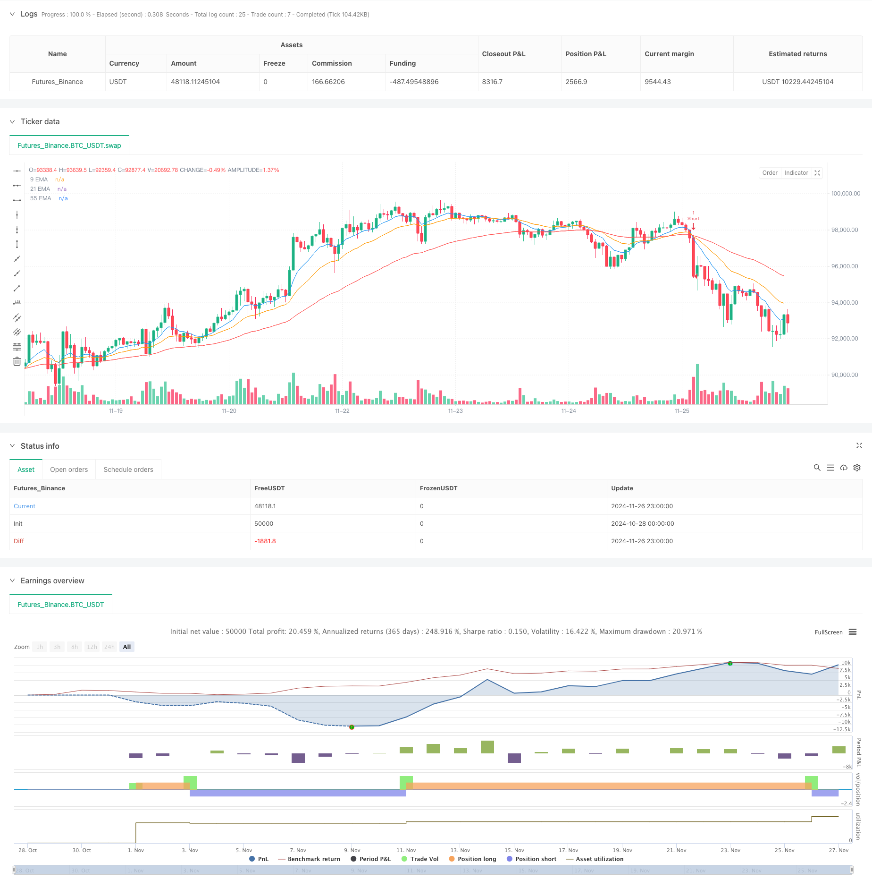

> Name

Triple-Exponential-Moving-Average-Trend-Trading-Strategy
> Author

ChaoZhang

> Strategy Description



[trans]
This article will detail a trend following trading strategy based on triple exponential moving averages. This strategy identifies market trends through the cross-relationship between exponential moving averages in three different periods of short-term, mid-term and long-term, and combines dynamic stop loss and take profit mechanisms for transaction management.
#### Strategy Overview
This strategy makes trading decisions based on three exponential moving averages (EMA) with different periods, namely 9 periods, 21 periods and 55 periods. By observing the cross relationship and relative position between these moving averages, we can judge the direction and intensity of the market trend and find suitable trading opportunities. The strategy also integrates a dynamic stop-loss mechanism based on ATR and a take-profit setting based on risk-return ratio to achieve better risk management.
#### Strategy Principle
The core logic of the strategy is to identify trends through the intersection and position relationship of three EMAs. Specifically:
1. When the short-term EMA (9 periods) crosses the mid-term EMA (21 periods) upwards, and the mid-term EMA is above the long-term EMA (55 periods), a long signal is triggered
2. When the short-term EMA crosses the mid-term EMA downward, and the mid-term EMA is below the long-term EMA, a short signal is triggered.
3. Use 1.5 times ATR as the dynamic stop loss distance to ensure that the stop loss point can adapt to market volatility.
4. Set a profit-taking position based on a risk-return ratio of 1.2 times to ensure that each transaction has a reasonable profit-loss ratio.
#### Strategic Advantages
1. Strong trend identification ability: The combination of triple EMA can more accurately identify market trends and filter out market noise.
2. Improved risk management: Through the setting of ATR dynamic stop loss and fixed risk-to-return ratio, ensure that each transaction has clear risk control
3. Strong adaptability: The strategy can be applied to different markets and time periods, and has good universality
4. Clear operating rules: clear entry and exit conditions, reducing interference caused by subjective judgments
#### Strategy Risk
1. Lagging risk: EMA, as a lagging indicator, may lead to late entry timing.
2. Volatile market risk: Frequent false signals may occur in a volatile market.
3. Risk of stop loss setting: The selection of ATR multiple needs to be optimized according to different market characteristics.
4. Fund management risk: Fixed risk-to-return ratio may not be suitable for all market environments
#### Strategy optimization direction
1. Trend filter optimization: Trend strength indicators such as ADX can be added to help filter signals from weak markets.
2. Dynamic parameter optimization: EMA period and ATR multiple can be dynamically adjusted according to market volatility
3. Fund management optimization: The risk-return ratio can be dynamically adjusted according to the market environment
4. Optimize the entry timing: You can optimize the entry timing by combining RSI and other swing indicators
#### Summary
The triple EMA trend trading strategy is a trading system with clear logic and controllable risks. Through reasonable parameter setting and optimization, stable trading opportunities can be obtained in different market environments. The key to a successful strategy lies in correctly understanding and applying the core principles of trend following while managing risks. In practical applications, it is recommended that investors make appropriate parameter adjustments based on specific market characteristics and their own risk tolerance. ||
This article introduces a trend following trading strategy based on triple exponential moving averages. The strategy identifies market trends through the crossover relationships between short-term, medium-term, and long-term exponential moving averages, combined with dynamic stop-loss and take-profit mechanisms for trade management.

#### Strategy Overview
The strategy makes trading decisions based on three exponential moving averages (EMAs) with different periods: 9, 21, and 55. By observing the crossover relationships and relative positions between these moving averages, it determines market trend direction and strength to find suitable trading opportunities. The strategy also integrates ATR-based dynamic stop-loss and risk-reward ratio based take-profit settings for better risk management.

#### Strategy Principles
The core logic of the strategy is to identify trends through the crossover and position relationships of three EMAs. Specifically:
1. A long signal is triggered when the short-term EMA (9-period) crosses above the medium-term EMA (21-period), and the medium-term EMA is above the long-term EMA (55-period)
2. A short signal is triggered when the short-term EMA crosses below the medium-term EMA, and the medium-term EMA is below the long-term EMA
3. Uses 1.5 times ATR as dynamic stop-loss distance to ensure stop-loss points adapt to market volatility
4. Sets take-profit levels based on a 1.2 risk-reward ratio to ensure reasonable profit/loss ratio for each trade

#### Strategy Advantages
1. Strong trend identification: The triple EMA combination can more accurately identify market trends and filter out market noise
2. Comprehensive risk management: Through ATR dynamic stop-loss and fixed risk-reward ratio settings, ensures clear risk control for each trade
3. High adaptability: The strategy can be applied to different markets and timeframes with good universality
4. Clear operating rules: Entry and exit conditions are clear, reducing interference from subjective judgments

#### Strategy Risks
1. Lag risk: EMAs as lagging indicators may lead to delayed entry timing
2. Sideways market risk: May generate frequent false signals in ranging markets
3. Stop-loss setting risk: ATR multiplier selection needs optimization based on different market characteristics
4. Money management risk: Fixed risk-reward ratio may not be suitable for all market environments

#### Strategy Optimization Directions
1. Trend filter optimization: Can add trend strength indicators like ADX to help filter signals in weak markets
2. Dynamic parameter optimization: Can dynamically adjust EMA periods and ATR multiplier based on market volatility
3. Money management optimization: Can dynamically adjust risk-reward ratio based on market environment
4. Entry timing optimization: Can optimize entry timing by combining oscillators like RSI

#### Summary
The Triple EMA Trend Trading Strategy is a trading system with clear logic and controllable risk. Through proper parameter settings and optimization, it can obtain stable trading opportunities in different market environments. The key to strategy success lies in correctly understanding and applying the core principles of trend following while maintaining good risk management. In practical application, investors are advised to make appropriate parameter adjustments based on specific market characteristics and their own risk tolerance.[/trans]


> Source (PineScript)

``` pinescript
/*backtest
start: 2024-10-28 00:00:00
end: 2024-11-27 00:00:00
period: 1h
basePeriod: 1h
exchanges: [{"eid":"Futures_Binance","currency":"BTC_USDT"}]
*/

//@version=5
strategy("Triple EMA Crossover Strategy", overlay=true)

// Define the input lengths for the EMAs
shortEmaLength = input(9, title="Short EMA Length")
mediumEmaLength = input(21, title="Medium EMA Length")
longEmaLength = input(55, title="Long EMA Length")

// Define the risk/reward ratios for SL and TP
riskRewardRatio = input(1.2, title="Risk/Reward Ratio")  // Example: risk 1 to gain 1.2
atrMultiplier = input(1.5, title="ATR Multiplier for SL") // ATR multiplier for stop loss

// Calculate EMAs
ema9 = ta.ema(close, shortEmaLength)
ema21 = ta.ema(close, mediumEmaLength)
ema55 = ta.ema(close, longEmaLength)

// Plot EMAs on the chart
plot(ema9, color=color.blue, title="9 EMA")
plot(ema21, color=color.orange, title="21 EMA")
plot(ema55, color=color.red, title="55 EMA")

// Define Long and Short Conditions
longCondition = ta.crossover(ema9, ema21) and ema21 > ema55
shortCondition = ta.crossunder(ema9, ema21) and ema21 < ema55

// Calculate the Average True Range (ATR) for better stop loss positioning
atr = ta.atr(14)  // Using a 14-period ATR for dynamic SL

// Execute Long trades
if (longCondition)
    // Set stop loss and take profit prices
    stopLoss = close - (atr * atrMultiplier)
    takeProfit = close + ((close - stopLoss) * riskRewardRatio)
    strategy.entry("Long", strategy.long, stop=stopLoss, limit=takeProfit)

// Execute Short trades
if (shortCondition)
    // Set stop loss and take profit prices
    stopLoss = close + (atr * atrMultiplier)
    takeProfit = close - ((stopLoss - close) * riskRewardRatio)
    strategy.entry("Short", strategy.short, stop=stopLoss, limit=takeProfit)
```

> Detail

https://www.fmz.com/strategy/473240

> Last Modified

2024-11-28 15:27:24
