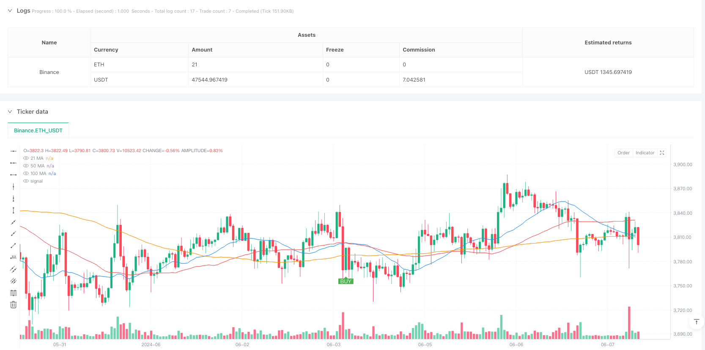
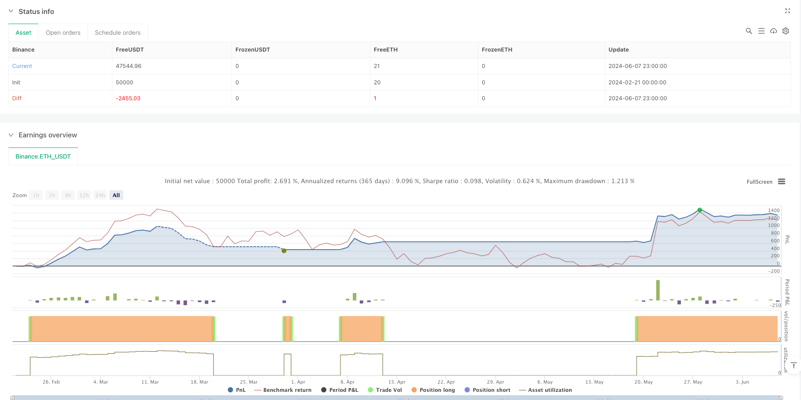

> Name

Triple-Moving-Average-Cross-Filter-Trading-System
> Author

ianzeng123

> Strategy Description





[trans]
#### Overview
This is a trend following strategy based on three simple moving averages (SMA). This strategy uses the intersection and position relationships of the 21, 50 and 100 period moving averages to identify market trends and place trades at the right time. The strategy primarily operates on the 5-minute time frame, while it is recommended to refer to the 30-minute chart for trend confirmation.
#### Strategy Principle
The strategy uses a triple filtering mechanism to determine trading signals:
1. Use the 21-period moving average as a fast moving average to capture short-term price changes
2. Use the 50-period moving average as the mid-term moving average and form a cross signal with the fast moving average.
3. Use the 100-period moving average as a trend filter to ensure that the trading direction is consistent with the main trend
The purchase conditions must be met at the same time:
- The 21 EMA crosses the 50 EMA upwards
- Both the 21 EMA and the 50 EMA are above the 100 EMA
The selling conditions must be met at the same time:
- The 21 EMA crosses the 50 EMA downwards
- Both the 21 EMA and the 50 EMA are below the 100 EMA
#### Strategic Advantages
1. Multiple confirmation mechanism reduces false signals
2. Trend filtering improves transaction success rate
3. Clear entry and exit rules
4. Can be used on multiple time frames
5. The risk-reward ratio is set at 1:2, which is conducive to long-term profitability.
6. The strategy logic is simple and easy to understand and execute.
#### Strategy Risk
1. Volatile markets may lead to frequent transactions
2. The lag of moving average may lead to delays in entry and exit
3. Rapid market reversal may cause large losses
4. Different market environments require adjustment of parameters.
Risk control suggestions:
- Set your stop loss below the most recent important low
- Confirm trends in conjunction with larger time periods
- Avoid trading in sideways volatile markets
- Regularly evaluate and optimize strategy parameters
#### Strategy optimization direction
1. Introduce trading volume indicators to confirm trend strength
2. Add dynamic stop loss mechanism
3. Add trend strength filter
4. Optimize parameter adaptation mechanism
5. Combine with other technical indicators for signal confirmation
6. Add market volatility filter
#### Summary
This is a trend following strategy with complete structure and clear logic. Through the triple moving average filtering and trend confirmation mechanism, false signals can be effectively reduced and the transaction success rate can be improved. The strategy has good scalability and can be optimized and adjusted according to different market environments. It is recommended to conduct sufficient backtesting and parameter optimization before real trading. ||
#### Overview
This is a trend-following strategy based on three Simple Moving Averages (SMA). The strategy utilizes the crossover and relative positions of 21, 50, and 100-period moving averages to identify market trends and generate trading signals. It primarily operates on a 5-minute timeframe, with recommended confirmation from the 30-minute chart.

#### Strategy Principle
The strategy employs a triple-filter mechanism to determine trading signals:
1. Uses 21-period MA as fast line to capture short-term price movements
2. Uses 50-period MA as medium-term line for crossover signals
3. Uses 100-period MA as trend filter to ensure alignment with main trend

Buy conditions require:
- 21 MA crosses above 50 MA
- Both 21 MA and 50 MA are above 100 MA

Sell conditions require:
- 21 MA crosses below 50 MA
- Both 21 MA and 50 MA are below 100 MA

#### Strategy Advantages
1. Multiple confirmation mechanisms reduce false signals
2. Trend filtering improves trading success rate
3. Clear entry and exit rules
4. Applicable across multiple timeframes
5. Risk-reward ratio set at 1:2 for long-term profitability
6. Simple logic, easy to understand and execute

#### Strategy Risks
1. Frequent trades in ranging markets
2. MA lag may cause delayed entries and exits
3. Quick reversals can lead to significant losses
4. Parameters need adjustment for different market conditions

Risk control suggestions:
- Set stop loss below recent significant low
- Confirm trends on higher timeframes
- Avoid trading in sideways markets
- Regular strategy parameter evaluation

#### Strategy Optimization
1. Incorporate volume indicators for trend strength confirmation
2. Implement dynamic stop-loss mechanism
3. Add trend strength filters
4. Optimize parameter adaptation
5. Integrate additional technical indicators
6. Add market volatility filters

#### Summary
This is a well-structured trend-following strategy with clear logic. Through triple moving average filtering and trend confirmation mechanisms, it effectively reduces false signals and improves trading success rate. The strategy offers good scalability and can be optimized for different market conditions. Thorough backtesting and parameter optimization are recommended before live trading.[/trans]


> Source (PineScript)

``` pinescript
/*backtest
start: 2024-02-21 00:00:00
end: 2024-06-08 00:00:00
period: 1h
basePeriod: 1h
exchanges: [{"eid":"Binance","currency":"ETH_USDT"}]
*/

// This Pine Script™ code is subject to the terms of the Mozilla Public License 2.0 at https://mozilla.org/MPL/2.0/
// © Vezpa
//@version=5
strategy("Vezpa's Gold Strategy", overlay=true)

// ======================== MAIN STRATEGY ========================
// Input parameters for the main strategy
fast_length = input.int(21, title="Fast MA Length", minval=1)
slow_length = input.int(50, title="Slow MA Length", minval=1)
trend_filter_length = input.int(100, title="Trend Filter MA Length", minval=1)

// Calculate moving averages for the main strategy
fast_ma = ta.sma(close, fast_length)
slow_ma = ta.sma(close, slow_length)
trend_ma = ta.sma(close, trend_filter_length)

// Plot moving averages
plot(fast_ma, color=color.blue, title="21 MA")
plot(slow_ma, color=color.red, title="50 MA")
plot(trend_ma, color=color.orange, title="100 MA")

// Buy condition: 21 MA crosses above 50 MA AND both are above the 100 MA
if (ta.crossover(fast_ma, slow_ma) and fast_ma > trend_ma and slow_ma > trend_ma)
    strategy.entry("Buy", strategy.long)

// Sell condition: 21 MA crosses below 50 MA AND both are below the 100 MA
if (ta.crossunder(fast_ma, slow_ma) and fast_ma < trend_ma and slow_ma < trend_ma)
    strategy.close("Buy")

// Plot buy signals as green balloons
plotshape(series=ta.crossover(fast_ma, slow_ma) and fast_ma > trend_ma and slow_ma > trend_ma, 
     title="Buy Signal", 
     location=location.belowbar, 
     color=color.green, 
     style=shape.labelup, 
     text="BUY", 
     textcolor=color.white, 
     size=size.small, 
     transp=0)

// Plot sell signals as red balloons
plotshape(series=ta.crossunder(fast_ma, slow_ma) and fast_ma < trend_ma and slow_ma < trend_ma, 
     title="Sell Signal", 
     location=location.abovebar, 
     color=color.red, 
     style=shape.labeldown, 
     text="SELL", 
     textcolor=color.white, 
     size=size.small, 
     transp=0)


```

> Detail

https://www.fmz.com/strategy/483045

> Last Modified

2025-02-21 10:48:37
