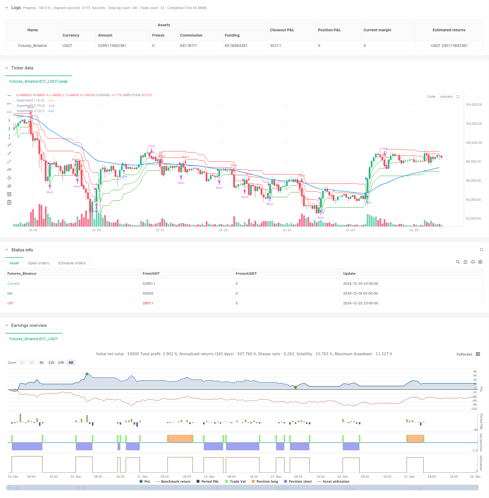

> Name

Triple-Supertrend-and-Exponential-Moving-Average-Trend-Following-Quantitative-Trading-Strategy
> Author

ChaoZhang

> Strategy Description



[trans]
#### Overview
This strategy is a trend following strategy that combines the Triple Supertrend indicator and the Exponential Moving Average (EMA). By setting three overpotential lines with different sensitivities and an EMA to capture the market trend, we can achieve multi-dimensional confirmation of the trend. The strategy uses ATR (average true range) to calculate dynamic support/resistance levels, and determines trend direction and trading signals based on the relationship between price and each line.
#### Strategy Principle
The strategy mainly includes the following core components:
1. The 50-period EMA is used to determine the overall trend direction. Prices above the EMA are considered an upward trend, and vice versa.
2. The three superpotential lines are calculated based on the 10-period ATR. The multipliers are 3.0, 2.0 and 1.0 respectively, and the sensitivities decrease in sequence.
3. Entry signal: Open long when the price is above EMA and all three overpotential lines show long signals; open short when the price is below EMA and all three overpotential lines show short signals.
4. Exit signal: Close the position when the third overpotential line (the least sensitive) turns.
#### Strategic Advantages
1. The multiple confirmation mechanism improves signal reliability and can effectively reduce false signals.
2. Combining short-term and long-term trend indicators, it can respond quickly without losing stability.
3. Dynamic stop loss settings can be automatically adjusted according to market volatility.
4. The strategy logic is clear and the parameters are highly adjustable.
5. It is suitable for multiple market cycles and has good universal applicability.
#### Strategy Risk
1. A volatile market may result in frequent transactions and increase transaction costs.
Solution: You can add a signal filter or extend the moving average period.
2. There may be a lag in the early stages of a trend reversal.
Solution: Momentum indicators can be introduced to assist judgment.
3. The multiple confirmation mechanism may miss some profit opportunities.
Response plan: The confirmation conditions can be appropriately adjusted according to market characteristics.
#### Strategy optimization direction
1. Introduce trading volume indicators as auxiliary confirmation.
2. Develop an adaptive parameter mechanism to dynamically adjust parameters according to market conditions.
3. Add volatility filter to adjust positions during periods of high volatility.
4. Optimize the stop loss mechanism and consider using trailing stop loss.
5. Add the retracement control module and set the maximum retracement limit.
#### Summary
This is a trend following strategy with rigorous logic and strong stability. Through the combined use of multiple technical indicators, it not only ensures the reliability of the signal, but also has good risk control capabilities. The parameters of the strategy are highly adjustable and can be optimized according to different market conditions. Although there is a certain lag, a good balance between risk and return can be achieved through reasonable optimization. ||
#### Overview
This strategy combines triple Supertrend indicators with an Exponential Moving Average (EMA) for trend following. It uses three Supertrend lines with different sensitivities and one EMA line to capture market trends through multi-dimensional confirmation. The strategy utilizes ATR (Average True Range) to calculate dynamic support/resistance levels and determines trend direction and trading signals based on price positions relative to these lines.

#### Strategy Principle
The strategy consists of these core components:
1. 50-period EMA determines overall trend direction, with price above EMA indicating uptrend and below indicating downtrend.
2. Three Supertrend lines calculated using 10-period ATR with multipliers of 3.0, 2.0, and 1.0, decreasing in sensitivity.
3. Entry signals: Long when price is above EMA and all three Supertrend lines show bullish signals; Short when price is below EMA and all three Supertrend lines show bearish signals.
4. Exit signals: Close positions when the third Supertrend line (least sensitive) reverses direction.

#### Strategy Advantages
1. Multiple confirmation mechanism improves signal reliability and reduces false signals.
2. Combines short-term and long-term trend indicators for both quick response and stability.
3. Dynamic stop-loss settings that automatically adjust to market volatility.
4. Clear strategy logic with adjustable parameters.
5. Applicable across multiple market cycles with good universality.

#### Strategy Risks
1. May generate frequent trades in ranging markets, increasing transaction costs.
Solution: Add signal filters or extend moving average periods.

2. Potential lag during trend reversal initiation.
Solution: Incorporate momentum indicators for assistance.

3. Multiple confirmation requirements might miss some profitable opportunities.
Solution: Adjust confirmation conditions based on market characteristics.

#### Strategy Optimization Directions
1. Incorporate volume indicators for additional confirmation.
2. Develop adaptive parameter mechanisms that adjust dynamically to market conditions.
3. Add volatility filters to adjust position sizing during high volatility periods.
4. Optimize stop-loss mechanism, considering trailing stops.
5. Add drawdown control module with maximum drawdown limits.

#### Summary
This is a logically rigorous and stable trend-following strategy. Through the combination of multiple technical indicators, it ensures signal reliability while maintaining good risk control capabilities. The strategy parameters are highly adjustable and can be optimized for different market conditions. While there is some inherent lag, appropriate optimization can achieve a good balance between risk and return.[/trans]


> Source (PineScript)

``` pinescript
/*backtest
start: 2024-12-19 00:00:00
end: 2024-12-26 00:00:00
period: 45m
basePeriod: 45m
exchanges: [{"eid":"Futures_Binance","currency":"BTC_USDT"}]
*/

//@version=5
strategy("Supertrend EMA Strategy", overlay=true)

// Input Parameters
ema_length = input(50, title="EMA Length")
supertrend_atr_period = input(10, title="ATR Period")
supertrend_multiplier1 = input.float(3.0, title="Supertrend Multiplier 1")
supertrend_multiplier2 = input.float(2.0, title="Supertrend Multiplier 2")
supertrend_multiplier3 = input.float(1.0, title="Supertrend Multiplier 3")

// Calculations
emaValue = ta.ema(close, ema_length)

[supertrend1, SupertrendDirection1] = ta.supertrend(supertrend_multiplier1, supertrend_atr_period)
[supertrend2, SupertrendDirection2] = ta.supertrend(supertrend_multiplier2, supertrend_atr_period)
[supertrend3, SupertrendDirection3] = ta.supertrend(supertrend_multiplier3, supertrend_atr_period)

// Plot Indicators
plot(emaValue, title="EMA", color=color.blue, linewidth=2)
plot(supertrend1, title="Supertrend 1 (10,3)", color=(SupertrendDirection1 == -1 ? color.green : color.red), linewidth=1, style=plot.style_line)
plot(supertrend2, title="Supertrend 2 (10,2)", color=(SupertrendDirection2 == -1 ? color.green : color.red), linewidth=1, style=plot.style_line)
plot(supertrend3, title="Supertrend 3 (10,1)", color=(SupertrendDirection3 == -1 ? color.green : color.red), linewidth=1, style=plot.style_line)

// Entry Conditions
long_condition = (SupertrendDirection1 == -1 and SupertrendDirection2 == -1 and SupertrendDirection3 == -1 and close > emaValue)
short_condition = (SupertrendDirection1 == 1 and SupertrendDirection2 == 1 and SupertrendDirection3 == 1 and close < emaValue)

// Exit Conditions
long_exit = (SupertrendDirection3 == 1)
short_exit = (SupertrendDirection3 == -1)

// Execute Strategy
if (long_condition)
    strategy.entry("Long", strategy.long)
if (short_condition)
    strategy.entry("Short", strategy.short)

if (long_exit)
    strategy.close("Long")
if (short_exit)
    strategy.close("Short")

```

> Detail

https://www.fmz.com/strategy/476281

> Last Modified

2024-12-27 15:56:53
