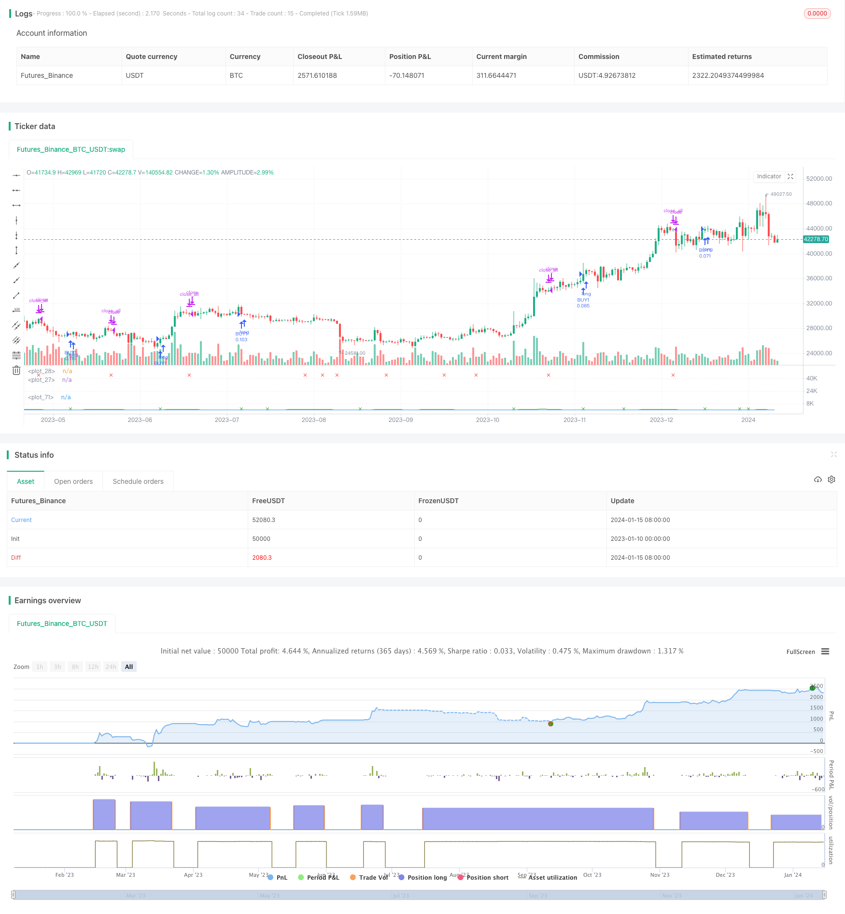

> Name

True-Range-Based-Weighted-Moving-Average-Cross-Period-Strategy
> Author

ChaoZhang

> Strategy Description


 [trans]

## Overview
This strategy uses True Range and Weighted Moving Average (WMA) to construct an inter-temporal indicator to achieve trend judgment. At the same time, it has a pyramid accumulation mechanism for multiple positions, as well as multiple stop-loss mechanisms, aiming to pursue stable profits.
## Strategy Principle
This strategy first calculates the rising volatility (sube) and falling volatility (baja), and then calculates the WMA of the fast line (corto) period and the slow line (largo) period respectively. The difference between the fast and slow lines is again used to calculate the indicator (ind) through WMA. A buy signal is generated when the indicator crosses above 0, and a sell signal is generated when it crosses below 0.
After entering the market, the strategy presets 5 positions, and the pyramid positions are added according to the equal ratio (double) accumulation method. At the same time, a stop-loss mechanism is set up. When opening a position later, it is necessary to judge whether the current floating profit is lower than the stop-loss line, so as to control risks.
## Advantage Analysis
This strategy integrates intertemporal judgment, pyramid position addition, multiple stop-loss and other mechanisms, which can effectively control risks and pursue stable profits.
Intertemporal judgment establishes a trend judgment system through a combination of fast and slow lines, which can effectively filter market noise and identify trend turning points. Pyramid positioning can make more profits at the beginning of the trend, and multiple stop-loss mechanisms can effectively control single losses.
## Risk Analysis
The main risk of this strategy is that unexpected events may cause rapid market reversal, triggering the stop loss cutoff and causing losses. In addition, improper parameter settings will also affect the stability of the strategy.
The risk of market reversal can be dealt with by appropriately relaxing the stop loss line. Optimizing parameter settings and adjusting cycle parameters, number of positions, etc. can improve strategy stability.
## Optimization direction
This strategy can be optimized from the following aspects:
1. Add statistical indicator judgment and modify parameters based on volatility, trading volume and other indicators to make the strategy more adaptable.
2. Add machine learning model judgment, use deep learning models such as LSTM to assist judgment, and improve the accuracy of the strategy.
3. Optimize the position management mechanism and consider adjusting the position increase according to the floating profit ratio to make the position growth more reasonable.
4. Combined with the futures hedging model, use futures and spot arbitrage to further control risks.
## Summarize
Generally speaking, this strategy is a cross-cyclical trend strategy based on real volatility indicators. It has a pyramid position increase and multiple stop-loss mechanisms, which can effectively control risks and pursue stable profits. It is a very practical quantitative trading strategy. However, we still need to pay attention to market reversal and parameter optimization issues, and further optimization can be carried out from statistics, machine learning and other aspects.
||


## Overview

This strategy uses True Range and Weighted Moving Average (WMA) to build a cross period indicator for trend judgement. At the same time, it has a pyramid position accumulation mechanism with multiple stop loss mechanisms to pursue stable profits.

## Strategy Principle  

The strategy first calculates the up amplitude (sube) and down amplitude (baja), and then calculates the WMA of the fast line (corto) cycle and the slow line (largo) cycle respectively. The difference between the fast and slow lines is calculated again through WMA to get the indicator (ind). When the indicator crosses above 0, a buy signal is generated. When it crosses below 0, a sell signal is generated.

After entering the market, the strategy presets 5 positions, which are accumulated in a pyramid (doubled) manner. At the same time, a stop loss mechanism is set so that the subsequent positions opened will be judged whether the current floating profit is lower than the stop loss line, so as to control risks.

## Advantage Analysis   

The strategy integrates mechanisms such as cross-cycle judgment, pyramid position accumulation, and multiple stop losses, which can effectively control risks and pursue stable profits.

Cross-cycle judgments establish a trend judgment system through fast and slow lines combination, which can effectively filter market noise and identify trend turning points. Pyramid positions can profit more at the beginning of the trend, and multiple stop loss mechanisms can effectively control single loss.

## Risk Analysis

The main risk of this strategy is the possibility of a sudden event causing a rapid market reversal that triggers a stop loss cutoff and causes losses. In addition, improper parameter settings will also affect the stability of the strategy.

The risk of market reversal can be dealt with by appropriately relaxing the stop loss line. Optimizing parameter settings and adjusting cycle parameters, number of positions, etc. can improve the stability of the strategy.

## Optimization Direction  

The strategy can be optimized in the following aspects:

1. Increase statistical indicators for judgement, use indicators like volatility and volume to correct parameters and make the strategy more adaptive.

2. Increase machine learning model for judgement, use LSTM and other deep learning models to assist judgement and improve strategy accuracy.  

3. Optimize position management mechanisms, consider adjusting the amplitude of position increase according to floating profit percentage to make position growth more reasonable.

4. Incorporate futures hedging models to further control risks through spot and futures arbitrage.   

## Summary   

In summary, this is a cross-cycle trend strategy based on True Range indicators with pyramid position accumulation and multiple stop loss mechanisms, which can effectively control risks and pursue stable profits. It is a very practical quantitative trading strategy. However, attention is still needed to reversal risks and parameter optimization problems. Further optimizations can be done in statistics, machine learning and other aspects.

[/trans]

> Strategy Arguments


|Argument|Default|Description|
|----|----|----|
|v_input_2|timestamp(31 Dec 2025 00:00 -0700)|End Time|
|v_input_3|10|corto|
|v_input_4|30|largo|
|v_input_5|10|suavizado|
|v_input_6|50000|contrato1|
|v_input_float_1|6.5|porc_tp|
|v_input_7|-6|safe|
|v_input_1|timestamp(01 Jan 2022 00:00 -0700)|(?Backtest Window)Start Time|


> Source (PineScript)

``` pinescript
/*backtest
start: 2023-01-10 00:00:00
end: 2024-01-16 00:00:00
period: 1d
basePeriod: 1h
exchanges: [{"eid":"Futures_Binance","currency":"BTC_USDT"}]
*/

// This source code is subject to the terms of the Mozilla Public License 2.0 at https://mozilla.org/MPL/2.0/
// © MaclenMtz

//@version=5
strategy("[MACLEN] Rangos", shorttitle="Rangos [https://t.me/Bitcoin_Maclen]", overlay=false )

//------WINDOW----------

i_startTime = input(defval = timestamp("01 Jan 2022 00:00 -0700"), title = "Start Time", group = "Backtest Window")
i_endTime = input(defval = timestamp("31 Dec 2025 00:00 -0700"), title = "End Time")
window = true

//-----------------------------

sube = close>close[1] ? ta.tr : 0
baja = close<close[1] ? ta.tr : 0

corto = input(10)
largo = input(30)
suavizado = input(10)

fastDiff = ta.wma(sube, corto) - ta.wma(baja,corto)
slowDiff = ta.wma(sube, largo) - ta.wma(baja, largo)
ind = ta.wma(fastDiff - slowDiff, suavizado)

iColor = ind>0 ? color.green : ind<0 ? color.red : color.black
plot(ind, color=iColor)
plot(0, color=color.white)

long = ind[1]<ind and ind[2]<ind[1] and ind<0
short = ind[1]>ind and ind[2]>ind[1] and ind>0

plotshape(long and not long[1], style = shape.xcross, color=color.green, location=location.bottom, size=size.tiny)
plotshape(short and not short[1], style = shape.xcross, color=color.red, location=location.top, size=size.tiny)

//Contratos
contrato1 = input(50000)/(16*close)
c1 = contrato1
c2 = contrato1
c3 = contrato1*2
c4 = contrato1*4
c5 = contrato1*8

//cap_enopentrade = strategy.opentrades == 1 ? c1: strategy.opentrades == 2 ? c1+c2: strategy.opentrades == 3 ? c1+c2+c3: strategy.opentrades == 4 ? c1+c2+c3+c4: strategy.opentrades == 5 ? c1+c2+c3+c4+c5 : 0
openprofit_porc = math.round((close-strategy.position_avg_price)/strategy.position_avg_price * 100,2)

porc_tp = input.float(6.5)
safe = input(-6)

//----------------Strategy---------------------------

if strategy.opentrades == 0
    strategy.entry('BUY1', strategy.long, qty=c1, when = long and not long[1] and window)

if strategy.opentrades == 1
    strategy.entry('BUY2', strategy.long, qty=c2, when = long and not long[1] and window and openprofit_porc<safe)

if strategy.opentrades == 2
    strategy.entry('BUY3', strategy.long, qty=c3, when = long and not long[1] and window and openprofit_porc<safe)

if strategy.opentrades == 3
    strategy.entry('BUY4', strategy.long, qty=c4, when = long and not long[1] and window and openprofit_porc<safe)

if strategy.opentrades == 4
    strategy.entry('BUY5', strategy.long, qty=c5, when = long and not long[1] and window and openprofit_porc<safe)

min_prof = strategy.openprofit>0

strategy.close_all(when=short and min_prof)

plot(openprofit_porc)

```

> Detail

https://www.fmz.com/strategy/439074

> Last Modified

2024-01-17 15:09:28
