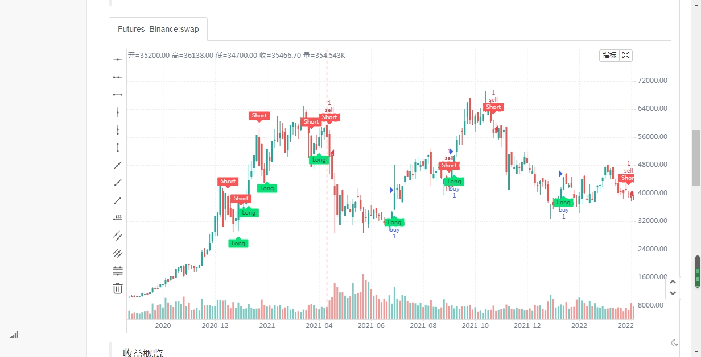
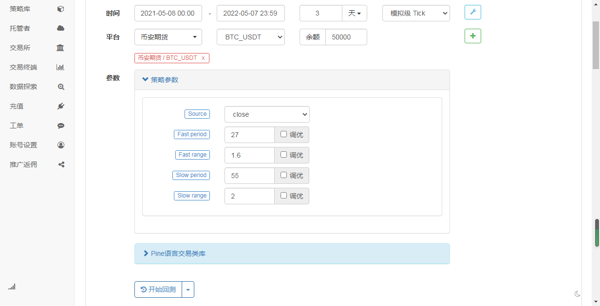
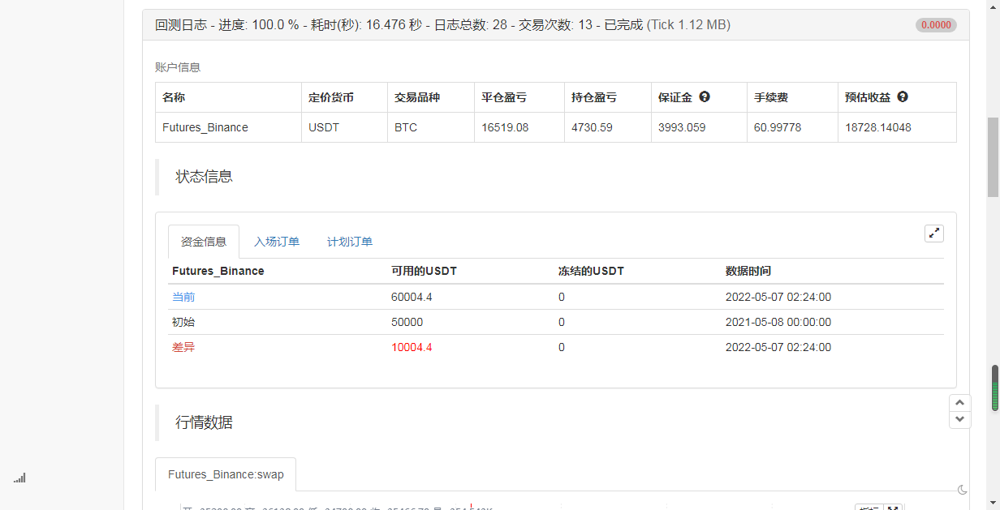

> Name

Twin-Range-Filter

> Author

Zer3192

> Strategy Description

  
  
  

> Strategy Arguments


|Argument|Default|Description|
|----|----|----|
|v_input_1_close|0|Source: close|high|low|open|hl2|hlc3|hlcc4|ohlc4|
|v_input_2|27|Fast period|
|v_input_3|1.6|Fast range|
|v_input_4|55|Slow period|
|v_input_5|2|Slow range|


> Source (PineScript)

``` pinescript
/*backtest
start: 2021-05-08 00:00:00
end: 2022-05-07 23:59:00
period: 4h
basePeriod: 15m
exchanges: [{"eid":"Futures_Binance","currency":"BTC_USDT"}]
*/
// This source code is subject to the terms of the Mozilla Public License 2.0 at https://mozilla.org/MPL/2.0/
// © colinmck

//@version=4

study(title="Twin Range Filter", overlay=true)

source = input(defval=close, title="Source")

// Smooth Average Range

per1 = input(defval=27, minval=1, title="Fast period")
mult1 = input(defval=1.6, minval=0.1, title="Fast range")

per2 = input(defval=55, minval=1, title="Slow period")
mult2 = input(defval=2, minval=0.1, title="Slow range")

smoothrng(x, t, m) =>
    wper = t * 2 - 1
    avrng = ema(abs(x - x[1]), t)
    smoothrng = ema(avrng, wper) * m
    smoothrng
smrng1 = smoothrng(source, per1, mult1)
smrng2 = smoothrng(source, per2, mult2)
smrng = (smrng1 + smrng2) / 2

// Range Filter

rngfilt(x, r) =>
    rngfilt = x
    rngfilt := x > nz(rngfilt[1]) ? x - r < nz(rngfilt[1]) ? nz(rngfilt[1]) : x - r : 
       x + r > nz(rngfilt[1]) ? nz(rngfilt[1]) : x + r
    rngfilt
filt = rngfilt(source, smrng)

upward = 0.0
upward := filt > filt[1] ? nz(upward[1]) + 1 : filt < filt[1] ? 0 : nz(upward[1])
downward = 0.0
downward := filt < filt[1] ? nz(downward[1]) + 1 : filt > filt[1] ? 0 : nz(downward[1])

hband = filt + smrng
lband = filt - smrng

longCond = bool(na)
shortCond = bool(na)
longCond := source > filt and source > source[1] and upward > 0 or source > filt and source < source[1] and upward > 0
shortCond := source < filt and source < source[1] and downward > 0 or source < filt and source > source[1] and downward > 0

CondIni = 0
CondIni := longCond ? 1 : shortCond ? -1 : CondIni[1]

long = longCond and CondIni[1] == -1
short = shortCond and CondIni[1] == 1

// Plotting

plotshape(long, title="Long", text="Long", style=shape.labelup, textcolor=color.black, size=size.tiny, location=location.belowbar, color=color.lime, transp=0)
plotshape(short, title="Short", text="Short", style=shape.labeldown, textcolor=color.white, size=size.tiny, location=location.abovebar, color=color.red, transp=0)

// Alerts

alertcondition(long, title="Long", message="Long")
alertcondition(short, title="Short", message="Short")
if long
   strategy.entry("buy", strategy.long)
else if short
    strategy.entry("sell", strategy.short)

```

> Detail

https://www.fmz.com/strategy/367643

> Last Modified

2022-06-12 21:00:10
