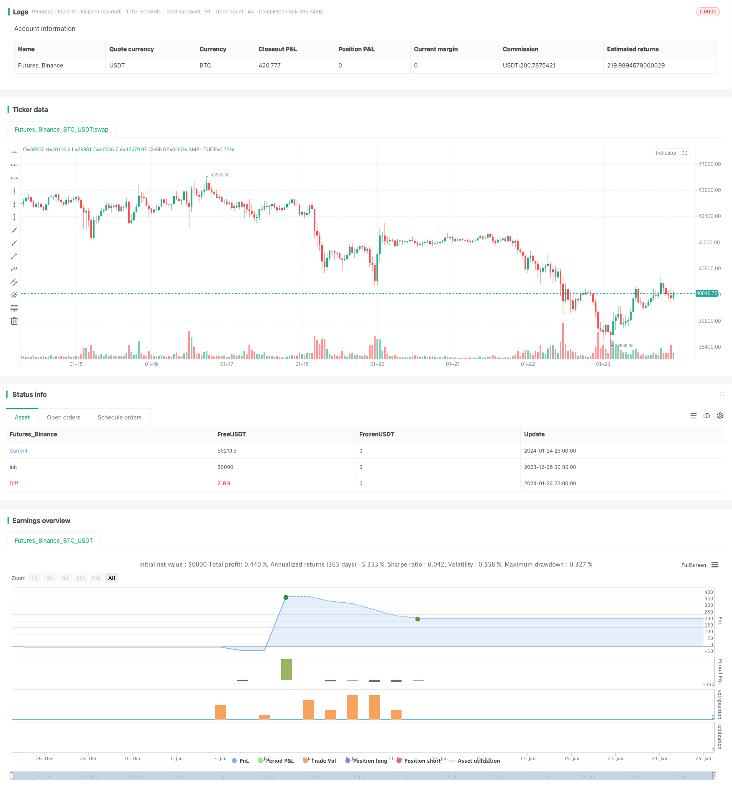

> Name

Two-Year-New-High-Retracement-Moving-Average-Strategy
> Author

ChaoZhang

> Strategy Description


 [trans]
### Overview
This strategy is based on a unique calculation of a stock's two-year high price and a moving average. When the stock price hits a two-year high and then pulls back to the 13-day exponential moving average, a buy signal is generated.
### Strategy Principle
The core logic of this strategy is based on the following unique calculation method:
1. When the stock price reaches its highest price in two years, it will form a short-term price high. This is a more critical price point.
2. When the price falls from this new high and pulls back to the 13-day exponential moving average, it is a better buying opportunity. This takes advantage of the central feature of price.
3. In addition, when the buy signal is issued, the stock price must be within 10% of the new high price in two years, and cannot be too far away. And it should be lower than the 13-day line and higher than the 21-day line, which ensures the timing of buying.
4. For the positions held, if the price falls below 5% of the 21-day line or falls 20% from the two-year high, the profit will be stopped within the range.
### Strategy Advantages
This is a long-term breakout strategy with the following advantages:
1. Using the unique price of a two-year high can effectively determine potential trend reversal opportunities.
2. The 13-day exponential moving average is used as the basis for market entry, which can effectively filter shocks and determine strong momentum.
3. The only calculation method uses price characteristics to send signals and avoid subjective assumptions.
4. With proper consideration of stop loss, most profits can be locked in.
### Strategic Risks and Solutions (Risks and Solutions)
This strategy also has some risks, mainly including:
1. The market may experience a deep correction and all losses cannot be stopped. At this time, you need to evaluate the general environment and determine whether to decisively stop losses.
2. In the case of a large gap overnight, it is impossible to stop the loss perfectly. This requires appropriate relaxation of the stop loss range in response.
3. The effect of filtering shocks on the 13th line may not be ideal and generate too many false signals. At this time, it can be appropriately extended to the 21st line.
4. The trend turning point described by new highs may not be effective, so you may consider using other indicators instead.
### Strategy Optimization Suggestions
There is still room for optimization in this strategy:
1. Other tools can be introduced to judge the general environment and avoid unnecessary positions.
2. Increase the strength of judgments such as quantity and energy indicators to further avoid accidentally entering the shock range.
3. Optimize the moving average parameters to make it better able to capture price characteristics.
4. Use machine learning methods to dynamically optimize the parameters of the new high price in two years to make the strategy more flexible.
### Conclusion
Overall, this strategy is a relatively unique long-term breakthrough idea. The key point is to use the important price of the two-year new high to make judgments, and use the 13-day exponential moving average as the basis for filtering and entry. This strategy has certain advantages, but there is also room for optimization and is worthy of further exploration and research.
||

### Overview
This strategy is based on the unique calculation of the two-year new high price and moving average of stocks. It generates a buy signal when the stock price retreats to the 13-day exponential moving average after reaching a two-year high.  

### Strategy Principle  
The core logic of this strategy is based on the following unique calculations:  

1. When the stock price reaches a new high over the last two years, it forms a short-term peak. This is a critical price level.  

2. When the price retreats from this new high and pulls back to the 13-day exponential moving average, it presents a good buying opportunity. This utilizes the price consolidation pattern. 

3. In addition, when the buy signal triggers, the stock price must be within 10% range of the two-year high, not too far away. It also needs to be below 13-day line and above 21-day line to ensure proper timing.  

4. For open positions, if the price breaks 5% below the 21-day MA line or declines 20% from the two-year high, the position will be stopped out to lock in profits.

### Strategy Advantages  
This is a long-term breakout strategy with these advantages:

1. The unique two-year high price can effectively identify potential trend reversal opportunities.   

2. The 13-day EMA line serves as the entry filter to avoid whipsaws and determine stronger momentum. 

3. The unique calculations generate signals based on price action, avoiding subjective interference.  

4. Reasonable stop loss allows locking in most profits.

### Risks and Solutions
There are also some risks mainly as follows:   

1. Markets can experience deep drawdowns, unable to stop out in time. Need to assess the overall environment to decide whether to cut losses resolutely.

2. Overnight big gaps may prevent perfect stop loss. Hence stop loss percentage needs to be widened to adapt.  

3. The 13-day line may not filter out consolidations well, generating excessive false signals. Can consider extending to 21-day line.

4. New high price may not work well to determine trend changes. Other indicators can combine to enhance effectiveness.

### Strategy Optimization Suggestions
There is room for further optimization:

1. Incorporate other tools to judge overall market conditions, avoiding unnecessary positions.  

2. Add momentum indicators to better avoid whipsaw ranges.
  
3. Optimize moving average parameters to better capture price patterns. 

4. Utilize machine learning to dynamically optimize the two-year high parameter for more flexibility.

### Conclusion  
In summary, this is a unique long term breakout strategy, with the key being the two-year high price level and the 13-day EMA line serving as entry filter. It has certain advantages but also room for improvements, worth further research and exploration.

[/trans]

> Strategy Arguments


|Argument|Default|Description|
|----|----|----|
|v_input_1|2000|Start Year|
|v_input_2|true|Start Month|
|v_input_3|true|Start Date|
|v_input_4|2021|End Year|
|v_input_5|6|End Month|
|v_input_6|3|End Date|


> Source (PineScript)

``` pinescript
/*backtest
start: 2023-12-26 00:00:00
end: 2024-01-25 00:00:00
period: 1h
basePeriod: 15m
exchanges: [{"eid":"Futures_Binance","currency":"BTC_USDT"}]
*/

// This source code is subject to the terms of the Mozilla Public License 2.0 at https://mozilla.org/MPL/2.0/
// © Part Timer

//This script accepts from and to date parameter for backtesting. 
//This script generates white arrow for each buying signal

//@version=4
strategy("AMRS_LongOnly_PartTimer", overlay = true)

//i_endTime = input(defval = timestamp("02 Jun 2021 15:30 +0000"), title = "End Time", type=input.time)

StartYear=input(defval = 2000, title ="Start Year", type=input.integer)
StartMonth=input(defval = 01, title ="Start Month", type=input.integer)
StartDate=input(defval = 01, title ="Start Date", type=input.integer)

endYear=input(defval = 2021, title ="End Year", type=input.integer)
endMonth=input(defval = 06, title ="End Month", type=input.integer)
endDate=input(defval = 03, title ="End Date", type=input.integer)

ema11=ema(close,11)
ema13=ema(close,13)
ema21=ema(close,21)

afterStartDate = true
//g=bar_index==1
//ath()=>
    //a=0.0
    //a:=g ? high : high>a[1] ? high:a[1]
    
//a = security(syminfo.tickerid, 'M', ath(),lookahead=barmerge.lookahead_on)

newHigh = (high > highest(high,504)[1])
//plot down arrows whenever it's a new high
plotshape(newHigh, style=shape.triangleup, location=location.abovebar, color=color.green, size=size.tiny)
b=highest(high,504)[1]
VarChk=((b-ema13)/b)*100
TrigLow = (low <= ema13) and (low >= ema21) and (VarChk <= 10)
plotshape(TrigLow, style=shape.triangleup, location=location.belowbar, color=color.white, size=size.tiny)
ExitPrice=(ema21 - (ema21*0.05))
DrawPrice=(b - (b*0.20))
stopprice=0.0
if (close <= ExitPrice)
    stopprice := ExitPrice
if (close <= DrawPrice)
    stopprice := DrawPrice

if (TrigLow and afterStartDate)
    strategy.entry("Long", strategy.long)

strategy.exit("exit","Long", stop=stopprice)
//beforeEndDate = (time < i_endTime)
beforeEndDate = (time >= timestamp(syminfo.timezone,endYear, endMonth, endDate, 0, 0))
if (beforeEndDate)
    strategy.close_all()
```

> Detail

https://www.fmz.com/strategy/440080

> Last Modified

2024-01-26 14:49:28
