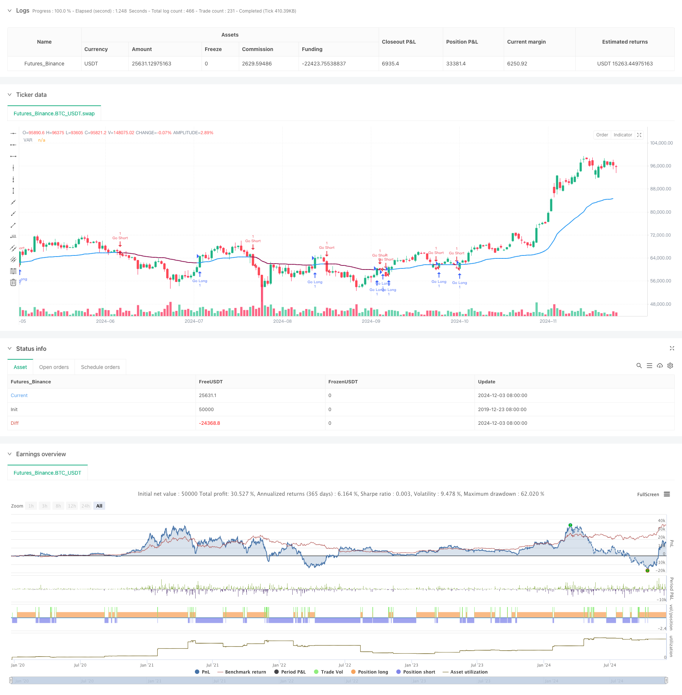

> Name

Adaptive-Weighted-Trend-Following-Strategy-VIDYA-Multi-Indicator-System
> Author

ChaoZhang

> Strategy Description



[trans]
#### Overview
This strategy is a trend following trading system based on the VIDYA (Variable Index Dynamic Average) indicator. This strategy adapts to market fluctuations by dynamically adjusting weights, and combines two calculation methods, Chua's Momentum Index (CMO) and standard deviation (StDev), to achieve more accurate trend identification and trading signal generation. The system introduces an adaptive mechanism based on the traditional moving average, which can automatically adjust the sensitivity according to market conditions.
#### Strategy Principle
The core of the strategy is the VIDYA indicator, and its calculation process includes the following key steps:
1. Determine the basic period (default 21 periods) and smoothing coefficient alpha through parameter settings
2. Introduce CMO or StDev as a volatility calculation method
3. Use dynamic weight k value to adjust VIDYA’s sensitivity to price changes
4. When the VIDYA line crosses upward, a long signal is generated, and when it crosses downward, a short signal is generated.
This strategy allows users to choose to use CMO or standard deviation to calculate the volatility coefficient, increasing the flexibility of the strategy. The CMO mode uses a fixed period of 9, while the standard deviation mode remains consistent with the basic period.
#### Strategic Advantages
1. Strong adaptability: through dynamic weight adjustment, it can maintain good performance in different market environments.
2. Signal stability: Compared with traditional moving averages, it can better filter out false signals
3. Adjustable parameters: Provides multiple adjustable parameters to facilitate optimization according to different market characteristics.
4. Dual calculation method: supports two volatility calculation methods, CMO and StDev, which increases the adaptability of the strategy.
5. Simple and easy to use: The strategy logic is clear, the signals are clear, and it is easy to operate in practice.
#### Strategy Risk
1. Trend dependence: Frequent false signals may occur in volatile markets
2. Parameter sensitivity: Different parameter combinations have a greater impact on strategy performance
3. Hysteresis: As a moving average indicator, there is still a certain degree of lag.
4. Market adaptability: may perform poorly in certain market environments
5. Fund management: Lack of stop-loss mechanism may lead to larger drawdowns
#### Strategy optimization direction
1. Introduce volatility filter: adjust signal generation rules in high volatility environment
2. Add trend confirmation indicators: combine with other technical indicators to improve signal reliability
3. Improve fund management: design dynamic stop loss and position management mechanisms
4. Optimize parameter selection: develop automatic parameter optimization methods for different market cycles
5. Increase market environment judgment: dynamically adjust strategy parameters according to market conditions
#### Summary
The VIDYA strategy provides a relatively reliable trend following solution through an innovative adaptive weighting mechanism. While remaining simple and easy to use, this strategy improves its adaptability to market changes through dynamic adjustments. Although there are still some inherent limitations, the stability and reliability of the strategy can be further improved through the provided optimization directions. The strategy's dual calculation method provides greater flexibility for application in different market environments. ||
#### Overview
This strategy is a trend following trading system based on the VIDYA (Variable Index Dynamic Average) indicator. The strategy adapts to market volatility by dynamically adjusting weights, combining Chande's Momentum Oscillator (CMO) and Standard Deviation (StDev) calculation methods to achieve more accurate trend identification and trading signal generation. The system introduces an adaptive mechanism on top of traditional moving averages, automatically adjusting sensitivity based on market conditions.

#### Strategy Principles
The core of the strategy is the VIDYA indicator, with calculation process including these key steps:
1. Setting basic period (default 21) and smoothing coefficient alpha
2. Incorporating CMO or StDev as volatility calculation methods
3. Using dynamic weight k to adjust VIDYA's sensitivity to price changes
4. Generating long signals when VIDYA crosses upward and short signals when crossing downward

The strategy allows users to choose between CMO or standard deviation for volatility coefficient calculation, increasing flexibility. CMO mode uses a fixed 9-period cycle, while StDev mode maintains consistency with the base period.

#### Strategy Advantages
1. Strong Adaptability: Maintains good performance in different market environments through dynamic weight adjustment
2. Stable Signals: Better filters false signals compared to traditional moving averages
3. Adjustable Parameters: Provides multiple tunable parameters for optimization based on different market characteristics
4. Dual Calculation Methods: Supports both CMO and StDev volatility calculations, increasing strategy adaptability
5. User-Friendly: Clear strategy logic and definitive signals, convenient for practical operation

#### Strategy Risks
1. Trend Dependency: May generate frequent false signals in oscillating markets
2. Parameter Sensitivity: Different parameter combinations significantly affect strategy performance
3. Lag: Inherent delay exists as a moving average type indicator
4. Market Adaptability: May underperform in certain specific market environments
5. Money Management: Lack of stop-loss mechanism may lead to significant drawdowns

#### Strategy Optimization Directions
1. Introduce Volatility Filter: Adjust signal generation rules in high volatility environments
2. Add Trend Confirmation Indicators: Combine with other technical indicators to improve signal reliability
3. Improve Money Management: Design dynamic stop-loss and position management mechanisms
4. Optimize Parameter Selection: Develop automatic parameter optimization methods for different market cycles
5. Enhance Market Environment Assessment: Dynamically adjust strategy parameters based on market conditions

#### Summary
The VIDYA strategy provides a relatively reliable trend following solution through innovative adaptive weight mechanisms. While maintaining simplicity and ease of use, the strategy improves adaptability to market changes through dynamic adjustments. Although some inherent limitations exist, the provided optimization directions can further enhance strategy stability and reliability. The dual calculation methods offer greater flexibility for application in different market environments.[/trans]


> Source (PineScript)

``` pinescript
/*backtest
start: 2019-12-23 08:00:00
end: 2024-12-04 00:00:00
period: 1d
basePeriod: 1d
exchanges: [{"eid":"Futures_Binance","currency":"BTC_USDT"}]
*/

// This Pine Script™ code is subject to the terms of the Mozilla Public License 2.0 at https://mozilla.org/MPL/2.0/
// © GriffinJames


//@version=5
strategy("VIDYA Strategy", overlay=true, initial_capital=25000)

// Inputs
src = input(close, title="Source")
pds = input.int(21, title="Length")
fixCMO = input.bool(true, title="Fixed CMO Length (9)?")
select = input.bool(true, title="Calculation Method: CMO/StDev?")
alpha = 2 / (pds + 1)
momm = ta.change(src)

// Functions to calculate MOM
f1(m) => m >= 0.0 ? m : 0.0
f2(m) => m >= 0.0 ? 0.0 : -m

m1 = f1(momm)
m2 = f2(momm)
sm1 = fixCMO ? math.sum(m1, 9) : math.sum(m1, pds)
sm2 = fixCMO ? math.sum(m2, 9) : math.sum(m2, pds)

percent(nom, div) => 100 * nom / div
chandeMO = na(percent(sm1 - sm2, sm1 + sm2)) ? 0 : percent(sm1 - sm2, sm1 + sm2)

// Select calculation method
k = select ? math.abs(chandeMO) / 100 : ta.stdev(src, pds)

// Calculate VIDYA
var float VIDYA = na
VIDYA := na(VIDYA[1]) ? src : alpha * k * src + (1 - alpha * k) * VIDYA[1]

// Conditions for long and short
col12 = VIDYA > VIDYA[1]
col32 = VIDYA < VIDYA[1]

// Plot VIDYA with dynamic colors
color2 = col12 ? color.new(color.blue, 0) : col32 ? color.new(color.maroon, 0) : color.new(color.blue, 0)
plot(VIDYA, "VAR", color=color2, linewidth=2)

// Long and Short Strategy
if (col12)
    strategy.entry("Go Long", strategy.long)
if (col32)
    strategy.entry("Go Short", strategy.short)

// Alert for VIDYA color change
alertcondition(ta.cross(VIDYA, VIDYA[1]), title="Color ALARM!", message="VIDYA has changed color!")

```

> Detail

https://www.fmz.com/strategy/474037

> Last Modified

2024-12-05 15:07:47
