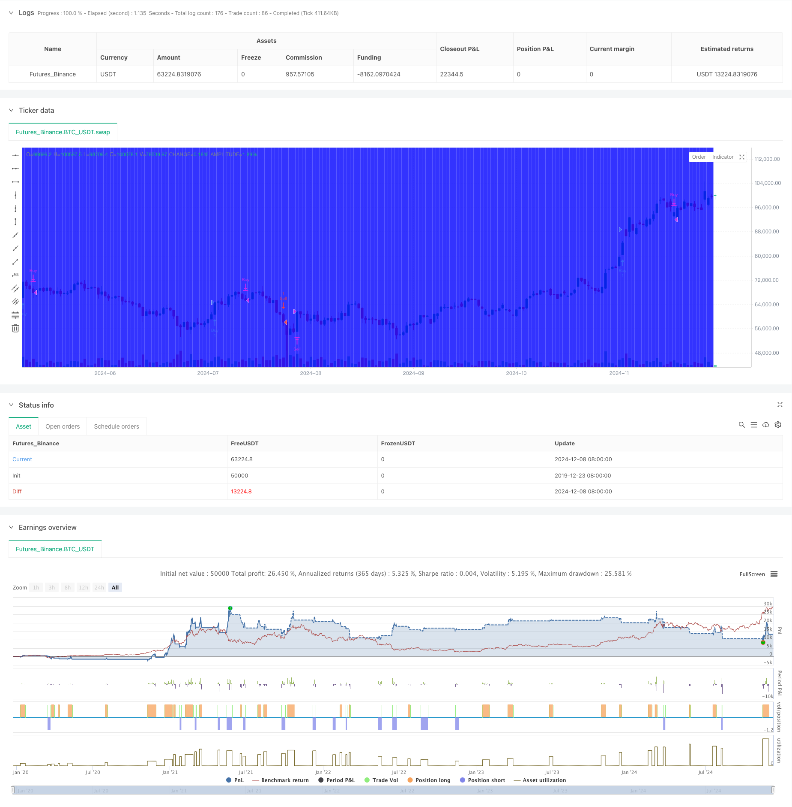

> Name

Advanced-Volatility-Mean-Reversion-Trading-Strategy-Multi-Dimensional-Quantitative-Trading-System-Based-on-VIX-and-Moving-Average
> Author

ChaoZhang

> Strategy Description




[trans]
#### Overview
This strategy is a quantitative trading system based on the behavior of the Volatility Index (VIX) relative to its 10-day moving average. This strategy uses the deviation between the VIX and its moving average as a trading signal, combining the concepts of technical analysis and statistical arbitrage. The core idea of ​​the strategy is to capture extreme changes in market sentiment, trade when the VIX deviates significantly, and wait for it to return to the mean.
#### Strategy Principle
The strategy adopts a two-way trading mechanism, including two dimensions: long and short:
Long conditions require that the lowest price of VIX must be higher than its 10-day moving average, and the closing price must be at least 10% higher than the moving average. When these two conditions are met at the same time, the system generates a long signal at the close.
The short-selling conditions require that the highest price of VIX must be lower than its 10-day moving average, and the closing price must be at least 10% lower than the moving average. When these two conditions are met at the same time, the system generates a short signal at the close.
The closing rules are also based on the relationship between the VIX and the moving average: for long positions, the position is closed when the VIX trades intraday below the previous day's 10-day moving average; for short positions, the position is closed when the VIX trades intraday above the previous day's 10-day moving average.
#### Strategic Advantages
1. Clear quantitative indicators: The strategy uses specific numerical indicators and clear trading rules to avoid subjective judgment.
2. Two-way trading mechanism: You can make profits at different stages of market fluctuations, increasing profit opportunities.
3. Improved risk control: Clear entry and exit conditions are set to help control risks.
4. Reliable technical indicators: Based on VIX, a widely recognized volatility indicator in the market, it has good market adaptability.
#### Strategy Risk
1. Market fluctuation risk: VIX itself is an indicator of market fluctuations, and the strategy may face sudden market fluctuations.
2. Overfitting risk: Strategies based on specific conditions may have overfitting problems.
3. Risk of mean reversion assumption: In a sustained trend market, the mean reversion assumption may fail.
4. Liquidity risk: You may face insufficient liquidity and slippage when the market fluctuates violently.
#### Strategy optimization direction
1. Parameter optimization: The moving average period and deviation threshold can be optimized.
2. Add filter conditions: combine with other technical indicators to improve the reliability of trading signals.
3. Dynamic threshold: Dynamically adjust the deviation threshold according to the market environment.
4. Risk management optimization: Add stop loss and fund management mechanisms.
#### Summary
This strategy is a mean reversion strategy based on market volatility, capturing extreme changes in market sentiment through quantitative methods. The strategy has clear trading rules and risk control mechanisms, but it is necessary to pay attention to the impact of changes in the market environment on the effectiveness of the strategy. Through continuous optimization and improvement, this strategy is expected to maintain stable performance in different market environments. ||
#### Overview
This strategy is a quantitative trading system based on the behavior of the Volatility Index (VIX) relative to its 10-day moving average. The strategy utilizes the deviation between VIX and its moving average as trading signals, combining technical analysis and statistical arbitrage concepts. The core idea is to capture extreme changes in market sentiment by trading when VIX shows significant deviations and waiting for mean reversion.

#### Strategy Principles
The strategy employs a bi-directional trading mechanism with both long and short dimensions:
Long conditions require VIX's low to be above its 10-day moving average, and the closing price must be at least 10% above the moving average. When both conditions are met, the system generates a buy signal at market close.
Short conditions require VIX's high to be below its 10-day moving average, and the closing price must be at least 10% below the moving average. When both conditions are met, the system generates a sell signal at market close.
Exit rules are also based on VIX's relationship with the moving average: long positions are closed when VIX trades below the previous day's 10-day moving average intraday; short positions are closed when VIX trades above the previous day's 10-day moving average intraday.

#### Strategy Advantages
1. Clear quantitative indicators: The strategy uses specific numerical indicators and clear trading rules, avoiding subjective judgment.
2. Bi-directional trading mechanism: Profits can be made in different market volatility phases, increasing profit opportunities.
3. Comprehensive risk control: Clear entry and exit conditions help control risk.
4. Reliable technical indicators: Based on VIX, a market-recognized volatility indicator, with good market adaptability.

#### Strategy Risks
1. Market volatility risk: VIX itself measures market volatility, and the strategy may face sudden market swings.
2. Overfitting risk: Strategies based on specific conditions may suffer from overfitting issues.
3. Mean reversion assumption risk: The mean reversion assumption may fail in trending markets.
4. Liquidity risk: May face liquidity shortages and slippage during extreme market volatility.

#### Strategy Optimization Directions
1. Parameter optimization: Optimize moving average periods and deviation thresholds.
2. Additional filters: Incorporate other technical indicators to improve signal reliability.
3. Dynamic thresholds: Adjust deviation thresholds based on market conditions.
4. Risk management optimization: Add stop-loss and money management mechanisms.

#### Conclusion
This strategy is a mean reversion strategy based on market volatility, using quantitative methods to capture extreme changes in market sentiment. The strategy has clear trading rules and risk control mechanisms but requires attention to how changing market environments affect strategy performance. Through continuous optimization and improvement, this strategy has the potential to maintain stable performance across different market conditions.[/trans]


> Source (PineScript)

``` pinescript
/*backtest
start: 2019-12-23 08:00:00
end: 2024-12-09 08:00:00
period: 1d
basePeriod: 1d
exchanges: [{"eid":"Futures_Binance","currency":"BTC_USDT"}]
*/

// This Pine Script™ code is subject to the terms of the Mozilla Public License 2.0 at https://mozilla.org/MPL/2.0/
// © EdgeTools

//@version=5
strategy("Connors VIX Reversal III invented by Dave Landry", overlay=true)

// Inputs
vixSymbol = input("swap", "VIX Symbol")
lengthMA = input(10, title="Length of Moving Average")
percentThreshold = input(10, title="Percentage Threshold")
buyColor = input(color.rgb(0, 255, 0,90), title="Buy Signal Color")
sellColor = input(color.rgb(255, 0, 0,90), title="Sell Signal Color")
exitColor = input(color.rgb(0, 0, 255,90), title="Exit Signal Color")

// Fetch VIX data
vixClose = request.security(vixSymbol, "D", close)
vixHigh = request.security(vixSymbol, "D", high)
vixLow = request.security(vixSymbol, "D", low)

// Calculate 10-day Moving Average of VIX
vixMA = ta.sma(vixClose, lengthMA)

// Calculate yesterday's 10-day Moving Average
vixMA_yesterday = ta.sma(vixClose[1], lengthMA)

// Buy Rules
buyCondition1 = vixLow > vixMA
buyCondition2 = vixClose > vixMA * (1 + percentThreshold / 100)
buySignal = buyCondition1 and buyCondition2

// Sell Rules
sellCondition1 = vixHigh < vixMA
sellCondition2 = vixClose < vixMA * (1 - percentThreshold / 100)
sellSignal = sellCondition1 and sellCondition2

// Exit Rules
buyExit = vixLow < vixMA_yesterday
sellExit = vixHigh > vixMA_yesterday

// Plot Buy/Sell Signals
bgcolor(buySignal ? buyColor : na)
bgcolor(sellSignal ? sellColor : na)

// Exit Signals
bgcolor(buyExit ? exitColor : na)
bgcolor(sellExit ? exitColor : na)

// Strategy
if (buySignal)
    strategy.entry("Buy", strategy.long)
if (sellSignal)
    strategy.entry("Sell", strategy.short)

if (buyExit)
    strategy.close("Buy")
if (sellExit)
    strategy.close("Sell")

```

> Detail

https://www.fmz.com/strategy/474722

> Last Modified

2024-12-11 17:54:30
