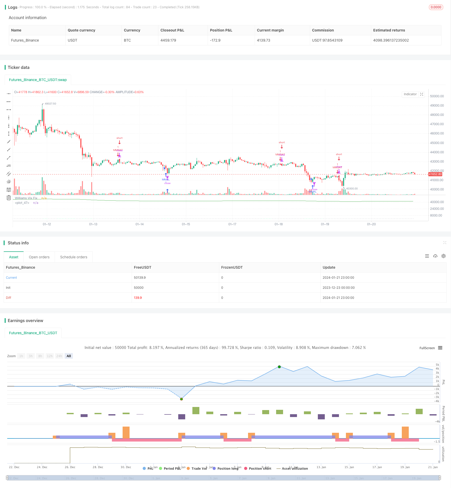

> Name

Volatility-and-Trend-Tracking-Strategy-Across-Timeframes-Based-on-Williams-VIX-and-DEMA
> Author

ChaoZhang

> Strategy Description


 [trans]

## Overview
This strategy first obtains the William VIX indicator by calculating the difference between the highest price and the lowest price within a certain period and dividing it by the highest price. Then combine the standard deviation principle of Bollinger Bands to set the upper track and lower track. At the same time, the take-profit range is set based on the percentile within a certain period. In the entry section, go long when the price crosses from the upper band and is lower than the DEMA indicator; go short when the price crosses from the lower band and is higher than the DEMA indicator.
## Strategy Principle
This strategy mainly uses the William VIX indicator to judge market volatility and risk, and supplements it with the DEMA indicator to judge price trends.
First of all, the calculation formula of William VIX indicator is:
```
WVF = ((Highest(close, n) - Low) / (Highest(close, n))) * 100
```

where n is the number of parameter periods. This indicator reflects the volatility between the highest and lowest prices within a certain period. Higher values ​​indicate greater volatility and higher risk.
On this basis, this strategy uses the idea of ​​Bollinger Bands. The upper rail is set to the middle rail + n times the standard deviation, and the lower rail is the middle rail - n times the standard deviation. When the price is close to the upper track, it means that volatility is expanding, and there is an opportunity to go long; when the price is close to the lower track, it means that volatility is shrinking, and there is an opportunity to go short.
In addition, this strategy also sets a take-profit range based on the percentile principle within a certain period. For example, the 90th percentile is the most recent 90% of prices within the statistical period. When the price exceeds this quantile, it means that the fluctuation has been relatively large, and you can consider taking profit.
In the specific trading strategy, the DEMA indicator is combined to determine the trend. Go long only when the price crosses from the upper band and is below DEMA; go short only when the price crosses from the lower band and is above DEMA.
## Strategic advantage analysis
This strategy combines the William VIX indicator to determine volatility, the Bollinger Bands based on the standard deviation principle, and the DEMA indicator to determine trends. It is highly comprehensive and can better grasp the two major elements of the market: risk and trend.
Specifically, the combination of the William VIX indicator and the upper and lower rails of Bollinger Bands can judge volatility risks; the DEMA indicator can judge the direction of price trends; the take-profit range setting can lock in profits and reject excessive greed.
Therefore, this strategy does a good job in grasping both risks and trends. Not only can it choose a better entry time, but it can also use the take-profit range to avoid reversal risks when good profits have been obtained. It can be said to be a prudent and conservative strategy.
## Strategy risk analysis
The biggest risk with this strategy is that volatility and trend indicators may diverge. That is to say, when the William VIX indicator shows increased volatility and the price is close to the upper or lower Bollinger Band, the judgment of the DEMA indicator is inconsistent with it. For example, volatility shows a long opportunity, but DEMA shows a downward trend. Loss may occur at this time.
In addition, setting the take-profit range too conservatively will also affect the profitability of the strategy. If the quantile parameter is set too low, it will be difficult to trigger the take profit, making it impossible to lock in profits.
## Optimization direction
You can consider setting the take-profit range parameters to adjustable parameters, which can be adjusted in different market environments. Specifically, when the market is in shock, the quantile parameters can be appropriately increased and the profit-taking range can be expanded; but in the market with obvious trends, the quantile parameters should be lowered and profit-taking should be taken in a timely manner.
In addition, you can also consider adding other indicators to judge the trend. When the original DEMA indicator and the new indicator are inconsistent, suspend the opening of a position to avoid losses caused by false signals.
## Summarize
This strategy comprehensively uses volatility indicators, standard deviation principles, trend judgment and profit-taking ideas, and can well respond to market risks and trend changes. It is stable and conservative and suitable for long-term holding. Through parameter optimization, the stability and profitability of the strategy can be further enhanced.
||

## Overview

This strategy first calculates the Williams VIX indicator by getting the difference between the highest price and the lowest price over a certain period divided by the highest price. Then, combining the idea of standard deviation from Bollinger Bands, it sets the upper and lower bands. At the same time, it sets the take profit range based on percentile over a certain period. In the entry part, when the price crosses below the upper band and is lower than the DEMA indicator, it goes long. When the price crosses above the lower band and is higher than the DEMA indicator, it goes short.

## Strategy Logic

This strategy mainly utilizes the Williams VIX indicator to gauge market volatility and risk, while using the DEMA indicator to judge the price trend.

Firstly, the calculation formula for Williams VIX indicator is:

```
WVF = ((Highest(close, n) - Low) / (Highest(close, n))) * 100
```

Where n is the parameter period. This indicator reflects the volatility between the highest price and the lowest price over a certain period. The higher the value, the greater the volatility and higher the risk.

On this basis, the strategy employs the idea of Bollinger Bands. The upper band is set as middle band + n times standard deviation, and the lower band is set as middle band - n times standard deviation. When price approaches the upper band, it indicates expanding volatility and long opportunity; when price approaches the lower band, it indicates contracting volatility and short opportunity.

In addition, the strategy also sets a take profit range based on percentile principle over a period. For example, 90 percentile means the latest 90% price over the statistical period. When price surpasses this percentile, it indicates the volatility has been quite big and it’s time to consider taking profit.

In the actual trading strategy, it incorporates DEMA indicator to judge the trend. It only goes long when price crosses below upper band and is lower than DEMA; it only goes short when price crosses above lower band and is higher than DEMA.

## Advantage Analysis  

This strategy combines the Williams VIX indicator which judges volatility, Bollinger Bands based on standard deviation, and DEMA indicator which judges the trend, making it very comprehensive to grasp the two key market factors: risk and trend.

Specifically, the Williams VIX combined with BB upper and lower bands can make risk and volatility judgments; the DEMA indicator can determine the price trend direction; the take profit range setting can lock in profits and avoid being too greedy.

Therefore, this strategy does very well in capturing risks and trends. It not only chooses better entry timing, but also avoids the reversal risk when decent profits have been made through the take profit range, making it a stable and conservative strategy.

## Risk Analysis

The biggest risk of this strategy is that the volatility indicator and trend indicator may diverge. That is when the Williams VIX indicator shows increasing volatility and price nears the BB upper or lower bands, the DEMA indicator’s judgement contradicts it. For example, volatility shows long opportunity but DEMA displays downward trend. There could be losses in situations like this.

In addition, excessively conservative take profit range settings could also hurt the strategy's profitability. If the percentile parameter is set too low, it would be hard to trigger taking profit, failing to lock in gains.

## Optimization Directions 

We could consider making take profit range parameters adjustable for different market environments. Specifically, in range-bound markets, appropriately lift percentile parameters to expand the profit taking range. But in obvious trending markets, lower the percentile parameter to take profits in time.

Also, we could consider adding other indicators to judge the trend. When the original DEMA diverges from the new indicators, suspend opening positions to avoid losses from false signals.

## Conclusion

This strategy comprehensively utilizes volatility indicators, standard deviation principles, trend judgements and profit taking ideas to address market risk and trend changes very well. It is stable and conservative, suitable for long-term holdings. Through parameter optimization, the strategy's stability and profitability could be further enhanced.

[/trans]

> Strategy Arguments


|Argument|Default|Description|
|----|----|----|
|v_input_1|22|LookBack Period Standard Deviation High|
|v_input_2|20|Bolinger Band Length|
|v_input_3|2|Bollinger Band Standard Devaition Up|
|v_input_4|2|BB STD LOW|
|v_input_5|50|Look Back Period Percentile High|
|v_input_6|0.85|Highest Percentile - 0.90=90%, 0.95=95%, 0.99=99%|
|v_input_7|1.01|Lowest Percentile - 1.10=90%, 1.05=95%, 1.01=99%|
|v_input_8|false|Show High Range - Based on Percentile and LookBack Period?|
|v_input_9|false|Show Standard Deviation Line?|
|v_input_10|2018|yearfrom|
|v_input_11|2019|yearuntil|
|v_input_12|true|monthfrom|
|v_input_13|12|monthuntil|
|v_input_14|true|dayfrom|
|v_input_15|31|dayuntil|
|v_input_16|50|lengthema|
|v_input_17_close|0|Source: close|high|low|open|hl2|hlc3|hlcc4|ohlc4|


> Source (PineScript)

``` pinescript
/*backtest
start: 2023-12-23 00:00:00
end: 2024-01-22 00:00:00
period: 1h
basePeriod: 15m
exchanges: [{"eid":"Futures_Binance","currency":"BTC_USDT"}]
*/

//@version=2

strategy("VIX and DEMA", overlay=false)
pd = input(22, title="LookBack Period Standard Deviation High")
bbl = input(20, title="Bolinger Band Length")
multupper = input(2.0    , minval=1, maxval=5, title="Bollinger Band Standard Devaition Up")
multlow = input(2.0,minval=1,maxval=5,title="BB STD LOW")
lb = input(50  , title="Look Back Period Percentile High")
ph = input(.85, title="Highest Percentile - 0.90=90%, 0.95=95%, 0.99=99%")
pl = input(1.01, title="Lowest Percentile - 1.10=90%, 1.05=95%, 1.01=99%")
hp = input(false, title="Show High Range - Based on Percentile and LookBack Period?")
sd = input(false, title="Show Standard Deviation Line?")

wvf = ((highest(close, pd)-low)/(highest(close, pd)))*100

sDevupper = multupper * stdev(wvf, bbl)
sDevlow = multlow *stdev(wvf,bbl)
midLine = sma(wvf, bbl)
lowerBand = midLine - sDevlow
upperBand = midLine + sDevupper

rangeHigh = (highest(wvf, lb)) * ph
rangeLow = (lowest(wvf, lb)) * pl

col = wvf >= upperBand or wvf >= rangeHigh ? lime : gray
price=close 


plot(hp and rangeHigh ? rangeHigh : na, title="Range High Percentile", style=line, linewidth=4, color=orange)
plot(hp and rangeLow ? rangeLow : na, title="Range High Percentile", style=line, linewidth=4, color=orange)
plot(wvf, title="Williams Vix Fix", style=histogram, linewidth = 4, color=col)
plot(sd and upperBand ? upperBand : na, title="Upper Band", style=line, linewidth = 3, color=aqua)

yearfrom = input(2018)
yearuntil =input(2019)
monthfrom =input(1)
monthuntil =input(12)
dayfrom=input(1)
dayuntil=input(31)


lengthema = input(50, minval=1)
src = input(close, title="Source")
e1 = ema(src, lengthema)
e2 = ema(e1, lengthema)
dema = 2 * e1 - e2
plot(dema, color=green)


if ((crossunder(wvf,upperBand) ) and (price<dema) ) 
    strategy.entry("MMAL", strategy.long, stop=close, oca_name="TREND",  comment="AL")
    
else
    strategy.cancel(id="MMAL")


if   ((( (wvf<lowerBand) ) and  (price>dema) ) ) 

    strategy.entry("MMSAT", strategy.short,stop=close, oca_name="TREND",  comment="SAT")
else
    strategy.cancel(id="MMSAT")
    
    
    
    
```

> Detail

https://www.fmz.com/strategy/439750

> Last Modified

2024-01-23 15:02:30
