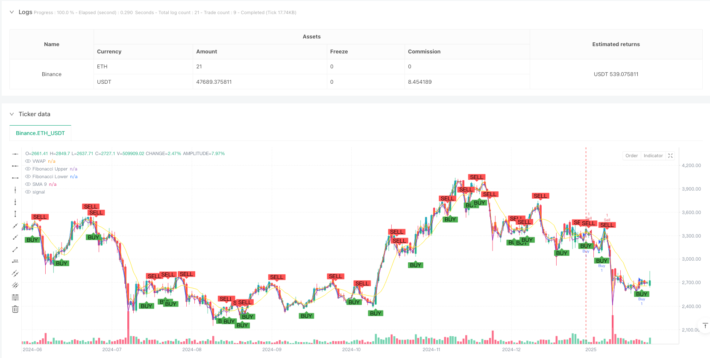
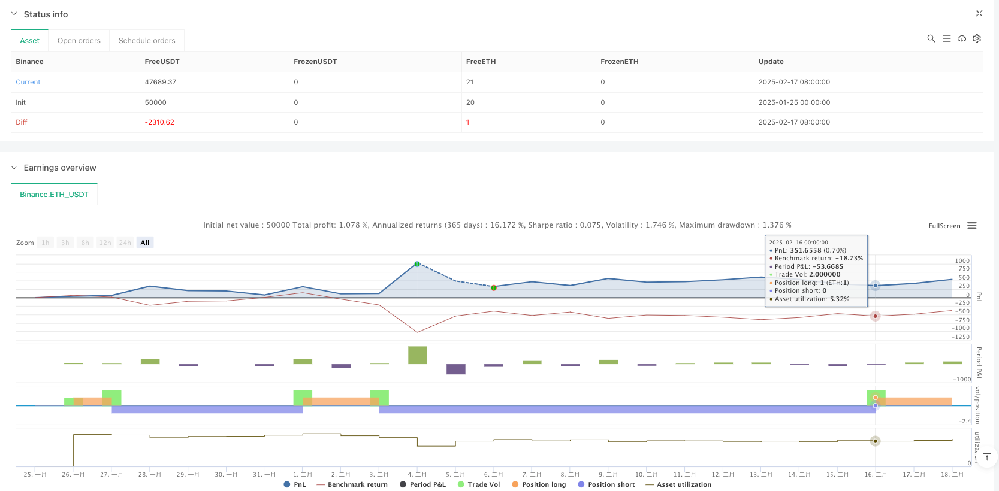

> Name

Multi-Indicator-Intraday-Quantitative-Trading-Strategy-Dynamic-Signal-System-Based-on-VWAP-Fibonacci-RSI-SMA
> Author

ianzeng123

> Strategy Description





[trans]
#### Overview
This is an intraday quantitative trading strategy that organically combines multiple technical indicators. It builds a multi-dimensional trading signal system by integrating the Volume Weighted Average Price (VWAP), Fibonacci retracement levels, Relative Strength Index (RSI) and Simple Moving Average (SMA). This strategy uses the synergy of different indicators to find high-probability trading opportunities in market fluctuations.
#### Strategy Principle
The strategy uses a multi-layer filtering mechanism to confirm trading signals:
1. Use the RSI indicator to identify overbought and oversold areas. When RSI breaks through 30 and enters the oversold area, a buy signal is generated. When RSI breaks through 70 and enters the overbought area, a sell signal is generated.
2. Establish a reference range for price movement through Fibonacci retracement levels (0.382 and 0.618), and only allow trading when the price is within this range
3. Use VWAP as a trend confirmation indicator. When the price is above VWAP, it supports long selling, and when the price is below VWAP, it supports short selling.
4. Introduce SMA as an auxiliary indicator to generate additional trading signals when the price breaks through the SMA
The final trading signal needs to meet RSI conditions or SMA conditions and meet the Fibonacci range and VWAP position requirements.
#### Strategic Advantages
1. The multiple signal confirmation mechanism significantly improves the reliability of transactions and reduces the impact of false signals.
2. It combines the two trading ideas of trend and shock, which can not only capture trend opportunities but also conduct range trading.
3. Through the introduction of VWAP, trading volume factors are taken into account to make the strategy closer to the actual market situation.
4. The application of Fibonacci retracement levels helps determine key price areas and improves the accuracy of entry timing.
5. The strategy logic is clear and the role of each indicator is clear, making it easy to monitor and adjust.
#### Strategy Risk
1. Multiple conditions may lead to missing some trading opportunities, especially in fast market conditions
2. RSI and SMA can produce lagging signals in volatile markets
3. The calculation of Fibonacci retracement range relies on historical data and may become invalid when the market environment changes significantly.
4. The reference meaning of VWAP may differ in different time periods.
5. It is necessary to set a reasonable stop loss to control risks and avoid excessive losses in violent fluctuations.
#### Strategy optimization direction
1. Introduce an adaptive parameter optimization mechanism to dynamically adjust each indicator parameter according to market fluctuations
2. Increase the dimension of trading volume analysis and add abnormal trading volume identification based on VWAP.
3. Consider adding market volatility indicators to adjust the aggressiveness of strategies under different volatility environments
4. Improve the stop-loss and stop-profit mechanism, and consider using a dynamic stop-loss plan
5. Add trading time filtering to identify market characteristics in different time periods
#### Summary
This is a comprehensive and logical day trading strategy. Through the synergy of multiple technical indicators, we can control risks while pursuing stable returns. The strategy has strong practicality and scalability, and can adapt to different market environments through reasonable parameter optimization and risk control. However, users need to deeply understand the characteristics of each indicator, set parameters appropriately, and always pay attention to risk control. ||
#### Overview
This is an intraday quantitative trading strategy that organically combines multiple technical indicators, integrating Volume Weighted Average Price (VWAP), Fibonacci retracement levels, Relative Strength Index (RSI), and Simple Moving Average (SMA) to construct a multi-dimensional trading signal system. The strategy seeks high-probability trading opportunities in market fluctuations through the synergistic combination of different indicators.

#### Strategy Principles
The strategy employs a multi-layer filtering mechanism to confirm trading signals:
1. Uses RSI to identify overbought and oversold areas, generating buy signals when RSI crosses above 30 (oversold) and sell signals when crossing above 70 (overbought)
2. Establishes price movement reference ranges through Fibonacci retracement levels (0.382 and 0.618), only allowing trades when price is within this range
3. Uses VWAP as a trend confirmation indicator, supporting long positions above VWAP and short positions below
4. Incorporates SMA as an auxiliary indicator, generating additional trading signals when price crosses the SMA
Final trading signals must satisfy either RSI or SMA conditions while complying with Fibonacci range and VWAP position requirements.

#### Strategy Advantages
1. Multiple signal confirmation mechanism significantly improves trading reliability and reduces the impact of false signals
2. Combines trend and oscillation trading approaches, capable of capturing both trending opportunities and range-bound trades
3. Incorporation of VWAP considers volume factors, making the strategy more aligned with actual market conditions
4. Application of Fibonacci retracement levels helps determine key price areas, improving entry timing accuracy
5. Clear strategy logic with well-defined indicator roles, facilitating monitoring and adjustment

#### Strategy Risks
1. Multiple conditions may cause missed trading opportunities, especially in fast-moving markets
2. RSI and SMA may generate lagging signals in volatile markets
3. Fibonacci retracement range calculations rely on historical data and may become invalid when market conditions change significantly
4. VWAP's reference value may vary across different time periods
5. Proper stop-loss settings are necessary for risk control to avoid excessive losses during violent fluctuations

#### Strategy Optimization Directions
1. Introduce adaptive parameter optimization mechanisms to dynamically adjust indicator parameters based on market volatility conditions
2. Enhance volume analysis dimension by adding volume anomaly detection to the VWAP foundation
3. Consider adding market volatility indicators to adjust strategy aggressiveness in different volatility environments
4. Improve stop-loss and take-profit mechanisms, potentially implementing dynamic stop-loss solutions
5. Add trading time filters to identify market characteristics in different time periods

#### Summary
This is a comprehensive and logically rigorous intraday trading strategy. Through the synergistic effect of multiple technical indicators, it pursues stable returns while controlling risks. The strategy possesses strong practicality and scalability, capable of adapting to different market environments through proper parameter optimization and risk control. However, users need to deeply understand the characteristics of each indicator, set parameters reasonably, and maintain constant attention to risk control.[/trans]


> Source (PineScript)

``` pinescript
/*backtest
start: 2025-01-25 00:00:00
end: 2025-02-18 08:00:00
period: 1d
basePeriod: 1d
exchanges: [{"eid":"Binance","currency":"ETH_USDT"}]
*/

// Pine Script v5 kodu
//@version=5
strategy("Intraday Strategy with VWAP, Fibonacci, RSI, and SMA", shorttitle="Intraday Strategy", overlay=true)

// Input settings
lengthRSI = input.int(14, title="RSI Length")
lengthFib = input.int(5, title="Fibonacci Lookback Period")
timeframeVWAP = input.timeframe("", title="VWAP Timeframe")
smaLength = input.int(9, title="SMA Length")

rsi = ta.rsi(close, lengthRSI)
sma = ta.sma(close, smaLength)

[fibHigh, fibLow] = request.security(syminfo.tickerid, timeframe.period, [high, low])
upper = fibHigh - (fibHigh - fibLow) * 0.382
lower = fibHigh - (fibHigh - fibLow) * 0.618

vwav = request.security(syminfo.tickerid, timeframeVWAP, ta.vwap(close))
price_above_vwap = close > vwav

// Trading conditions
buySignalRSI = ta.crossover(rsi, 30) and close > lower and close < upper and price_above_vwap
sellSignalRSI = ta.crossunder(rsi, 70) and close < upper and close > lower and not price_above_vwap

buySignalSMA = ta.crossover(close, sma)
sellSignalSMA = ta.crossunder(close, sma)

finalBuySignal = buySignalRSI or buySignalSMA
finalSellSignal = sellSignalRSI or sellSignalSMA

// Execute trades
if finalBuySignal
    strategy.entry("Buy", strategy.long)
if finalSellSignal
    strategy.entry("Sell", strategy.short)

// Plot signals
plotshape(finalBuySignal, title="Buy Signal", location=location.belowbar, color=color.green, style=shape.labelup, text="BUY")
plotshape(finalSellSignal, title="Sell Signal", location=location.abovebar, color=color.red, style=shape.labeldown, text="SELL")

// Plot VWAP, SMA, and levels
plot(vwav, color=color.blue, title="VWAP")
plot(sma, color=color.yellow, title="SMA 9")
lineUpper = plot(upper, color=color.orange, title="Fibonacci Upper")
lineLower = plot(lower, color=color.purple, title="Fibonacci Lower")


```

> Detail

https://www.fmz.com/strategy/482777

> Last Modified

2025-02-27 17:50:42
