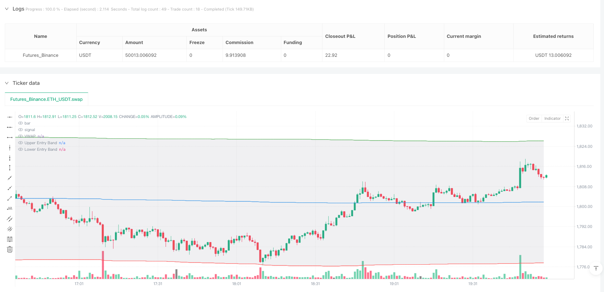
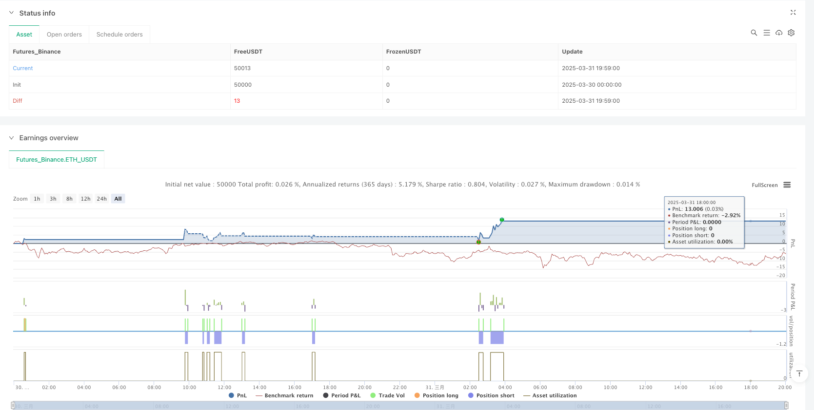

> Name

VWAP Deviation Band-and-Volatility-Filter-Trading-Strategy
> Author

ianzeng123

> Strategy Description





[trans]

#### Overview
The VWAP Bias Band and Volatility Filter trading strategy is an intraday trading system based on the Volume Weighted Average Price (VWAP) and standard deviation channels. This strategy uses VWAP as the central reference point for price, combines Al Brooks' H1/H2 and L1/L2 reversal patterns, and screens low-volatility environments through the ATR volatility filter to form a structured trading decision-making framework. The strategy enters the market when the price returns after breaking through the standard deviation channel. At the same time, it sets a stop loss based on the signal bar shape and a variety of flexible profit methods, including return to VWAP and deviation band target level. In addition, the safe exit mechanism provides additional protection in the event of consecutive adverse price movements, making the strategy robust in a variety of market environments.
#### Strategy Principle
The core principles of this strategy are built on the following key components:
1. **Anchoring the VWAP calculation for each trading day**: The VWAP calculation is reset at the beginning of each trading day to ensure that the price reference point is closely related to the trading activity of the day. The strategy uses standard deviation to create fluctuation bands above and below VWAP, with the default setting being 2 times the standard deviation.
2. **Entry trigger signal**:
   - Long entry (H1/H2): When the price opens below the 2 times standard deviation deviation band below, but closes above this deviation band, and there is sufficient long strength (calculated by the closing position within the bar range).
   - Short entry (L1/L2): When the price opens above the upper 2 times standard deviation deviation zone, but closes below this deviation zone, and has sufficient short strength.
3. **Volatility Filter**:
   - Measure market volatility using ATR(14)
   - Skip trading signals when the standard deviation range is too small (less than 3 times ATR) to avoid mistaken entries in low volatility environments
4. **Stop loss setting**:
   - Long: signal bar low minus stop loss buffer
   - Short: Signal bar high plus stop loss buffer
5. **Profit Exit Strategy**:
   - Different entry logic can be independently configured for the long and short directions
   - Options include: reverting to VWAP, reaching a specific deviation band target, or disabling automatic profit taking
6. **Safe exit mechanism**:
   - Safe exit triggered when a predetermined number of consecutive reverse bars occur
   - Long: X consecutive negative bars
   - Short position: X consecutive positive bars   
The strategy implements a complete signal strength calculation mechanism that evaluates the quality of each signal by calculating the relative position of the closing price within a range of highs and lows. An entry signal will only be considered valid if the signal strength reaches the minimum threshold (default 0.7).
#### Strategic Advantages
After deep analysis of the code, this strategy has the following significant advantages:
1. **Market structure-based entry**: The strategy does not simply track price fluctuations, but looks for specific reversal patterns in price near deviation bands, which means that trading is carried out along the statistical advantage of regression to the mean.
2. **Multiple filtering mechanisms**: Filter trading signals at multiple levels through volatility filters, signal strength requirements and specific price patterns, significantly reducing misleading signals.
3. **Flexible Risk Management**: The strategy provides a variety of risk control tools, including tight stop loss based on signal bars, adjustable profit targets and safe exit mechanisms, allowing traders to adjust risk parameters according to different market environments.
4. **Independent Long and Short Configuration**: The strategy allows traders to independently configure the entry and exit conditions for long and short trades, which is very valuable for optimizing performance in markets with directional preferences.
5. **Visual Assistance**: The strategy includes rich visualization options, such as VWAP, deviation band display and low volatility area highlighting, to help traders understand market status and potential signals more intuitively.
6. **Session-anchored VWAP**: VWAP is recalculated on each trading day to ensure that the price reference point is always related to current market activity and avoids the problem of using outdated reference points.
7. **Emphasis on signal quality**: Through signal strength calculations, the strategy focuses on high-quality reversal signals, not just mechanical crossovers of price and deviation bands.
#### Strategy Risk
Although this strategy is well designed, there are still potential risks:
1. **Reversal Risk in Trending Markets**: As a strategy based on mean reversion, counter-trend signals may be triggered frequently in strong trending markets, resulting in continuous stop losses. Solution: In a strong trend environment, you can disable counter-trend trading or add filter conditions.
2. **Parameter Sensitivity**: Strategy performance is highly dependent on several key parameters such as standard deviation multiple, stop loss size and signal strength threshold. Solution: Conduct comprehensive parameter optimization and sensitivity analysis to find parameter sets that are robust under different market conditions.
3. **Lack of time filtering**: The strategy does not take into account the characteristics of the trading period and may produce misleading signals during particularly volatile periods such as the market opening or closing. Workaround: Add a time filter to avoid trading during specific market hours.
4. **Fixed stop loss risk**: Stop losses using fixed points may perform inconsistently in different volatility environments. Solution: Consider using a dynamic ATR-based stop loss that adapts the stop loss to current market volatility.
5. **Lack of volume filtering**: Although the strategy uses VWAP, it does not directly filter low volume environments, which may lead to unreliable signals in the case of insufficient liquidity. Solution: Add a trading volume threshold condition to ensure that you only trade in an environment with sufficient liquidity.
6. **Safe Exit Timing Issue**: A fixed number of reverse bars may trigger a safe exit too early, or not react quickly enough when an exit is really needed. Solution: Consider a dynamic safe exit mechanism that combines the price fluctuation range with the number of bars.
#### Strategy optimization direction
Based on code analysis, the following are possible optimization directions:
1. **Dynamic deviation with multiple**: The current strategy uses a fixed 2 times the standard deviation as the entry trigger condition. You can consider dynamically adjusting this multiple based on market volatility, using larger multiples in high-volatility markets and smaller multiples in low-volatility markets to adapt to different market environments.
2. **Add time filter**: Implement transaction filtering for specific time periods to avoid volatile and unstable periods such as market opening, closing and lunch hours, or focus on specific efficient trading periods.
3. **Integrated Market Structure Analysis**: Add trend analysis on higher time frames, only trade in the direction consistent with the larger trend, or use stricter filters on counter-trend signals.
4. **Optimize safe exit mechanism**: The current safe exit is based on a fixed number of reverse bars. Consider incorporating price move magnitude, such as triggering an exit when price retracements exceed a specific percentage of the maximum favorable move since entry.
5. **Add trading volume confirmation**: When the entry signal is formed, add trading volume confirmation conditions to ensure that the signal is accompanied by sufficient market participation and improve signal reliability.
6. **Implement dynamic stop loss management**: Replace fixed point stop loss with dynamic stop loss based on ATR, or implement a moving stop loss function to protect earned profits.
7. **Add P/L ratio filter**: Calculate the ratio of potential target to stop loss before entering the market, and only execute those trades with a sufficiently favorable P/L ratio.
8. **Integration of Seasonal and Calendar Effects**: Analyze and exploit seasonal patterns and calendar effects in specific markets to enhance trading during statistically more favorable periods, or reduce trading during unfavorable periods.
These optimizations can improve the robustness and profitability of the strategy, especially its adaptability in different market environments.
#### Summary
The VWAP Bias Bands and Volatility Filter Trading Strategy is a well-designed day trading system that combines several key concepts in technical analysis. It utilizes VWAP as the price center reference point, calculates deviation bands through standard deviation, and captures trading opportunities when price rebounds from these bands. The core advantage of this strategy lies in its multi-level filtering mechanism and flexible risk management system, allowing it to adapt to different market environments.
Although there are some potential risks, such as reversal risk and parameter sensitivity in strongly trending markets, these can be mitigated through further optimization. Optimization directions include dynamically adjusting the deviation band multiple, adding time filters, integrating higher time frame analysis and improving stop loss management.
Overall, this is a solid strategy framework suitable for further customization and improvement by experienced traders. By being optimized for specific markets and trading styles, it has the potential to become a reliable day trading tool, especially in market environments with moderate volatility and mean reversion trends. ||
#### Overview
The VWAP Deviation Band and Volatility Filter Trading Strategy is an intraday trading system based on Volume Weighted Average Price (VWAP) and standard deviation channels. This strategy utilizes VWAP as a central reference point for price, combines Al Brooks' H1/H2 and L1/L2 reversal patterns, and employs an ATR-based volatility filter to screen out low volatility environments, forming a structured trading decision framework. The strategy enters positions when price breaks through standard deviation channels and then reverts, while signal-bar-based stop losses implementing and various flexible profit-taking methods, including regression to VWAP and deviation band targets. Additionally, a safety exit mechanism provides extra protection when consecutive adverse price movements occur, ensuring the strategy maintains robustness across various market conditions.
#### Strategy Principles
The core principles of this strategy are built on several key components:

1. **VWAP Calculation Anchored to Each Trading Session**: The VWAP calculation resets at the beginning of each trading day, ensuring that the price reference point is closely related to the current day's trading activity. The strategy uses standard deviations to create bands above and below VWAP, defaulting to 2x standard deviation.

2. **Entry Trigger Signals**:
   - Long Entry (H1/H2): When price opens below the lower 2x standard deviation band but closes above this band, with sufficient bullish strength (calculated via the closing position within the bar range).
   - Short Entry (L1/L2): When price opens above the upper 2x standard deviation band but closes below this band, with sufficient bearish strength.

3. **Volatility Filter**:
   - Uses ATR(14) to measure market volatility
   - Skips trading signals when the standard deviation range is too small (less than 3x ATR), avoiding false entries in low volatility environments

4. **Stop Loss Configuration**:
   - Longs: Signal bar low minus a stop buffer
   - Shorts: Signal bar high plus a stop buffer

5. **Profit-Taking Exit Strategies**:
   - Different exit logic can be configured independently for long and short directions
   - Options include: regression to VWAP, reaching specific deviation band targets, or disabling automatic profit-taking

6. **Safety Exit Mechanism**:
   - Triggers a safety exit when a predetermined number of consecutive opposing bars appear
   - Longs: X consecutive bearish bars
   - Shorts: X consecutive bullish bars
   
The strategy implements a complete signal strength calculation mechanism by measuring the relative position of the closing price within the high-low range to evaluate the quality of each signal. Entry signals are only considered valid when signal strength reaches a minimum threshold (default 0.7).

#### Strategy Advantages
After in-depth code analysis, this strategy demonstrates the following significant advantages:

1. **Market Structure-Based Entries**: Rather than simply tracking price movements, the strategy looks for specific reversal patterns near deviation bands, meaning trades are conducted with the statistical advantage of mean reversion.

2. **Multi-Layered Filtering Mechanism**: Through volatility filters, signal strength requirements, and specific price patterns, trade signals are screened on multiple levels, significantly reducing misleading signals.

3. **Flexible Risk Management**: The strategy provides various risk control tools, including tight signal-bar-based stop losses, adjustable profit targets, and a safety exit mechanism, allowing traders to adjust risk parameters for different market environments.

4. **Independent Long/Short Configuration**: The strategy allows traders to independently configure entry and exit conditions for long and short trades, which is particularly valuable for optimizing performance in markets with directional bias.

5. **Visual Aids**: The strategy includes rich visualization options, such as VWAP, deviation band display, and highlighting of low volatility zones, helping traders intuitively understand market conditions and potential signals.

6. **Session-Anchored VWAP**: Recalculating VWAP for each trading day ensures that price reference points always remain relevant to current market activity, avoiding issues with outdated reference points.

7. **Emphasis on Signal Quality**: Through signal strength calculations, the strategy focuses on high-quality reversal signals rather than merely mechanical crossovers of price and deviation bands.

#### Strategy Risks
Despite its well-designed structure, the strategy still presents the following potential risks:

1. **Reversal Risk in Trending Markets**: As a mean-reversion-based strategy, it may frequently trigger counter-trend signals in strong trending markets, leading to consecutive stop losses. Solution: Disable counter-trend direction trading in strong trend environments or add additional filtering conditions.

2. **Parameter Sensitivity**: Strategy performance heavily depends on multiple key parameters, such as standard deviation multiplier, stop loss size, and signal strength threshold. Solution: Conduct comprehensive parameter optimization and sensitivity analysis to find robust parameter sets for different market conditions.

3. **Lack of Time Filtering**: The strategy does not consider the characteristics of trading sessions and may generate misleading signals during especially volatile periods such as market opening or closing. Solution: Add time filters to avoid trading during specific market sessions.

4. **Fixed Stop Loss Risk**: Using a fixed point-based stop loss may perform inconsistently across different volatility environments. Solution: Consider using ATR-based dynamic stop losses that adapt to current market volatility.

5. **Lack of Volume Filtering**: While the strategy uses VWAP, it doesn't directly filter low volume environments, which may lead to unreliable signals in conditions of insufficient liquidity. Solution: Add volume threshold conditions to ensure trading only in environments with adequate liquidity.

6. **Timing Issues with Safety Exit**: A fixed number of opposing bars may trigger safety exits prematurely or react too slowly when an exit is truly needed. Solution: Consider a dynamic safety exit mechanism that combines price movement magnitude with bar count.

#### Strategy Optimization Directions
Based on code analysis, here are potential optimization directions:

1. **Dynamic Deviation Band Multiplier**: The current strategy uses a fixed 2x standard deviation for entry trigger conditions. Consider dynamically adjusting this multiplier based on market volatility, using larger multipliers in high-volatility markets and smaller ones in low-volatility markets to adapt to different market environments.

2. **Add Time Filters**: Implement trade filtering for specific time periods, avoiding unstable volatility periods such as market opening, closing, and lunch hours, or focusing on specific high-efficiency trading sessions.

3. **Integrate Market Structure Analysis**: Incorporate trend analysis from higher timeframes, trading only in directions consistent with larger trends, or using stricter filtering conditions for counter-trend signals.

4. **Optimize Safety Exit Mechanism**: The current safety exit is based on a fixed number of opposing bars. Consider combining price movement magnitude, such as triggering an exit when price retraces beyond a specific percentage of the maximum favorable movement after entry.

5. **Add Volume Confirmation**: When entry signals form, add volume confirmation conditions to ensure signals are accompanied by sufficient market participation, improving signal reliability.

6. **Implement Dynamic Stop Loss Management**: Replace fixed point-based stops with ATR-based dynamic stop losses, or implement trailing stop functionality to protect accumulated profits.

7. **Add Risk-Reward Ratio Filtering**: Calculate the potential target-to-stop ratio before entry, executing only trades with sufficiently favorable risk-reward ratios.

8. **Incorporate Seasonality and Calendar Effects**: Analyze and leverage seasonal patterns and calendar effects specific to the market, increasing trading during statistically favorable periods and reducing it during unfavorable periods.

These optimizations can improve the strategy's robustness and profitability, particularly its adaptability across different market environments.

#### Conclusion
The VWAP Deviation Band and Volatility Filter Trading Strategy is a well-designed intraday trading system that combines several key concepts from technical analysis. It utilizes VWAP as the central price reference point, calculates deviation bands through standard deviations, and captures trading opportunities when price rebounds from these bands. The core strengths of this strategy lie in its multi-layered filtering mechanism and flexible risk management system, enabling it to adapt to different market environments.

Despite some potential risks, such as reversal risk in strong trending markets and parameter sensitivity, these can be mitigated through further optimization. Optimization directions include dynamically adjusting deviation band multipliers, adding time filters, integrating higher timeframe analysis, and improving stop loss management.

Overall, this is a solidly constructed strategy framework suitable for experienced traders to further customize and improve. Through optimization targeted at specific markets and trading styles, it has the potential to become a reliable intraday trading tool, especially in moderately volatile markets with mean-reversion tendencies.[/trans]


> Source (PineScript)

``` pinescript
/*backtest
start: 2025-03-30 00:00:00
end: 2025-03-31 20:00:00
period: 1m
basePeriod: 1m
exchanges: [{"eid":"Futures_Binance","currency":"ETH_USDT"}]
*/

//@version=5
strategy("VWAP Strategy", overlay=true, default_qty_type=strategy.fixed, default_qty_value=1, initial_capital=2000)

// === Inputs ===
src = input.source(hlc3, "Source")
stopPoints = input.float(20.0, "Stop Buffer (Points from Signal Bar High/Low)", step=0.25)

exitModeLong = input.string("VWAP", "Long Exit Rule", options=["VWAP", "Deviation Band", "None"])
exitModeShort = input.string("VWAP", "Short Exit Rule", options=["VWAP", "Deviation Band", "None"])
targetLongDeviation = input.float(2.0, "Long Target Deviation", step=0.1)
targetShortDeviation = input.float(2.0, "Short Target Deviation", step=0.1)

enableSafetyExit = input.bool(true, "Enable Safety Exit")
numOpposingBars = input.int(3, "Opposing Bars for Safety Exit", minval=1)

allowLongs = input.bool(true, "Allow Long Trades")
allowShorts = input.bool(true, "Allow Short Trades")

minStrength = input.float(0.7, "Minimum Signal Strength (0-1)", step=0.05)

showVWAP = input.bool(true, "Show VWAP")
showBands = input.bool(true, "Show Entry Bands")
showLowVolZones = input.bool(true, "Highlight Low Vol Zones")

// === VWAP Session Logic ===
var float sumSrc = na
var float sumVol = na
var float sumSrcSqVol = na

newSession = ta.change(time("D"))
if newSession or na(sumSrc)
    sumSrc := 0.0
    sumVol := 0.0
    sumSrcSqVol := 0.0

sumSrc += src * volume
sumVol += volume
sumSrcSqVol += math.pow(src, 2) * volume

vwap = sumSrc / sumVol
variance = (sumSrcSqVol / sumVol) - math.pow(vwap, 2)
stdev = math.sqrt(variance)

// === Deviation Bands ===
bandEntryMult = 2.0
entryUpper = vwap + stdev * bandEntryMult
entryLower = vwap - stdev * bandEntryMult

targetUpperLong = vwap + stdev * targetLongDeviation
targetLowerShort = vwap - stdev * targetShortDeviation

// === ATR-Based Volatility Filter ===
atrVal = ta.atr(14)
isVolTooLow = stdev * 2 < atrVal * 3
bgcolor(showLowVolZones and isVolTooLow ? color.new(color.orange, 85) : na, title="Low Volatility Zone")

// === Signal Strength Calculations ===
barRange = high - low
bullStrength = barRange > 0 ? (close - low) / barRange : 0
bearStrength = barRange > 0 ? (high - close) / barRange : 0

// === Entry Triggers with Strength Filter ===
isH1H2 = open < entryLower and close > entryLower and bullStrength >= minStrength
isL1L2 = open > entryUpper and close < entryUpper and bearStrength >= minStrength

plotshape(isH1H2, title="H1/H2", location=location.belowbar, color=color.lime, style=shape.triangleup, size=size.tiny)
plotshape(isL1L2, title="L1/L2", location=location.abovebar, color=color.red, style=shape.triangledown, size=size.tiny)

// === Signal Bar Stop Tracking ===
var float signalLow = na
var float signalHigh = na

// === Entry Logic ===
longCondition = allowLongs and isH1H2 and strategy.position_size == 0 and not isVolTooLow
shortCondition = allowShorts and isL1L2 and strategy.position_size == 0 and not isVolTooLow

if longCondition
    strategy.entry("Long", strategy.long)
    signalLow := low

if shortCondition
    strategy.entry("Short", strategy.short)
    signalHigh := high

// === Reset Signal Bar Info
if strategy.position_size == 0
    signalLow := na
    signalHigh := na

// === Apply Signal-Bar-Based Stop
if strategy.opentrades > 0
    if strategy.position_size > 0 and not na(signalLow)
        strategy.exit("Long SL", from_entry="Long", stop=signalLow - stopPoints)
    if strategy.position_size < 0 and not na(signalHigh)
        strategy.exit("Short SL", from_entry="Short", stop=signalHigh + stopPoints)

// === Target Exits (Independent per side)
exitLongVWAP = strategy.position_size > 0 and exitModeLong == "VWAP" and high >= vwap
exitLongDev  = strategy.position_size > 0 and exitModeLong == "Deviation Band" and high >= targetUpperLong
exitShortVWAP = strategy.position_size < 0 and exitModeShort == "VWAP" and low <= vwap
exitShortDev  = strategy.position_size < 0 and exitModeShort == "Deviation Band" and low <= targetLowerShort

if exitModeLong != "None" and (exitLongVWAP or exitLongDev)
    strategy.close("Long", comment="Target Exit")

if exitModeShort != "None" and (exitShortVWAP or exitShortDev)
    strategy.close("Short", comment="Target Exit")

// === Safety Exit
bullishBar(i) => close[i] > open[i]
bearishBar(i) => close[i] < open[i]

bullCount = 0
bearCount = 0
for i = 0 to numOpposingBars - 1
    bullCount += bullishBar(i) ? 1 : 0
    bearCount += bearishBar(i) ? 1 : 0

exitSafetyLong = enableSafetyExit and strategy.position_size > 0 and bearCount == numOpposingBars
exitSafetyShort = enableSafetyExit and strategy.position_size < 0 and bullCount == numOpposingBars

if exitSafetyLong
    strategy.close("Long", comment="Safety Exit")

if exitSafetyShort
    strategy.close("Short", comment="Safety Exit")

// === Plotting ===
plot(showVWAP ? vwap : na, color=color.blue, title="VWAP")
pUpper = plot(showBands ? entryUpper : na, color=color.green, title="Upper Entry Band")
pLower = plot(showBands ? entryLower : na, color=color.red, title="Lower Entry Band")
fill(pUpper, pLower, color=color.new(color.gray, 85))
```

> Detail

https://www.fmz.com/strategy/489644

> Last Modified

2025-04-07 11:57:10
