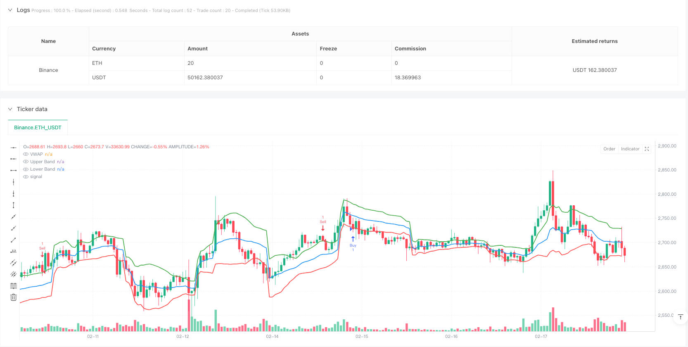
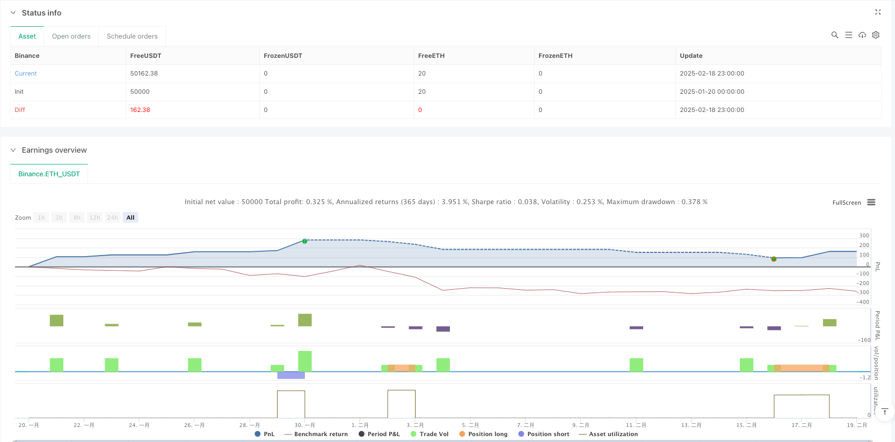

> Name

VWAP Volatility Reversal-Strategy-with-Standard-Deviation-Channel-Breakout-System
> Author

ianzeng123

> Strategy Description





[trans]
#### Overview
This strategy is a trading system based on VWAP (Volume Weighted Average Price) and standard deviation channels, which trade by identifying price reversal patterns at the channel boundaries. The strategy combines momentum and mean reversion trading concepts to capture trading opportunities when prices break through key technical levels.
#### Strategy Principle
The core of the strategy is to use VWAP as the center of the price and use the standard deviation of 20 periods to build an upper and lower channel. Look for long opportunities near the lower rail and short selling opportunities near the upper rail. Specifically:
- Long conditions: The price forms a bullish reversal pattern on the lower track, and then breaks through the high point of the previous positive line
- Short selling conditions: The price forms a bearish pattern on the upper track and then breaks through the low of the previous negative line.
- Take-profit setting: Target VWAP and the upper track for long positions, and target the lower track for short positions.
- Stop loss setting: When going long, stop the loss by reversing the low point of the positive line, and when going short, stop the loss by reversing the high point of the negative line.
#### Strategic Advantages
1. It combines the advantages of trend following and reversal trading, which can not only capture the continuation of the trend, but also seize the reversal opportunity.
2. Using VWAP as the core indicator can better reflect the real supply and demand of the market.
3. By adopting the profit-taking method in batches, profits can be realized at different prices.
4. The stop loss setting is reasonable and can effectively control risks.
5. The strategy logic is clear, parameter setting is simple, and it is easy to understand and execute.
#### Strategy Risk
1. Stop loss may be triggered frequently in highly volatile markets
2. Too many false signals may be generated during the sideways trading phase
3. Sensitive to the time period of VWAP calculation
4. Standard deviation channel width may not be suitable for all market environments
5. You may miss some important trend opportunities
#### Strategy optimization direction
1. Introduce volume filter to improve signal quality
2. Add trend confirmation indicators, such as moving average system
3. Dynamically adjust the standard deviation cycle to adapt to different market environments
4. Optimize the profit-taking ratio in batches to increase overall income
5. Add time filtering to avoid trading during unfavorable periods
6. Consider adding volatility indicators and optimizing position management
#### Summary
This is a complete trading system that combines VWAP, standard deviation channels and price patterns. The strategy conducts trades by looking for reversal signals at key price levels, and uses batched take-profits and reasonable stop-losses to manage risks. Although there are certain limitations, the stability and profitability of the strategy can be further improved through the suggested optimization directions. The strategy is suitable for application in volatile markets and is a trading system worth considering for medium and long-term traders. ||
#### Overview
This strategy is a trading system based on VWAP (Volume-Weighted Average Price) and standard deviation channels, which identifies reversal patterns at channel boundaries for trade execution. The strategy combines momentum and mean reversion trading concepts, capturing opportunities when prices break through key technical levels.

#### Strategy Principles
The core of the strategy uses VWAP as a price pivot, constructing upper and lower channels using 20-period standard deviation. It looks for long opportunities near the lower band and short opportunities near the upper band. Specifically:
- Long entry: Price forms a bullish reversal pattern near the lower band, then breaks above the previous bullish candle's high
- Short entry: Price forms a bearish pattern near the upper band, then breaks below the previous bearish candle's low
- Take profit: VWAP and upper band for longs, lower band for shorts
- Stop loss: Below the reversal bullish candle for longs, above the reversal bearish candle for shorts

#### Strategy Advantages
1. Combines benefits of trend-following and reversal trading, capturing both trend continuation and reversal opportunities
2. Uses VWAP as core indicator, better reflecting true market supply and demand
3. Implements staged profit-taking, realizing gains at different price levels
4. Reasonable stop-loss settings for effective risk control
5. Clear strategy logic with simple parameter settings, easy to understand and execute

#### Strategy Risks
1. May trigger frequent stop losses in highly volatile markets
2. Can generate excessive false signals during consolidation phases
3. Sensitive to VWAP calculation timeframe
4. Standard deviation channel width may not suit all market conditions
5. Might miss some significant trending opportunities

#### Strategy Optimization Directions
1. Introduce volume filters to improve signal quality
2. Add trend confirmation indicators, such as moving average systems
3. Dynamically adjust standard deviation periods to adapt to different market environments
4. Optimize staged profit-taking ratios to enhance overall returns
5. Add time filters to avoid trading during unfavorable periods
6. Consider adding volatility indicators to optimize position management

#### Summary
This is a complete trading system combining VWAP, standard deviation channels, and price patterns. The strategy trades by seeking reversal signals at key price levels, managing risk through staged profit-taking and reasonable stop losses. While it has certain limitations, the suggested optimization directions can further enhance the strategy's stability and profitability. The strategy is suitable for markets with higher volatility and represents a worthy trading system for medium to long-term traders.[/trans]


> Source (PineScript)

``` pinescript
/*backtest
start: 2025-01-20 00:00:00
end: 2025-02-19 00:00:00
period: 1h
basePeriod: 1h
exchanges: [{"eid":"Binance","currency":"ETH_USDT"}]
*/

//@version=6  
strategy("VRS Strategy", overlay=true)  

// Calculate VWAP  
vwapValue = ta.vwap(close)  

// Calculate standard deviation for the bands  
stdDev = ta.stdev(close, 20) // 20-period standard deviation for bands  
upperBand = vwapValue + stdDev  
lowerBand = vwapValue - stdDev  

// Plot VWAP and its bands  
plot(vwapValue, color=color.blue, title="VWAP", linewidth=2)  
plot(upperBand, color=color.new(color.green, 0), title="Upper Band", linewidth=2)  
plot(lowerBand, color=color.new(color.red, 0), title="Lower Band", linewidth=2)  

// Signal Conditions  
var float previousGreenCandleHigh = na  
var float previousGreenCandleLow = na  
var float previousRedCandleLow = na  

// Detect bearish candle close below lower band  
bearishCloseBelowLower = close[1] < lowerBand and close[1] < open[1]  

// Detect bullish reversal candle after a bearish close below lower band  
bullishCandle = close > open and low < lowerBand // Ensure it's near the lower band  
candleReversalCondition = bearishCloseBelowLower and bullishCandle  

if (candleReversalCondition)  
    previousGreenCandleHigh := high[1]  // Capture the high of the previous green candle  
    previousGreenCandleLow := low[1]     // Capture the low of the previous green candle  
    previousRedCandleLow := na            // Reset previous red candle low  

// Buy entry condition: next candle breaks the high of the previous green candle  
buyEntryCondition = not na(previousGreenCandleHigh) and close > previousGreenCandleHigh  

if (buyEntryCondition)  
    // Set stop loss below the previous green candle  
    stopLoss = previousGreenCandleLow   
    risk = close - stopLoss // Calculate risk for position sizing  

    // Target Levels  
    target1 = vwapValue // Target 1 is at VWAP  
    target2 = upperBand  // Target 2 is at the upper band  

    // Ensure we only enter the trade near the lower band  
    if (close < lowerBand)  
        strategy.entry("Buy", strategy.long)  
        
        // Set exit conditions based on targets  
        strategy.exit("Take Profit 1", from_entry="Buy", limit=target1)  
        strategy.exit("Take Profit 2", from_entry="Buy", limit=target2)  
        strategy.exit("Stop Loss", from_entry="Buy", stop=stopLoss)  

// Sell signal condition: Wait for a bearish candle near the upper band  
bearishCandle = close < open and high > upperBand // A bearish candle should be formed near the upper band  
sellSignalCondition = bearishCandle  

if (sellSignalCondition)  
    previousRedCandleLow := low[1] // Capture the low of the current bearish candle  

    // Sell entry condition: next candle breaks the low of the previous bearish candle  
    sellEntryCondition = not na(previousRedCandleLow) and close < previousRedCandleLow  

    if (sellEntryCondition)  
        // Set stop loss above the previous bearish candle  
        stopLossSell = previousRedCandleLow + (high[1] - previousRedCandleLow) // Set stop loss above the bearish candle  
        targetSell = lowerBand // Target for sell is at the lower band  

        // Ensure we only enter the trade near the upper band  
        if (close > upperBand)  
            strategy.entry("Sell", strategy.short)  
            
            // Set exit conditions for sell  
            strategy.exit("Take Profit Sell", from_entry="Sell", limit=targetSell)  
            strategy.exit("Stop Loss Sell", from_entry="Sell", stop=stopLossSell)  

// Reset previous values when a trade occurs  
if (strategy.position_size > 0)  
    previousGreenCandleHigh := na  
    previousGreenCandleLow := na  
    previousRedCandleLow := na
```

> Detail

https://www.fmz.com/strategy/482766

> Last Modified

2025-02-20 09:33:31
