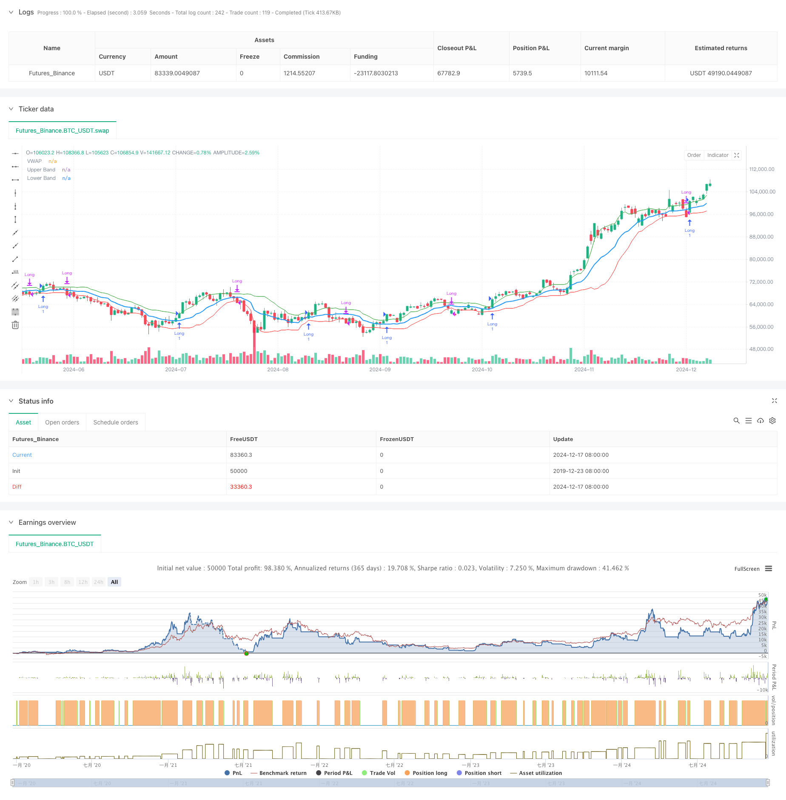

> Name

Adaptive-VWAP-Bands-with-Garman-Klass-Volatility-Dynamic-Tracking-Strategy
> Author

ChaoZhang

> Strategy Description



[trans]
#### Overview
This is an adaptive trading strategy based on Volume Weighted Average Price (VWAP) and Garman-Klass Volatility (GKV). This strategy dynamically adjusts the standard deviation band of VWAP through volatility to achieve intelligent tracking of market trends. When the price breaks through the upper track, open a long position and close the position when it breaks through the lower track. The greater the volatility, the higher the breakthrough threshold. The smaller the volatility, the lower the breakthrough threshold.
#### Strategy Principle
The core of the strategy is to combine VWAP with GKV volatility. First calculate VWAP as the price center, and then use the standard deviation of the closing price to construct the band. The key is to use the GKV formula to calculate volatility, which takes into account the four prices of opening, high and closing, and is more accurate than traditional volatility. Volatility dynamically adjusts the band width - when volatility increases, the band widens, raising the breakout threshold; when volatility decreases, the band narrows, lowering the breakout threshold. This adaptive mechanism effectively avoids false breakthroughs.
#### Strategic Advantages
1. Combining the volume-price relationship and fluctuation characteristics, the signal is more reliable
2. Adaptive adjustment of band width to reduce noise interference
3. Use GKV volatility to grasp the market microstructure more accurately
4. The calculation logic is simple and clear, easy to implement and maintain
5. Suitable for different market environments and has strong universal applicability
#### Strategy Risk
1. In volatile markets, frequent transactions may occur, increasing costs.
2. Sensitive to VWAP length and volatility cycle
3. May be slow to react during rapid trend reversals
4. Requires real-time market data and has high requirements on data quality.
Risk control suggestions:
-Set reasonable stop loss levels
- Optimize parameters to suit different markets
- Add trend confirmation indicator
- Control the size of funds
#### Strategy optimization direction
1. Introduce multi-cycle analysis to improve signal reliability
2. Increase the dimension of trading volume analysis to confirm the effectiveness of breakthroughs
3. Optimize the volatility calculation method, such as considering introducing EWMA
4. Add trend strength filter
5. Consider adding a dynamic stop loss mechanism
These optimizations can improve the stability and return quality of the strategy.
#### Summary
This strategy achieves dynamic tracking of the market by innovatively combining VWAP with GKV volatility. Its adaptive nature allows it to maintain stable performance in different market environments. Although there are some potential risks, through reasonable risk control and continuous optimization, the strategy has good application prospects. ||
#### Overview
This is an adaptive trading strategy based on Volume Weighted Average Price (VWAP) and Garman-Klass Volatility (GKV). The strategy dynamically adjusts the standard deviation bands of VWAP through volatility to achieve intelligent market trend tracking. It opens long positions when price breaks above the upper band and closes positions when breaking below the lower band, with higher volatility leading to higher breakout thresholds and lower volatility leading to lower thresholds.

#### Strategy Principle
The core of the strategy combines VWAP with GKV volatility. It first calculates VWAP as the price pivot, then builds bands using the standard deviation of closing prices. The key is using the GKV formula for volatility calculation, which considers four price points (open, high, low, close) and is more accurate than traditional volatility measures. Volatility dynamically adjusts band width - when volatility increases, bands widen, raising breakout thresholds; when volatility decreases, bands narrow, lowering breakout thresholds. This adaptive mechanism effectively avoids false breakouts.

#### Strategy Advantages
1. Combines volume-price relationship and volatility characteristics for more reliable signals
2. Adaptive adjustment of band width reduces noise interference
3. Uses GKV volatility for more accurate market microstructure capture
4. Simple and clear calculation logic, easy to implement and maintain
5. Suitable for different market environments with strong universality

#### Strategy Risks
1. May trade frequently in ranging markets, increasing costs
2. Sensitive to VWAP length and volatility period
3. May respond slowly to rapid trend reversals
4. Requires real-time market data with high quality requirements
Risk control suggestions:
- Set reasonable stop-loss levels
- Optimize parameters for different markets
- Add trend confirmation indicators
- Control position sizing

#### Strategy Optimization Directions
1. Introduce multi-timeframe analysis to improve signal reliability
2. Add volume analysis dimension to confirm breakout validity
3. Optimize volatility calculation method, consider introducing EWMA
4. Add trend strength filters
5. Consider adding dynamic stop-loss mechanisms
These optimizations can improve strategy stability and return quality.

#### Summary
The strategy achieves dynamic market tracking through innovative combination of VWAP and GKV volatility. Its adaptive nature enables stable performance across different market environments. While there are some potential risks, the strategy shows good application prospects through proper risk control and continuous optimization.[/trans]


> Source (PineScript)

``` pinescript
/*backtest
start: 2019-12-23 08:00:00
end: 2024-12-18 08:00:00
period: 1d
basePeriod: 1d
exchanges: [{"eid":"Futures_Binance","currency":"BTC_USDT"}]
*/

//@version=5
strategy("Adaptive VWAP Bands with Garman Klass Volatility", overlay=true)

// Inputs
length = input.int(25, title="Volatility Length")
vwapLength = input.int(14, title="VWAP Length")
vol_multiplier = input.float(1,title="Volatility Multiplier")

// Function to calculate Garman-Klass Volatility
var float sum_gkv = na
if na(sum_gkv)
    sum_gkv := 0.0

sum_gkv := 0.0
for i = 0 to length - 1
    sum_gkv := sum_gkv + 0.5 * math.pow(math.log(high[i]/low[i]), 2) - (2*math.log(2)-1) * math.pow(math.log(close[i]/open[i]), 2)

gcv = math.sqrt(sum_gkv / length)

// VWAP calculation
vwap = ta.vwma(close, vwapLength)

// Standard deviation for VWAP bands
vwapStdDev = ta.stdev(close, vwapLength)

// Adaptive multiplier based on GCV
multiplier = (gcv / ta.sma(gcv, length)) * vol_multiplier

// Upper and lower bands
upperBand = vwap + (vwapStdDev * multiplier)
lowerBand = vwap - (vwapStdDev * multiplier)

// Plotting VWAP and bands
plot(vwap, title="VWAP", color=color.blue, linewidth=2)
plot(upperBand, title="Upper Band", color=color.green, linewidth=1)
plot(lowerBand, title="Lower Band", color=color.red, linewidth=1)

var barColor = color.black

// Strategy: Enter long above upper band, go to cash below lower band
if (close > upperBand)
    barColor := color.green
    strategy.entry("Long", strategy.long)
else if (close < lowerBand)
    barColor := color.fuchsia
    strategy.close("Long")

barcolor(barColor)

```

> Detail

https://www.fmz.com/strategy/475603

> Last Modified

2024-12-20 14:51:00
