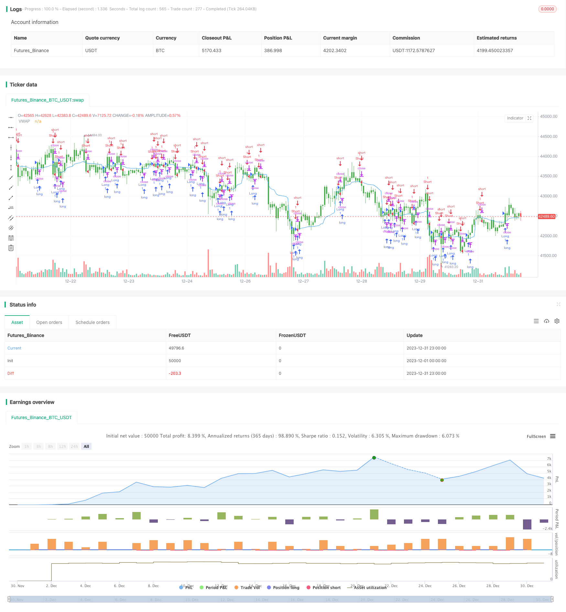

> Name

Scalping-Strategy-with-Volume-and-VWAP-Confirmation
> Author

ChaoZhang

> Strategy Description


 [trans]

## Overview
This strategy is a short-term trading strategy based on volume and typical price weighted average price (VWAP) confirmations. It combines two important technical indicators, trading volume and VWAP, to identify trends and find entry points with higher probability.
## Strategy Principle
This strategy mainly relies on two indicators for judgment - volume and VWAP.
First, it calculates the 20-period VWAP. VWAP represents the average price of the day and is an important reference for evaluating price rationality. If the price is higher than VWAP, it means the bulls are stronger, otherwise it means the shorts.
Secondly, the strategy will also determine whether the trading volume of each K line exceeds the preset threshold of 100. Only when the trading volume is active enough, is there a definite trend, which can avoid wrong transactions when the market is sluggish and waveless.
Combining these two judgment criteria, the entry and exit rules are formed:
**Admission Conditions**
- Long: Closing Price>VWAP and Volume>100
- Short position: Closing price <VWAP and Volume>100
**Exit Conditions**
- Long: Closing price <VWAP
- Short: Closing price > VWAP
It can be seen that this strategy combines the price indicator VWAP and trading volume at the same time, improving the stability of the strategy through double confirmation.
## Strategic Advantages
This strategy mainly has the following advantages:
1. Use the VWAP indicator to judge the rationality of the price and avoid blindly following the trend.
2. Combine trading volume to confirm trading signals to make the signals more reliable
3. The operation frequency is high, suitable for short-term trading, and higher profits can be obtained.
4. The strategy logic is simple and clear, easy to understand and implement
5. Taking into account both the price indicator VWAP and the trading volume, the winning rate is increased through double confirmation.
## Strategy Risk
There are also some risks to be aware of with this strategy:
1. As a short-term strategy, the operation frequency is higher, which will generate more transaction costs and slippage losses.
2. When the market trend is unclear, the VWAP indicator may produce false signals
3. Trading volume indicators are not suitable for low-liquidity stocks
4. Strategy parameters such as trading volume thresholds need to be constantly adjusted and optimized, and are difficult to apply universally.
5. Short-term trading often requires close monitoring of the market and has higher requirements for traders.
In order to control risks, it is recommended to choose stocks with good liquidity, narrow range, and high volatility for strategy, and at the same time adjust the parameters to adapt to different stocks. In addition, it is also necessary to control the position of a single transaction to avoid excessive losses in a single transaction.
## Strategy optimization
This strategy also has the following points that can be further optimized:
1. Optimize VWAP parameters and find the best parameters for different stocks
2. Set the volume threshold based on the average daily trading volume of the stock
3. When taking a short position, add other indicator filters to avoid false signals.
4. Add a stop-loss strategy to control the maximum loss in a single transaction
5. Adjust position control methods to achieve a higher profit-loss ratio
Through parameter optimization, adding other filter indicators, stop loss management and other methods, the stability and profitability of the strategy can be further improved.
## Summarize
This strategy integrates two major indicators, VWAP and trading volume, and selects stocks through price rationality judgment and high trading volume confirmation. It operates at a high frequency and has strong trend capturing capabilities. At the same time, attention should also be paid to controlling the increase in transaction costs caused by excessive trading frequency and stop loss management. Through further optimization, it is expected to obtain better strategic effects.
||

## Overview

This is a scalping strategy that utilizes volume and Volume Weighted Average Price (VWAP) for confirmation. It combines these two important technical indicators to identify trends and locate higher probability entry points.  

## Strategy Logic

The strategy mainly relies on two indicators for decision making - volume and VWAP.

Firstly, it calculates the 20-period VWAP. VWAP represents the average price of the day, and is an important benchmark for assessing price reasonableness. If the price is higher than VWAP, it indicates stronger bullish forces, and vice versa for bearish forces.

Secondly, the strategy also checks if the volume of each candlestick bar exceeds the preset threshold of 100. Only when the trading volume is sufficiently active, a definite trend is considered to exist. This avoids incorrect trades when the market is dull and inactive.

Based on these two criteria, the entry and exit rules are formed:  

**Entry Conditions**

- Long: Close > VWAP and Volume > 100 
- Short: Close < VWAP and Volume > 100

**Exit Conditions**   

- Long: Close < VWAP 
- Short: Close > VWAP

As we can see, the strategy combines both the price indicator VWAP and volume, using dual confirmation to improve stability.

## Advantages

The main advantages of this strategy include:

1. Using VWAP to gauge price reasonableness, avoiding blind trend following
2. Confirming signals with volume to make them more reliable  
3. High operation frequency, suitable for scalping, allowing higher profits
4. Simple and clear logic, easy to understand and implement
5. Considers both VWAP and volume for dual confirmation and higher win rate  

## Risks

There are also some risks to note:

1. As a scalping strategy, high operation frequency leads to higher transaction costs and slippage
2. VWAP signals may be incorrect when market trend is unclear
3. Volume indicator less applicable for low liquidity stocks
4. Difficult to universally optimize parameters like volume threshold   
5. Scalping requires close monitoring of the markets

To mitigate risks, high liquidity stocks with narrow price range and volatility are recommended. Fine tune parameters for different stocks. Also control position sizing to limit losses.

## Optimization

Some ways to further optimize the strategy:

1. Optimize VWAP parameter for individual stocks
2. Set volume threshold based on average daily volume 
3. Add other filters when there are no positions to avoid false signals
4. Incorporate stop loss for max loss control  
5. Adjust position sizing rules for higher profit ratio

Through parameter tuning, adding filters, stop loss etc, we can further improve the stability and profitability.


## Conclusion

The strategy consolidates two major indicators, VWAP and volume, to pick stocks with price reasonableness and high volume confirmation. It has high operation frequency and strong trend capturing capability. At the same time, trading costs and stop losses should be managed. Further optimizations can lead to even better strategy performance.

[/trans]

> Strategy Arguments


|Argument|Default|Description|
|----|----|----|
|v_input_1|14|MACD Length|
|v_input_2|100|Volume Threshold|
|v_input_3|20|VWAP Length|


> Source (PineScript)

``` pinescript
/*backtest
start: 2023-12-01 00:00:00
end: 2023-12-31 23:59:59
period: 1h
basePeriod: 15m
exchanges: [{"eid":"Futures_Binance","currency":"BTC_USDT"}]
*/

// This Pine Script™ code is subject to the terms of the Mozilla Public License 2.0 at https://mozilla.org/MPL/2.0/
// © netyogindia

//@version=5
strategy("Scalping Strategy with Volume and VWAP Confirmation", overlay=true)

// Input parameters
length = input(14, title="MACD Length")
volume_threshold = input(100, title="Volume Threshold")
vwap_length = input(20, title="VWAP Length")

// Calculate VWAP
vwapValue = ta.vwap(close, vwap_length)

// Calculate volume
barVolume = volume

// Define entry conditions
longCondition = close > vwapValue and barVolume > volume_threshold
shortCondition = close < vwapValue and barVolume > volume_threshold

// Define exit conditions
exitLongCondition = close < vwapValue
exitShortCondition = close > vwapValue

// Plot VWAP
plot(vwapValue, color=color.blue, title="VWAP")

// Plot Volume bars
barcolor(barVolume >= volume_threshold ? color.green : na)

// Execute strategy orders
strategy.entry("Long", strategy.long, when=longCondition)
strategy.entry("Short", strategy.short, when=shortCondition)
strategy.close("Long", when=exitLongCondition)
strategy.close("Short", when=exitShortCondition)


```

> Detail

https://www.fmz.com/strategy/440315

> Last Modified

2024-01-29 11:35:45
