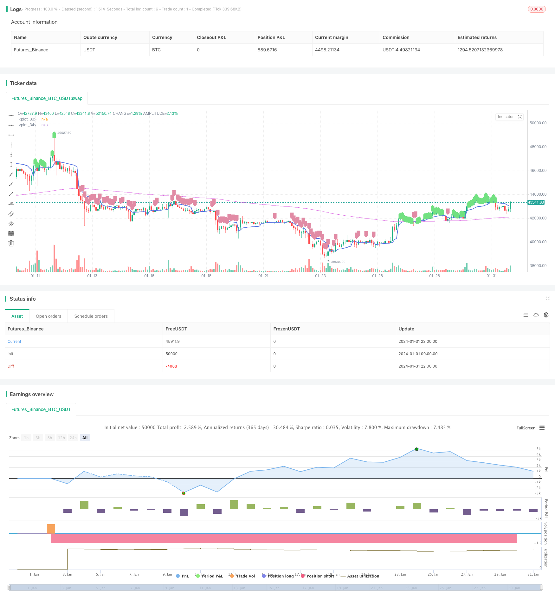

> Name

VWAP-based trend following strategy VWAP-Trend-Following-Strategy
> Author

ChaoZhang

> Strategy Description


[trans]
## Overview
This strategy is based on VWAP and EMA as indicators to determine the direction of the trend. VWAP represents the typical price and EMA200 represents the medium and long-term trend. Go long when the price is higher than VWAP and EMA200, go short when it is lower than VWAP and EMA200, which is a typical trend following strategy.
## Strategy Principle
The core logic of the strategy is to use VWAP and EMA to determine the price trend.
- VWAP represents a typical price that reflects the average cost of market participants. When the price is higher than VWAP, it means that the buyer's power has increased and he should go long; when the price is lower than VWAP, it means that the seller's power has increased and he should go short.
- EMA200 represents the mid- to long-term trend of price. When the price is above EMA200, it means that the medium and long term is bullish, and you should go long; when the price is below EMA200, it means that the medium and long term is bearish, and you should go short.
Therefore, this strategy first determines whether the price is higher than VWAP and EMA200 at the same time, and if so, go long; if the price is lower than VWAP and EMA200 at the same time, go short. It can be seen that this strategy mainly relies on VWAP and EMA to judge buying and selling decisions.
In addition, the strategy also sets take-profit and stop-loss points. After going long, set the take-profit to 3.5% of the entry price and the stop-loss to 1.4%; after going short, set the take-profit to 2.5% of the entry price and the stop-loss to 0.9%. This can avoid excessive losses.
## Strategic Advantages
The biggest advantage of this strategy is that it is very reliable to use VWAP and EMA to judge the trend.
- VWAP can accurately reflect the average cost of market participants and is a very good indicator for judging trends;
- EMA200 can clearly reflect the medium and long-term trend, and it is very accurate and reliable to judge the direction of the general trend.
Therefore, the reliability of using VWAP and EMA together to determine the trend is very high. When the two judgment trends are consistent, the success rate of the operation is very high.
In addition, setting stop-profit and stop-loss points can avoid excessive single losses.
## Strategy Risk
The main risk with this strategy is that VWAP and EMA may send false signals.
- When the market experiences severe fluctuations, the price may deviate from VWAP in the short term, sending an incorrect signal.
- When a new trend has just begun, EMA may lag behind price changes, causing the strategy to miss the best entry opportunity.
In addition, the stop-profit and stop-loss settings may be inappropriate, and the risk of excessive single loss still exists.
In order to solve the above problems, we can optimize the parameter settings of VWAP and EMA so that they can better identify the beginning of a new trend. At the same time, you can set adaptive take-profit and stop-loss, so that the take-profit and stop-loss can be adjusted with price fluctuations.
## Strategy optimization direction
This strategy can mainly be optimized from the following aspects:
- Optimize the VWAP parameters and find a VWAP parameter combination that can more stably judge the trend.
- Optimize the EMA cycle and find EMA parameters that are more accurate in judging the trend.
- Add other indicators to identify trends, such as Bollinger Bands, KDJ, etc., combined with VWAP and EMA to improve the accuracy of judgment.  
- Set adaptive take profit and stop loss. According to certain rules, the take-profit and stop-loss levels are adjusted with price fluctuations to avoid being too rigid.
- Combined with position management. Adjust the position size based on indicators such as retracements and consecutive losses to control the overall risk of the strategy.
## Summarize
This strategy overall is a very reliable trend following strategy. It uses VWAP and EMA to determine the trend direction, and the idea is clear and simple. When the two send consistent signals, the probability of success in entering the market is high. Risks can be controlled by properly setting stop-profit and stop-loss settings. We can still further improve this strategy through various methods (parameter optimization, adding indicators, adaptive take-profit and stop-loss, position management, etc.) to make its performance even better.
||

## Overview  

This strategy uses VWAP and EMA as indicators to determine the trend direction. It goes long when the price is above both VWAP and EMA200, and goes short when the price is below both VWAP and EMA200. It's a typical trend following strategy.  

## Strategy Logic  

The core logic of the strategy lies in using VWAP and EMA to judge the price trend.

- VWAP represents the typical price and reflects the average cost of market participants. When price is above VWAP, it means the buying power increases and should go long. When price is below VWAP, it means the selling power strengthens and should go short.

- EMA200 represents the mid-long term trend of the price. When price is above EMA200, it means mid-long term outlook is bullish and should go long. When price is below EMA200, it means mid-long term outlook is bearish and should go short.

Therefore, this strategy first judges if the price is above both VWAP and EMA200, if yes then go long; if the price is below both VWAP and EMA200, then go short. We can see that this strategy mainly relies on VWAP and EMA to make trading decisions.

In addition, the strategy also sets take profit and stop loss points. After going long, TP is set to 3.5% of the entry price and SL is set to 1.4% of entry price. After going short, TP is 2.5% of entry price and SL is 0.9% of entry price. This avoids huge losses.


## Advantages  

The biggest advantage of this strategy is that using VWAP and EMA to determine trends is very reliable.  

- VWAP can accurately reflect the average cost of market participants, it's a very good indicator to judge trends.
- EMA200 can clearly reflect the mid-long term trend and determine the direction of major trends very accurately.

 Therefore, combining VWAP and EMA to judge trends is highly reliable. When both indicators give consistent signals, the success rate of trading is very high.

In addition, setting TP/SL avoids excessive losses per trade.

## Risks

The main risk of this strategy is that VWAP and EMA may give wrong signals.  

- When there is violent market fluctuation, the price may deviate from VWAP in short term and give wrong signals.
- When a new trend just begins, EMA may lag the price change and cause missing the best entry timing.  

Also, improper TP/SL settings still poses the risk of excessive losses per trade.

To solve the above issues, we can optimize the parameters of VWAP and EMA to make them better in detecting the beginning of new trends. Also we can set adaptive TP/SL to adjust them according to price fluctuation.


## Enhancement  

The main aspects to enhance this strategy:

- Optimize VWAP parameters to find more stable settings in determining trends. 
- Optimize EMA periods to find more accurate settings in judging trends.  
- Add other trend indicators like Bollinger Bands, KDJ etc. to combine with VWAP and EMA, to improve accuracy.
- Set adaptive take profit and stop loss based on certain rules to adjust them dynamically according to price fluctuation.
- Incorporate position sizing based on drawdown, consecutive losses etc. to control overall risk.

## Conclusion   

In conclusion, this is a very reliable trend following strategy. It uses simple logic of VWAP and EMA to determine trend directions. When both indicators give consistent signals, the success rate is very high. By setting proper TP/SL, the risk can be controlled. There are still many ways (parameter optimization, adding indicators, adaptive TP/SL, position sizing etc.) to further improve this strategy and make its performance even better.

[/trans]

> Strategy Arguments


|Argument|Default|Description|
|----|----|----|
|v_input_1|3.5|Long Take Profit %|
|v_input_2|1.4|Long Stop Loss %|
|v_input_3|2.5|Short Take Profit %|
|v_input_4|0.9|Short Stop Loss %|
|v_input_5|2019|Backtest Start Year|
|v_input_6|true|Backtest Start Month|
|v_input_7|true|Backtest Start Day|
|v_input_8|2020|Backtest Stop Year|
|v_input_9|12|Backtest Stop Month|
|v_input_10|31|Backtest Stop Day|


> Source (PineScript)

``` pinescript
/*backtest
start: 2024-01-01 00:00:00
end: 2024-01-31 23:59:59
period: 2h
basePeriod: 15m
exchanges: [{"eid":"Futures_Binance","currency":"BTC_USDT"}]
*/

//26m Binance BTCUSDTPERP
//@version=4
strategy("VWAP Trend Follower", initial_capital=100, overlay=true, commission_type=strategy.commission.percent, commission_value=0.04, default_qty_type = strategy.percent_of_equity, default_qty_value = 90, currency = currency.USD )

/// INITIALISE STRATEGY ///
price=close[1]
vprice=vwap(price)
trend=ema(price, 200)

/// RISK MANAGEMENT ///
long_tp_inp = input(3.5, title='Long Take Profit %',step=0.1)/100
long_sl_inp = input(1.4, title='Long Stop Loss %',step=0.1)/100
short_tp_inp = input(2.5, title='Short Take Profit %',step=0.1)/100
short_sl_inp = input(0.9, title='Short Stop Loss %',step=0.1)/100
long_take_level = strategy.position_avg_price * (1 + long_tp_inp)
long_stop_level = strategy.position_avg_price * (1 - long_sl_inp)
short_take_level = strategy.position_avg_price * (1 - short_tp_inp)
short_stop_level = strategy.position_avg_price * (1 + short_sl_inp)
//long_trailing = input(5, title='Trailing Stop Long',step=0.1) / 100
//short_trailing = input(5, title='Trailing Stop short',step=0.1) / 100

/// STRATEGY CONDITIONS ///
aLong= price > trend and price > vprice
entry_long = aLong and aLong[2] and aLong[1]
aShort= price < trend and price < vprice 
entry_short = aShort and aShort[2] and aShort[1]
//exit_long = 
//exit_short =
//entry_price_long=valuewhen(entry_long,close,0)
//entry_price_short=valuewhen(entry_short,close,0)

/// PLOTTING ///
plot(vprice,                color=#5875E1, linewidth=2)
plot(trend,                 color=#D965E1, linewidth=1)
plotshape(series=aLong,     color=#71E181,style=shape.labelup)
plotshape(series=aShort,    color=#E18BA5,style=shape.labeldown)
//plot(long_take_level,     color=#00E676, linewidth=2)
//plot(long_stop_level,     color=#FF5252, linewidth=1)
//plot(short_take_level,    color=#4CAF50, linewidth=2)
//plot(short_stop_level,    color=#FF5252, linewidth=1)

/// PERIOD ///
testStartYear   = input(2019, "Backtest Start Year")
testStartMonth  = input(1, "Backtest Start Month")
testStartDay    = input(1, "Backtest Start Day")
testPeriodStart = timestamp(testStartYear,testStartMonth,testStartDay,0,0)
testStopYear    = input(2020, "Backtest Stop Year")
testStopMonth   = input(12, "Backtest Stop Month")
testStopDay     = input(31, "Backtest Stop Day")
testPeriodStop  = timestamp(testStopYear,testStopMonth,testStopDay,0,0)
testPeriod() => true

//// STRATEGY EXECUTION ////

if testPeriod()
    if strategy.position_size == 0 or strategy.position_size > 0
        strategy.entry(id="Long", long=true, when=entry_long, comment="Long")
        strategy.exit("Take Profit/ Stop Loss","Long", limit=long_take_level, stop=long_stop_level,comment="Exit Long")//,trail_points=entry_price_long * long_trailing / syminfo.mintick, trail_offset=entry_price_long * long_trailing / syminfo.mintick)
//        strategy.close(id="Long", when=exit_long, comment = "Exit Long")

    if strategy.position_size == 0 or strategy.position_size < 0
        strategy.entry(id="Short", long=false, when=entry_short, comment = "Short")
        strategy.exit("Take Profit/ Stop Loss","Short", limit=short_take_level , stop=short_stop_level,comment = "Exit Short")//, trail_points=entry_price_short * short_trailing / syminfo.mintick, trail_offset=entry_price_short * short_trailing / syminfo.mintick)
//        strategy.close(id="Short", when=exit_short, comment = "Exit Short")
```

> Detail

https://www.fmz.com/strategy/443141

> Last Modified

2024-02-29 15:26:56
