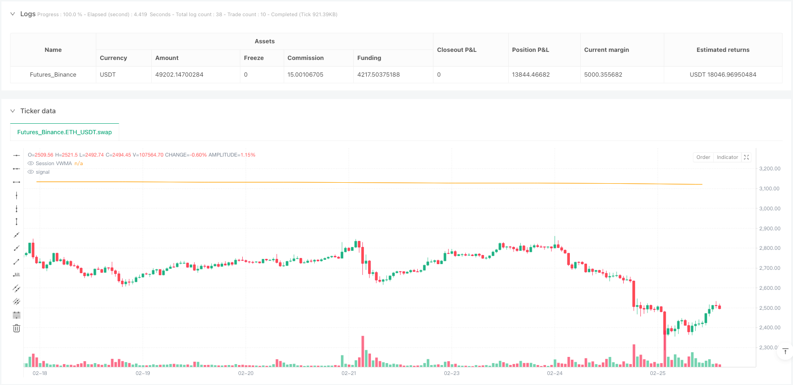
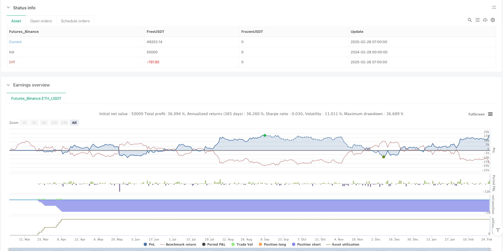

> Name

VWMA dynamic price level upper and lower breakthrough strategy during the trading period-Session-Based-VWMA-Dynamic-Level-Breakthrough-Strategy
> Author

ianzeng123

> Strategy Description





[trans]


#### Overview
The VWMA dynamic price penetration strategy up and down during the trading period is a quantitative trading system based on the volume-weighted moving average (VWMA) during the intraday trading period. This strategy works specifically on the 1-minute time frame, generating buy and sell signals by monitoring the relationship between price and the VWMA that resets each trading day. The core logic of the strategy is to trigger a trading signal when the price completely breaks through the VWMA. Specifically, a buy signal is generated when the lowest price of the candle chart is higher than the VWMA, and a sell signal is generated when the highest price of the candle chart is lower than the VWMA. According to the strategy description, the sell signal performance of this strategy is particularly good, with a winning rate of more than 65%, which is especially suitable for early entry.
#### Strategy Principle
The core principle of this strategy is to use the VWMA recalculated on each trading day as a dynamic reference line, and identify potential trading opportunities through the relative position of the price and the reference line. Here’s how the strategy works in detail:
1. **Trading session VWMA calculation**: The strategy uses the VWMA indicator with a length of 55, but unlike the traditional VWMA, this indicator resets the calculation at the beginning of each trading day to ensure that the VWMA more accurately reflects the market sentiment of the day.
2. **Signal generation mechanism**:
   - Buy signal: Triggered when the lowest price of the candle is completely above the VWMA and the previous candle does not meet this condition
   - Sell signal: triggered when the highest price of the candle is completely below the VWMA and the previous candle does not meet this condition
3. **Trading control logic**: The strategy implements an intelligent trading control mechanism to prevent repeated entries with continuous signals in the same direction, that is, a buy signal must be followed by a sell signal before buying again, and vice versa.
4. **Automatic closing of positions**: The strategy automatically closes all positions at 15:29 (Indian Standard Time) every day to ensure that no overnight positions are held and effectively avoid overnight risks.
5. **Multiple Position Management**: The strategy supports up to 10 levels of pyramid-style position addition, and fund management uses 10% of the account equity for position control.
#### Strategic Advantages
After a deeper analysis of the code, this strategy demonstrates the following significant benefits:
1. **Period Adaptability**: By resetting the VWMA calculation on each trading day, the strategy can better adapt to the market conditions of the day and is not overly affected by historical data.
2. **Clear entry signal**: The strategy requires the price to completely break through the VWMA before triggering the signal, reducing false breakthroughs and misjudgments in volatile markets.
3. **Directional Control**: Through transaction control logic, the strategy avoids continuous entry in the same direction and requires a direction change before entering again, effectively reducing the risk of frequent transactions.
4. **Risk Control**: The automatic closing mechanism at a fixed time every day effectively avoids overnight risks and is suitable for short-term intraday traders.
5. **High Win Rate Potential**: According to the strategy description, the sell signal in particular performs well, with a win rate of over 65%, providing traders with a high probability of success.
6. **Flexible position management**: Supports pyramid-style position addition strategies, which can increase positions when the trend continues and maximize profit potential.
#### Strategy Risk
Although this strategy has many advantages, there are still potential risks:
1. **Time frame limitations**: The strategy clearly states that it is most suitable for the 1-minute time frame and may not perform well on other time frames, which limits the application scenarios of the strategy.
2. **Buy signals are relatively weak**: The strategy description mentions that buy signals need to set fixed take-profit and stop-loss points, implying that buy signals are less reliable than sell signals, which may result in limited profitability of buy operations.
3. **Market conditions dependence**: As the main indicator, VWMA may produce a large number of false signals in sideways and volatile markets, and the strategy may perform better in strong trending markets.
4. **Risk of closing positions at fixed time**: Fixed closing of positions at 15:29 may lead to early exit in favorable market conditions and miss some profit opportunities.
5. **Parameter Sensitivity**: VWMA length 55 is a fixed parameter. Different market environments may require different parameter settings. Fixed parameters may not be suitable for all market conditions.
Risk Mitigation Methods:
- In view of the relatively weak buy signal, it is recommended to implement strict stop loss and target profit settings
- Consider adding market environment filters to only apply strategies in suitable market environments
- Develop an adaptive parameter adjustment mechanism so that the VWMA length can be automatically adjusted according to market changes
#### Strategy optimization direction
Based on code analysis, this strategy can be optimized in the following directions:
1. **Add market environment filtering**: Introduce volatility or trend strength indicators as filtering conditions to only generate signals in suitable market environments. For example, you can use ATR or ADX indicators to determine whether the current market is suitable for this strategy.
2. **Optimize VWMA parameters**: Implement adaptive VWMA length and dynamically adjust parameters according to market volatility, so that the strategy can better adapt to different market environments. This can be achieved by relating the VWMA length to market volatility.
3. **Enhance signal confirmation mechanism**: Introduce additional technical indicators or price patterns as confirmation conditions to improve signal quality. For example, you can combine RSI, MACD and other indicators for signal confirmation.
4. **Improved position closing strategy**: In addition to fixed time closing, dynamic closing rules based on market conditions are added, such as profit retracement, target achievement or technical indicator reversal.
5. **Differentiated buying and selling signal processing**: Develop targeted management strategies based on the different performance characteristics of buying and selling signals, such as adopting more conservative position management and stricter stop-loss strategies for buying signals.
6. **Fund Management Optimization**: Implement a more flexible fund management mechanism and dynamically adjust the capital ratio of each transaction based on signal strength, market volatility and historical performance.
These optimization directions aim to improve the robustness and adaptability of the strategy while maintaining its original high win rate characteristics.
#### Summary
The VWMA dynamic price penetration strategy above and below during the trading period is a well-designed intraday trading system that uses the daily reset VWMA as a dynamic reference line and combines the conditions for the price to completely break through the reference line to generate trading signals. This strategy is particularly suitable for the 1-minute time frame and performs particularly well on sell signals, with a win rate of over 65%.
The main advantages of the strategy are its adaptability to the day's market conditions, clear entry conditions and effective risk control mechanisms. However, the strategy also has potential risks such as time frame limitations, relatively weak buy signals, and dependence on market conditions.
By adding market environment filtering, implementing adaptive parameters, enhancing signal confirmation mechanisms, improving closing strategies and other optimization measures, this strategy has the potential to further improve its robustness and profitability. Overall, this is a trading strategy with a clear structure and strict logic, especially suitable for day traders who pursue a high winning rate and control risks.
For traders who wish to apply this strategy, it is recommended to fully test it in a simulated environment first, pay special attention to the performance of buy signals, and adjust parameter settings and money management rules according to their own risk tolerance and trading goals. ||
#### Overview
The Session-Based VWMA Dynamic Level Breakthrough Strategy is a quantitative trading system based on the Volume Weighted Moving Average (VWMA) reset at the beginning of each trading session. This strategy is specifically designed for 1-minute timeframes, generating buy and sell signals by monitoring the relationship between price and the session-based VWMA. The core logic triggers trading signals when price completely breaks through the VWMA - specifically, a buy signal is generated when the candle's low is above the VWMA, and a sell signal is generated when the candle's high is below the VWMA. According to the strategy description, the sell signals perform particularly well with a win rate exceeding 65%, making it especially suitable for morning entries.

#### Strategy Principles
The core principle of this strategy utilizes a session-based VWMA recalculated at the beginning of each trading day as a dynamic reference line, identifying potential trading opportunities through the relative position of price to this reference line. The detailed working principles are as follows:

1. **Session VWMA Calculation**: The strategy uses a VWMA indicator with a length of 55, but unlike traditional VWMA, this indicator resets at the beginning of each trading day, ensuring that the VWMA more accurately reflects the current day's market sentiment.

2. **Signal Generation Mechanism**:
   - Buy Signal: Triggered when the candle's low is completely above the VWMA and the previous candle did not satisfy this condition
   - Sell Signal: Triggered when the candle's high is completely below the VWMA and the previous candle did not satisfy this condition

3. **Trade Control Logic**: The strategy implements an intelligent trade control mechanism that prevents consecutive same-direction entries, meaning that after a buy signal, a sell signal must occur before another buy can be entered, and vice versa.

4. **Automatic Close at Session End**: The strategy automatically closes all positions at 15:29 (Indian Standard Time) every day, ensuring no overnight positions are held, effectively mitigating overnight risk.

5. **Multiple Position Management**: The strategy supports up to 10 pyramid-style position additions, with position sizing controlled at 10% of account equity.

#### Strategy Advantages
After in-depth code analysis, this strategy demonstrates the following significant advantages:

1. **Session Adaptability**: By resetting the VWMA calculation at the beginning of each trading day, the strategy better adapts to the current day's market conditions without being overly influenced by historical data.

2. **Clear Entry Signals**: The strategy requires price to completely break through the VWMA to trigger a signal, reducing false breakouts and misjudgments in choppy markets.

3. **Directional Control**: Through trade control logic, the strategy avoids consecutive entries in the same direction, requiring a direction change before re-entry, effectively reducing frequent trading risk.

4. **Risk Control**: The daily automatic position closing mechanism effectively avoids overnight risk, suitable for intraday short-term traders.

5. **High Win Rate Potential**: According to the strategy description, especially the sell signals perform excellently with a win rate exceeding 65%, providing traders with a higher probability of success.

6. **Flexible Position Management**: Support for pyramid-style position additions can increase positions as trends continue, maximizing profit potential.

#### Strategy Risks
Despite numerous advantages, the strategy still has the following potential risks:

1. **Timeframe Limitation**: The strategy explicitly states it works best on 1-minute timeframes, which may limit its application scenarios as performance on other timeframes might be suboptimal.

2. **Weaker Buy Signals**: The strategy description mentions that buy signals require fixed take-profit and stop-loss points, suggesting that buy signals' reliability is not as strong as sell signals. This might limit the profitability of buy operations.

3. **Market Condition Dependency**: VWMA as the main indicator may generate numerous false signals in ranging, choppy markets. The strategy may perform better in strong trending markets.

4. **Fixed-Time Closing Risk**: Fixed closing at 15:29 may lead to premature exits during favorable market conditions, missing some profit opportunities.

5. **Parameter Sensitivity**: The VWMA length of 55 is a fixed parameter that might not be optimal for all market conditions. Different market environments may require different parameter settings.

Risk mitigation methods:
- For weaker buy signals, implement strict stop-loss and profit target settings
- Consider adding market environment filters, only applying the strategy in suitable market conditions
- Develop adaptive parameter adjustment mechanisms to automatically adjust the VWMA length based on market changes

#### Strategy Optimization Directions
Based on code analysis, the strategy can be optimized in the following directions:

1. **Add Market Environment Filtering**: Introduce volatility or trend strength indicators as filtering conditions, generating signals only in suitable market environments. For example, ATR or ADX indicators can determine if the current market is suitable for this strategy.

2. **Optimize VWMA Parameters**: Implement adaptive VWMA length, dynamically adjusting parameters based on market volatility for better adaptation to different market environments. This can be achieved by establishing a relationship between VWMA length and market volatility.

3. **Enhance Signal Confirmation**: Introduce additional technical indicators or price patterns as confirmation conditions to improve signal quality. For example, combining with RSI, MACD, or other indicators for signal confirmation.

4. **Improve Exit Strategy**: In addition to fixed-time exits, add dynamic exit rules based on market conditions, such as profit retracement, target achievement, or technical indicator reversals.

5. **Differentiated Buy/Sell Signal Handling**: Develop targeted management strategies for the different performance characteristics of buy and sell signals. For example, adopting more conservative position management and stricter stop-loss strategies for buy signals.

6. **Money Management Optimization**: Implement more flexible money management mechanisms, dynamically adjusting the proportion of funds for each trade based on signal strength, market volatility, and historical performance.

These optimization directions aim to improve the strategy's robustness and adaptability while maintaining its original high win-rate characteristics.

#### Conclusion
The Session-Based VWMA Dynamic Level Breakthrough Strategy is an elegantly designed intraday trading system that generates trading signals by utilizing a daily reset VWMA as a dynamic reference line, combined with conditions of price completely breaking through this reference line. This strategy is particularly suitable for 1-minute timeframes, with sell signals performing exceptionally well, achieving a win rate exceeding 65%.

The strategy's main advantages lie in its adaptability to the current day's market conditions, clear entry criteria, and effective risk control mechanisms. However, the strategy also has potential risks including timeframe limitations, relatively weaker buy signals, and dependency on market conditions.

By adding market environment filtering, implementing adaptive parameters, enhancing signal confirmation mechanisms, improving exit strategies, and other optimization measures, this strategy has the potential to further improve its robustness and profitability. Overall, this is a clearly structured, logically rigorous trading strategy, particularly suitable for intraday traders seeking high win rates and risk control.

For traders wishing to apply this strategy, it is recommended to first conduct thorough testing in a simulated environment, paying special attention to the performance of buy signals, and adjusting parameter settings and money management rules according to personal risk tolerance and trading objectives.[/trans]


> Source (PineScript)

``` pinescript
/*backtest
start: 2024-02-29 00:00:00
end: 2025-02-26 08:00:00
period: 1h
basePeriod: 1h
exchanges: [{"eid":"Futures_Binance","currency":"ETH_USDT"}]
*/

//@version=5
strategy("SVWMA Lx", overlay=true, initial_capital=100000, 
     default_qty_type=strategy.percent_of_equity, default_qty_value=10, pyramiding=10, calc_on_every_tick=true)

//──────────────────────────────
// Session VWMA Inputs
//──────────────────────────────
vwmaLen   = input.int(55, title="VWMA Length", inline="VWMA", group="Session VWMA")
vwmaColor = input.color(color.orange, title="VWMA Color", inline="VWMA", group="Session VWMA", tooltip="VWMA resets at the start of each session (at the opening of the day).")

//──────────────────────────────
// Session VWMA Calculation Function
//──────────────────────────────
day_vwma(_start, s, l) =>
    bs_nd = ta.barssince(_start)
    v_len = math.max(1, bs_nd < l ? bs_nd : l)
    ta.vwma(s, v_len)

//──────────────────────────────
// Determine Session Start
//──────────────────────────────
newSession = ta.change(time("D")) != 0

//──────────────────────────────
// Compute Session VWMA
//──────────────────────────────
vwmaValue = day_vwma(newSession, close, vwmaLen)
plot(vwmaValue, color=vwmaColor, title="Session VWMA")

//──────────────────────────────
// Define Signal Conditions (only on transition)
//──────────────────────────────
bullCond = low > vwmaValue      // Bullish: candle low above VWMA
bearCond = high < vwmaValue     // Bearish: candle high below VWMA

// Trigger signal only on the bar where the condition first becomes true
bullSignal = bullCond and not bullCond[1]
bearSignal = bearCond and not bearCond[1]

//──────────────────────────────
// **Exit Condition at 15:29 IST**
//──────────────────────────────
sessionEnd = hour == 15 and minute == 29

// Exit all positions at 15:29 IST
if sessionEnd
    strategy.close_all(comment="Closing all positions at session end")

//──────────────────────────────
// **Trade Control Logic** (Prevents consecutive same-side signals)
//──────────────────────────────
var bool lastTradeWasBuy = false  // Track last trade direction **Reset Direction At Session End**
var bool lastTradeWasSell = false // Track last trade direction **Reset Direction At Session End**
// Reset at new session
if newSession
    lastTradeWasBuy := true
    lastTradeWasSell := true

//──────────────────────────────
// **Position Management: Entry & Labels**
//──────────────────────────────
if bullSignal and not lastTradeWasBuy  //
    if strategy.position_size < 0
        strategy.close("Short", comment="Exit Short on Bull Signal")
        strategy.entry("Long", strategy.long, comment="Enter Long: Buy Call & Sell Put at ATM")
    else
        strategy.entry("Long", strategy.long, comment="Add Long: Buy Call & Sell Put at ATM")

    // Add BUY Label above entry candle
    label.new(x=bar_index, y=low - ta.atr(5) * 0.5, text="BUY", color=color.green, textcolor=color.white, size=size.small,  style=label.style_label_up, xloc=xloc.bar_index)

    lastTradeWasBuy := true  // Mark that the last trade was a Buy

if bearSignal and lastTradeWasBuy  //
    if strategy.position_size < 0
        strategy.close("Long", comment="Exit Long on Bear Signal")
        strategy.entry("Short", strategy.short, comment="Enter Short: Buy Put & Sell Call at ATM")
    else
        strategy.entry("Short", strategy.short, comment="Add Short: Buy Put & Sell Call at ATM")

    // Add SELL Label below candle 
    label.new(x=bar_index, y=high + ta.atr(5) * 0.5,  text="SELL", color=color.red, textcolor=color.white, size=size.small, style=label.style_label_down, xloc=xloc.bar_index)

    lastTradeWasBuy := false  // Mark that the last trade was a Sell

//──────────────────────────────
// **Updated Alert Conditions**
//──────────────────────────────
alertcondition(bullSignal and not lastTradeWasBuy, 
     title="Long Entry Alert", 
     message="Bullish signal: BUY CALL & SELL PUT at ATM. Entry allowed.")

alertcondition(bearSignal and lastTradeWasBuy, 
     title="Short Entry Alert", 
     message="Bearish signal: BUY PUT & SELL CALL at ATM. Entry allowed.")

```

> Detail

https://www.fmz.com/strategy/484104

> Last Modified

2025-02-28 10:22:57
