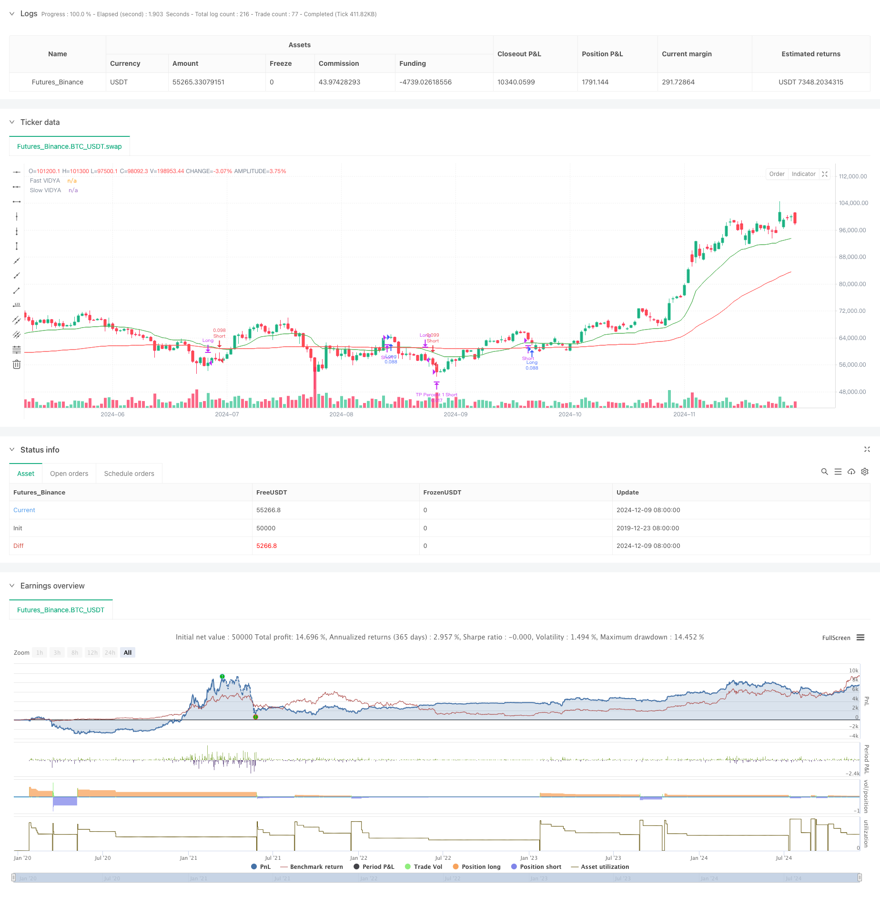

> Name

Variable-Index-Dynamic-Average-Multi-Tier-Profit-Trend-Following-Strategy
> Author

ChaoZhang

> Strategy Description



[trans]
#### Overview
This strategy is a trend following system that combines the Variable Index Dynamic Average (VIDYA) indicator and Bollinger Bands, and also integrates a multi-layered take-profit mechanism. Different from traditional trend strategies, this system adopts a more adaptive profit-making method and distinguishes long and short positions through unique ATR benchmarks and percentage targets. Its innovation lies in the use of a dynamic multi-layered take-profit approach, especially a more aggressive percentage multiplier for short trades. This flexibility helps optimize trade management and profit distribution based on market volatility and trend strength.
#### Strategy Principle
The core of the strategy is to use two VIDYA indicators, fast and slow, to analyze price trends while taking into account market volatility. The calculation formula of VIDYA indicator is:
Smoothing factor (α) = 2/(period + 1)
VIDYA(t) = α * k * price (t) + (1 - α * k) * VIDYA(t-1)
where k = |Chandler Momentum Oscillator (MO)|/100
Bollinger Bands as volatility filter:
Upper track = MA + (K * standard deviation)
Lower track = MA - (K * standard deviation)
Admission conditions:
- Bulls: The price breaks through the slow VIDYA and the fast VIDYA is trending upward, and at the same time, the price breaks through the upper Bollinger Band
- Short: The price falls below the slow VIDYA and the fast VIDYA is trending downward, and at the same time the price falls below the lower Bollinger Bands
Multi-layered take-profit mechanisms include:
1. Take profit based on ATR
2. Percent-based take profit
3. For short positions, a multiplier is used to enlarge the take-profit ratio.
#### Strategic Advantages
1. Strong dynamic adaptability: VIDYA indicator can automatically adjust according to market fluctuations and is more sensitive than traditional moving averages.
2. Improved risk management: multi-layer profit-taking mechanism can lock in profits at different price levels
3. Differentiated processing: adopting different take-profit strategies for long and short positions, which is more in line with market characteristics
4. Volatility filtering: The use of Bollinger Bands can filter out false breakthrough signals
5. Flexible parameters: parameters can be adjusted according to different market conditions
#### Strategy Risk
1. Volatile market risk: False signals may occur in sideways markets
2. Impact of slippage: Multiple take-profit levels may cause execution price deviations due to slippage
3. Parameter dependence: Different market environments may require frequent parameter adjustments.
4. System complexity: The multi-layer take-profit mechanism increases the complexity of the strategy
5. Fund management pressure: Multiple take-profit levels may make position management more difficult
#### Strategy optimization direction
1. Dynamic parameter adjustment: An adaptive parameter system can be developed to automatically adjust according to market conditions.
2. Market environment identification: Add a market environment judgment module and use different parameters under different market conditions.
3. Stop loss optimization: dynamic stop loss mechanism can be added to improve risk control capabilities
4. Signal filtering: Increase auxiliary indicators such as trading volume to improve signal reliability
5. Position management: Develop more intelligent position allocation algorithms
#### Summary
This strategy creates a comprehensive trend following system by combining the dynamic adaptability of the VIDYA indicator with the volatility filtering capabilities of Bollinger Bands. The multi-layered profit-taking mechanism and differentiated long-short handling methods enable it to have good profitability and risk control capabilities. However, users need to pay attention to changes in the market environment, adjust parameters in a timely manner, and establish a complete fund management system. Further optimization of the strategy mainly focuses on parameter adaptation, market environment identification and risk control.
|| 

#### Overview
This strategy is a trend-following system that combines the Variable Index Dynamic Average (VIDYA) indicator with Bollinger Bands and integrates a multi-tier profit-taking mechanism. Unlike traditional trend strategies, this system employs a more adaptive profit-taking approach, differentiating between long and short positions through unique ATR-based and percentage-based targets. Its innovation lies in the dynamic multi-tier approach to profit-taking, particularly for short trades where more aggressive percentages are applied using a multiplier, allowing flexibility to optimize trade management and profit allocation based on market volatility and trend strength.

#### Strategy Principles
The core of the strategy uses fast and slow VIDYA indicators to analyze price trends while considering market volatility. The VIDYA indicator is calculated as:
Smoothing factor(α) = 2/(Period+1)
VIDYA(t) = α * k * Price(t) + (1 - α * k) * VIDYA(t-1)
Where k = |Chande Momentum Oscillator(MO)|/100

Bollinger Bands as volatility filter:
Upper Band = MA + (K * StdDev)
Lower Band = MA - (K * StdDev)

Entry conditions:
- Long: Price breaks above slow VIDYA with upward fast VIDYA trend and price above upper Bollinger Band
- Short: Price breaks below slow VIDYA with downward fast VIDYA trend and price below lower Bollinger Band

Multi-tier profit-taking mechanism includes:
1. ATR-based take profit
2. Percentage-based take profit
3. Multiplier for short trade profit percentages

#### Strategy Advantages
1. Dynamic Adaptability: VIDYA indicator automatically adjusts to market volatility, more sensitive than traditional moving averages
2. Robust Risk Management: Multi-tier profit-taking mechanism locks in profits at different price levels
3. Differentiated Handling: Different profit-taking strategies for long and short positions align with market characteristics
4. Volatility Filtering: Bollinger Bands help filter false breakout signals
5. Flexible Parameters: Adjustable parameters for different market conditions

#### Strategy Risks
1. Choppy Market Risk: May generate false signals in ranging markets
2. Slippage Impact: Multiple take-profit levels may experience price execution deviation
3. Parameter Dependency: Different market environments may require frequent parameter adjustments
4. System Complexity: Multi-tier profit-taking mechanism increases strategy complexity
5. Position Management Pressure: Multiple take-profit levels may complicate position management

#### Optimization Directions
1. Dynamic Parameter Adjustment: Develop adaptive parameter system for automatic market condition adjustment
2. Market Environment Recognition: Add market condition identification module for parameter switching
3. Stop Loss Optimization: Implement dynamic stop-loss mechanism for improved risk control
4. Signal Filtering: Add volume and other auxiliary indicators for improved signal reliability
5. Position Management: Develop smarter position allocation algorithms

#### Summary
This strategy creates a comprehensive trend-following system by combining VIDYA indicator's dynamic adaptability with Bollinger Bands' volatility filtering. The multi-tier profit-taking mechanism and differentiated long/short handling provide strong profit potential and risk control. However, users need to monitor market environment changes, adjust parameters accordingly, and establish robust money management systems. Further strategy optimization should focus on parameter adaptation, market environment recognition, and risk control enhancement.[/trans]


> Source (PineScript)

``` pinescript
/*backtest
start: 2019-12-23 08:00:00
end: 2024-12-10 08:00:00
period: 1d
basePeriod: 1d
exchanges: [{"eid":"Futures_Binance","currency":"BTC_USDT"}]
*/

// This source code is subject to the terms of the Mozilla Public License 2.0 at https://mozilla.org/MPL/2.0/
// © PresentTrading

// This strategy, "VIDYA ProTrend Multi-Tier Profit," is a trend-following system that utilizes fast and slow VIDYA indicators 
// to identify entry and exit points based on the direction and strength of the trend. 
// It incorporates Bollinger Bands as a volatility filter and features a multi-step take profit mechanism, 
// with adjustable ATR-based and percentage-based profit targets for both long and short positions. 
// The strategy allows for more aggressive take profit settings for short trades, making it adaptable to varying market conditions.

//@version=5
strategy("VIDYA ProTrend Multi-Tier Profit", overlay=true, precision=3, commission_value= 0.1, commission_type=strategy.commission.percent, slippage= 1, currency=currency.USD, default_qty_type = strategy.percent_of_equity, default_qty_value = 10, initial_capital=10000)


// User-defined inputs
tradeDirection = input.string(title="Trading Direction", defval="Both", options=["Long", "Short", "Both"])
fastVidyaLength = input.int(10, title="Fast VIDYA Length", minval=1)
slowVidyaLength = input.int(30, title="Slow VIDYA Length", minval=1)
minSlopeThreshold = input.float(0.05, title="Minimum VIDYA Slope Threshold", step=0.01)

// Bollinger Bands Inputs
bbLength = input.int(20, title="Bollinger Bands Length", minval=1)
bbMultiplier = input.float(1.0, title="Bollinger Bands Multiplier", step=0.1)

// Multi-Step Take Profit Settings
group_tp = "Multi-Step Take Profit"
useMultiStepTP = input.bool(true, title="Enable Multi-Step Take Profit", group=group_tp)
tp_direction = input.string(title="Take Profit Direction", defval="Both", options=["Long", "Short", "Both"], group=group_tp)
atrLengthTP =  input.int(14, title="ATR Length", group=group_tp)


// ATR-based Take Profit Steps
atrMultiplierTP1 = input.float(2.618, title="ATR Multiplier for TP 1", group=group_tp)
atrMultiplierTP2 = input.float(5.0, title="ATR Multiplier for TP 2", group=group_tp)
atrMultiplierTP3 = input.float(10.0, title="ATR Multiplier for TP 3", group=group_tp)

// Short Position Multiplier for Take Profit Percentages
shortTPPercentMultiplier = input.float(1.5, title="Short TP Percent Multiplier", group=group_tp)

// Percentage-based Take Profit Steps (Long)
tp_level_percent1 = input.float(title="Take Profit Level 1 (%)", defval=3.0, group=group_tp)
tp_level_percent2 = input.float(title="Take Profit Level 2 (%)", defval=8.0, group=group_tp)
tp_level_percent3 = input.float(title="Take Profit Level 3 (%)", defval=17.0, group=group_tp)

// Percentage-based Take Profit Allocation (Long)
tp_percent1 = input.float(title="Take Profit Percent 1 (%)", defval=12.0, group=group_tp)
tp_percent2 = input.float(title="Take Profit Percent 2 (%)", defval=8.0, group=group_tp)
tp_percent3 = input.float(title="Take Profit Percent 3 (%)", defval=10.0, group=group_tp)

// ATR-based Take Profit Percent Allocation (Long)
tp_percentATR1 = input.float(title="ATR TP Percent 1 (%)", defval=10.0, group=group_tp)
tp_percentATR2 = input.float(title="ATR TP Percent 2 (%)", defval=10.0, group=group_tp)
tp_percentATR3 = input.float(title="ATR TP Percent 3 (%)", defval=10.0, group=group_tp)

// Short position percentage allocations using the multiplier
tp_percent1_short = tp_percent1 * shortTPPercentMultiplier
tp_percent2_short = tp_percent2 * shortTPPercentMultiplier
tp_percent3_short = tp_percent3 * shortTPPercentMultiplier

tp_percentATR1_short = tp_percentATR1 * shortTPPercentMultiplier
tp_percentATR2_short = tp_percentATR2 * shortTPPercentMultiplier
tp_percentATR3_short = tp_percentATR3 * shortTPPercentMultiplier

// VIDYA Calculation Function
calcVIDYA(src, length) =>
    alpha = 2 / (length + 1)
    momm = ta.change(src)
    m1 = momm >= 0.0 ? momm : 0.0
    m2 = momm < 0.0 ? -momm : 0.0
    sm1 = math.sum(m1, length)
    sm2 = math.sum(m2, length)
    chandeMO = nz(100 * (sm1 - sm2) / (sm1 + sm2))
    k = math.abs(chandeMO) / 100
    var float vidya = na
    vidya := na(vidya[1]) ? src : (alpha * k * src + (1 - alpha * k) * vidya[1])
    vidya

// Calculate VIDYAs
fastVIDYA = calcVIDYA(close, fastVidyaLength)
slowVIDYA = calcVIDYA(close, slowVidyaLength)

// Bollinger Bands Calculation
[bbUpper, bbBasis, bbLower] = ta.bb(close, bbLength, bbMultiplier)

// Manual Slope Calculation (price difference over time)
calcSlope(current, previous, length) =>
    (current - previous) / length

// Slope of fast and slow VIDYA (comparing current value with value 'length' bars ago)
fastSlope = calcSlope(fastVIDYA, fastVIDYA[fastVidyaLength], fastVidyaLength)
slowSlope = calcSlope(slowVIDYA, slowVIDYA[slowVidyaLength], slowVidyaLength)

// Conditions for long entry with Bollinger Bands filter
longCondition = close > slowVIDYA and fastVIDYA > slowSlope and fastSlope > minSlopeThreshold and slowSlope > 1/2*minSlopeThreshold and close > bbUpper

// Conditions for short entry with Bollinger Bands filter
shortCondition = close < slowVIDYA and fastSlope < slowSlope and fastSlope < -minSlopeThreshold and slowSlope < -1/2*minSlopeThreshold and close < bbLower

// Exit conditions (opposite crossovers or flat slopes)
exitLongCondition = fastSlope < -minSlopeThreshold and slowSlope < -1/2*minSlopeThreshold or shortCondition
exitShortCondition = fastSlope > minSlopeThreshold and slowSlope > 1/2*minSlopeThreshold or longCondition

// Entry and Exit logic with trading direction
if (longCondition) and (strategy.position_size == 0) and (tradeDirection == "Long" or tradeDirection == "Both")
    strategy.entry("Long", strategy.long)

if (exitLongCondition) and strategy.position_size > 0 and (tradeDirection == "Long" or tradeDirection == "Both")
    strategy.close("Long")

if (shortCondition) and (strategy.position_size == 0) and (tradeDirection == "Short" or tradeDirection == "Both")
    strategy.entry("Short", strategy.short)

if (exitShortCondition) and strategy.position_size < 0 and (tradeDirection == "Short" or tradeDirection == "Both")
    strategy.close("Short")


if useMultiStepTP
    if strategy.position_size > 0 and (tp_direction == "Long" or tp_direction == "Both")
        // ATR-based Take Profit (Long)
        tp_priceATR1_long = strategy.position_avg_price + atrMultiplierTP1 * ta.atr(atrLengthTP)
        tp_priceATR2_long = strategy.position_avg_price + atrMultiplierTP2 * ta.atr(atrLengthTP)
        tp_priceATR3_long = strategy.position_avg_price + atrMultiplierTP3 * ta.atr(atrLengthTP)
        
        // Percentage-based Take Profit (Long)
        tp_pricePercent1_long = strategy.position_avg_price * (1 + tp_level_percent1 / 100)
        tp_pricePercent2_long = strategy.position_avg_price * (1 + tp_level_percent2 / 100)
        tp_pricePercent3_long = strategy.position_avg_price * (1 + tp_level_percent3 / 100)

        // Execute ATR-based exits for Long
        strategy.exit("TP ATR 1 Long", from_entry="Long", qty_percent=tp_percentATR1, limit=tp_priceATR1_long)
        strategy.exit("TP ATR 2 Long", from_entry="Long", qty_percent=tp_percentATR2, limit=tp_priceATR2_long)
        strategy.exit("TP ATR 3 Long", from_entry="Long", qty_percent=tp_percentATR3, limit=tp_priceATR3_long)
        
        // Execute Percentage-based exits for Long
        strategy.exit("TP Percent 1 Long", from_entry="Long", qty_percent=tp_percent1, limit=tp_pricePercent1_long)
        strategy.exit("TP Percent 2 Long", from_entry="Long", qty_percent=tp_percent2, limit=tp_pricePercent2_long)
        strategy.exit("TP Percent 3 Long", from_entry="Long", qty_percent=tp_percent3, limit=tp_pricePercent3_long)

    if strategy.position_size < 0 and (tp_direction == "Short" or tp_direction == "Both")
        // ATR-based Take Profit (Short) - using the same ATR levels as long
        tp_priceATR1_short = strategy.position_avg_price - atrMultiplierTP1 * ta.atr(atrLengthTP)
        tp_priceATR2_short = strategy.position_avg_price - atrMultiplierTP2 * ta.atr(atrLengthTP)
        tp_priceATR3_short = strategy.position_avg_price - atrMultiplierTP3 * ta.atr(atrLengthTP)
        
        // Percentage-based Take Profit (Short) - using the same levels, but more aggressive percentages
        tp_pricePercent1_short = strategy.position_avg_price * (1 - tp_level_percent1 / 100)
        tp_pricePercent2_short = strategy.position_avg_price * (1 - tp_level_percent2 / 100)
        tp_pricePercent3_short = strategy.position_avg_price * (1 - tp_level_percent3 / 100)

        // Execute ATR-based exits for Short (using the percentage multiplier for short)
        strategy.exit("TP ATR 1 Short", from_entry="Short", qty_percent=tp_percentATR1_short, limit=tp_priceATR1_short)
        strategy.exit("TP ATR 2 Short", from_entry="Short", qty_percent=tp_percentATR2_short, limit=tp_priceATR2_short)
        strategy.exit("TP ATR 3 Short", from_entry="Short", qty_percent=tp_percentATR3_short, limit=tp_priceATR3_short)
        
        // Execute Percentage-based exits for Short
        strategy.exit("TP Percent 1 Short", from_entry="Short", qty_percent=tp_percent1_short, limit=tp_pricePercent1_short)
        strategy.exit("TP Percent 2 Short", from_entry="Short", qty_percent=tp_percent2_short, limit=tp_pricePercent2_short)
        strategy.exit("TP Percent 3 Short", from_entry="Short", qty_percent=tp_percent3_short, limit=tp_pricePercent3_short)
// Plot VIDYAs
plot(fastVIDYA, color=color.green, title="Fast VIDYA")
plot(slowVIDYA, color=color.red, title="Slow VIDYA")

```

> Detail

https://www.fmz.com/strategy/474837

> Last Modified

2024-12-12 14:29:53
