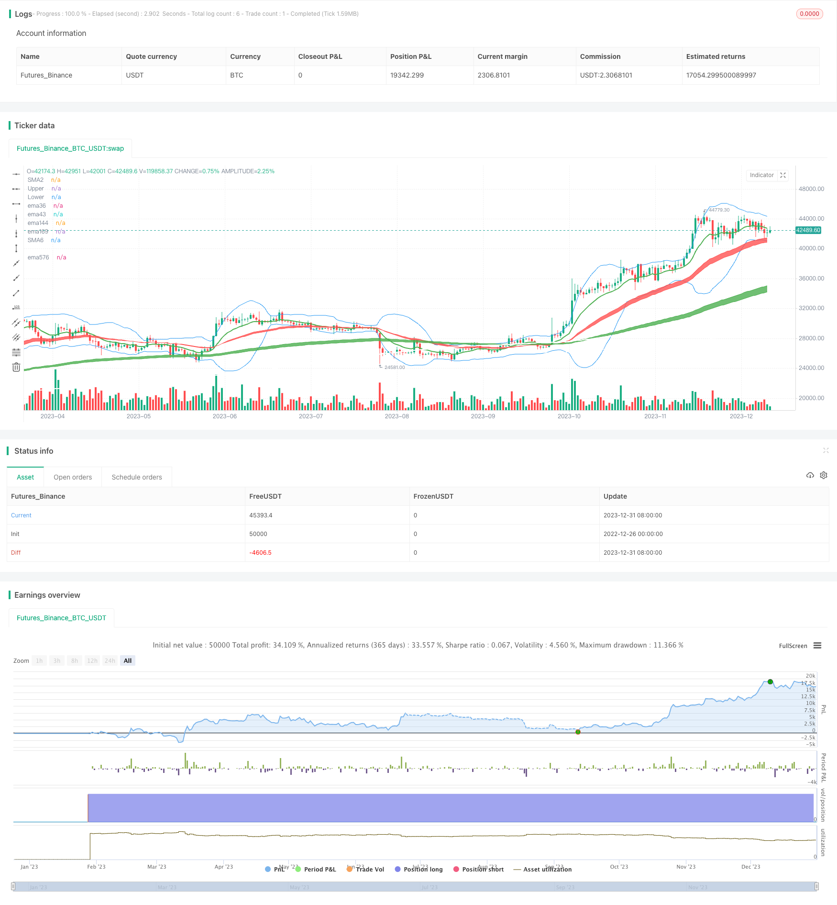

> Name

Moving-Vegas-Channel-Crossover-Strategy Moving-Vegas-Channel-Crossover-Strategy
> Author

ChaoZhang

> Strategy Description


[trans]

The core idea of ​​this strategy is to judge the short, medium and long-term trend direction of the stock based on moving averages of different periods such as EMA 36, 143, 169, etc., and combine it with the MACD indicator to issue buy and sell signals. Specifically, the short-term judgment is based on the 5 and 10-day EMA, the medium-term judgment is based on the 20- and 60-day EMA, and the long-term judgment is based on the 120 and 250-day EMA. When the short-term EMA crosses above the mid-term EMA, it is bullish, and when it crosses below, it is bearish; combined with the MACD long and short indicator, the buying and selling timing is judged.
The specific principles of Vegas tunnel strategy:
1. Use EMA36 and EMA43 to form short-term trend judgment, which form the red channel;
2. Use EMA144 and EMA169 to form the mid-term trend judgment, which form the green channel;
3. Use EMA576 and EMA676 to form a long-term trend judgment, which form a gray channel;
4. When the price stands on each EMA moving average, you can go long, and then combine the MACD indicator to break through the 0 axis upward to send a buy signal;
5. When the price falls below each EMA moving average, you can go short, and then combine the MACD indicator to break down the 0 axis to send a sell signal.
6. According to the crossed EMA moving average period, it is divided into three trading strategies: short, medium and long, which correspond to different holding periods.
The advantages of this strategy are mainly reflected in:
1. Combine the short, medium and long channels at the same time to determine the trend direction, which is relatively stable.
2. The Vegas tunnel is clear and intuitive, making it easy to judge trends. 
3. Combined with the MACD indicator, you can grasp better buying and selling opportunities.
4. Divided into three strategies: short, medium and long, you can operate more flexibly.
Key risks of this strategy:
1. When the stock price fluctuates violently, the EMA moving average is generated lagging behind, and the possibility of misjudgment is high.
2. When the judgments of the three channels are inconsistent, there is a risk of incorrect operation.
3. Time-sharing chart operations require strong mental endurance.
How to deal with it:
1. The EMA moving average period can be appropriately adjusted to better match the current market characteristics.  
2. Adjust the position ratio before trading to control single losses.
The optimization space of this strategy:
1. Vegas Tunnel is not enough to distinguish trends and judge, and Bollinger Bands can be introduced to assist judgment. 
2. The MACD indicator is not effective for range-bound market fluctuations. KD, RSI and other indicators can be used instead.
3. Add a stop loss strategy, such as taking the initiative to stop loss when the closing price falls below the key EMA.
4. The price limit of A shares has a great impact, so you can consider shorting ETFs for hedging.
||

The core idea of this strategy is to determine the short, mid and long term trend direction of stocks based on EMAs with different cycles such as 36, 143, 169, combined with MACD indicator to issue buying and selling signals. Specifically, in short term, 5 and 10 day EMAs are used to judge, in mid term, 20 and 60 day EMAs are used to judge, in long term, 120 and 250 day EMAs are used to judge, when short term EMA crosses middle term EMA upwards, it’s bullish, otherwise it’s bearish; MACD indicator of bullish and bearish signals is used to determine buying and selling time.  

The specific mechanism of the Vegas Tunnel strategy: 
1. Use EMA 36 and EMA 43 to form short term trend judgment, they make up the red channel; 
2. Use EMA 144 and EMA 169 to form medium-term trend judgment, they make up the green channel; 
3. Use EMA576 and EMA676 to form long term trend judgment, they make up the gray channel; 
4. When the price stands on the above EMA lines, go long, combined with MACD indicator breaking through 0 axis upwards as buying signal;
5. When the price breaks below the above EMA lines, go short, combined with MACD indicator breaking through 0 axis downwards as selling signal;
6. According to the EMA line breakthrough, three strategies are defined, short, medium and long term respectively, corresponding to different holding period.  

Advantages of this strategy:  
1. Combining short, medium and long three channels to judge trend direction, relatively stable;
2. Vegas tunnel is intuitive to determine trend;
3. MACD helps capture better buying and selling timing;
4. Divided into short, medium and long three strategies for more flexible operations.  

Major risks:
1. When prices fluctuate wildly, EMA lines lag, likely to make wrong judgments;
2. When three channels show inconsistent signals, risks of wrong operations exist;  
3. Minute chart operations need stronger psychological endurance.  

Coping methods:
1. Adjust EMA cycle to better match current market characteristics;
2. Adjust position size beforehand to limit single loss.

Optimization space: 
1. Vegas tunnels’ trend judgement capability needs improving, Bollinger bands may be added;
2. MACD works poorly for sideways markets, indicators like KD and RSI may be better options; 
3. Add stop loss policies, like stop loss when closing price breaks key EMA lines;
4. Short ETF to hedge given A share limit-ups and downs having greater impacts.  

[/trans]

> Strategy Arguments


|Argument|Default|Description|
|----|----|----|
|v_input_1|true|Use Current Chart Resolution?|
|v_input_2|D|Use Different Timeframe? Uncheck Box Above|
|v_input_3|12|12 EMA|
|v_input_4|240|240 SMA|
|v_input_5|20|BB Length|
|v_input_6_close|0|BB Source: close|high|low|open|hl2|hlc3|hlcc4|ohlc4|
|v_input_7|2|BB StdDev|
|v_input_8|false|BB Offset|
|v_input_9|true|Start Date|
|v_input_10|true|Start Month|
|v_input_11|2018|Start Year|
|v_input_12|true|End Date|
|v_input_13|11|End Month|
|v_input_14|2030|End Year|


> Source (PineScript)

``` pinescript
/*backtest
start: 2022-12-26 00:00:00
end: 2024-01-01 00:00:00
period: 1d
basePeriod: 1h
exchanges: [{"eid":"Futures_Binance","currency":"BTC_USDT"}]
*/

//@version=4

strategy("Vegas Tunnel strategy", overlay=true)
//-------------------------------------------
//-------------------------------------------
// Inputs
useCurrentRes = input(true, title="Use Current Chart Resolution?")
resCustom = input(title="Use Different Timeframe? Uncheck Box Above", type=input.resolution, defval="D")
//tfSet = input(title = "Time Frame", options=["Current","120", "240", "D", "W"], defval="D")
tfSet = useCurrentRes ? timeframe.period : resCustom
maPeriods2 = input(12, "12 EMA")
maPeriods6 = input(240, "240 SMA")
BBlength = input(20, title="BB Length", minval=1)
BBsrc = input(close, title="BB Source")
mult = input(2.0, minval=0.001, maxval=50, title="BB StdDev")
sm2 = security(syminfo.tickerid, tfSet, ema(close, maPeriods2))
sm6 = security(syminfo.tickerid, tfSet, sma(close, maPeriods6))
p2 = plot(sm2, color=color.green, transp=30,  linewidth=2, title="SMA2")
p6 = plot(sm6, color=color.white, transp=30,  linewidth=2, title="SMA6")
//BB
basis = sma(BBsrc, BBlength)
dev = mult * stdev(BBsrc, BBlength)
upper = basis + dev
lower = basis - dev
offset = input(0, "BB Offset", type = input.integer, minval = -500, maxval = 500)
//plot(basis, "Basis", color=color.blue,linewidth, offset = offset)
pBB1 = plot(upper, "Upper", color=color.blue, offset = offset)
pBB2= plot(lower, "Lower", color=color.blue, offset = offset)

//MACD
fast_ma = ema(close, 48)
slow_ma = ema(close, 56)
macd = fast_ma - slow_ma

//vagas隧道
f1=ema(close, 36)
f2=ema(close, 43)
f3=ema(close, 144)
f4=ema(close, 169)
f5=ema(close, 576)
f6=ema(close, 676)
f7=ema(close,2304)
z1=plot(f1,color=color.red, title="ema36",transp=100)
z2=plot(f2,color=color.red, title="ema43",transp=100)
z3=plot(f3,color=color.green, title="ema144",transp=100)
z4=plot(f4,color=color.green, title="ema169",transp=100)
z5=plot(f5,color=color.white, title="ema576",transp=100)
z6=plot(f6,color=color.white, title="ema676",transp=100)
fill(z1, z2, color=color.red,transp=60)
fill(z3, z4, color=color.green,transp=60)
fill(z5, z6, color=color.gray,transp=60)

// Make input options that configure backtest date range
startDate = input(title="Start Date", type=input.integer,
     defval=1, minval=1, maxval=31)
startMonth = input(title="Start Month", type=input.integer,
     defval=1, minval=1, maxval=12)
startYear = input(title="Start Year", type=input.integer,
     defval=2018, minval=1800, maxval=2100)
endDate = input(title="End Date", type=input.integer,
     defval=1, minval=1, maxval=31)
endMonth = input(title="End Month", type=input.integer,
     defval=11, minval=1, maxval=12)
endYear = input(title="End Year", type=input.integer,
     defval=2030, minval=1800, maxval=2100)
// Look if the close time of the current bar
// falls inside the date range
inDateRange =  true

//波段多
if (inDateRange and crossunder(f3,f1))// 
    strategy.entry("buy", strategy.long,1, when=macd>0, comment = "買Long-term")
buyclose=crossunder(f3,f5) 
strategy.close("buy", when = buyclose, comment = "關Long-term")
//多策略1
if (inDateRange and crossover(low , f3) and macd>0 and f3>f6)
    strategy.entry("buy1", strategy.long,100, comment = "買Mid-term")
buyclose1=crossunder(close,upper*0.999) 
if (macd<0 or f3<f6)
    strategy.close("buy1", comment = "關Mid-term")
//strategy.close("buy1",when=cross(basis,close), comment = "關M",qty_percent=50)
strategy.close("buy1", when = buyclose1, comment = "關Mid-term",qty_percent=100)
//多策略3
if (inDateRange and  (macd>0) and crossunder(low,f1) and f1>f4) // 
    strategy.entry("buy3", strategy.long,1, comment = "買Short-term")
buyclose3=crossunder(close,upper*0.999)
if (macd<0 or f1<f4)
    strategy.close("buy3", comment = "關Short-term")
strategy.close("buy3", when = buyclose3, comment = "關Short-term")
//多策略4
if (inDateRange and  (macd>0) and crossunder(low,f5) and f4>f5) // 
    strategy.entry("buy4", strategy.long,1, comment = "買Long-term")
buyclose4=crossunder(close,upper*0.999)
if (macd<0 or f4<f6)
    strategy.close("buy4", comment = "關Long-term")
strategy.close("buy4", when = buyclose4, comment = "關Long-term")
    
//空策略1
if (inDateRange and  (macd<0) and crossunder(high,f1) and f1<f3 and f3<f6) // 
    strategy.entry("sell1", strategy.short,1, comment = "空Short-term")
sellclose1=crossunder(lower*0.999,close)
if (macd>0 or f1>f4)
    strategy.close("sell1", comment = "關空Short-term")
strategy.close("sell1", when = sellclose1, comment = "關空Short-term")
//空策略2
if (inDateRange and  (macd<0) and crossunder(high,f4) and f4<f6) // 
    strategy.entry("sell2", strategy.short,1, comment = "空Mid-term")
sellclose2=crossunder(lower,close)
if (macd>0 or f4>f6)
    strategy.close("sell2", comment = "關空Mid-term")
strategy.close("sell2", when = sellclose2, comment = "關Mid-term")
//空策略3
if (inDateRange and (macd<0) and crossunder(high,f6)) // 
    strategy.entry("sell3", strategy.short,1, comment = "空Long-term")
sellclose3=crossunder(lower,close)
if (macd>0 or f6>f7)
    strategy.close("sell3", comment = "關空Long-term")
strategy.close("sell3", when = sellclose3, comment = "關空Long-term")
```

> Detail

https://www.fmz.com/strategy/437381

> Last Modified

2024-01-02 10:53:06
