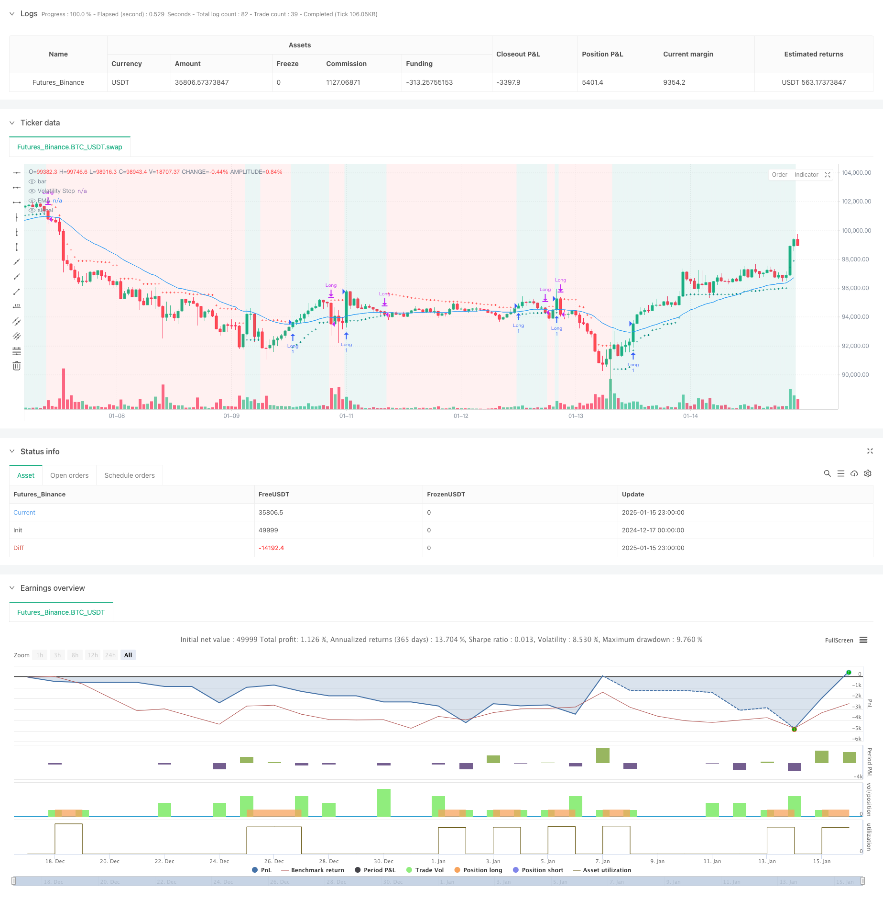

> Name

Volatility-Stop-Based-EMA-Trend-Following-Trading-Strategy
> Author

ChaoZhang

> Strategy Description



[trans]
#### Overview
This strategy is a trend following trading system based on the Volatility Stop (VStop) indicator and the Exponential Moving Average (EMA). The strategy combines Stan Weinstein's trading philosophy, optimizes capital management through dynamically adjusted stop loss levels, and uses EMA to confirm the trend direction. This combination provides investors and swing traders with a trading framework that can capture trends while effectively managing risk.
#### Strategy Principles
The core logic of the strategy is based on two main technical indicators:
1. Volatility stop loss (VStop): a dynamic stop loss indicator based on ATR (average true volatility), which adaptively adjusts the stop loss position based on market volatility. When the price is in an upward trend, the stop loss line will move upward as the price rises; when the trend reverses, the stop loss line will switch directions and be recalculated.
2. Exponential Moving Average (EMA): As a trend confirmation tool, it helps filter out false signals. The price needs to stand above the EMA before a position will be considered, which ensures that the trading direction is consistent with the main trend.
The trading signal generation logic is as follows:
- Conditions for opening a position: the price is above VStop (in an upward trend) and the closing price is greater than the EMA
- Closing conditions: when the closing price falls below the EMA
- Risk control: Provide real-time stop loss position through dynamically adjusted VStop
#### Strategic Advantages
1. Strong adaptability: VStop is calculated based on the actual market volatility and can automatically adjust the stop loss distance according to different market environments.
2. Excellent trend tracking ability: confirm the trend direction through EMA and avoid frequent trading in volatile markets
3. Improved risk management: the dynamic stop-loss mechanism can lock in profits in time and control drawdowns
4. Strong parameter adjustability: VStop and EMA parameters can be flexibly adjusted according to different trading varieties and time periods.
5. The logic is concise and clear: the strategy rules are intuitive and easy to understand, making it easy to implement in actual operations.
#### Strategy Risk
1. Trend reversal risk: In a severe trend reversal, you may have to endure a certain retracement before closing your position.
2. False breakthrough risk: False breakthrough signals may appear when the market fluctuates, leading to frequent trading
3. Parameter sensitivity: Different parameter settings may lead to large differences in strategy performance.
4. Slippage risk: When market liquidity is insufficient, the actual execution price may deviate from the theoretical price.
5. Systemic risk: You may face a large retracement when the market fluctuates violently.
#### Strategy optimization direction
1. Add trend strength filter: You can introduce ADX, MACD and other indicators to measure the trend strength, and only trade when the trend is clear
2. Optimize the stop loss mechanism: support and resistance levels can be combined to set a more intelligent stop loss position.
3. Add trading volume analysis: Confirm the effectiveness of price breakthroughs through trading volume
4. Introduce market environment identification: dynamically adjust strategy parameters according to different market environments (trends/shocks)
5. Improve position management: dynamically adjust position size based on volatility and risk assessment
#### Summary
This strategy builds a complete trend-following trading framework by combining volatility stops and moving average systems. The main advantage of the strategy lies in its adaptability and risk management capabilities, but at the same time, attention must be paid to the impact of the market environment on strategy performance. Through continuous optimization and improvement, the strategy is expected to maintain stable performance in different market environments. It is recommended that traders fully test the parameter settings and adjust the strategy based on their own risk tolerance before using it in real trading. ||
#### Overview
This strategy is a trend following trading system based on the Volatility Stop (VStop) indicator and Exponential Moving Average (EMA). Incorporating Stan Weinstein's trading principles, it optimizes capital management through dynamically adjusted stop losses while using EMA to confirm trend direction. This combination provides investors and swing traders with a framework that can both capture trends and effectively manage risks.

#### Strategy Principles
The core logic is built on two main technical indicators:
1. Volatility Stop (VStop): A dynamic stop-loss indicator based on ATR (Average True Range) that adapts to market volatility. When price is in an uptrend, the stop line moves up with price; when the trend reverses, the stop line switches direction and recalculates.

2. Exponential Moving Average (EMA): Serves as a trend confirmation tool to filter false signals. Price must be above EMA to consider entry positions, ensuring trade direction aligns with the main trend.

Trade signal generation logic:
- Entry conditions: Price above VStop (in uptrend) and closing price above EMA
- Exit conditions: When closing price falls below EMA
- Risk control: Real-time stop-loss positions provided by dynamically adjusted VStop

#### Strategy Advantages
1. Strong adaptability: VStop calculates based on actual market volatility, automatically adjusting stop distances for different market environments
2. Excellent trend following capability: Confirms trend direction through EMA, avoiding frequent trading in oscillating markets
3. Comprehensive risk management: Dynamic stop-loss mechanism locks in profits and controls drawdowns
4. Strong parameter adjustability: Flexible adjustment of VStop and EMA parameters for different trading instruments and timeframes
5. Clear and concise logic: Strategy rules are intuitive and easy to implement

#### Strategy Risks
1. Trend reversal risk: May experience some drawdown before exiting during sharp trend reversals
2. False breakout risk: May generate false breakthrough signals during market oscillation, leading to frequent trading
3. Parameter sensitivity: Different parameter settings may result in significant strategy performance variations
4. Slippage risk: Actual execution prices may deviate from theoretical prices in markets with insufficient liquidity
5. Systematic risk: May face significant drawdowns during severe market volatility

#### Strategy Optimization Directions
1. Add trend strength filter: Introduce indicators like ADX, MACD to measure trend strength, trading only when trends are clear
2. Optimize stop-loss mechanism: Set more intelligent stop-loss positions combining support and resistance levels
3. Incorporate volume analysis: Confirm price breakout validity through volume
4. Introduce market environment recognition: Dynamically adjust strategy parameters based on different market environments (trend/oscillation)
5. Improve position management: Dynamically adjust position size based on volatility and risk assessment

#### Summary
This strategy constructs a complete trend following trading framework by combining volatility stops and moving average systems. Its main advantages lie in adaptability and risk management capabilities, but attention must be paid to the impact of market environment on strategy performance. Through continuous optimization and improvement, the strategy has the potential to maintain stable performance in different market environments. Traders are advised to thoroughly test parameter settings and adjust the strategy according to their risk tolerance before live trading.[/trans]


> Source (PineScript)

``` pinescript
/*backtest
start: 2024-12-17 00:00:00
end: 2025-01-16 00:00:00
period: 1h
basePeriod: 1h
exchanges: [{"eid":"Futures_Binance","currency":"BTC_USDT","balance":49999}]
*/

//@version=5
strategy("VStop + EMA Strategy", overlay=true)

// VStop Parameters
length = input.int(20, "VStop Length", minval=2)
multiplier = input.float(2.0, "VStop Multiplier", minval=0.25, step=0.25)

// EMA Parameters
emaLength = input.int(30, "EMA Length", minval=1)

// VStop Calculation
volStop(src, atrlen, atrfactor) =>
    if not na(src)
        var max     = src
        var min     = src
        var uptrend = true
        var float stop    = na
        atrM        = nz(ta.atr(atrlen) * atrfactor, ta.tr)
        max         := math.max(max, src)
        min         := math.min(min, src)
        stop        := nz(uptrend ? math.max(stop, max - atrM) : math.min(stop, min + atrM), src)
        uptrend     := src - stop >= 0.0
        if uptrend != uptrend[1] and not barstate.isfirst
            max    := src
            min    := src
            stop   := uptrend ? max - atrM : min + atrM
        [stop, uptrend]

// Calculate VStop
[vStop, isUptrend] = volStop(close, length, multiplier)

// Plot VStop
plot(vStop, "Volatility Stop", style=plot.style_cross, color=isUptrend ? color.teal : color.red)

// Calculate 30 EMA
emaValue = ta.ema(close, emaLength)
plot(emaValue, "EMA", color=color.blue)

// Entry and Exit Conditions
longCondition = isUptrend and close > emaValue
exitCondition = close <= emaValue

// Strategy Execution
if longCondition and not strategy.opentrades
    strategy.entry("Long", strategy.long)
if exitCondition and strategy.opentrades
    strategy.close("Long")

// Display Strategy Info
bgcolor(isUptrend ? color.new(color.teal, 90) : color.new(color.red, 90), title="Trend Background")

```

> Detail

https://www.fmz.com/strategy/478708

> Last Modified

2025-01-17 15:06:09
