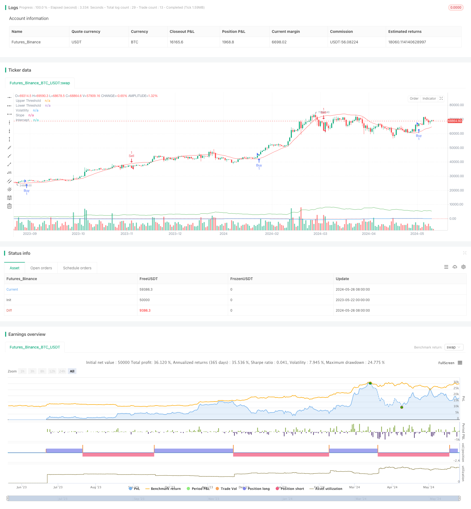

> Name

Volatility-and-Linear-Regression-based-Long-Short-Market-Regime-Optimization-Strategy
> Author

ChaoZhang

> Strategy Description



[trans]
#### Overview
This strategy uses linear regression and volatility indicators to identify different market states. When buy or sell conditions are met, the strategy will establish corresponding long or short positions. At the same time, this strategy allows parameter optimization and adjustment according to market conditions to adapt to different market environments. The strategy also uses exponential moving averages as an additional indicator to confirm trading signals.
#### Strategy Principle
1. Calculate the intercept and slope of linear regression, which is used to determine market trends.
2. Calculate the average true volatility (ATR) times the multiplier as the volatility indicator.
3. When the slope is greater than the upper threshold and the price is above the regression line plus volatility, a buy signal is generated.
4. A sell signal is generated when the slope is less than the lower threshold and the price is below the regression line minus the volatility.
5. Use fast and slow exponential moving averages (EMA) as additional confirmation indicators.
6. When a buy signal appears and the fast EMA is above the slow EMA, open a long position.
7. When a sell signal appears and the fast EMA is below the slow EMA, open a short position.
#### Strategic Advantages
1. Combining linear regression and volatility indicators can more accurately identify market status and trends.
2. Use additional EMA indicators to confirm trading signals and improve the reliability of the strategy.
3. Allow key parameters to be optimized to adapt to different market environments and variety characteristics.
4. Considering both trend and volatility, you can open a position in time when the trend is clear and control risks when the volatility intensifies.
#### Strategy Risk
1. Improper parameter selection may lead to poor strategy performance and needs to be optimized according to specific varieties and market characteristics.
2. In volatile markets or trend turning points, the strategy may experience frequent trading or false signals.
3. The strategy relies on historical data and may not respond promptly to emergencies or abnormal market fluctuations.
#### Strategy optimization direction
1. Introduce other technical indicators or fundamental factors to enrich the decision-making basis of strategies and improve signal accuracy.
2. Optimize parameter selection, such as regression length, volatility multiplier, EMA period, etc., to adapt to different varieties and market characteristics.
3. Add stop-loss and take-profit mechanisms to control single transaction risks and overall retracement levels.
4. Consider adding position management and fund management rules, and adjust the position size according to market fluctuations and account equity.
#### Summary
This strategy identifies market status through linear regression and volatility indicators, and uses EMA as a confirmation indicator to build a trading strategy with strong adaptability and clear logic. The advantage of the strategy is that it combines trend and volatility while allowing parameter optimization and is suitable for different market environments. However, the strategy also has risks such as parameter selection, market shocks and black swan events, and needs to be continuously optimized and improved in practical applications. In the future, the strategy can be improved from aspects such as enriching signal sources, optimizing parameter selection, and improving risk control measures to improve its stability and profitability.
|| 

#### Overview
The strategy utilizes linear regression and volatility indicators to identify different market states. When the conditions for buying or selling are met, the strategy establishes corresponding long or short positions. Additionally, the strategy allows for parameter optimization and adjustment based on market conditions to adapt to various market environments. The strategy also employs exponential moving averages (EMAs) as additional indicators to confirm trading signals.

#### Strategy Principles
1. Calculate the intercept and slope of the linear regression to determine market trends.
2. Calculate the Average True Range (ATR) multiplied by a multiplier as the volatility indicator.
3. Generate a buy signal when the slope is greater than the upper threshold and the price is above the regression line plus volatility.
4. Generate a sell signal when the slope is less than the lower threshold and the price is below the regression line minus volatility.
5. Use fast and slow EMAs as additional confirmation indicators.
6. Establish a long position when a buy signal occurs and the fast EMA is above the slow EMA.
7. Establish a short position when a sell signal occurs and the fast EMA is below the slow EMA.

#### Strategy Advantages
1. By combining linear regression and volatility indicators, the strategy can more accurately identify market states and trends.
2. The use of additional EMA indicators to confirm trading signals enhances the reliability of the strategy.
3. Allowing optimization of key parameters enables adaptation to different market environments and instrument characteristics.
4. Considering both trends and volatility, the strategy can promptly establish positions when trends are clear and control risks when volatility increases.

#### Strategy Risks
1. Improper parameter selection may lead to poor strategy performance, requiring optimization based on specific instruments and market characteristics.
2. In choppy markets or at trend turning points, the strategy may experience frequent trades or false signals.
3. The strategy relies on historical data and may not react promptly to sudden events or abnormal market fluctuations.

#### Strategy Optimization Directions
1. Incorporate other technical indicators or fundamental factors to enrich the decision-making basis and improve signal accuracy.
2. Optimize parameter selection, such as regression length, volatility multiplier, EMA periods, etc., to adapt to different instruments and market characteristics.
3. Introduce stop-loss and take-profit mechanisms to control individual trade risks and overall drawdown levels.
4. Consider incorporating position sizing and money management rules to adjust position sizes based on market volatility and account equity.

#### Summary
The strategy identifies market states using linear regression and volatility indicators, with EMAs as confirmation indicators, constructing an adaptive and logically clear trading strategy. The strategy's advantages lie in combining trends and volatility while allowing parameter optimization, making it suitable for various market environments. However, the strategy also faces risks such as parameter selection, choppy markets, and black swan events, requiring continuous optimization and improvement in practical applications. Future enhancements can focus on enriching signal sources, optimizing parameter selection, and refining risk control measures to enhance the strategy's stability and profitability.
[/trans]


> Source (PineScript)

``` pinescript
/*backtest
start: 2023-05-22 00:00:00
end: 2024-05-27 00:00:00
period: 1d
basePeriod: 1h
exchanges: [{"eid":"Futures_Binance","currency":"BTC_USDT"}]
*/

// This Pine Script™ code is subject to the terms of the Mozilla Public License 2.0 at https://mozilla.org/MPL/2.0/
// © tmalvao

//@version=5
strategy("Regime de Mercado com Regressão e Volatilidade Otimizado", overlay=true)

// Parâmetros para otimização
upperThreshold = input.float(1.0, title="Upper Threshold")
lowerThreshold = input.float(-1.0, title="Lower Threshold")
length = input.int(50, title="Length", minval=1)

// Indicadores de volatilidade
atrLength = input.int(14, title="ATR Length")
atrMult = input.float(2.0, title="ATR Multiplier")
atr = ta.atr(atrLength)
volatility = atr * atrMult

// Calculando a regressão linear usando função incorporada
intercept = ta.linreg(close, length, 0)
slope = ta.linreg(close, length, 1) - ta.linreg(close, length, 0)

// Sinal de compra e venda
buySignal = slope > upperThreshold and close > intercept + volatility
sellSignal = slope < lowerThreshold and close < intercept - volatility

// Entrando e saindo das posições
if (buySignal)
    strategy.entry("Buy", strategy.long)
if (sellSignal)
    strategy.entry("Sell", strategy.short)

// Indicadores adicionais para confirmação
emaFastLength = input.int(10, title="EMA Fast Length")
emaSlowLength = input.int(50, title="EMA Slow Length")
emaFast = ta.ema(close, emaFastLength)
emaSlow = ta.ema(close, emaSlowLength)

// Confirmando sinais com EMAs
if (buySignal and emaFast > emaSlow)
    strategy.entry("Buy Confirmed", strategy.long)
if (sellSignal and emaFast < emaSlow)
    strategy.entry("Sell Confirmed", strategy.short)

// Exibindo informações no gráfico
plot(slope, title="Slope", color=color.blue)
plot(intercept, title="Intercept", color=color.red)
plot(volatility, title="Volatility", color=color.green)
hline(upperThreshold, "Upper Threshold", color=color.green, linestyle=hline.style_dotted)
hline(lowerThreshold, "Lower Threshold", color=color.red, linestyle=hline.style_dotted)


```

> Detail

https://www.fmz.com/strategy/452743

> Last Modified

2024-05-28 17:40:37
