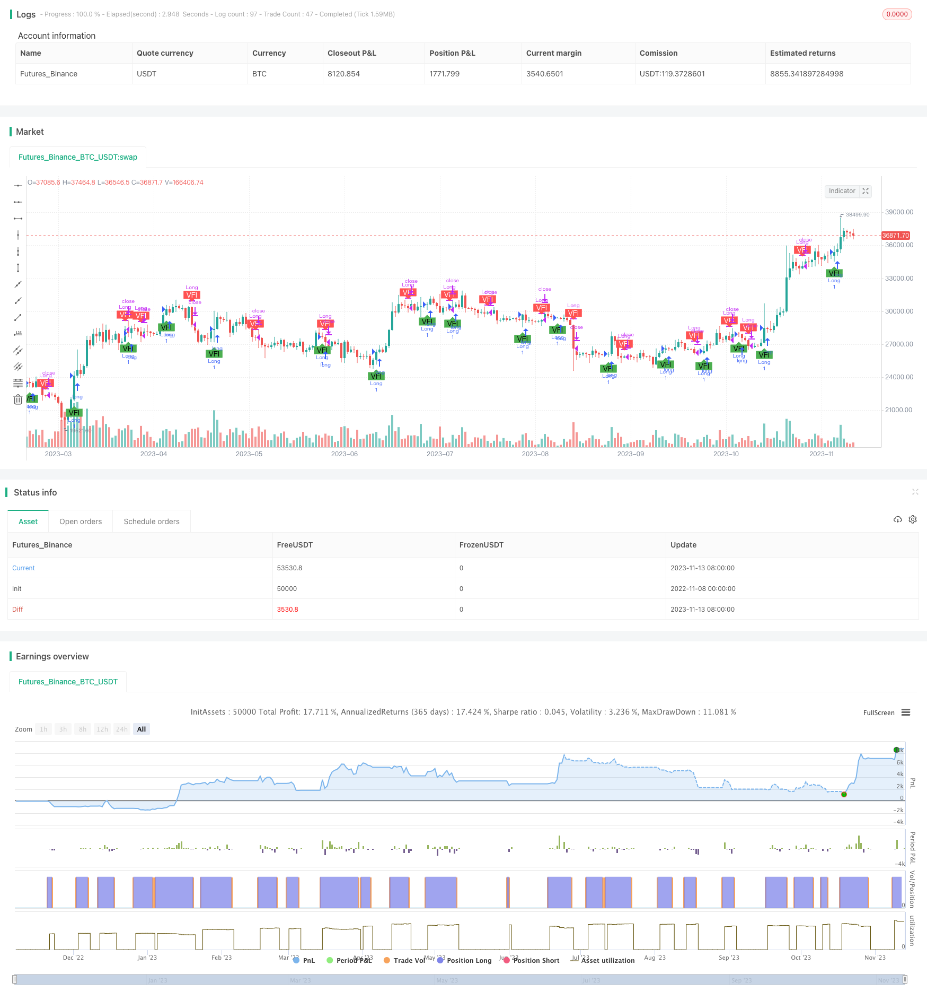

> Name

Volume-Flow-Indicator-Based-Trend-Following-Strategy
> Author

ChaoZhang

> Strategy Description



[trans]

## Overview
This strategy determines the direction of the market trend by calculating changes in trading volume, uses trend tracking, establishes a position at the beginning of the trend, and closes the position with a stop loss when the trend ends.
## Strategy Principle
1. Calculate typical price typical, logarithmic return inter, and return variance vinter
2. Calculate the average transaction volume vave and the maximum transaction volume threshold vmax
3. Calculate the price change amount mf, compare it with the variance threshold cutoff, and calculate the price driving amount vcp
4. Summarize vcp to obtain the volume and price indicator vfi, and calculate vfi and its moving average vfima respectively.
5. Compare the size of vfi and vfima to obtain the difference between volume and price indicators dVFI to determine the trend direction.
6. When dVFI crosses above 0, it is a bullish signal; when it crosses below 0, it is a bearish signal.
7. Establish a long and short strategy based on the dVFI pattern.
## Strategic advantage analysis
1. This strategy fully considers the impact of changes in trading volume on trend judgment, and uses the momentum indicator to measure the strength of the trend, which can more accurately capture the turning point of the trend.
2. The strategy adds transaction volume threshold calculation, which can filter out normal fluctuations, capture only the collective behavior of large funds, and avoid being misled by market noise.
3. Judgment of volume and price linkage, comprehensive consideration of price and trading volume, can effectively avoid false breakthroughs. 
4. Using moving average filtering and logical judgment, most false signals can be filtered out.
5. Tracking trends rather than predicting reversals is very suitable for medium and long-term trend trading and is helpful for grasping the main direction of the market.
## Strategy risk analysis
1. This strategy mainly relies on changes in trading volume to judge trends, and the effect will be compromised in varieties with inactive trading volume.
2. Trading volume data is easily manipulated and may produce misleading signals. It is necessary to guard against deviations between volume and price.
3. The relationship between volume and price often lags behind, and you may miss the best entry opportunity at the beginning of the trend.
4. Extensive stop loss methods may stop losses prematurely and fail to continuously capture the trend.
5. Inability to effectively respond to short-term adjustments and may be insensitive to emergencies.
You can consider adding moving average systems, volatility indicators, etc. to optimize entry and stop loss; combine more data sources to analyze the relationship between volume and price to prevent misleading signals; add appropriate technical indicators to improve response to short-term adjustments.
## Strategy optimization direction
1. To optimize the entry conditions, you can consider adding moving average, 자세오극점 and other judgments to determine the entry after the trend starts.
2. Optimize the stop loss method. You can set trailing stop loss, level stop loss, etc. to make the stop loss closer to the price and follow the trend stop.
3. Adding trend judgment links, such as ADX, can avoid erroneous transactions in sideways and market shocks.
4. Optimize parameter settings and find the optimal parameter combination through longer data backtesting.
5. Expand the strategy to more varieties and look for varieties with better quality and more active trading volume.
6. Consider adding machine learning models to use more data to judge the relationship between volume and price to improve signal quality.
## Summarize
The overall idea of ​​this strategy is clear, the core indicators are intuitive and easy to understand, and the trend direction can be reliably identified. The advantage of the strategy is that it emphasizes changes in trading volume and is suitable for tracking medium and long-term trends, but it is necessary to guard against misleading signals. Through parameter optimization, stop loss method improvement, indicator optimization combination, etc., the real performance of the strategy can be further enhanced.
||

## Overview

This strategy judges market trend direction by calculating changes in trading volume, and adopts a trend following approach by establishing positions at the beginning of trends and closing positions when trends end.

## Strategy Logic

1. Calculate typical price typical, logarithmic return inter, and return variance vinter
2. Calculate average trading volume vave, maximum trading volume threshold vmax  
3. Calculate price change mf, compare with variance threshold cutoff to get price driven momentum vcp
4. Sum vcp to get volume price indicator vfi, calculate vfi and its moving average vfima
5. Compare vfi with vfima to get the difference dVFI and determine trend direction
6. When dVFI crosses above 0, it is a bullish signal, and when crossing below 0, it is a bearish signal
7. Establish long and short strategies based on dVFI patterns

## Advantage Analysis

1. The strategy fully considers the impact of trading volume changes on trend judgment, using momentum indicators to measure trend strength and more accurately capture trend turning points.

2. The strategy incorporates trading volume threshold calculation to filter normal fluctuations and only capture collective behavior of large funds, avoiding being misled by market noise.

3. The combined consideration of price and volume can effectively avoid false breakouts.

4. The use of moving averages and logical criteria filters out most false signals.

5. Following trends rather than predicting reversals is well suited for medium-to-long term trend trading and capturing the market's main direction.

## Risk Analysis

1. The strategy relies mainly on trading volume changes to determine trends, and its effectiveness may be compromised in products with inactive trading volume.

2. Trading volume data can be manipulated, potentially generating misleading signals, so price-volume divergences need to be watched out for.

3. Price-volume relationships are often lagging, potentially missing the optimal entry timing at the beginning of trends. 

4. Crude stop loss methods may prematurely exit trades, unable to persistently capture trends.

5. Unable to respond effectively to short-term corrections, and may be insensitive to sudden events.

Consider incorporating moving averages, volatility indicators to optimize entries and stops; analyzing price-volume with more data sources to avoid misleading signals; incorporating appropriate technical indicators to improve responsiveness to short-term corrections.

## Optimization Directions

1. Optimize entry conditions by incorporating moving averages, ichimoku kinko hyo etc to confirm entries after trend starts.

2. Optimize stops with trailing stops, staged stops etc to make stops adhere closely to price and track trend stops. 

3. Add trend metrics like ADX to avoid incorrect trades in range-bound and choppy markets.

4. Optimize parameters through longer backtests to find optimal parameter combinations.

5. Expand strategy to more products, searching for higher quality instruments with active volume.

6. Consider adding machine learning models to leverage more data for price-volume analysis and improve signal quality.

## Conclusion

The overall strategy logic is clear, with intuitive core indicators reliably identifying trend direction. The advantage lies in emphasizing trading volume changes, suitable for tracking medium-to-long term trends, but misleading signals need to be watched out for. Further improvements in parameters, stop losses, indicator combinations can enhance live performance.

[/trans]


> Source (PineScript)

``` pinescript
/*backtest
start: 2022-11-08 00:00:00
end: 2023-11-14 00:00:00
period: 1d
basePeriod: 1h
exchanges: [{"eid":"Futures_Binance","currency":"BTC_USDT"}]
*/

//@version=4
strategy("Strategy for Volume Flow Indicator with alerts and markers on the chart", overlay=true)
// This indicator has been copied form Lazy Bear's code
lengthVFI = 130 
coefVFI = 0.2 
vcoefVFI = 2.5 
signalLength= 5 
smoothVFI=true 

ma(x,y) => smoothVFI ? sma(x,y) : x

typical=hlc3
inter = log( typical ) - log( typical[1] )
vinter = stdev(inter, 30 )
cutoff = coefVFI * vinter * close
vave = sma( volume, lengthVFI )[1]
vmax = vave * vcoefVFI
vc = iff(volume < vmax, volume, vmax)
mf = typical - typical[1]
vcp = iff( mf > cutoff, vc, iff ( mf < -cutoff, -vc, 0 ) )

vfi = ma(sum( vcp , lengthVFI )/vave, 3)
vfima=ema( vfi, signalLength )
dVFI=vfi-vfima

bullishVFI = dVFI > 0 and dVFI[1] <=0
bearishVFI =  dVFI < 0 and dVFI[1] >=0

longCondition = dVFI > 0 and dVFI[1] <=0
shortCondition = dVFI < 0 and dVFI[1] >=0

plotshape(bullishVFI, color=color.green, style=shape.labelup, textcolor=#000000, text="VFI", location=location.belowbar, transp=0)
plotshape(bearishVFI, color=color.red, style=shape.labeldown, textcolor=#ffffff,  text="VFI", location=location.abovebar, transp=0)

alertcondition(bullishVFI, title='Bullish - Volume Flow Indicator', message='Bullish - Volume Flow Indicator')
alertcondition(bearishVFI, title='Bearish - Volume Flow Indicator', message='Bearish - Volume Flow Indicator')

if(year > 2018)
    strategy.entry("Long", strategy.long, when=dVFI > 0 and dVFI[1] <=0)

if(shortCondition)
    strategy.close(id="Long")


```

> Detail

https://www.fmz.com/strategy/432240

> Last Modified

2023-11-15 17:53:51
