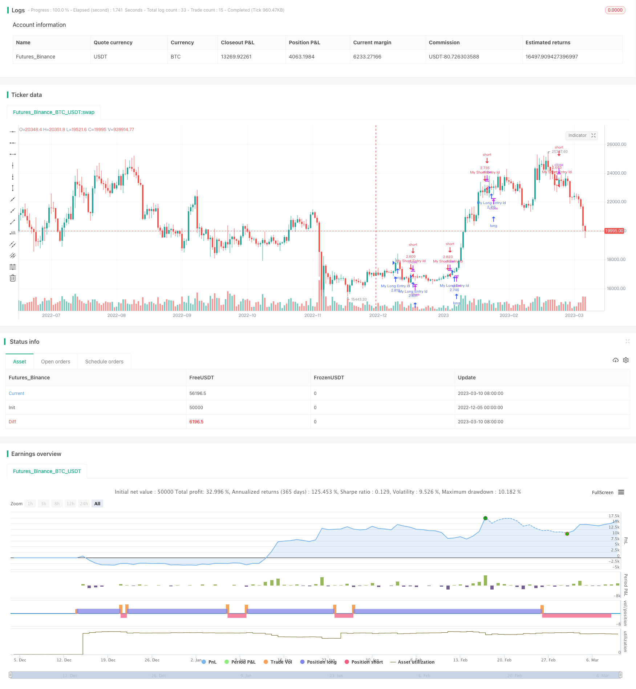

> Name

Volume-Oscillator-Long-and-Short-Term-Moving-Average-Crossover-Strategy based on trading volume oscillator
> Author

ChaoZhang

> Strategy Description



[trans]

### Overview
This strategy is implemented based on long-term and short-term moving average crossovers on trading volume. It uses EMAs of different periods to calculate the long-term and short-term trends of trading volume, and constructs an oscillator through their difference. Go long when the oscillator crosses above the zero line and go short when it crosses below the zero line. In addition, it will also combine the previous high point and low point to determine the specific operation direction.
### Strategy Principles
The core indicator of this strategy is the Volume Oscillator. It reflects the trend of trading volume through the difference between the long-term and short-term trading volume exponential moving averages. The specific calculation formula is as follows:
Volume Oscillator = (ShortEMA - LongEMA) / LongEMA * 100

Among them, ShortEMA and LongEMA represent short-term and long-term exponential moving averages respectively. When ShortEMA crosses above LongEMA, this indicator is positive, which means that trading volume is expanding; when ShortEMA crosses below LongEMA, this indicator is negative, which means that trading volume is shrinking.
After calculating this oscillator, this strategy uses its intersection with the zero axis to generate trading signals. When the indicator turns from negative to positive, that is, when it crosses the zero axis, go long; when the indicator turns from positive to negative, that is, when it crosses below the zero axis, go short. This reflects the potential energy conversion of trading volume.
In addition, the strategy will also combine the previous high and low points to determine the specific operation direction. That is, when the indicator crosses the zero axis, if the previous high point is greater than the absolute value of the previous low point, it is bullish; otherwise, it is bearish. This feature can be used to judge the strength of trading volume expansion.
### Strategic Advantages
This strategy has the following advantages:
1. Using trading volume as a basic indicator can effectively determine the willingness of market participants and has strong practicality.
2. Combined with long-term and short-term EMA, you can capture both mid- and long-term trends and short-term momentum.
3. The trading signal formed by the intersection of the indicator and the zero axis is simple, clear and easy to judge.
4. Adding the previous high and low points to determine the specific operation direction can effectively utilize the potential energy of trading volume.
5. The strategy has clear ideas, flexible parameter adjustment, and strong adaptability.
### Strategy Risk
There are also some risks to be aware of with this strategy:
1. Trading volume indicators are susceptible to false market breakthroughs and may produce false signals. Stop losses can be set to control risk.
2. In volatile market conditions, trading volume may cross frequently, and indicator turning points need to be reasonably confirmed.
3. The previous high and low points only reflect the latest expansion, and the sustainability of its strength cannot be determined.
4. Parameters for different varieties and time periods need to be optimized separately, which is not universal enough.
5. The trading volume indicator responds slowly to high-frequency programmed trading and may miss the best entry opportunity.
### Strategy optimization direction
This strategy can be optimized from the following aspects:
1. Add filter conditions to avoid false signals, such as adding confirmation of price indicators.
2. Optimize the period parameters of long- and short-term EMA to make it more consistent with the characteristics of different varieties.
3. Set period parameters for the previous high and low points, using the highest and lowest prices for a period of time.
4. Set the indicator turning area as a range to avoid frequent trading.
5. Add a stop loss strategy to control single losses.
6. Combined with other volume and price technical indicators such as VRP volume and price indicators.
7. Use machine learning methods to automatically optimize parameters.
### Summarize
In general, the long- and short-term crossover strategy based on the trading volume oscillator makes full use of the characteristics of the trading volume turning point, has strong judgment, and has good detection ability in the early stage of trend development. At the same time, it is combined with the previous high and low points to determine the specific direction, making trading decisions more accurate. But we also need to pay attention to risk control to prevent losses caused by false signals. This strategy has a lot of room for optimization, and can be expanded in terms of parameter adjustment and combination of indicators, making its trading delay shorter and more responsive to market changes.
||

### Overview

This strategy is based on the crossover of long and short term moving averages of trading volume. It uses EMAs of different periods to calculate the long and short term trends of trading volume, and constructs an oscillator based on their difference. It goes long when the oscillator crosses above the zero level, and goes short when crossing below. It also incorporates previous high and low prices to determine the specific direction.

### Strategy Logic

The core indicator of this strategy is Volume Oscillator. It reflects the trend of trading volume change by calculating the difference between long term and short term Exponential Moving Averages. The concrete formula is:  

Volume Oscillator = (ShortEMA - LongEMA) / LongEMA * 100

Here ShortEMA and LongEMA refer to short term and long term EMAs respectively. When ShortEMA crosses over LongEMA, the indicator turns positive, implying expanding trading volume. When ShortEMA crosses below LongEMA, the indicator turns negative, implying contracting trading volume.  

After calculating the oscillator, this strategy uses its crossover with zero level to generate trading signals. It goes long when the oscillator turns from negative to positive, i.e. crossing above zero level, and goes short when turning from positive to negative, i.e. crossing below zero level. This reflects the momentum conversion of trading volume.

In addition, the strategy also incorporates previous high and low prices to determine specific directions. That is when oscillator crossing above zero level, if previous high price is greater than absolute value of previous low price, it implies a long signal, otherwise a short signal. This feature helps judging the strength of volume expansion.

### Advantages

This strategy has the following advantages:

1. Using trading volume as the basis indicator can effectively determine market participants' willingness and is very practical. 

2. Incorporating both long term and short term EMAs can capture mid-long term trends and short term momentum simultaneously.

3. The crossing signals formed by indicator and zero level is simple and clear for decision making.

4. Adding previous highs and lows to determine directions can make good use of the momentum size of trading volumes.

5. The strategy logic is straightforward, parameters are flexible for adjustment and it has relatively strong adaptivity.

### Risks

Some risks of this strategy need to be noted:

1. Volume indicator can be influenced by market false breakouts, generating wrong signals. Stop loss should be set to control risks.

2. In range-bound markets, volume crossovers may happen frequently. Proper confirmation of indicator's turning points is needed.

3. Previous highs and lows only reflect the latest expansion and cannot determine its sustainability. 

4. Parameters need separate optimization for different products and time periods. The universality is limited.

5. Volume indicator reacts slowly to high-frequency algorithmic trading, possibly missing the best entry timing.

### Optimization Directions

The strategy can be optimized in the following aspects:

1. Adding filters to avoid false signals, e.g. confirming with price indicators. 

2. Optimizing periods of long and short term EMAs to match characteristics of different products.

3. Setting period parameters for previous highs and lows to use maximum and minimum prices of a period.

4. Defining a range for indicator's turning area instead of a single level to avoid over-trading. 

5. Adding stop loss strategies to control single loss.

6. Incorporating other volume-based indicators like VRP.

7. Using machine learning methods to auto-optimize parameters.

### Summary

In summary, the volume oscillator long short term moving average crossover strategy makes good use of volume reversal features and has strong judging power in the initial stage of trends. Adding previous highs and lows to determine directions makes trading decisions more accurate. Risk control is also important to prevent losses from false signals. This strategy has large room for optimization, in aspects like parameter tuning and combining indicators, to shorten its trading delay and reaction time to market changes.

[/trans]

> Strategy Arguments


|Argument|Default|Description|
|----|----|----|
|v_input_1|5|shortlen|
|v_input_2|10|longlen|
|v_input_3|false|zero|
|v_input_4|false|low_val|
|v_input_5|false|high_val|
|v_input_6|false|prev_high_val|
|v_input_7|false|prev_low_val|
|v_input_8|false|where|


> Source (PineScript)

``` pinescript
/*backtest
start: 2022-12-05 00:00:00
end: 2023-03-11 00:00:00
period: 1d
basePeriod: 1h
exchanges: [{"eid":"Futures_Binance","currency":"BTC_USDT"}]
*/

//@version=3
strategy("SB_Volume_oscillator_Prev_high_low", overlay=true,default_qty_type = strategy.percent_of_equity, default_qty_value = 100)

shortlen = input(5, minval=1)
longlen = input(10, minval=1)
short = ema(volume, shortlen)
long = ema(volume, longlen)
osc = 100 * (short - long) / long
//hline(0, title="Zero")
//plot(osc)
zero=input(0.0)

low_val=input(0.0)
high_val=input(0.0)
prev_high_val=input(0.0)
prev_low_val=input(0.0)
where=input(0)
where:=nz(where[1])
low_val:=nz(low_val[1])
high_val:=nz(high_val[1])
prev_high_val:=nz(prev_high_val[1])
prev_low_val:=nz(prev_low_val[1])
if(crossover(osc,zero))
    high_val:=osc
    where:=1
    prev_low_val:=low_val
    low_val:=osc

if(crossunder(osc,zero))
    low_val:=osc
    where:=-1
    prev_high_val:=high_val
    high_val:=osc

if(where==1)
    if(high_val<osc)
        high_val:=osc
        
if(where==-1)
    if(low_val>osc)
        low_val:=osc


if (crossover(osc,zero))
    if(prev_high_val<=abs(prev_low_val))
        strategy.entry("My Long Entry Id", strategy.long)
    if(prev_high_val>abs(prev_low_val))
        strategy.entry("My Short Entry Id", strategy.short)

if (crossunder(osc,zero))
    if(prev_high_val<=abs(prev_low_val))
        strategy.entry("My Long Entry Id", strategy.long)
    if(prev_high_val>abs(prev_low_val))
        strategy.entry("My Short Entry Id", strategy.short)
```

> Detail

https://www.fmz.com/strategy/435091

> Last Modified

2023-12-12 11:19:04
