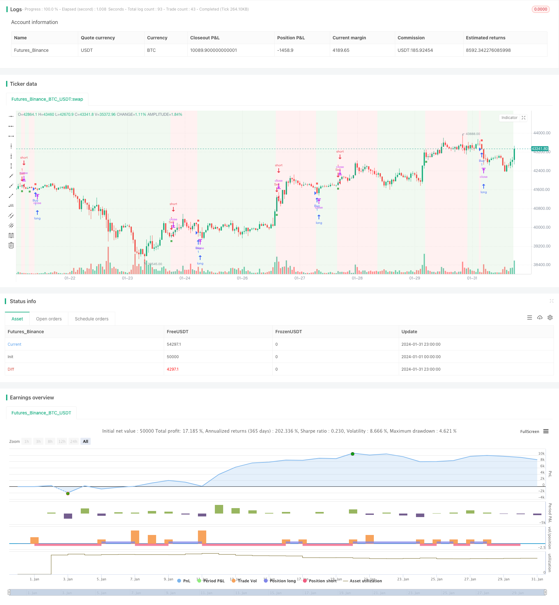

> Name

Historical trend mutation strategy Vortex-Trend-Reversal-Strategy
> Author

ChaoZhang

> Strategy Description


[trans]
## Overview
The historical trend mutation strategy uses eddy current indicators to identify market trend reversal points and combines them with exponential moving averages to generate trading signals, aiming to capture favor markets. This strategy cleverly combines the advantages of eddy current indicators and moving averages to effectively judge market trends and provide trading guidance.
## Principle analysis
1. **Eddy Current Indicator** - Determine the direction and strength of the trend by analyzing positive and negative price movements. The main parameters include period length, multiplier and threshold.
2. **Exponential Moving Average** - Exponentially smoothes the closing price to provide smoother trend judgment. The longer the moving average period, the more stable the trend judgment is.
This strategy uses the Eddy Current indicator to determine the main trend direction of the market and generates a trading signal when the indicator line crosses the threshold. Filter in conjunction with moving averages to avoid false signals. Specifically, a buy signal is generated when the Vortex indicator crosses the threshold line upwards and the price is above the moving average; a sell signal is generated when the Vortex indicator crosses the threshold line downwards and the price is below the moving average.
## Advantage Analysis
- Utilize the reversal recognition ability of the Eddy Current indicator to capture potential trend reversal opportunities in a timely manner
- Combined with moving averages for signal filtering to avoid erroneous transactions in volatile market conditions
- The strategy sensitivity can be adjusted through parameter optimization, making it suitable for different market environments.
- Intuitive interface and clear trading signals for easy real-time operation
## Risk Analysis
- Be alert to the systemic risk of indicator failure caused by emergencies
- There may be many false signals in volatile market conditions
- Improper parameter settings can also lead to being too aggressive or conservative
- Appropriate stop loss is required to control single loss
Risks can be dealt with by adding additional filters, combining multiple indicator judgments, optimizing parameter settings, and setting appropriate stop losses.
## Optimization direction
- Try different moving average types to find the best matching combination
- Adjust the parameters of the eddy current indicator and moving average to achieve the best return rate
- Test strategy stability on multiple time periods
- Add indicators such as Bollinger Bands to filter signals
- Fine-tuning parameters for specific varieties
## Summarize
The historical trend mutagenesis strategy is generally relatively robust and has certain filtering capabilities while seizing potential trend reversals. With the assistance of parameter optimization and risk management, this strategy is expected to achieve an excellent rate of return. It is recommended that traders conduct comprehensive verification in the simulated real market, and may also try to carry out innovative expansion based on this strategy.
||

## Overview  

The Vortex Trend Reversal Strategy utilizes the Vortex Indicator to identify potential trend reversals and capture favorable market movements. By intelligently combining the Vortex Indicator with a moving average line, this strategy aims to effectively determine market trends and generate trading signals.  

## Principles  

1. **Vortex Indicator** - Judging trend direction and strength by analyzing positive and negative price movements. Major parameters include period, multiplier and threshold.  

2. **Exponential Moving Average** - Smoothing closing prices for a more fluid trend indication. Longer moving average periods lead to more stable trend judgments.

This strategy leverages the Vortex Indicator to determine the major trend direction. Trading signals are generated when indicator lines cross the threshold value. With further filtering from the moving average line, erroneous signals can be avoided. Specifically, a buy signal is generated when the Vortex Indicator crosses above the threshold line and price is above the moving average; A sell signal occurs when indicator crosses below threshold and price is below moving average.

## Advantages

- Captures potential trend reversal opportunities in a timely manner with the Vortex Indicator  
- Avoids wrong trades in choppy markets by filtering signals with the moving average line
- Adjustable sensitivity for different market environments through parameter optimization
- Intuitive interface and clear trading signals for ease of real trading operations

## Risks 

- Systemic risks of indicator failure due to black swan events  
- Increased erroneous signals possible in ranging markets
- Overly aggressive or conservative behavior with improper parameter settings 
- Individual losing trades need to be controlled with appropriate stop loss  

Additional filters, cross-verification between indicators, parameter optimization and proper stop loss implementation could help address the above risks.

## Enhancement Opportunities 

- Experimenting with different moving average types to find best match
- Fine-tuning parameters of both indicators for optimum risk-adjusted returns
- Examining strategy robustness across multiple timeframes  
- Adding filters like Bollinger Bands to filter signals
- Asset-specific parameter tweaking  

## Conclusion  

The Vortex Trend Reversal Strategy demonstrates decent robustness in capturing potential reversals while possessing reasonable filtering capabilities. With proper optimization and risk management, this strategy shows promise in obtaining strong risk-adjusted returns. Traders are encouraged to thoroughly backtest this strategy and explore innovative extensions based on it.

[/trans]

> Strategy Arguments


|Argument|Default|Description|
|----|----|----|
|v_input_1|14|(?AstroHub Vortex Strategy)Length|
|v_input_2|true|Multiplier|
|v_input_3|0.5|Threshold|
|v_input_4|20|EMA Length|


> Source (PineScript)

``` pinescript
/*backtest
start: 2024-01-01 00:00:00
end: 2024-01-31 23:59:59
period: 1h
basePeriod: 15m
exchanges: [{"eid":"Futures_Binance","currency":"BTC_USDT"}]
*/

// This work is licensed under a Attribution-NonCommercial-ShareAlike 4.0 International (CC BY-NC-SA 4.0) https://creativecommons.org/licenses/by-nc-sa/4.0/
// © AstroHub

//@version=5
strategy("Vortex Strategy [AstroHub]", shorttitle="VS [AstroHub]", overlay=true)

// Vortex Indicator Settings
length = input(14, title="Length", group ="AstroHub Vortex Strategy", tooltip="Number of bars used in the Vortex Indicator calculation. Higher values may result in smoother but slower responses to price changes.")
mult = input(1.0, title="Multiplier", group ="AstroHub Vortex Strategy", tooltip="Multiplier for the Vortex Indicator calculation. Adjust to fine-tune the sensitivity of the indicator to price movements.")
threshold = input(0.5, title="Threshold",group ="AstroHub Vortex Strategy",  tooltip="Threshold level for determining the trend. Higher values increase the likelihood of a trend change being identified.")
emaLength = input(20, title="EMA Length", group ="AstroHub Vortex Strategy", tooltip="Length of the Exponential Moving Average (EMA) used in the strategy. A longer EMA may provide a smoother trend indication.")

// Calculate Vortex Indicator components
a = math.abs(close - close[1])
b = close - ta.sma(close, length)
shl = ta.ema(b, length)
svl = ta.ema(a, length)

// Determine trend direction
upTrend = shl > svl
downTrend = shl < svl

// Define Buy and Sell signals
buySignal = ta.crossover(shl, svl) and close > ta.ema(close, emaLength) and (upTrend != upTrend[1])
sellSignal = ta.crossunder(shl, svl) and close < ta.ema(close, emaLength) and (downTrend != downTrend[1])

// Execute strategy based on signals
strategy.entry("Sell", strategy.short, when=buySignal)
strategy.entry("Buy", strategy.long, when=sellSignal)

// Background color based on the trend
bgcolor(downTrend ? color.new(color.green, 90) : upTrend ? color.new(color.red, 90) : na)

// Plot Buy and Sell signals with different shapes and colors
buySignal1 = ta.crossover(shl, svl) and close > ta.ema(close, emaLength)
sellSignal1 = ta.crossunder(shl, svl) and close < ta.ema(close, emaLength) 

plotshape(buySignal1, style=shape.square, color=color.new(color.green, 10), size=size.tiny, location=location.belowbar, title="Buy Signal")
plotshape(sellSignal1, style=shape.square, color=color.new(color.red, 10), size=size.tiny, location=location.abovebar, title="Sell Signal")
plotshape(buySignal1, style=shape.square, color=color.new(color.green, 90), size=size.small, location=location.belowbar, title="Buy Signal")
plotshape(sellSignal1, style=shape.square, color=color.new(color.red, 90), size=size.small, location=location.abovebar, title="Sell Signal")


```

> Detail

https://www.fmz.com/strategy/442861

> Last Modified

2024-02-26 16:45:21
