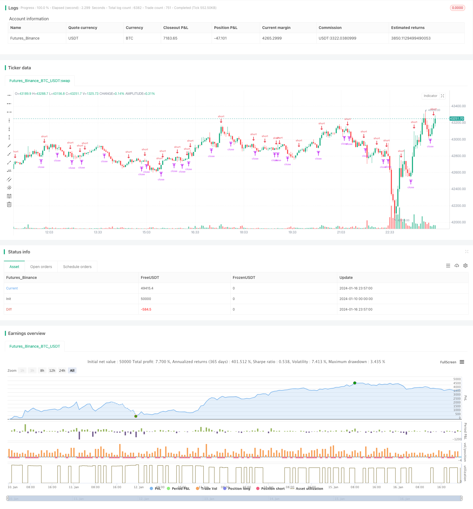

> Name

Weekly-Breakthrough-Moving-Average-Trading-Strategy
> Author

ChaoZhang

> Strategy Description



[trans]

## Overview
This strategy trades based on Bitcoin’s weekly closing price and the 8-week simple moving average. When the weekly closing price goes above the 8-week line, go long; when the weekly closing price goes below the 8-week line, close the position. At the same time, a stop-loss and stop-profit ratio is set to control risks.
## Strategy Principle
This strategy analyzes Bitcoin’s weekly market and 8-week simple moving average to determine whether the market is currently in an upward trend or a downward trend. When the weekly closing price breaks through the 8-week line upward, it means that the market has entered an upward channel, and long orders can be profitable; when the weekly closing price crosses below the 8-week line, it means that Bitcoin has entered a downward channel on a weekly basis, and previous long orders should be stopped.
Specifically, the following judgment conditions are set in the strategy:
```
buy_condition= crossover(btc,ma)#周线收盘价上穿8周线,做多 
sell_condition= crossunder(btc,ma)#周线收盘价下穿8周线,平仓
```

When the buying conditions are met, the strategy will enter the long position; when the closing conditions are met, the strategy will choose to take profit or stop loss to exit.
In addition, the strategy also sets the stop-loss and take-profit ratios:
```
loss_ratio=input(defval=1,title="LOSS RATIO", group="STRATEGY") 
reward_ratio=input(defval=3,title="REWARD RATIO", group="STRATEGY")
```

Among them, the stop loss ratio defaults to 1, and the take profit ratio defaults to 3. This means that when the closing signal comes, if the current profit is made, the profit will be stopped at 3 times of the profit; if the current loss is made, the loss will be stopped at 1 times of the loss.
## Advantage Analysis
This strategy has the following advantages:
1. Weekly operation, small retracement, suitable for long-term holding
2. 8-week line filters shocks and identifies main trends
3. Set stop loss and stop profit to control risks
## Risk Analysis
There are also some risks with this strategy:
1. Weekly operation, unable to adjust positions according to short-term market conditions
2. Breakout signals may appear as false signals
3. When the market is abnormal, the stop-loss and take-profit settings may become invalid.
Countermeasures:
1. Can be combined with other short-cycle indicators to identify short-term adjustment opportunities.
2. Add filter conditions to avoid false signals
3. Adjust the stop-loss and stop-profit ratios according to market conditions to reduce losses
## Optimization direction
This strategy can be optimized from the following aspects:
1. Add other filtering conditions to ensure the effectiveness of breakthrough signals
2. Optimize the setting of stop-loss and take-profit ratios
3. Combine short-period indicators to achieve coordination of multiple time frames
4. Use machine learning algorithms to automatically optimize parameters
## Summary
Overall, this strategy is relatively simple and direct. It judges the market trend by breaking through the average line on a weekly basis; at the same time, it sets stop loss and profit to control risks. It can be used as a reference for long-term holding of Bitcoin. However, this strategy also has certain blind spots, and subsequent improvements can be made in terms of improving signal effectiveness, optimizing parameter settings, and realizing the combination of multiple time frames.
||

## Overview
This strategy trades based on the weekly closing price of Bitcoin and the 8-week simple moving average. It goes long when the weekly closing price breaks above the 8-week line and closes the position when the weekly closing price breaks below the 8-week line. It also sets stop loss and take profit ratios to control risks.

## Strategy Logic
This strategy analyzes the weekly price action of Bitcoin and the 8-week simple moving average to judge if the market is in an uptrend or a downtrend. When the weekly closing price breaks above the 8-week line, it signals that the market has entered an uptrend channel and a long position could profit. When the weekly closing price breaks below the 8-week line, it signals that the Bitcoin weekly chart has entered a downtrend channel and existing long positions should be stopped out. 

Specifically, the following trading conditions are set in the strategy:

```
buy_condition = crossover(btc,ma) #weekly closing price breaks above 8-week line, go long
sell_condition = crossunder(btc,ma) #weekly closing price breaks below 8-week line, close position
```

When the buy condition is met, the strategy goes long. When the sell condition is triggered, the strategy exits with either take profit or stop loss.

In addition, stop loss and take profit ratios are configured: 

```
loss_ratio=input(defval=1,title="LOSS RATIO", group="STRATEGY")
reward_ratio=input(defval=3,title="REWARD RATIO", group="STRATEGY") 
```

The default stop loss ratio is 1 and default take profit ratio is 3. This means that when exit signal comes, if currently profitable, exit with 3 times profit. If currently loss, exit with 1 times loss.

## Advantage Analysis
The advantages of this strategy include:

1. Weekly timeframe, less drawdown, suitable for long term holding
2. 8-week MA filters out noise and identifies major trends 
3. Stop loss and take profit controls risk

## Risk Analysis
There are also some risks:  

1. Unable to adjust position based on short-term price action
2. Breakout signals may have false signals 
3. Stop loss/take profit may fail during extreme market events

Countermeasures:
1. Combine with other short-term indicators to catch short-term opportunities
2. Add filters to avoid false signals
3. Adjust stop loss/take profit ratios based on market conditions to limit losses

## Optimization Directions
Some ways this strategy can be improved:

1. Add additional filters to ensure valid breakout signals
2. Optimize stop loss and take profit ratios  
3. Incorporate short-term indicators for multi-timeframe analysis
4. Use machine learning to auto-optimize parameters

## Conclusion
In summary, this is a simple and straightforward strategy that judges trend based on weekly breakouts and moving average. It also controls risk via stop loss and take profit. It can serve as a reference system for long-term Bitcoin holdings. But there are some limitations that can be improved on signal quality, parameter tuning, multi-timeframe analysis etc.

[/trans]

> Strategy Arguments


|Argument|Default|Description|
|----|----|----|
|v_input_1_close|0|(?STRATEGY)source: close|high|low|open|hl2|hlc3|hlcc4|ohlc4|
|v_input_7|true|LOSS RATIO|
|v_input_8|3|REWARD RATIO|
|v_input_2|#FF3232|(?MA)COLOR|
|v_input_3|2|LINE WIDTH|
|v_input_4|#6666FF|(?GRAPHIC)COLOR|
|v_input_5|2|LINE WIDTH|
|v_input_6|2020|(?STRATEGY EXECUTION YEAR)YEAR|


> Source (PineScript)

``` pinescript
/*backtest
start: 2024-01-10 00:00:00
end: 2024-01-17 00:00:00
period: 3m
basePeriod: 1m
exchanges: [{"eid":"Futures_Binance","currency":"BTC_USDT"}]
*/

// This source code is subject to the terms of the Mozilla Public License 2.0 at https://mozilla.org/MPL/2.0/
// © taberandwords
//developer: taberandwords
//author: taberandwords
//@version=4

strategy("WEEKLY BTC TRADING SCRYPT","WBTS",overlay=false,default_qty_type=strategy.fixed)

source=input(defval=close,title="source",group="STRATEGY")

btc=security('BTCUSDT','1W', source)
ma=sma(btc,8)

buy_condition= crossover(btc,ma) 
sell_condition= crossunder(btc,ma)

ma_color=input(defval=#FF3232,title="COLOR",group="MA")
ma_linewidth=input(defval=2,title="LINE WIDTH",group="MA")
graphic_color=input(defval=#6666FF,title="COLOR",group="GRAPHIC")
graphic_linewidth=input(defval=2,title="LINE WIDTH",group="GRAPHIC")

start_date=input(defval=2020,title="YEAR",group="STRATEGY EXECUTION YEAR")

loss_ratio=input(defval=1,title="LOSS RATIO", group="STRATEGY")
reward_ratio=input(defval=3,title="REWARD RATIO", group="STRATEGY")

if(year>=start_date)
    strategy.entry('BUY',long=true,when=buy_condition,alert_message='Price came to buying value!')

    if(strategy.long)
        alert('BTC buy order trigerred!',alert.freq_once_per_bar)
    strategy.exit(id="SELL",loss=loss_ratio,profit=reward_ratio,when=sell_condition,alert_message='Price came to position closing value!')
    if(sell_condition)
        alert('BTC sell order trigerred!',alert.freq_once_per_bar)
plot(series=source,title="WEEKLY CLOSE",color=graphic_color,linewidth=graphic_linewidth)
plot(ma,title="SMA8 WEEKLY",color=ma_color,linewidth=ma_linewidth)
plot(strategy.equity,display=0)

```

> Detail

https://www.fmz.com/strategy/439195

> Last Modified

2024-01-18 11:47:25
