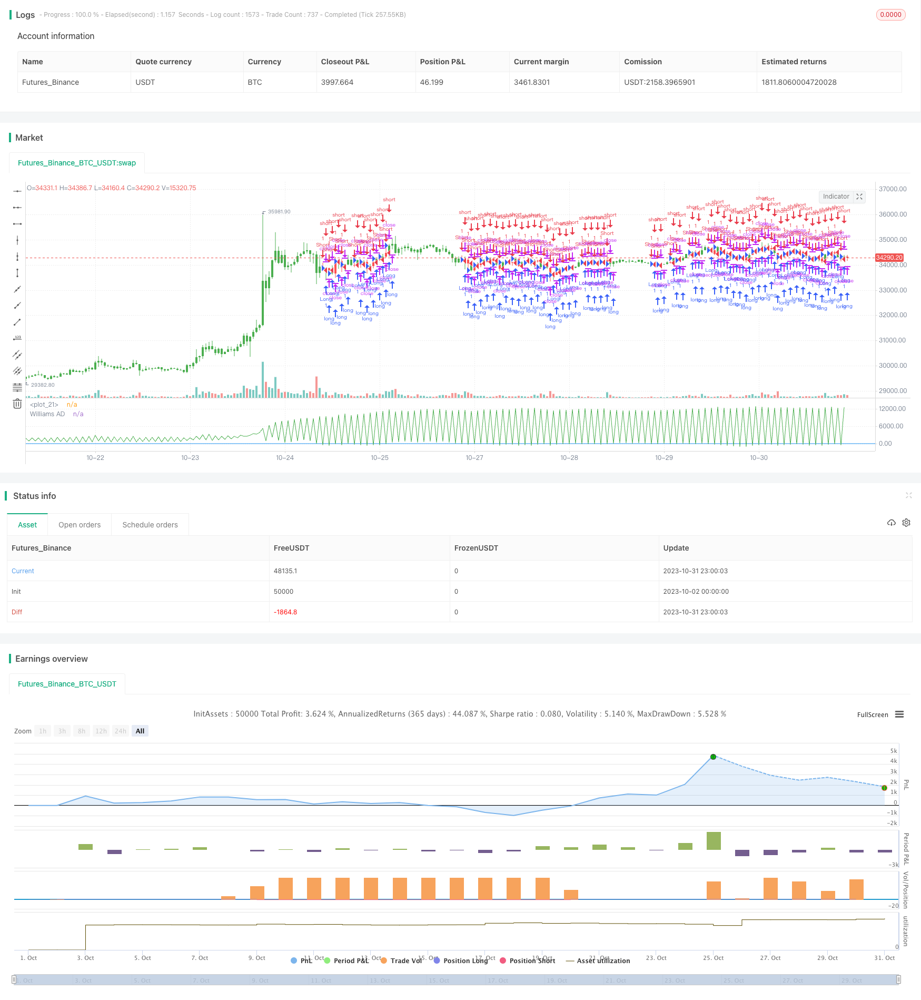

> Name

Williams-Accumulation-Distribution-Williams-AD-Strategy
> Author

ChaoZhang

> Strategy Description




[trans]

## Overview
Williams Accumulation/Distribution (Williams AD) is a technical analysis indicator that judges market buying and selling momentum by monitoring price changes and trading volume changes. This indicator is based on the assumption that trading volume usually increases in falling markets. It reflects whether the current market trend is controlled by buyers or sellers.
This strategy analyzes the value changes of the William Accumulation/Distribution indicator to determine whether the current trend is in the accumulation phase or the distribution phase, thereby generating buy and sell signals.
## Strategy Principle
The core indicator of this strategy is the Williams Accumulation/Distribution indicator (Williams AD). The calculation formula is as follows:
```
If Close > Previous Close
   Williams AD = Previous Williams AD + (Close - Low)
If Close < Previous Close
   Williams AD = Previous Williams AD + (Close - High)  
If Close == Previous Close
   Williams AD = Previous Williams AD
```

Among them, if today's closing price is higher than yesterday, then today's AD value is equal to yesterday's AD value plus the difference between "today's close - today's low". If today's closing price is lower than yesterday, today's AD value is equal to yesterday's AD value plus the difference of "today's close - today's high".
This indicator reflects the power relationship in trading. The main judgment rules are as follows:
- The AD indicator rises, which represents the increase in buyer power and is an accumulation market.
- The AD indicator falls, which means that the seller's power has increased, which is a distribution market.
When the stock price reaches a new high but the AD indicator does not reach a new high, it is regarded as a distribution signal and goes short. When the stock price hits a new low but the AD indicator does not hit a new low, it is regarded as an accumulation signal and goes long.
According to this judgment rule, the specific trading signal generation rules of this strategy are:
- AD > 0, generates a long signal
- AD < 0, generates a short signal
And you can reverse the long and short direction by inputting the parameter reverse.
## Strategic advantage analysis
This strategy has the following advantages:
1. Using the William accumulation/distribution indicator to judge market trading strength can improve your trading winning rate.
2. The indicator calculation method is simple and easy to implement.
3. It can flexibly adapt to different market conditions by inverting parameters.
4. By monitoring the divergence between indicators and prices, more accurate trading signals can be generated.
5. The current market momentum can be clearly and intuitively displayed through the K-line color.
## Risk Analysis
This strategy also has the following risks:
1. There is a lag in the William Accumulation/Distribution indicator and may produce false signals.
2. Relying only on one indicator is susceptible to false breakthroughs and other factors, and signals are generated too frequently.
3. Improper parameter settings may lead to too frequent transactions.
4. It is necessary to combine other factors to determine the timing of buying and selling.
5. When converting between bull and bear, there may be misunderstandings in indicator judgment.
Risks can be reduced by optimizing parameter settings, combining multiple indicator confirmations, and appropriately filtering the number of transactions.
## Strategy optimization direction
This strategy can be optimized from the following aspects:
1. Add parameters for optimization, such as setting trading range, trading frequency, etc.
2. Filter in combination with other indicators to avoid false signals, such as volume and price indicators, moving averages, etc.
3. Add a stop loss strategy to control single losses.
4. Carry out parameter training and find the optimal parameter combination.
5. Combined with machine learning algorithms to achieve dynamic parameter optimization.
6. Test the robustness of the strategy in market environments such as different varieties and cycles.
7. Construct a simulated trading system for backtesting and evaluate the risk and return of the strategy.
## Summarize
William's accumulation/distribution indicator strategy determines the direction of market strength through the long and short changes in the indicator. It has the characteristics of simple generation of trading signals and flexible parameter settings. However, as a single technical indicator strategy, it has certain inherent flaws and requires multi-dimensional optimization and verification with other technical means in order to achieve stable profits in the real market. This strategy provides a reference for judging market buying and selling strength, but caution is required when trading.
||

## Overview

The Williams Accumulation/Distribution Indicator (Williams AD) is a technical analysis indicator that monitors price changes and trading volumes to determine market sentiment. This indicator is based on Williams' assumption that volume tends to increase in a falling market. It reflects whether the current market trend is controlled by buyers or sellers.

This strategy analyzes the changes in the values of the Williams Accumulation/Distribution indicator to determine whether the current trend is in an accumulation phase or a distribution phase, thereby generating buy and sell signals.

## Strategy Logic

The core indicator of this strategy is the Williams Accumulation/Distribution (Williams AD). The calculation formula is as follows:

```
If Close > Previous Close
   Williams AD = Previous Williams AD + (Close - Low)  
If Close < Previous Close
   Williams AD = Previous Williams AD + (Close - High)
If Close == Previous Close
   Williams AD = Previous Williams AD
```

Where if today's close is higher than yesterday's, today's AD value is equal to yesterday's AD value plus the difference between "today's close - today's low". If today's close is lower than yesterday's, today's AD value is equal to yesterday's AD value plus the difference between "today's close - today's high".

This indicator reflects the power relationship in trading. The main judgment rules are as follows:

- Rising AD indicates increasing buying power, which is an accumulation trend.  
- Falling AD indicates increasing selling power, which is a distribution trend.

When the security price hits a new high and the AD indicator does not hit a new high, it is considered a distribution signal to go short. When the security price hits a new low and the AD indicator does not hit a new low, it is considered an accumulation signal to go long.

According to these rules, the specific trading signal generation rules for this strategy are:

- AD > 0, generate long signal
- AD < 0, generate short signal

The long and short direction can be reversed through the input parameter "reverse".

## Advantage Analysis

The advantages of this strategy include:

1. Using Williams AD to judge market sentiment can improve win rate.

2. The indicator calculation is simple and easy to implement. 

3. The reverse parameter allows flexible adaptation to different market conditions.

4. Divergence between indicator and price can generate relatively accurate trading signals.

5. Market sentiment can be clearly visualized through candlestick colors.

## Risk Analysis

This strategy also has the following risks:

1. Williams AD has lagging issues which may generate wrong signals.

2. Relying solely on one indicator can be affected by false breakouts and generate too frequent signals.

3. Improper parameter settings may lead to over-trading.

4. Other factors need to be considered to determine entry and exit timing. 

5. Indicator judgements may be problematic around trend reversals.

Risks can be reduced through optimizing parameters, combining multiple indicators for confirmation, filtering trade frequency, etc.

## Optimization Directions

This strategy can be optimized in the following aspects:

1. Add more parameters for optimization, such as trading range, frequency, etc.

2. Combine with other indicators for signal filtering, such as volume-price indicators, moving averages, etc.

3. Add stop loss strategies to control single trade loss. 

4. Conduct parameter training to find optimal parameter combinations.

5. Incorporate machine learning algorithms for dynamic parameter optimization.

6. Test robustness across different products, timeframes, market environments.

7. Build backtesting system to evaluate strategy's risk-reward profile.

## Conclusion

The Williams AD strategy judges market sentiment based on indicator direction changes. It has the advantages of simple signal generation and flexible parameter tuning. But as a single indicator strategy, it has inherent limitations and needs multi-dimensional optimizations and additional techniques for verification before stable profitability in live trading. It provides reference for judging market sentiment but still requires prudent trading.

[/trans]

> Strategy Arguments


|Argument|Default|Description|
|----|----|----|
|v_input_1|false|Trade reverse|


> Source (PineScript)

``` pinescript
/*backtest
start: 2023-10-02 00:00:00
end: 2023-11-01 00:00:00
period: 1h
basePeriod: 15m
exchanges: [{"eid":"Futures_Binance","currency":"BTC_USDT"}]
*/

//@version=2
////////////////////////////////////////////////////////////
//  Copyright by HPotter v1.0 18/01/2018
// Accumulation is a term used to describe a market controlled by buyers;
// whereas distribution is defined by a market controlled by sellers.
// Williams recommends trading this indicator based on divergences:
//
//  Distribution of the security is indicated when the security is making 
//  a new high and the A/D indicator is failing to make a new high. Sell.
//
//  Accumulation of the security is indicated when the security is making 
//  a new low and the A/D indicator is failing to make a new low. Buy.
//
//You can change long to short in the Input Settings
//WARNING:
//- For purpose educate only
//- This script to change bars colors.
////////////////////////////////////////////////////////////
strategy(title="Williams Accumulation/Distribution (Williams AD)", shorttitle="Williams AD")
reverse = input(false, title="Trade reverse")
hline(0, color=blue, linestyle=line)
xPrice = close
xWAD = iff(close > nz(close[1], 0), nz(xWAD[1],0) + close - low[1], 
         iff(close < nz(close[1],0), nz(xWAD[1],0) + close - high[1],0))
pos = iff(xWAD > 0, 1,
       iff(xWAD < 0, -1, nz(pos[1], 0))) 
possig = iff(reverse and pos == 1, -1,
          iff(reverse and pos == -1, 1, pos))	   
if (possig == 1) 
    strategy.entry("Long", strategy.long)
if (possig == -1)
    strategy.entry("Short", strategy.short)	   	    
barcolor(possig == -1 ? red: possig == 1 ? green : blue )        
plot(xWAD, color=green, title="Williams AD")
```

> Detail

https://www.fmz.com/strategy/430903

> Last Modified

2023-11-02 17:25:51
