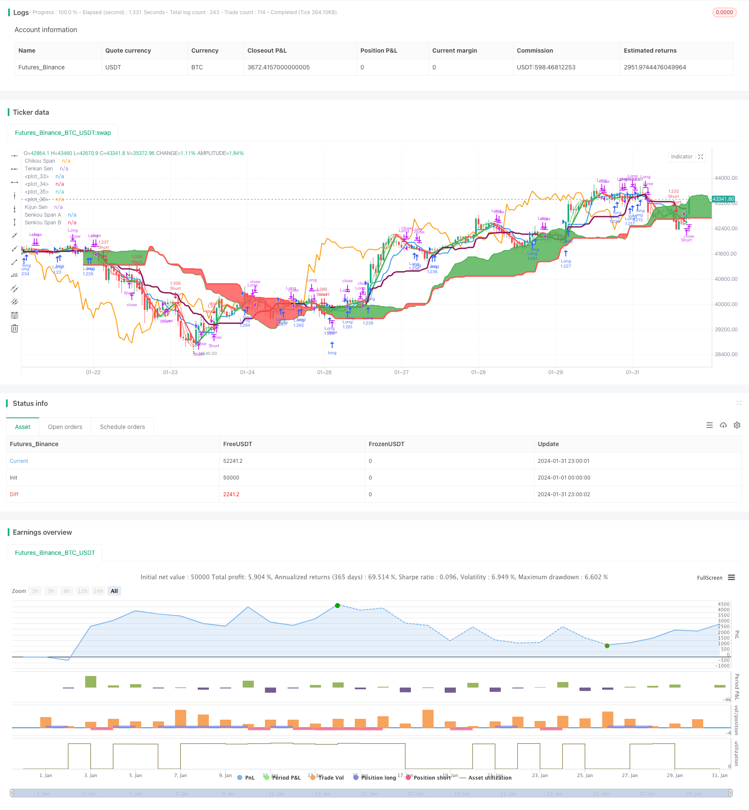

> Name

Williams-Double-Exponential-Moving-Average-and-Ichimoku-Kinkou-Hyo-Strategy
> Author

ChaoZhang

> Strategy Description


[trans]
### Overview
This strategy combines two technical indicators, the William Double Exponential Moving Average and the Ichimoku Balance Chart, to leverage their respective advantages and improve the accuracy of trading decisions. Among them, the William Double Exponential Moving Average can fully reflect the price change trend, and the Ichimoku Balance Chart can judge trend reversal in advance.
### Principle
The William Double Exponential Moving Average contains a fast line and a slow line. The fast line calculation formula is: 2* (n/2 period weighted moving average), and the slow line calculation formula is: n period weighted moving average. When the fast line breaks through the slow line from below, it is a buy signal; when it breaks down from above, it is a sell signal.
The Ichimoku balance chart consists of four components: change of hands line, baseline line, leading line and cloud chart. Among them, the golden cross between the change of hands line and the baseline is a buy signal, and the death cross is a sell signal. When the price breaks through the upper edge of the cloud chart, it is a buy signal, and when the price falls below the lower edge of the cloud chart, it is a sell signal.
This strategy combines the advantages of two indicators. The first judgment is that the William indicator sends a signal, and the second judgment is that the Ichimoku equilibrium chart indicator confirms, which can effectively filter out false signals and improve the accuracy of decision-making.
### Advantages
1. The William Double Exponential Moving Average is responsive and can determine the direction of a strong trend.
2. The Ichimoku balance chart is used to judge the trend first, and the trend reversal can be judged in advance.
3. Combining two indicators can verify each other and reduce false signals.
4. Through parameter optimization, it can adapt to different cycles and varieties.
### Risk and Optimization
1. Frequent signals may occur in non-trending markets. Parameters can be adjusted appropriately to filter out some signals.
2. There will be a certain lag when the fast line and the slow line cross. It can be combined with cloud chart judgment to avoid missing the best buying and selling points.
3. It is recommended to use it in combination with trend indicators or fluctuation indicators to further avoid false signals.
### Summarize
This strategy makes full use of the William indicator to determine the trend direction and the Ichimoku equilibrium chart to see reversals in advance, which can significantly improve the accuracy of trading decisions. By adjusting parameters and combining other indicators, the strategy can be continuously optimized to make it more adaptable to market changes.
||

### Overview  

This strategy combines the Williams Double Exponential Moving Average and Ichimoku Kinkou Hyo, two technical indicators, in order to utilize their respective advantages and improve the accuracy of trading decisions. The Williams Double Exponential Moving Average can fully reflect trends in price changes, while Ichimoku Kinkou Hyo can provide early warnings of trend reversals.  

### Principles

The Williams Double Exponential Moving Average contains a fast line and a slow line. The fast line is calculated with the formula: 2*(n/2 period Weighted Moving Average), and the slow line is calculated with: n period Weighted Moving Average. When the fast line crosses above the slow line from below, it is a buy signal; when it crosses below from above, it is a sell signal.

Ichimoku Kinkou Hyo consists of four components: the tenkan sen, kijun sen, leading line and cloud layers. A golden cross between the tenkan sen and kijun sen is a buy signal, while a death cross is a sell signal. When prices break above or below the upper or lower edges of the cloud layers, it signals a buy or sell, respectively.

This strategy combines the strengths of both indicators. The first determinant is a signal from the Williams Indicator, and the second is confirmation from Ichimoku Kinkou Hyo, effectively filtering out false signals and improving decision accuracy.

### Advantages  

1. The Williams Double Exponential Moving Average reacts sensitively and can determine a strong trend direction.
2. Ichimoku Kinkou Hyo provides leading judgments and early warnings of trend reversals.  
3. Combining the two indicators allows them to validate each other and reduce false signals.
4. Parameters can be optimized for adaption to different cycle lengths and products.

### Risks and Optimization

1. Frequent signals may occur in non-trending markets. Parameters can be adjusted to filter out some signals.
2. There may be some lag in crossovers between the fast and slow lines. Cloud layers can be referenced to avoid missing optimal entry and exit points.
3. It is recommended to combine with trend or volatility indicators to further avoid false signals.  

### Summary  

This strategy fully utilizes the abilities of the Williams Indicator to judge trend directions and Ichimoku Kinkou Hyo to provide early warnings of reversals, significantly improving the accuracy of trading decisions. Further optimizations such as parameter tuning and combining with other indicators will allow sustainable enhancements for adapting to market changes.

[/trans]

> Strategy Arguments


|Argument|Default|Description|
|----|----|----|
|v_input_1|12|Double HullMA|
|v_input_2|9|Tenkan Sen Periods|
|v_input_3|24|Kijun Sen Periods|
|v_input_4|51|Senkou Span B Periods|
|v_input_5|24|Displacement|


> Source (PineScript)

``` pinescript
/*backtest
start: 2024-01-01 00:00:00
end: 2024-01-31 23:59:59
period: 1h
basePeriod: 15m
exchanges: [{"eid":"Futures_Binance","currency":"BTC_USDT"}]
*/

//@version=3

strategy("Hull MA-X + Ichimoku Kinko Hyo", shorttitle="Hi", overlay=true, default_qty_type=strategy.percent_of_equity, max_bars_back=1000, default_qty_value=100, calc_on_order_fills= true, calc_on_every_tick=true, pyramiding=0)

keh=input(title="Double HullMA",defval=12, minval=1)
n2ma=2*wma(close,round(keh/2))
nma=wma(close,keh)
diff=n2ma-nma
sqn=round(sqrt(keh))
n2ma1=2*wma(close[1],round(keh/2))
nma1=wma(close[1],keh)
diff1=n2ma1-nma1
sqn1=round(sqrt(keh))
n1=wma(diff,sqn)
n2=wma(diff1,sqn)
b=n1>n2?lime:red
c=n1>n2?green:red
d=n1>n2?red:green

TenkanSenPeriods = input(9, minval=1, title="Tenkan Sen Periods")
KijunSenPeriods = input(24, minval=1, title="Kijun Sen Periods")
SenkouSpanBPeriods = input(51, minval=1, title="Senkou Span B Periods")
displacement = input(24, minval=1, title="Displacement")
donchian(len) => avg(lowest(len), highest(len))
TenkanSen = donchian(TenkanSenPeriods)
KijunSen = donchian(KijunSenPeriods)
SenkouSpanA = avg(TenkanSen, KijunSen)
SenkouSpanB = donchian(SenkouSpanBPeriods)
SenkouSpanH = max(SenkouSpanA[displacement - 1], SenkouSpanB[displacement - 1])
SenkouSpanL = min(SenkouSpanA[displacement - 1], SenkouSpanB[displacement - 1])
ChikouSpan = close[displacement-1]

Hullfast=plot(n1,color=c)
Hullslow=plot(n2,color=c)
plot(cross(n1, n2) ? n1:na, style = circles, color=b, linewidth = 4)
plot(cross(n1, n2) ? n1:na, style = line, color=d, linewidth = 3)
plot(TenkanSen, color=blue, title="Tenkan Sen", linewidth = 2)
plot(KijunSen, color=maroon, title="Kijun Sen", linewidth = 3)
plot(close, offset = -displacement, color=orange, title="Chikou Span", linewidth = 2)
sa=plot (SenkouSpanA, offset = displacement, color=green,  title="Senkou Span A", linewidth = 2)
sb=plot (SenkouSpanB, offset = displacement, color=red,  title="Senkou Span B", linewidth = 3)
fill(sa, sb, color = SenkouSpanA > SenkouSpanB ? green : red)

longCondition = n1>n2 and close>n2 and close>ChikouSpan and close>SenkouSpanH and (TenkanSen>KijunSen or close>KijunSen)
if (longCondition)
    strategy.entry("Long",strategy.long)

shortCondition = n1<n2 and close<n2 and close<ChikouSpan and close<SenkouSpanL and (TenkanSen<KijunSen or close<KijunSen)
if (shortCondition)
    strategy.entry("Short",strategy.short)

closelong = n1<n2 and close<n2 and (TenkanSen<KijunSen or close<TenkanSen or close<KijunSen or close<SenkouSpanL)
if (closelong)
    strategy.close("Long")

closeshort = n1>n2 and close>n2 and (TenkanSen>KijunSen or close>TenkanSen or close>KijunSen or close>SenkouSpanH)
if (closeshort)
    strategy.close("Short")
```

> Detail

https://www.fmz.com/strategy/442018

> Last Modified

2024-02-18 16:20:12
