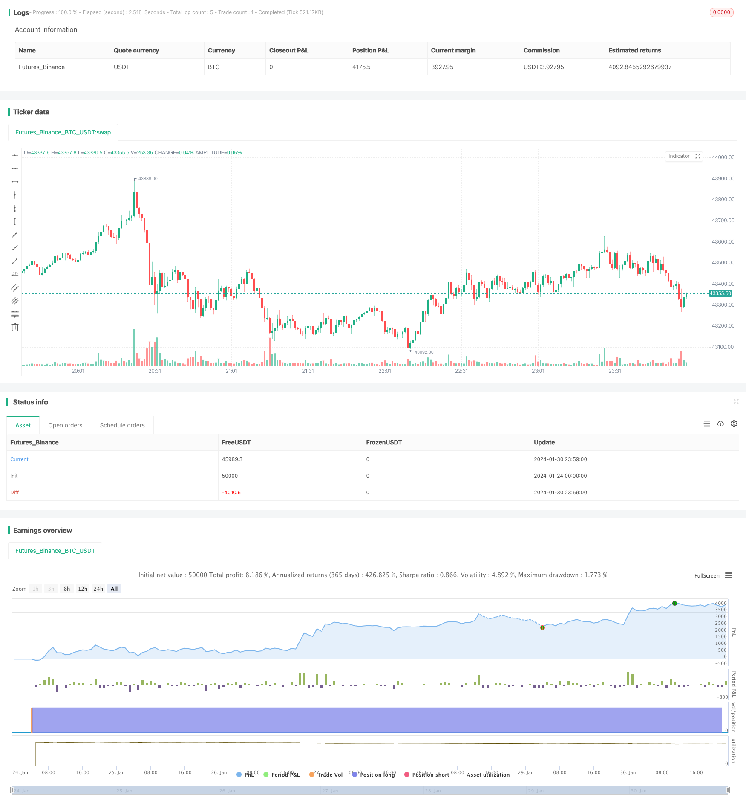

> Name

Yin-Yang-Hanging-Man-Strategy
> Author

ChaoZhang

> Strategy Description


[trans]
### Overview
The Yin Yang hanging neck strategy is a quantitative trading strategy based on the hanging neck pattern. This strategy generates trading signals by identifying candlestick patterns in candlestick charts. When the hanging neck line pattern is identified, if it is a positive hanging neck line, a buy signal is generated; if it is a negative hanging neck line, a sell signal is generated.
### Strategy Principles
The core identification condition of the Yin-Yang hanging neck strategy is the hanging neck shape with a small candle body and long upper and lower shadow lines. Specifically, the conditions for identifying hanging wires are as follows:
1. The size of the candle line (the difference between the opening price and the closing price) must be smaller than the threshold (dojiThreshold)
2. The size of the upper shadow line should be greater than twice the size of the candle line body.
3. The size of the lower shadow line should also be greater than twice the size of the candle line body.
If the above conditions are met, it can be identified as a hanging neck line pattern. In addition, according to the size relationship between the upper and lower shadow lines, more specific hanging neck line categories can be distinguished, such as positive hanging neck, negative hanging neck, long-leg hanging neck, etc. After identifying the hanging neck line pattern, the strategy will generate a trading signal on the next K line, that is, the positive line hanging neck will generate a buy signal, and the negative line hanging neck will generate a sell signal.
### Advantage Analysis
The Yin Yang Hanging Line strategy has the following main advantages:
1. The rules are simple and clear, easy to understand and implement
2. The hanging neck line represents the signal of market power game and trend conversion. Capturing the turning point can obtain better returns.
3. Can filter trading signals based on trends, support, resistance and other factors to improve strategy stability
However, the Yin-Yang hanging neck line strategy also has some limitations, which are mainly reflected in the following aspects:
1. The hanging neck pattern appears less frequently and it is easy to miss trading opportunities.
2. A single technical indicator can easily produce false signals
3. Unable to effectively respond to sudden and large fluctuations in violent market conditions
### Risk Analysis
The main risks of the Yin Yang Hanging Line strategy come from the following aspects:
1. The risk of error in judging the shape of the hanging neck line. Due to the subjectivity of human judgment of forms, it is easy to miss or misjudge forms.
2. Risks caused by false penis hanging and false vagina hanging. It is easy to misjudge short-term small fluctuations as important signals. 
3. Risk of volatile market conditions. During the shock period, it is difficult to make profits through the hanging neck line.
4. Risks in setting key parameters. If the threshold is set too wide or too narrow, it will affect the strategy's return rate.
In addition, a single technical indicator strategy cannot effectively filter market noise and can easily produce misleading signals. Therefore, the risks and fluctuations of the Yin Yang Hanging Line strategy are relatively large, and risk management needs to be strengthened.
### Optimization direction
In order to control risks, the Yin-Yang hanging neckline strategy can be further optimized from the following aspects:
1. Set pre-trade conditions, such as filtering with trend indicators; set conditions for breaking through the previous high point to confirm trend turning.
2. Combine with other technical indicators to judge the strength. For example, the amplification of trading volume can verify the importance.
3. Automatically optimize key parameter settings through machine learning and other methods.
4. Use stop loss to control single losses.
Through the above improvements, the risk of the hanging neck strategy can be greatly reduced and the stability of the strategy can be improved.
### Summarize
The Yin-Yang hanger strategy generates trading signals by identifying hanger patterns in candlestick charts. It has the advantages of simple rules and capturing turning points, but it also has the risk of generating false signals. This strategy can control risks and improve stability and practical effects through parameter optimization and adding filter conditions. But even so, as a single technical indicator strategy, it is still highly sensitive to market noise and has greater risks, so it needs to be treated with caution.
||

### Overview

The Yin Yang Hanging Man strategy is a quantitative trading strategy based on the hanging man candlestick pattern. This strategy generates trading signals by identifying hanging man patterns in candlestick charts. When a hanging man pattern is identified, a buy signal is generated for a bullish hanging man, while a sell signal is generated for a bearish hanging man.

### Strategy Logic

The core identification condition of the Yin Yang Hanging Man strategy is the hanging man candlestick pattern with a small real body and long upper/lower shadows. Specifically, the identification conditions for a hanging man are:  

1. The real body size (difference between opening price and closing price) is smaller than the threshold (dojiThreshold)
2. The upper shadow size is more than twice the real body size  
3. The lower shadow size is also more than twice the real body size

When the above conditions are met, the pattern can be identified as a hanging man. Moreover, more specific types of hanging mans like bullish/bearish or long-legged can be distinguished based on the relative sizes of the upper and lower shadows. After identifying the pattern, the strategy generates trading signals on the next candlestick, i.e. buy on bullish hanging man, sell on bearish hanging man.

### Advantage Analysis  

The Yin Yang Hanging Man strategy has the following main advantages:

1. Simple and clear rules that are easy to understand and implement  
2. Hanging mans represent tussles in market force and trend reversals, capturing turning points can yield good returns
3. Can combine with factors like trend, support/resistance to filter signals and improve stability

However, there are some limitations to the strategy as well:

1. Low frequency of hanging man patterns, tends to miss trading opportunities  
2. Single indicator prone to false signals
3. Ineffective in extreme volatility and violent trend swings

### Risk Analysis   

The main risks of this strategy stem from:  

1. Risk of errors in pattern identification due to subjectivity
2. Risk from false bullish/bearish hanging signal on minor fluctuations
3. Risk in range-bound markets with difficulty profiting from patterns  
4. Risk from suboptimal parameter settings like threshold levels

Also, single indicator strategies cannot filter market noise effectively and can generate misleading signals. So the Yin Yang strategy has relatively large risks and fluctuations that necessitate robust risk management.  

### Optimization Directions   

To control risks, the strategy can be improved in the following ways:

1. Adding trade prerequisites like filters based on trend indicators or breakthrough of previous peak to confirm trend reversal   
2. Incorporating other indicators like trading volumes to gauge signal importance
3. Automated optimization of key parameters via machine learning etc
4. Mitigating losses through stop loss

With these enhancements, the risks can be reduced significantly while improving stability of the Yin Yang hanging man strategy.  

### Conclusion

To summarize, the Yin Yang Hanging Man strategy generates trade signals by identifying hanging man patterns in candlestick charts. It has the advantage of simple rules and catching reversals but also risks of false signals. The risks can be controlled through parameter tuning, adding filters etc but sensitivity to noise and fluctuations remains high. So the strategy warrants prudent application despite enhancements.

[/trans]


> Source (PineScript)

``` pinescript
/*backtest
start: 2024-01-24 00:00:00
end: 2024-01-31 00:00:00
period: 1m
basePeriod: 1m
exchanges: [{"eid":"Futures_Binance","currency":"BTC_USDT"}]
*/

//@version=5
strategy("Doji Candlestick Strategy", shorttitle="Doji", overlay=true)

// Calculate body and shadow sizes
bodySize = close > open ? close - open : open - close
upperShadow = high - (open > close ? open : close)
lowerShadow = (open > close ? close : open) - low

// Define thresholds for identifying different Doji types
dojiThreshold = 0.05
longLeggedDojiThreshold = 0.02

// Buy conditions for different Doji types
dojiCondition = bodySize <= dojiThreshold and upperShadow > bodySize * 2 and lowerShadow > bodySize * 2
dragonflyDojiCondition = bodySize <= dojiThreshold and upperShadow > bodySize * 2 and lowerShadow <= bodySize * 0.5
gravestoneDojiCondition = bodySize <= dojiThreshold and upperShadow <= bodySize * 0.5 and lowerShadow > bodySize * 2
longLeggedDojiCondition = bodySize <= longLeggedDojiThreshold and upperShadow > bodySize * 2 and lowerShadow > bodySize * 2

// Buy signal
buyCondition = dojiCondition or dragonflyDojiCondition or gravestoneDojiCondition or longLeggedDojiCondition

// Strategy orders
strategy.entry("Buy", strategy.long, when=buyCondition)

// Plotting
plotshape(series=buyCondition, title="Buy Signal", color=color.green, style=shape.triangleup, location=location.belowbar, size=size.small)

```

> Detail

https://www.fmz.com/strategy/440692

> Last Modified

2024-02-01 11:09:15
