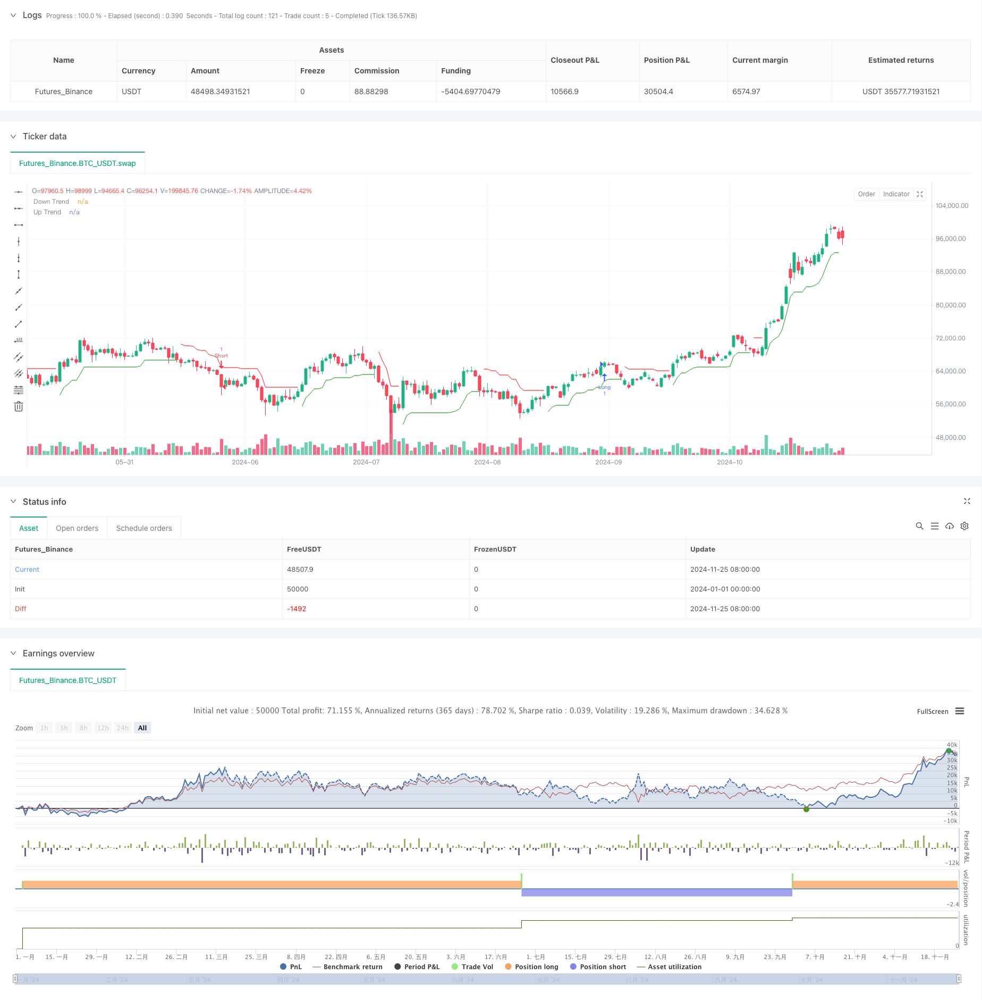

> Name

Dynamic trading strategy long-short switching system based on Z-Score and Supertrend-Z-Score-and-Supertrend-Based-Dynamic-Trading-Strategy-Long-Short-Switching-System
> Author

ChaoZhang

> Strategy Description



[trans]
#### Overview
This strategy is a quantitative trading system that combines the Z-Score statistical method, the Relative Strength Index (RSI) and the Supertrend indicator. The strategy looks for high-probability trading opportunities in the market by monitoring the statistical deviation of prices, combined with momentum indicators and trend confirmation. This strategy can not only capture overbought and oversold opportunities in the market, but also filter false signals through trend confirmation and achieve long and short two-way trading.
#### Strategy Principle
The core logic of the strategy is built on the synergy of three main technical indicators: First, the deviation of the current price from the historical mean is measured by calculating the Z-score of the price, which uses a 75-period moving average and standard deviation. When the Z-score exceeds 1.1 or falls below -1.1, it indicates a statistically significant deviation in price. Secondly, the RSI indicator is introduced as momentum confirmation, which requires that RSI needs to match the direction when opening a position (RSI>60 when long, RSI<40 when short). Finally, use the Super Trend indicator as a trend filter, which is calculated based on an 11-period ATR and a multiplier factor of 2.0. Only when these three conditions are met at the same time, the strategy will issue a trading signal.
#### Strategic Advantages
1. Multiple signal confirmation: By combining indicators from three dimensions: statistics, momentum and trend, the reliability of trading signals is greatly improved.
2. Adaptable: The Z-score calculation method enables the strategy to adapt to different market environments without being affected by the absolute price level.
3. Improved risk control: Super trend indicators provide automatic trend tracking and risk control mechanisms.
4. Two-way trading: The strategy can capture opportunities in both long and short directions, improving the efficiency of capital utilization.
5. Clear signals: The strategy uses clear mathematical models and objective indicators to avoid subjective judgments.
#### Strategy Risk
1. Lagging risk: Due to the use of multiple period moving averages, the strategy may experience signal lag in rapidly changing markets.
2. False breakthrough risk: In sideways markets, frequent false breakthrough signals may appear.
3. Parameter sensitivity: The effect of the strategy is highly dependent on the selection of parameters. Different market environments may require different parameter settings.
4. Dependence on market conditions: In markets where the trend is not obvious, the performance of the strategy may not be ideal.
#### Strategy optimization direction
1. Dynamic parameter adjustment: An adaptive parameter mechanism can be introduced to automatically adjust the Z score threshold and super trend parameters according to market volatility.
2. Add market environment filtering: Add the market environment identification module and use different parameter combinations under different market conditions.
3. Improve the stop loss mechanism: introduce dynamic stop loss strategies, such as ATR-based stop loss or trailing stop loss.
4. Optimize signal filtering: Volume confirmation or other technical indicators can be added to further filter trading signals.
5. Introduce time filtering: Consider increasing restrictions on trading time windows to avoid periods of greater volatility.
#### Summary
This is a quantitative trading strategy that combines statistical methods and technical analysis to improve the reliability of transactions through multiple signal confirmations. The core advantage of the strategy lies in its objective mathematical model and complete risk control mechanism, but at the same time, attention must be paid to parameter optimization and market adaptability. Through the suggested optimization directions, there is room for further improvement of the strategy, especially in terms of dynamic adaptation to the market environment and risk control. This strategy is suitable for use in markets with high volatility and obvious trends. It is an option worth considering for quantitative traders who pursue stable returns. ||
#### Overview
This strategy is a quantitative trading system that combines Z-Score statistical methods, Relative Strength Index (RSI), and Supertrend indicators. The strategy monitors statistical price deviations, combines momentum indicators and trend confirmation to identify high-probability trading opportunities in the market. This strategy not only captures market overbought and oversold opportunities but also filters false signals through trend confirmation, enabling two-way trading.

#### Strategy Principle
The core logic of the strategy is built on the synergy of three main technical indicators: First, it calculates the Z-score of prices to measure the current price's deviation from its historical mean, using a 75-period moving average and standard deviation. When the Z-score exceeds 1.1 or falls below -1.1, it indicates significant statistical deviation. Second, the RSI indicator is introduced as momentum confirmation, requiring RSI to align with the direction (RSI>60 for long positions, RSI<40 for short positions). Finally, the Supertrend indicator serves as a trend filter, calculated based on an 11-period ATR and a multiplier factor of 2.0. Trading signals are only generated when all three conditions are simultaneously satisfied.

#### Strategy Advantages
1. Multiple Signal Confirmation: Combining indicators from statistical, momentum, and trend dimensions greatly improves the reliability of trading signals.
2. High Adaptability: The Z-score calculation method allows the strategy to adapt to different market environments, independent of absolute price levels.
3. Comprehensive Risk Control: The Supertrend indicator provides automatic trend following and risk control mechanisms.
4. Bilateral Trading: The strategy can capture opportunities in both long and short directions, improving capital utilization efficiency.
5. Clear Signals: The strategy uses clear mathematical models and objective indicators, avoiding subjective judgment.

#### Strategy Risks
1. Lag Risk: Due to the use of multiple period moving averages, the strategy may experience signal delays in rapidly changing markets.
2. False Breakout Risk: Frequent false breakout signals may occur in ranging markets.
3. Parameter Sensitivity: The strategy's effectiveness highly depends on parameter selection, different market environments may require different parameter settings.
4. Market Condition Dependency: The strategy's performance may not be ideal in markets without clear trends.

#### Strategy Optimization Directions
1. Dynamic Parameter Adjustment: Introduce adaptive parameter mechanisms to automatically adjust Z-score thresholds and Supertrend parameters based on market volatility.
2. Enhanced Market Environment Filtering: Add market environment recognition modules to use different parameter combinations under different market conditions.
3. Improved Stop Loss Mechanism: Introduce dynamic stop-loss strategies, such as ATR-based stops or trailing stops.
4. Optimized Signal Filtering: Add volume confirmation or other technical indicators to further filter trading signals.
5. Time-Based Filtering: Consider adding trading time window restrictions to avoid highly volatile periods.

#### Summary
This is a quantitative trading strategy that combines statistical methods and technical analysis, using multiple signal confirmations to improve trading reliability. The strategy's core advantages lie in its objective mathematical model and comprehensive risk control mechanisms, while attention must be paid to parameter optimization and market adaptability. Through the suggested optimization directions, there is room for further improvement, especially in dynamically adapting to market environments and risk control. This strategy is suitable for markets with high volatility and clear trends, making it a worthy consideration for quantitative traders pursuing steady returns.[/trans]


> Source (PineScript)

``` pinescript
/*backtest
start: 2024-01-01 00:00:00
end: 2024-11-26 00:00:00
period: 1d
basePeriod: 1d
exchanges: [{"eid":"Futures_Binance","currency":"BTC_USDT"}]
*/

//@version=5
strategy("Z-Score Long and Short Strategy with Supertrend", overlay=true)

// Inputs for Z-Score
len = input.int(75, "Z-Score Lookback Length")
z_long_threshold = 1.1  // Threshold for Z-Score to open long
z_short_threshold = -1.1  // Threshold for Z-Score to open short

// Z-Score Calculation
z = (close - ta.sma(close, len)) / ta.stdev(close, len)

// Calculate Driver RSI
driver_rsi_length = input.int(14, "Driver RSI Length")  // Input for RSI Length
driver_rsi = ta.rsi(close, driver_rsi_length)  // Calculate the RSI

// Supertrend Parameters
atrPeriod = input.int(11, "ATR Length", minval=1)
factor = input.float(2.0, "Factor", minval=0.01, step=0.01)

// Supertrend Calculation
[supertrend, direction] = ta.supertrend(factor, atrPeriod)

// Conditions for Long and Short based on Z-Score
z_exceeds_long = z >= z_long_threshold and driver_rsi > 60
z_exceeds_short = z <= z_short_threshold and driver_rsi < 40

// Entry Conditions
if (z_exceeds_long and direction < 0) // Enter Long if Z-Score exceeds threshold and Supertrend is down
    strategy.entry("Long", strategy.long)
    label.new(bar_index, low, text="Open Long", style=label.style_label_up, color=color.green, textcolor=color.white, size=size.small)
    alert("Open Long", alert.freq_once_per_bar)  // Alert for Long entry

if (z_exceeds_short and direction > 0) // Enter Short if Z-Score exceeds threshold and Supertrend is up
    strategy.entry("Short", strategy.short)
    label.new(bar_index, high, text="Open Short", style=label.style_label_down, color=color.red, textcolor=color.white, size=size.small)
    alert("Open Short", alert.freq_once_per_bar)  // Alert for Short entry

// Plot Supertrend
upTrend = plot(direction < 0 ? supertrend : na, "Up Trend", color=color.green, style=plot.style_linebr)
downTrend = plot(direction > 0 ? supertrend : na, "Down Trend", color=color.red, style=plot.style_linebr)
fill(upTrend, downTrend, color=color.new(color.green, 90), fillgaps=false)

// Alert conditions for Supertrend changes (optional)
alertcondition(direction[1] > direction, title='Downtrend to Uptrend', message='The Supertrend value switched from Downtrend to Uptrend')
alertcondition(direction[1] < direction, title='Uptrend to Downtrend', message='The Supertrend value switched from Uptrend to Downtrend')

```

> Detail

https://www.fmz.com/strategy/473141

> Last Modified

2024-11-27 16:01:20
