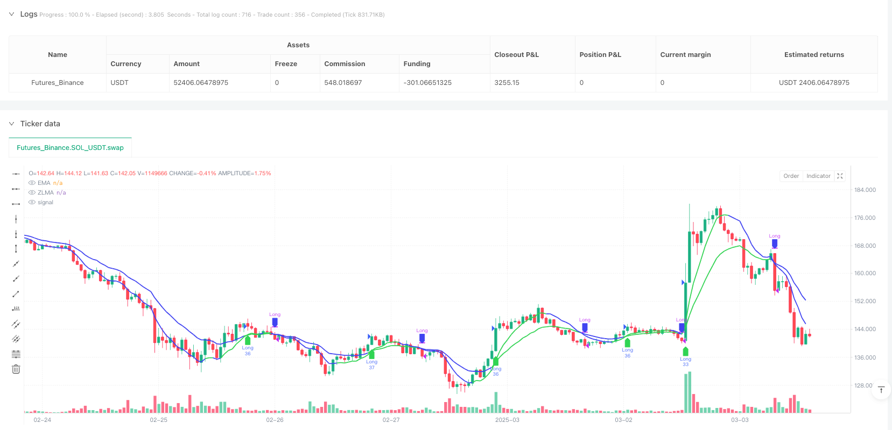
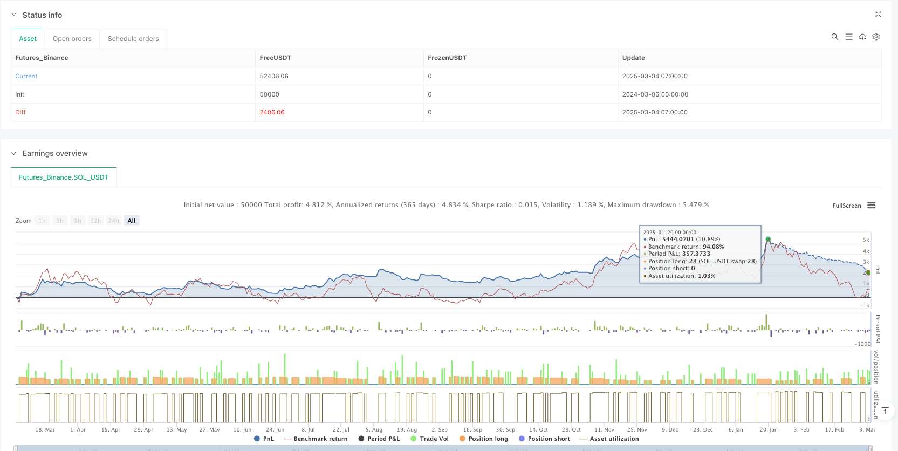

> Name

Zero-Lag-Moving-Average-Trend-Crossover-Strategy
> Author

ianzeng123

> Strategy Description




[trans]

#### Strategy Overview
The Zero Latency Moving Average Trend Crossover Strategy is a trend following trading system based on a modified moving average. The core of this strategy is to use the intersection relationship between the zero-latency moving average (ZLMA) and the traditional exponential moving average (EMA) to identify market trend turning points, thereby capturing uptrends and avoiding downtrends. By eliminating the lag inherent in traditional moving averages, this strategy can respond more quickly to price changes and improve the accuracy of entry and exit timing.
#### Strategy Principle
The technical principle of this strategy is based on an innovative solution to the traditional moving average delay problem. Its core calculation process is as follows:
1. First calculate the standard exponential moving average (EMA), using user-defined period parameters (default is 15)
2. Calculate the correction factor: add the difference between the current closing price and the EMA to the closing price to form the corrected price data
3. Calculate the Zero Lag Moving Average (ZLMA): Apply the EMA algorithm again to the corrected price data
The introduction of the correction factor is the key innovation of this strategy. By compensating for the delay characteristic of EMA, the final ZLMA can more closely follow price changes and reduce the lagging reaction of traditional moving averages at trend turning points.
The trading signal generation logic is as follows:
- Bull entry signal: when ZLMA crosses EMA upwards (detected by ta.crossover function)
- Long position closing signal: when ZLMA crosses EMA downward (ta.crossunder function detection)
- Additional closing mechanism: Automatically close positions before the market closes (15:45) to avoid overnight risks
#### Strategic Advantages
Through in-depth analysis of the strategy code, the following obvious advantages can be summarized:
1. **Reduced Latency** - Zero-latency moving average technology effectively reduces the lag problem of traditional moving averages, allowing strategies to identify trend changes earlier and enter or exit early.
2. **Trend Confirmation Mechanism** - Using the intersection relationship of two moving averages, it can filter out some price noise and reduce the probability of false signals.
3. **Adaptive visual feedback** - The visualization part of the strategy uses color changes to indicate the trend direction, which enhances the intuitiveness of trend identification.
4. **Risk Management Integration** - Built-in automatic closing mechanism before market close to effectively manage overnight risks
5. **Simple and easy to adjust parameters** - Only one period parameter (length) needs to be adjusted, the operation threshold is low, and it is easy for novices to use and optimize
6. **Flexible fund management** - The position management method of account equity percentage (10%) is adopted by default to adapt to the transaction needs of different fund sizes.
#### Strategy Risk
Although this strategy has many advantages, there are still several risks worth noting:
1. **Trend shock risk** - In a sideways market, ZLMA and EMA may cross frequently, generating too many trading signals, increasing transaction costs and the risk of false breakthroughs. Solution: Consider adding a signal confirmation mechanism, such as filtering signals based on trading volume or volatility indicators
2. **Parameter sensitivity** - The choice of moving average period (length) has a significant impact on strategy performance. Different markets and time frames may require different parameters. Solution: Test parameter optimization on different markets and time frames
3. **Limitations of a Single Technical Indicator** - Relying solely on moving average crossovers may ignore changes in market structure and fundamentals. Solution: Consider integrating other supplementary metrics or filters
4. **Fixed closing time limit** - The closing time hardcoded in the code (15:45) may not apply to all markets. Solution: Modify to configurable parameters or use the market time function of the trading platform
#### Strategy optimization direction
Based on in-depth analysis of the code, this strategy can be optimized in the following directions:
1. **Add trend strength filter** - Introduce trend strength indicators such as ADX (Average Directional Index), and only execute trading signals when the trend is clear, which can significantly reduce misleading signals in volatile markets
2. **Dynamic adjustment of period parameters** - Introduce an adaptive mechanism to automatically adjust the moving average period according to market volatility. Use shorter periods in high-volatility markets and longer periods in low-volatility markets.
3. **Add stop loss mechanism** - The current strategy lacks a clear stop loss strategy. You can add a dynamic stop loss based on ATR (true fluctuation range) to improve the level of risk management.
4. **Optimize Fund Management** - Introduce volatility-based position adjustment, increase positions in low-volatility environments, and reduce positions in high-volatility environments
5. **Add multi-time frame confirmation** - Combine the trend direction of a longer time period as a trading filter condition to avoid trading against the general trend
6. **Market status classification** - Add market status judgment logic (trending market/shock market), and use different trading strategy parameters in different market status
The core idea of ​​optimization is to enhance the adaptability and robustness of the strategy so that it can maintain relatively stable performance in different market environments.
#### Summary
The zero-latency moving average trend crossover strategy provides a concise and effective framework for trend following trading by innovatively solving the delay problem of traditional moving averages. This strategy uses the cross relationship between ZLMA and EMA to capture trend turning points, and combines the automatic closing mechanism to manage risks. It is suitable for traders who seek the advantages of trend tracking and want to reduce the lag of traditional moving averages.
Although this strategy is simple and easy to use in design, factors such as market environment adaptability, parameter optimization, and risk management still need to be considered in actual application. Through the suggested optimization direction, the robustness and adaptability of the strategy can be further improved, allowing it to maintain relatively stable performance under different market conditions. ||
#### Strategy Overview
The Zero-Lag Moving Average Trend Crossover Strategy is a trend-following trading system based on improved moving averages. The core of this strategy is to identify market trend reversal points by utilizing the crossover relationship between the Zero-Lag Moving Average (ZLMA) and the traditional Exponential Moving Average (EMA), thereby capturing uptrends and avoiding downtrends. By eliminating the inherent lag of traditional moving averages, this strategy can respond more quickly to price changes, improving the accuracy of entry and exit timing.

#### Strategy Principles
The technical principle of this strategy is based on an innovative solution to the delay problem of traditional moving averages. The core calculation process is as follows:

1. First, calculate the standard Exponential Moving Average (EMA) using a user-defined period parameter (default is 15)
2. Calculate the correction factor: add the difference between the current closing price and the EMA to the closing price to form a corrected price data
3. Calculate the Zero-Lag Moving Average (ZLMA): apply the EMA algorithm again to the corrected price data

The introduction of the correction factor is the key innovation of this strategy. It compensates for the delay characteristics of EMA, making the final ZLMA follow price movements more closely and reducing the lag reaction of traditional moving averages at trend turning points.

The trading signal generation logic is as follows:
- Long entry signal: when ZLMA crosses above EMA (detected by the ta.crossover function)
- Long exit signal: when ZLMA crosses below EMA (detected by the ta.crossunder function)
- Additional exit mechanism: automatically close positions before market close (15:45) to avoid overnight risk

#### Strategy Advantages
Through in-depth analysis of the strategy code, the following significant advantages can be summarized:

1. **Reduced Latency** - The zero-lag moving average technique effectively reduces the lag issue of traditional moving averages, allowing the strategy to identify trend changes earlier and enter or exit positions in advance
2. **Trend Confirmation Mechanism** - Using the crossover relationship between two moving averages can filter out some price noise and reduce the probability of false signals
3. **Adaptive Visual Feedback** - The visualization part of the strategy uses color changes to indicate trend direction, enhancing the intuitiveness of trend identification
4. **Integrated Risk Management** - Built-in automatic position closing mechanism before market close effectively manages overnight risk
5. **Simple and Easy-to-Adjust Parameters** - Only one period parameter (length) needs to be adjusted, lowering the operational threshold and facilitating use and optimization by beginners
6. **Flexible Capital Management** - By default, it adopts the account equity percentage (10%) position management method, adapting to trading needs of different capital scales

#### Strategy Risks
Despite its many advantages, the strategy still has the following risks worth noting:

1. **Trend Oscillation Risk** - In sideways markets, ZLMA and EMA may frequently cross, generating too many trading signals, increasing transaction costs and false breakout risks. Solution: Consider adding signal confirmation mechanisms, such as combining volume or volatility indicators to filter signals
2. **Parameter Sensitivity** - The choice of moving average period (length) has a significant impact on strategy performance, and different markets and timeframes may require different parameters. Solution: Test parameter optimization for different markets and timeframes
3. **Single Technical Indicator Limitation** - Relying solely on moving average crossovers may ignore changes in market structure and fundamentals. Solution: Consider integrating other complementary indicators or filtering conditions
4. **Fixed Closing Time Limitation** - The hard-coded closing time (15:45) in the code may not be applicable to all markets. Solution: Modify to a configurable parameter or use the market time function of the trading platform

#### Strategy Optimization Directions
Based on an in-depth analysis of the code, the strategy can be optimized in the following directions:

1. **Add Trend Strength Filter** - Introduce trend strength indicators such as ADX (Average Directional Index), execute trading signals only when the trend is clear, which can significantly reduce misleading signals in oscillating markets
2. **Dynamically Adjust Period Parameters** - Introduce adaptive mechanisms to automatically adjust the moving average period according to market volatility, using shorter periods in high-volatility markets and longer periods in low-volatility markets
3. **Add Stop Loss Mechanism** - The current strategy lacks a clear stop loss strategy, and dynamic stop losses based on ATR (Average True Range) can be added to improve risk management
4. **Optimize Capital Management** - Introduce volatility-based position adjustment, increasing positions in low-volatility environments and reducing positions in high-volatility environments
5. **Add Multi-Timeframe Confirmation** - Combine the trend direction of longer time periods as a trading filter condition to avoid trading against the major trend
6. **Market State Classification** - Add market state judgment logic (trending market/oscillating market), using different trading strategy parameters in different market states

The core idea of optimization is to enhance the adaptability and robustness of the strategy, making it maintain relatively stable performance in different market environments.

#### Summary
The Zero-Lag Moving Average Trend Crossover Strategy provides a concise and effective framework for trend-following trading by innovatively solving the delay problem of traditional moving averages. The strategy captures trend turning points through the crossover relationship between ZLMA and EMA, combines automatic position closing mechanisms to manage risk, and is suitable for traders who seek trend-following advantages while wanting to reduce the lag of traditional moving averages.

Although the strategy is designed to be simple and easy to use, when applied in practice, factors such as market environment adaptability, parameter optimization, and risk management still need to be considered. Through the suggested optimization directions, the robustness and adaptability of the strategy can be further enhanced, allowing it to maintain relatively stable performance under different market conditions.[/trans]


> Source (PineScript)

``` pinescript
/*backtest
start: 2024-03-06 00:00:00
end: 2025-03-04 08:00:00
period: 1h
basePeriod: 1h
exchanges: [{"eid":"Futures_Binance","currency":"SOL_USDT"}]
*/

// This Pine Script™ code is subject to the terms of the Mozilla Public License 2.0 at https://mozilla.org/MPL/2.0/
// © ChartPrime

//@version=5
strategy("Zero-Lag MA Trend Strategy", overlay = true, default_qty_type = strategy.percent_of_equity, default_qty_value = 10)

// --------------------------------------------------------------------------------------------------------------------}
// ???? ??????
// --------------------------------------------------------------------------------------------------------------------{
int  length    = input.int(15, title="Length") // Length for moving averages

// Colors for visualization
color up = input.color(#30d453, "+", group = "Colors", inline = "i")
color dn = input.color(#4043f1, "-", group = "Colors", inline = "i")

// --------------------------------------------------------------------------------------------------------------------}
// ????????? ????????????
// --------------------------------------------------------------------------------------------------------------------{
emaValue   = ta.ema(close, length) // EMA
correction = close + (close - emaValue) // Correction factor
zlma       = ta.ema(correction, length) // Zero-Lag Moving Average (ZLMA)

// Entry signals
longSignal  = ta.crossover(zlma, emaValue) // Bullish crossover
shortSignal = ta.crossunder(zlma, emaValue) // Bearish crossunder
// Close positions before the market closes
var int marketCloseHour = 15
var int marketCloseMinute = 45
timeToClose = hour == marketCloseHour and minute >= marketCloseMinute
// --------------------------------------------------------------------------------------------------------------------}
// ????? ?????????
// --------------------------------------------------------------------------------------------------------------------{
if longSignal
    strategy.entry("Long", strategy.long)

if shortSignal
    strategy.close("Long")

if timeToClose
    strategy.close_all("EOD Exit")
// --------------------------------------------------------------------------------------------------------------------}
// ?????????????
// --------------------------------------------------------------------------------------------------------------------{
// Plot the Zero-Lag Moving Average and EMA
plot(zlma, color = zlma > zlma[3] ? up : dn, linewidth = 2, title = "ZLMA")
plot(emaValue, color = emaValue < zlma ? up : dn, linewidth = 2, title = "EMA")

// Mark trade entries with shapes
plotshape(series=longSignal, location=location.belowbar, color=up, style=shape.labelup, title="Buy Signal")
plotshape(series=shortSignal, location=location.abovebar, color=dn, style=shape.labeldown, title="Sell Signal")

```

> Detail

https://www.fmz.com/strategy/485126

> Last Modified

2025-03-06 11:06:36
