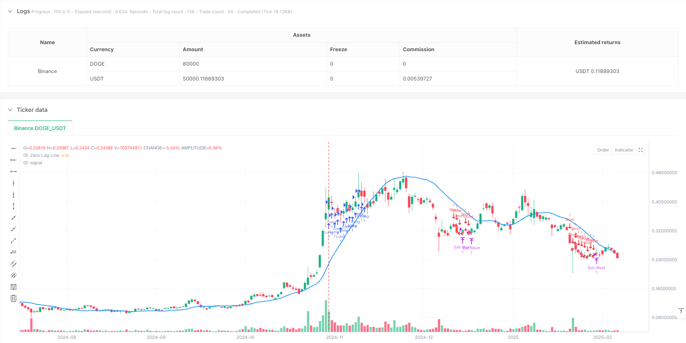
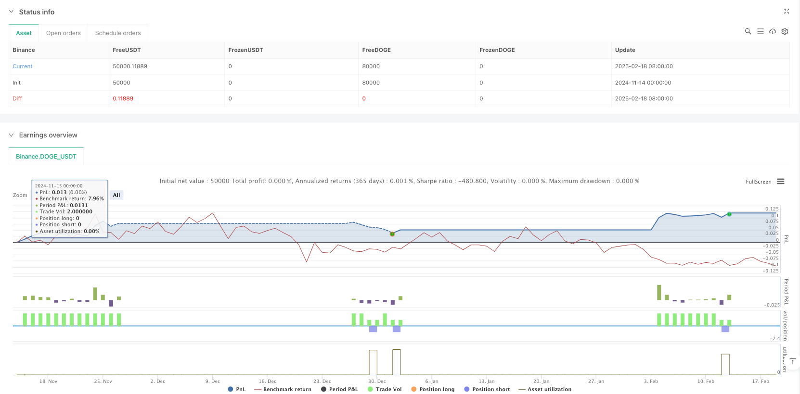

> Name

Zero-Lag-Trend-Momentum-Indicator-Trading-Strategy
> Author

ianzeng123

> Strategy Description





[trans]
#### Overview
This strategy is a quantitative trading system based on zero-lag moving averages and trend strength scores. It identifies market trends by eliminating the lag of traditional moving averages and combining volatility channels and trend strength scores to capture short- and medium-term price fluctuation opportunities. This strategy adopts a two-way trading model, going long in an upward trend and short in a downward trend, and sets a stop-profit and stop-loss to control risks.
#### Strategy Principle
The core of the strategy is to eliminate the lag effect of traditional moving averages through a zero-lag moving average. The specific implementation method is: first calculate the difference between the current price and the lagged price, then add the difference to the current price, and finally calculate the moving average of the result. At the same time, the strategy introduces a trend strength scoring system to quantify trend strength by comparing price levels in different time periods. In addition, the strategy also sets up a dynamic volatility channel based on ATR to filter trading signals. A trading signal is triggered when the price breaks out of the channel and the trend score reaches the threshold.
#### Strategic Advantages
1. The zero-latency feature enables the strategy to capture changes in market trends more quickly, reducing the losses caused by the lag of traditional moving average strategies.
2. The trend strength scoring system provides a quantitative measurement of market trends and helps filter out false signals.
3. The dynamic volatility channel can be adaptively adjusted according to market volatility, improving the stability of the strategy.
4. The strategy adopts a two-way trading model, which can capture profit opportunities in both long and short directions.
5. It has a complete stop-profit and stop-loss mechanism to effectively control risks.
#### Strategy Risk
1. Frequent false breakthrough signals may occur in a volatile market, leading to over-trading.
2. The parameter settings of the trend strength scoring system are relatively complex and may require frequent adjustments under different market conditions.
3. Zero-latency calculations may produce unstable results under extreme market conditions.
4. The strategy relies on historical data to calculate trend strength and may fail when the market fluctuates violently.
#### Strategy optimization direction
1. Introduce the adaptive adjustment mechanism of market volatility indicators (such as ATR) and dynamically adjust the trend intensity scoring threshold.
2. Add trading volume analysis indicators to verify the validity of the trend.
3. Develop a market state identification module and use different parameter settings under different market states.
4. Add a time filter to avoid trading during periods of greater market volatility.
5. Optimize the take-profit and stop-loss mechanism and dynamically adjust the take-profit and stop-loss ratio according to market volatility.
#### Summary
This strategy well solves the lag problem in traditional trend following strategies through innovative zero-delay calculation methods and trend strength scoring systems. At the same time, the stability and reliability of the strategy are improved by introducing dynamic volatility channels and a complete risk control mechanism. Although the strategy still has room for improvement in terms of parameter optimization and market adaptability, the overall design idea is clear and has good practical application value. It is recommended that traders make appropriate parameter adjustments based on specific market characteristics and transaction target characteristics when using it in real trading. ||
#### Overview
This strategy is a quantitative trading system based on zero-lag moving averages and trend strength scoring. It eliminates the lag of traditional moving averages, combining volatility channels and trend strength scoring to identify market trends and capture medium to short-term price movements. The strategy employs bi-directional trading, going long in uptrends and short in downtrends, with built-in stop-loss and take-profit mechanisms for risk control.

#### Strategy Principles
The core of the strategy lies in eliminating the lag effect of traditional moving averages through zero-lag calculation. This is achieved by first calculating the difference between current and lagged prices, adding this difference to the current price, and then applying moving average calculations to the result. The strategy also incorporates a trend strength scoring system that quantifies trend strength by comparing price levels across different timeframes. Additionally, it implements an ATR-based dynamic volatility channel to filter trading signals. Trade signals are only triggered when price breaks through the channel and trend score reaches the threshold.

#### Strategy Advantages
1. Zero-lag characteristics enable faster capture of market trend changes, reducing losses associated with traditional moving average strategies.
2. The trend strength scoring system provides quantitative measurement of market trends, helping filter false signals.
3. Dynamic volatility channels adapt to market volatility, improving strategy stability.
4. Bi-directional trading approach captures profit opportunities in both directions.
5. Comprehensive stop-loss and take-profit mechanisms effectively control risk.

#### Strategy Risks
1. May generate frequent false breakout signals in ranging markets, leading to overtrading.
2. Complex parameter settings in the trend strength scoring system may require frequent adjustments under different market conditions.
3. Zero-lag calculations may produce unstable results under extreme market conditions.
4. Strategy relies on historical data for trend strength calculation, which may fail during severe market volatility.

#### Strategy Optimization Directions
1. Introduce adaptive adjustment mechanism for volatility indicators (like ATR) to dynamically adjust trend strength score thresholds.
2. Add volume analysis indicators to verify trend validity.
3. Develop market state recognition module to use different parameter settings under different market conditions.
4. Implement time filters to avoid trading during highly volatile market periods.
5. Optimize stop-loss and take-profit mechanisms by dynamically adjusting ratios based on market volatility.

#### Summary
This strategy effectively addresses the lag issues in traditional trend-following strategies through innovative zero-lag calculation methods and trend strength scoring system. By incorporating dynamic volatility channels and comprehensive risk control mechanisms, it enhances strategy stability and reliability. While there is room for improvement in parameter optimization and market adaptability, the overall design is clear and shows good practical application value. Traders are advised to adjust parameters according to specific market characteristics and trading instruments when implementing the strategy in live trading.[/trans]


> Source (PineScript)

``` pinescript
/*backtest
start: 2024-11-14 00:00:00
end: 2025-02-19 08:00:00
period: 1d
basePeriod: 1d
exchanges: [{"eid":"Binance","currency":"DOGE_USDT"}]
*/

// This Pine Script™ code is subject to the terms of the Mozilla Public License 2.0 at https://mozilla.org/MPL/2.0/
// © josephdelvecchio

//@version=6
strategy("Zero Lag Trend Strategy", overlay=true)

// -- Input Parameters --
timeframe = input.timeframe("10", "Timeframe")
zeroLagMovAvg = input.string("ema", "Zero Lag Moving Average", options=["ema", "sma"])
length = input.int(50, "Lookback Period")
volatility_mult = input.float(1.5, "Volatility Multiplier")
loop_start = input.int(1, "Loop Start")
loop_end = input.int(50, "Loop End")
threshold_up = input.int(5, "Threshold Up")
threshold_down = input.int(-5, "Threshold Down")
signalpct = input.float(8, "Signal Percentage")
stoppct = input.float(0, "Stop Percentage")

// -- Helper Variables --
nATR = ta.atr(length)
lag = math.floor((length - 1) / 2)
zl_basis = zeroLagMovAvg == "ema" ? ta.ema(2 * close - close[lag], length) : ta.sma(2 * close - close[lag], length)
volatility = ta.highest(nATR, length * 3) * volatility_mult

// -- Trend Strength Scoring Function --
forloop_analysis(basis_price, loop_start, loop_end) =>
    int sum = 0 // Use 'sum' as you did originally, for the +/- logic
    for i = loop_start to loop_end
        if basis_price > basis_price[i]
            sum += 1
        else if basis_price < basis_price[i] // Explicitly check for less than
            sum -= 1
        // If they are equal, do nothing (sum remains unchanged)
    sum

score = forloop_analysis(zl_basis, loop_start, loop_end)

// -- Signal Generation --
long_signal = score > threshold_up and close > zl_basis + volatility
short_signal = score < threshold_down and close < zl_basis - volatility

// -- Trend Detection (Ensure One Trade Until Reversal) --
var int trend = na
trend := long_signal ? 1 : short_signal ? -1 : trend[1]
trend_changed = trend != trend[1]

// -- Stop-Loss & Take-Profit --
stop_loss = close * (1 - stoppct / 100)
take_profit = close * (1 + signalpct / 100)

// -- Strategy Orders (Enter Only When Trend Changes) --

if long_signal
    strategy.entry("Long", strategy.long)
else if short_signal
    strategy.entry("Short", strategy.short)

// -- Strategy Exits --
strategy.exit("Exit Long", from_entry="Long", stop=stop_loss, limit=take_profit)
strategy.exit("Exit Short", from_entry="Short", stop=take_profit, limit=stop_loss)

// -- Visualization --
p_basis = zl_basis
plot(p_basis, title="Zero Lag Line", color=color.blue, linewidth=2)

// -- Buy/Sell Arrows --
plotshape(series=trend_changed and trend == 1, location=location.belowbar, color=color.green, style=shape.triangleup, size=size.large, title="Buy Signal")
plotshape(series=trend_changed and trend == -1, location=location.abovebar, color=color.red, style=shape.triangledown, size=size.large, title="Sell Signal")

```

> Detail

https://www.fmz.com/strategy/483034

> Last Modified

2025-02-21 10:19:25
