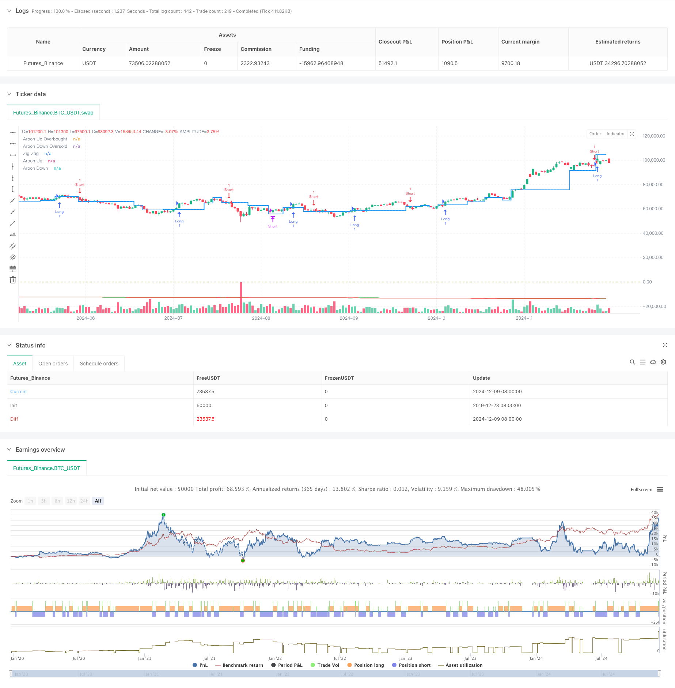

> Name

Adaptive-Trend-Following-and-Reversal-Detection-Strategy-A-Quantitative-Trading-System-Based-on-ZigZag-and-Aroon-Indicators
> Author

ChaoZhang

> Strategy Description



[trans]
#### Overview
This strategy is an adaptive trading system that combines the ZigZag indicator and the Aroon indicator. The ZigZag indicator is used to filter out market noise and identify important price movements, while the Aroon indicator is used to confirm the strength of trends and potential reversal points. Through the synergy of these two indicators, the strategy can capture the turning point of the market in a timely manner while maintaining sensitivity to trends.
#### Strategy Principle
The core logic of the strategy is based on the following key elements:
1. The ZigZag indicator filters short-term fluctuations by setting the depth parameter (zigzagDepth) and only retains price fluctuations with statistical significance.
2. The Aroon indicator generates two lines, Aroon Up and Aroon Down, by calculating the time interval between the highest price and the lowest price (aroonLength).
3. The entry signal is triggered by two conditions:
   - When Aroon Up breaks through Aroon Down and ZigZag shows an upward trend, a long position will be opened
   - When Aroon Down breaks through Aroon Up and ZigZag shows a downward trend, a short position will be opened.
4. The exit signal is triggered by the crossover of the Aroon indicator:
   - Long positions are closed when Aroon Down crosses Aroon Up
   - Short positions are closed when Aroon Up wears Aroon Down
#### Strategic Advantages
1. The double confirmation mechanism improves the reliability of transactions and reduces false signals.
2. The use of ZigZag indicator effectively reduces the impact of market noise.
3. The Aroon indicator can provide a quantitative measure of trend strength.
4. The strategy is adaptive and can be adjusted in different market environments.
5. The exit mechanism is clear and helps control risks.
#### Strategy Risk
1. Frequent trading signals may occur in a volatile market, increasing transaction costs.
2. The lagging nature of the ZigZag indicator may cause a slight delay in entry timing.
3. The choice of parameters has a great impact on strategy performance.
4. A large retracement may occur in a rapid reversal market.
#### Strategy optimization direction
1. Introduce volatility indicators and adjust parameters according to market fluctuations.
2. Add trading volume indicators as auxiliary confirmation.
3. Optimize the stop loss mechanism and add trailing stop loss.
4. Consider adding market environment classification and using different parameter combinations in different market environments.
5. Introduce a position management system to adjust the position size according to signal strength.
#### Summary
This strategy builds a relatively complete trend tracking system through the combination of ZigZag and Aroon indicators. The advantage of the strategy lies in its adaptability and double confirmation mechanism, but it is also necessary to pay attention to the impact of parameter selection and market environment on strategy performance. Through continuous optimization and improvement, this strategy is expected to achieve stable performance in actual transactions. ||
#### Overview
This strategy is an adaptive trading system that combines the ZigZag indicator with the Aroon indicator. The ZigZag indicator filters market noise and identifies significant price movements, while the Aroon indicator confirms trend strength and potential reversal points. Through the synergistic combination of these two indicators, the strategy maintains sensitivity to trends while also capturing market turning points in a timely manner.

#### Strategy Principles
The core logic of the strategy is based on the following key elements:
1. The ZigZag indicator filters short-term fluctuations by setting a depth parameter (zigzagDepth), retaining only statistically significant price movements.
2. The Aroon indicator generates Aroon Up and Aroon Down lines by calculating the time interval between highest and lowest prices (aroonLength).
3. Entry signals are triggered by two concurrent conditions:
   - Long positions are opened when Aroon Up crosses above Aroon Down and ZigZag shows an upward trend
   - Short positions are opened when Aroon Down crosses above Aroon Up and ZigZag shows a downward trend
4. Exit signals are triggered by Aroon indicator crossovers:
   - Long positions are closed when Aroon Down crosses above Aroon Up
   - Short positions are closed when Aroon Up crosses above Aroon Down

#### Strategy Advantages
1. Dual confirmation mechanism improves trading reliability and reduces false signals.
2. ZigZag indicator effectively reduces the impact of market noise.
3. Aroon indicator provides quantitative measurement of trend strength.
4. Strategy demonstrates adaptability across different market environments.
5. Clear exit mechanisms help control risk.

#### Strategy Risks
1. May generate frequent trading signals in oscillating markets, increasing transaction costs.
2. ZigZag indicator's lag might cause slightly delayed entries.
3. Parameter selection significantly impacts strategy performance.
4. Potential for larger drawdowns during rapid market reversals.

#### Strategy Optimization Directions
1. Incorporate volatility indicators to adjust parameters based on market volatility.
2. Add volume indicators as supplementary confirmation.
3. Optimize stop-loss mechanisms, including trailing stops.
4. Consider market environment classification for different parameter combinations.
5. Implement position sizing system based on signal strength.

#### Summary
The strategy builds a comprehensive trend-following system through the combination of ZigZag and Aroon indicators. Its strengths lie in its adaptability and dual confirmation mechanism, while attention must be paid to parameter selection and market environment impacts. Through continuous optimization and improvement, the strategy shows promise for stable performance in actual trading.[/trans]


> Source (PineScript)

``` pinescript
/*backtest
start: 2019-12-23 08:00:00
end: 2024-12-10 08:00:00
period: 1d
basePeriod: 1d
exchanges: [{"eid":"Futures_Binance","currency":"BTC_USDT"}]
*/

//@version=5
strategy("Zig Zag + Aroon Strategy", overlay=true)

// Zig Zag parameters
zigzagDepth = input(5, title="Zig Zag Depth")

// Aroon parameters
aroonLength = input(14, title="Aroon Length")

// Zig Zag logic
var float lastZigZag = na
var float lastZigZagHigh = na
var float lastZigZagLow = na
var int direction = 0  // 1 for up, -1 for down

// Calculate Zig Zag
if (not na(high) and high >= ta.highest(high, zigzagDepth) and direction != 1)
    lastZigZag := high
    lastZigZagHigh := high
    direction := 1
if (not na(low) and low <= ta.lowest(low, zigzagDepth) and direction != -1)
    lastZigZag := low
    lastZigZagLow := low
    direction := -1

// Aroon calculation
highestHigh = ta.highest(high, aroonLength)
lowestLow = ta.lowest(low, aroonLength)
aroonUp = (aroonLength - (bar_index - ta.highestbars(high, aroonLength))) / aroonLength * 100
aroonDown = (aroonLength - (bar_index - ta.lowestbars(low, aroonLength))) / aroonLength * 100

// Long entry condition
longCondition = (ta.crossover(aroonUp, aroonDown)) and (lastZigZag == lastZigZagHigh)
if (longCondition)
    strategy.entry("Long", strategy.long)

// Short entry condition
shortCondition = (ta.crossover(aroonDown, aroonUp)) and (lastZigZag == lastZigZagLow)
if (shortCondition)
    strategy.entry("Short", strategy.short)

// Exit conditions
if (ta.crossover(aroonDown, aroonUp) and strategy.position_size > 0)
    strategy.close("Long")

if (ta.crossover(aroonUp, aroonDown) and strategy.position_size < 0)
    strategy.close("Short")

// Plot Zig Zag
plot(lastZigZag, color=color.blue, title="Zig Zag", linewidth=2, style=plot.style_stepline)

// Plot Aroon
hline(70, "Aroon Up Overbought", color=color.red)
hline(30, "Aroon Down Oversold", color=color.green)
plot(aroonUp, color=color.green, title="Aroon Up")
plot(aroonDown, color=color.red, title="Aroon Down")
```

> Detail

https://www.fmz.com/strategy/474881

> Last Modified

2024-12-12 17:21:41
