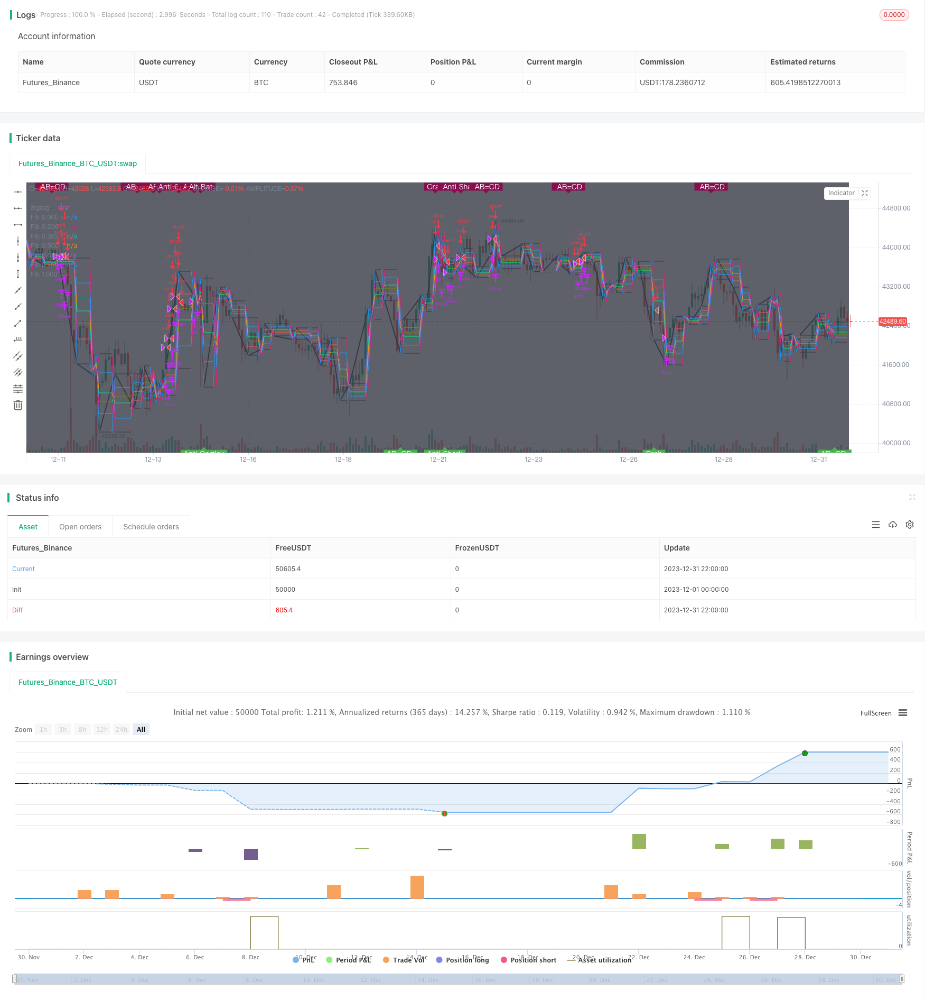

> Name

Multiple pattern recognition short-term trading strategies based on ZigZag ZigZag-Pattern-Recognition-Short-term-Trading-Strategy
> Author

ChaoZhang

> Strategy Description


 [trans]
## Overview
This strategy identifies the K-line pattern based on the ZigZag indicator, and combines it with the Fibonacci retracement line to set the Entry window, take-profit price, and stop-loss price to achieve short-term trading. The strategy supports multiple forms, including 13 long and short trend forms such as Bat, Butterfly, and Gartley.
## Strategy Principle
1. Use the ZigZag indicator to identify potential reversal points
2. Calculate the last 4 reversal points and determine whether they match any of the 13 predefined patterns.
3. If the pattern matches and the price enters the Fibonacci retracement 0.382 area, enter the market
4. Set the take profit to the 0.618 retracement level and the stop loss to the -0.618 retracement level.
5. Valid forms include the common Bat, Butterfly, Gartley, etc., as well as some reverse forms, such as Anti-Bat, Anti-Butterfly, etc.
## Advantage Analysis
1. The strategy takes advantage of the ZigZag indicator to effectively filter market noise and identify clearer trend conversion points.
2. Combine multiple forms to increase Entry opportunities while controlling risks
3. Use Fibonacci retracement to set reference points to standardize entry and stop loss Take profit
## Risk Analysis
1. The ZigZag indicator is sensitive to parameters and needs to be adjusted to find the best parameter combination.
2. A large number of pattern matching increases the risk of curve fitting, and the effect of real trading may be weaker than backtesting
3. Only considering the last four turning points, more complex patterns cannot be identified.
4. Failure to consider retesting after breaking through the retracement line may lead to premature stop loss.
## Optimization direction
1. Optimize ZigZag parameters and find the best parameter combination
2. Increase the validity test of the pattern, such as considering the closing price to confirm the key points
3. Add more K-line forms and expand Entry opportunities
4. Add a retracement and retest mechanism to reduce the risk of stop loss
## Summarize
This strategy uses the ZigZag indicator and the K-line pattern to comprehensively determine the trend conversion point and set the Fibonacci retracement area to standardize the entry and exit logic. It is a potential short-term trading strategy. The key is to find the best parameter combination and adjust the stop loss mechanism appropriately, which is expected to achieve better real-time results.
||

## Overview  

This strategy identifies candlestick patterns based on the ZigZag indicator and sets entry windows, take profit and stop loss prices using Fibonacci retracements for short-term trading. The strategy supports 13 types of patterns for both long and short trends, including Bat, Butterfly, Gartley etc.

## Strategy Logic  

1. Identify potential reversal points using the ZigZag indicator
2. Calculate the most recent 4 reversal points and check if they match any of the 13 predefined patterns
3. Enter trade if a pattern is matched and price enters the Fibonacci 0.382 retracement area  
4. Set take profit to 0.618 retracement level, stop loss to -0.618 retracement level
5. Valid patterns include common ones like Bat, Butterfly, Gartley, as well as some reverse patterns such as Anti-Bat, Anti-Butterfly etc  

## Advantage Analysis

1. The ZigZag indicator effectively filters out market noise and identifies clearer trend reversal points  
2. Multiple patterns increase opportunities to enter trades while controlling risks
3. Fibonacci retracement levels standardize entry, take profit and stop loss  

## Risk Analysis  

1. The ZigZag indicator is sensitive to parameters, optimization is needed to find the best parameter combination  
2. Too many fitted patterns increase curve fitting risks, real trading performance may underperform backtest results  
3. Only the most recent 4 reversal points considered, more complex patterns are ignored
4. No re-test of retracement breakouts considered, may cause premature stop loss  

## Optimization Directions  

1. Optimize ZigZag parameters to find the best combination 
2. Add validity checks for patterns, e.g. confirmation of key points by closing prices
3. Expand pattern library to increase entry opportunities  
4. Add re-test mechanism of retracements to lower stop loss risks  

## Conclusion  

This strategy identifies trend reversal points using the ZigZag indicator and candlestick patterns, and sets standardized entry/exit logic with Fibonacci retracement zones. With optimized parameters and adjusted stop loss mechanisms, it has the potential to achieve good real trading results. The key is finding the best parameter combinations and tuning stop losses accordingly.

[/trans]

> Strategy Arguments


|Argument|Default|Description|
|----|----|----|
|v_input_1|false|Use Heikken Ashi Candles|
|v_input_2|true|Use Alt Timeframe|
|v_input_3|60|Alt Timeframe|
|v_input_4|true|Show Patterns|
|v_input_5|true|Display Fibonacci 0.000:|
|v_input_6|true|Display Fibonacci 0.236:|
|v_input_7|true|Display Fibonacci 0.382:|
|v_input_8|true|Display Fibonacci 0.500:|
|v_input_9|true|Display Fibonacci 0.618:|
|v_input_10|true|Display Fibonacci 0.764:|
|v_input_11|true|Display Fibonacci 1.000:|
|v_input_12|true|Trade size:|
|v_input_13|0.382|Fib. Rate to use for Entry Window:|
|v_input_14|0.618|Fib. Rate to use for TP:|
|v_input_15|-0.618|Fib. Rate to use for SL:|


> Source (PineScript)

``` pinescript
/*backtest
start: 2023-12-01 00:00:00
end: 2023-12-31 23:59:59
period: 2h
basePeriod: 15m
exchanges: [{"eid":"Futures_Binance","currency":"BTC_USDT"}]
*/

//@version=4

strategy(title='[STRATEGY][RS]ZigZag PA Strategy V4', shorttitle='S', overlay=true)
useHA = input(false, title='Use Heikken Ashi Candles')
useAltTF = input(true, title='Use Alt Timeframe')
tf = input('60', title='Alt Timeframe')
showPatterns = input(true, title='Show Patterns')
showFib0000 = input(title='Display Fibonacci 0.000:', type=bool, defval=true)
showFib0236 = input(title='Display Fibonacci 0.236:', type=bool, defval=true)
showFib0382 = input(title='Display Fibonacci 0.382:', type=bool, defval=true)
showFib0500 = input(title='Display Fibonacci 0.500:', type=bool, defval=true)
showFib0618 = input(title='Display Fibonacci 0.618:', type=bool, defval=true)
showFib0764 = input(title='Display Fibonacci 0.764:', type=bool, defval=true)
showFib1000 = input(title='Display Fibonacci 1.000:', type=bool, defval=true)
zigzag() =>
    _isUp = close >= open
    _isDown = close <= open
    _direction = _isUp[1] and _isDown ? -1 : _isDown[1] and _isUp ? 1 : nz(_direction[1])
    _zigzag = _isUp[1] and _isDown and _direction[1] != -1 ? highest(2) : _isDown[1] and _isUp and _direction[1] != 1 ? lowest(2) : na

_ticker = useHA ? heikenashi(syminfo.tickerid) : syminfo.tickerid
sz = useAltTF ? (ta.change(time(tf)) != 0 ? request.security(_ticker, tf, zigzag()) : na) : zigzag()

plot(sz, title='zigzag', color=color.black, linewidth=2)

//  ||---   Pattern Recognition:

x = ta.valuewhen(sz, sz, 4) 
a = ta.valuewhen(sz, sz, 3) 
b = ta.valuewhen(sz, sz, 2) 
c = ta.valuewhen(sz, sz, 1) 
d = ta.valuewhen(sz, sz, 0)

xab = (abs(b-a)/abs(x-a))
xad = (abs(a-d)/abs(x-a))
abc = (abs(b-c)/abs(a-b))
bcd = (abs(c-d)/abs(b-c))

//  ||-->   Functions:
isBat(_mode)=>
    _xab = xab >= 0.382 and xab <= 0.5
    _abc = abc >= 0.382 and abc <= 0.886
    _bcd = bcd >= 1.618 and bcd <= 2.618
    _xad = xad <= 0.618 and xad <= 1.000    // 0.886
    _xab and _abc and _bcd and _xad and (_mode == 1 ? d < c : d > c)

isAntiBat(_mode)=>
    _xab = xab >= 0.500 and xab <= 0.886    // 0.618
    _abc = abc >= 1.000 and abc <= 2.618    // 1.13 --> 2.618
    _bcd = bcd >= 1.618 and bcd <= 2.618    // 2.0  --> 2.618
    _xad = xad >= 0.886 and xad <= 1.000    // 1.13
    _xab and _abc and _bcd and _xad and (_mode == 1 ? d < c : d > c)

isAltBat(_mode)=>
    _xab = xab <= 0.382
    _abc = abc >= 0.382 and abc <= 0.886
    _bcd = bcd >= 2.0 and bcd <= 3.618
    _xad = xad <= 1.13
    _xab and _abc and _bcd and _xad and (_mode == 1 ? d < c : d > c)

isButterfly(_mode)=>
    _xab = xab <= 0.786
    _abc = abc >= 0.382 and abc <= 0.886
    _bcd = bcd >= 1.618 and bcd <= 2.618
    _xad = xad >= 1.27 and xad <= 1.618
    _xab and _abc and _bcd and _xad and (_mode == 1 ? d < c : d > c)

isAntiButterfly(_mode)=>
    _xab = xab >= 0.236 and xab <= 0.886    // 0.382 - 0.618
    _abc = abc >= 1.130 and abc <= 2.618    // 1.130 - 2.618
    _bcd = bcd >= 1.000 and bcd <= 1.382    // 1.27
    _xad = xad >= 0.500 and xad <= 0.886    // 0.618 - 0.786
    _xab and _abc and _bcd and _xad and (_mode == 1 ? d < c : d > c)

isABCD(_mode)=>
    _abc = abc >= 0.382 and abc <= 0.886
    _bcd = bcd >= 1.13 and bcd <= 2.618
    _abc and _bcd and (_mode == 1 ? d < c : d > c)

isGartley(_mode)=>
    _xab = xab >= 0.5 and xab <= 0.618 // 0.618
    _abc = abc >= 0.382 and abc <= 0.886
    _bcd = bcd >= 1.13 and bcd <= 2.618
    _xad = xad >= 0.75 and xad <= 0.875 // 0.786
    _xab and _abc and _bcd and _xad and (_mode == 1 ? d < c : d > c)

isAntiGartley(_mode)=>
    _xab = xab >= 0.500 and xab <= 0.886    // 0.618 -> 0.786
    _abc = abc >= 1.000 and abc <= 2.618    // 1.130 -> 2.618
    _bcd = bcd >= 1.500 and bcd <= 5.000    // 1.618
    _xad = xad >= 1.000 and xad <= 5.000    // 1.272
    _xab and _abc and _bcd and _xad and (_mode == 1 ? d < c : d > c)

isCrab(_mode)=>
    _xab = xab >= 0.500 and xab <= 0.875    // 0.886
    _abc = abc >= 0.382 and abc <= 0.886    
    _bcd = bcd >= 2.000 and bcd <= 5.000    // 3.618
    _xad = xad >= 1.382 and xad <= 5.000    // 1.618
    _xab and _abc and _bcd and _xad and (_mode == 1 ? d < c : d > c)

isAntiCrab(_mode)=>
    _xab = xab >= 0.250 and xab <= 0.500    // 0.276 -> 0.446
    _abc = abc >= 1.130 and abc <= 2.618    // 1.130 -> 2.618
    _bcd = bcd >= 1.618 and bcd <= 2.618    // 1.618 -> 2.618
    _xad = xad >= 0.500 and xad <= 0.750    // 0.618
    _xab and _abc and _bcd and _xad and (_mode == 1 ? d < c : d > c)

isShark(_mode)=>
    _xab = xab >= 0.500 and xab <= 0.875    // 0.5 --> 0.886
    _abc = abc >= 1.130 and abc <= 1.618    //
    _bcd = bcd >= 1.270 and bcd <= 2.240    //
    _xad = xad >= 0.886 and xad <= 1.130    // 0.886 --> 1.13
    _xab and _abc and _bcd and _xad and (_mode == 1 ? d < c : d > c)

isAntiShark(_mode)=>
    _xab = xab >= 0.382 and xab <= 0.875    // 0.446 --> 0.618
    _abc = abc >= 0.500 and abc <= 1.000    // 0.618 --> 0.886
    _bcd = bcd >= 1.250 and bcd <= 2.618    // 1.618 --> 2.618
    _xad = xad >= 0.500 and xad <= 1.250    // 1.130 --> 1.130
    _xab and _abc and _bcd and _xad and (_mode == 1 ? d < c : d > c)

is5o(_mode)=>
    _xab = xab >= 1.13 and xab <= 1.618
    _abc = abc >= 1.618 and abc <= 2.24
    _bcd = bcd >= 0.5 and bcd <= 0.625 // 0.5
    _xad = xad >= 0.0 and xad <= 0.236 // negative?
    _xab and _abc and _bcd and _xad and (_mode == 1 ? d < c : d > c)

isWolf(_mode)=>
    _xab = xab >= 1.27 and xab <= 1.618
    _abc = abc >= 0 and abc <= 5
    _bcd = bcd >= 1.27 and bcd <= 1.618
    _xad = xad >= 0.0 and xad <= 5
    _xab and _abc and _bcd and _xad and (_mode == 1 ? d < c : d > c)

isHnS(_mode)=>
    _xab = xab >= 2.0 and xab <= 10
    _abc = abc >= 0.90 and abc <= 1.1
    _bcd = bcd >= 0.236 and bcd <= 0.88
    _xad = xad >= 0.90 and xad <= 1.1
    _xab and _abc and _bcd and _xad and (_mode == 1 ? d < c : d > c)

isConTria(_mode)=>
    _xab = xab >= 0.382 and xab <= 0.618
    _abc = abc >= 0.382 and abc <= 0.618
    _bcd = bcd >= 0.382 and bcd <= 0.618
    _xad = xad >= 0.236 and xad <= 0.764
    _xab and _abc and _bcd and _xad and (_mode == 1 ? d < c : d > c)

isExpTria(_mode)=>
    _xab = xab >= 1.236 and xab <= 1.618
    _abc = abc >= 1.000 and abc <= 1.618
    _bcd = bcd >= 1.236 and bcd <= 2.000
    _xad = xad >= 2.000 and xad <= 2.236
    _xab and _abc and _bcd and _xad and (_mode == 1 ? d < c : d > c)

plotshape(not showPatterns ? na : isABCD(-1) and not isABCD(-1)[1], text="\nAB=CD", title='Bear ABCD', style=shape.labeldown, color=maroon, textcolor=white, location=location.top, transp=0, offset=-2)
plotshape(not showPatterns ? na : isBat(-1) and not isBat(-1)[1], text="Bat", title='Bear Bat', style=shape.labeldown, color=maroon, textcolor=white, location=location.top, transp=0, offset=-2)
plotshape(not showPatterns ? na : isAntiBat(-1) and not isAntiBat(-1)[1], text="Anti Bat", title='Bear Anti Bat', style=shape.labeldown, color=maroon, textcolor=white, location=location.top, transp=0, offset=-2)
plotshape(not showPatterns ? na : isAltBat(-1) and not isAltBat(-1)[1], text="Alt Bat", title='Bear Alt Bat', style=shape.labeldown, color=maroon, textcolor=white, location=location.top, transp=0)
plotshape(not showPatterns ? na : isButterfly(-1) and not isButterfly(-1)[1], text="Butterfly", title='Bear Butterfly', style=shape.labeldown, color=maroon, textcolor=white, location=location.top, transp=0)
plotshape(not showPatterns ? na : isAntiButterfly(-1) and not isAntiButterfly(-1)[1], text="Anti Butterfly", title='Bear Anti Butterfly', style=shape.labeldown, color=maroon, textcolor=white, location=location.top, transp=0)
plotshape(not showPatterns ? na : isGartley(-1) and not isGartley(-1)[1], text="Gartley", title='Bear Gartley', style=shape.labeldown, color=maroon, textcolor=white, location=location.top, transp=0)
plotshape(not showPatterns ? na : isAntiGartley(-1) and not isAntiGartley(-1)[1], text="Anti Gartley", title='Bear Anti Gartley', style=shape.labeldown, color=maroon, textcolor=white, location=location.top, transp=0)
plotshape(not showPatterns ? na : isCrab(-1) and not isCrab(-1)[1], text="Crab", title='Bear Crab', style=shape.labeldown, color=maroon, textcolor=white, location=location.top, transp=0)
plotshape(not showPatterns ? na : isAntiCrab(-1) and not isAntiCrab(-1)[1], text="Anti Crab", title='Bear Anti Crab', style=shape.labeldown, color=maroon, textcolor=white, location=location.top, transp=0)
plotshape(not showPatterns ? na : isShark(-1) and not isShark(-1)[1], text="Shark", title='Bear Shark', style=shape.labeldown, color=maroon, textcolor=white, location=location.top, transp=0)
plotshape(not showPatterns ? na : isAntiShark(-1) and not isAntiShark(-1)[1], text="Anti Shark", title='Bear Anti Shark', style=shape.labeldown, color=maroon, textcolor=white, location=location.top, transp=0)
plotshape(not showPatterns ? na : is5o(-1) and not is5o(-1)[1], text="5-O", title='Bear 5-O', style=shape.labeldown, color=maroon, textcolor=white, location=location.top, transp=0)
plotshape(not showPatterns ? na : isWolf(-1) and not isWolf(-1)[1], text="Wolf Wave", title='Bear Wolf Wave', style=shape.labeldown, color=maroon, textcolor=white, location=location.top, transp=0)
plotshape(not showPatterns ? na : isHnS(-1) and not isHnS(-1)[1], text="Head and Shoulders", title='Bear Head and Shoulders', style=shape.labeldown, color=maroon, textcolor=white, location=location.top, transp=0)
plotshape(not showPatterns ? na : isConTria(-1) and not isConTria(-1)[1], text="Contracting Triangle", title='Bear Contracting triangle', style=shape.labeldown, color=maroon, textcolor=white, location=location.top, transp=0)
plotshape(not showPatterns ? na : isExpTria(-1) and not isExpTria(-1)[1], text="Expanding Triangle", title='Bear Expanding Triangle', style=shape.labeldown, color=maroon, textcolor=white, location=location.top, transp=0)

plotshape(not showPatterns ? na : isABCD(1) and not isABCD(1)[1], text="AB=CD\n", title='Bull ABCD', style=shape.labelup, color=green, textcolor=white, location=location.bottom, transp=0)
plotshape(not showPatterns ? na : isBat(1) and not isBat(1)[1], text="Bat", title='Bull Bat', style=shape.labelup, color=green, textcolor=white, location=location.bottom, transp=0)
plotshape(not showPatterns ? na : isAntiBat(1) and not isAntiBat(1)[1], text="Anti Bat", title='Bull Anti Bat', style=shape.labelup, color=green, textcolor=white, location=location.bottom, transp=0)
plotshape(not showPatterns ? na : isAltBat(1) and not isAltBat(1)[1], text="Alt Bat", title='Bull Alt Bat', style=shape.labelup, color=green, textcolor=white, location=location.bottom, transp=0)
plotshape(not showPatterns ? na : isButterfly(1) and not isButterfly(1)[1], text="Butterfly", title='Bull Butterfly', style=shape.labelup, color=green, textcolor=white, location=location.bottom, transp=0)
plotshape(not showPatterns ? na : isAntiButterfly(1) and not isAntiButterfly(1)[1], text="Anti Butterfly", title='Bull Anti Butterfly', style=shape.labelup, color=green, textcolor=white, location=location.bottom, transp=0)
plotshape(not showPatterns ? na : isGartley(1) and not isGartley(1)[1], text="Gartley", title='Bull Gartley', style=shape.labelup, color=green, textcolor=white, location=location.bottom, transp=0)
plotshape(not showPatterns ? na : isAntiGartley(1) and not isAntiGartley(1)[1], text="Anti Gartley", title='Bull Anti Gartley', style=shape.labelup, color=green, textcolor=white, location=location.bottom, transp=0)
plotshape(not showPatterns ? na : isCrab(1) and not isCrab(1)[1], text="Crab", title='Bull Crab', style=shape.labelup, color=green, textcolor=white, location=location.bottom, transp=0)
plotshape(not showPatterns ? na : isAntiCrab(1) and not isAntiCrab(1)[1], text="Anti Crab", title='Bull Anti Crab', style=shape.labelup, color=green, textcolor=white, location=location.bottom, transp=0)
plotshape(not showPatterns ? na : isShark(1) and not isShark(1)[1], text="Shark", title='Bull Shark', style=shape.labelup, color=green, textcolor=white, location=location.bottom, transp=0)
plotshape(not showPatterns ? na : isAntiShark(1) and not isAntiShark(1)[1], text="Anti Shark", title='Bull Anti Shark', style=shape.labelup, color=green, textcolor=white, location=location.bottom, transp=0)
plotshape(not showPatterns ? na : is5o(1) and not is5o(1)[1], text="5-O", title='Bull 5-O', style=shape.labelup, color=green, textcolor=white, location=location.bottom, transp=0)
plotshape(not showPatterns ? na : isWolf(1) and not isWolf(1)[1], text="Wolf Wave", title='Bull Wolf Wave', style=shape.labelup, color=green, textcolor=white, location=location.bottom, transp=0)
plotshape(not showPatterns ? na : isHnS(1) and not isHnS(1)[1], text="Head and Shoulders", title='Bull Head and Shoulders', style=shape.labelup, color=green, textcolor=white, location=location.bottom, transp=0)
plotshape(not showPatterns ? na : isConTria(1) and not isConTria(1)[1], text="Contracting Triangle", title='Bull Contracting Triangle', style=shape.labelup, color=green, textcolor=white, location=location.bottom, transp=0)
plotshape(not showPatterns ? na : isExpTria(1) and not isExpTria(1)[1], text="Expanding Triangle", title='Bull Expanding Triangle', style=shape.labelup, color=green, textcolor=white, location=location.bottom, transp=0)

//-------------------------------------------------------------------------------------------------------------------------------------------------------------
fib_range = abs(d-c)
fib_0000 = not showFib0000 ? na : d > c ? d-(fib_range*0.000):d+(fib_range*0.000)
fib_0236 = not showFib0236 ? na : d > c ? d-(fib_range*0.236):d+(fib_range*0.236)
fib_0382 = not showFib0382 ? na : d > c ? d-(fib_range*0.382):d+(fib_range*0.382)
fib_0500 = not showFib0500 ? na : d > c ? d-(fib_range*0.500):d+(fib_range*0.500)
fib_0618 = not showFib0618 ? na : d > c ? d-(fib_range*0.618):d+(fib_range*0.618)
fib_0764 = not showFib0764 ? na : d > c ? d-(fib_range*0.764):d+(fib_range*0.764)
fib_1000 = not showFib1000 ? na : d > c ? d-(fib_range*1.000):d+(fib_range*1.000)
plot(title='Fib 0.000', series=fib_0000, color=fib_0000 != fib_0000[1] ? na : black)
plot(title='Fib 0.236', series=fib_0236, color=fib_0236 != fib_0236[1] ? na : red)
plot(title='Fib 0.382', series=fib_0382, color=fib_0382 != fib_0382[1] ? na : olive)
plot(title='Fib 0.500', series=fib_0500, color=fib_0500 != fib_0500[1] ? na : lime)
plot(title='Fib 0.618', series=fib_0618, color=fib_0618 != fib_0618[1] ? na : teal)
plot(title='Fib 0.764', series=fib_0764, color=fib_0764 != fib_0764[1] ? na : blue)
plot(title='Fib 1.000', series=fib_1000, color=fib_1000 != fib_1000[1] ? na : black)

bgcolor(not useAltTF ? na : change(time(tf))!=0?black:na)
f_last_fib(_rate)=>d > c ? d-(fib_range*_rate):d+(fib_range*_rate)

trade_size = input(title='Trade size:', type=float, defval=1.00)
ew_rate = input(title='Fib. Rate to use for Entry Window:', type=float, defval=0.382)
tp_rate = input(title='Fib. Rate to use for TP:', type=float, defval=0.618)
sl_rate = input(title='Fib. Rate to use for SL:', type=float, defval=-0.618)
buy_patterns_00 = isABCD(1) or isBat(1) or isAltBat(1) or isButterfly(1) or isGartley(1) or isCrab(1) or isShark(1) or is5o(1) or isWolf(1) or isHnS(1) or isConTria(1) or isExpTria(1)
buy_patterns_01 = isAntiBat(1) or isAntiButterfly(1) or isAntiGartley(1) or isAntiCrab(1) or isAntiShark(1)
sel_patterns_00 = isABCD(-1) or isBat(-1) or isAltBat(-1) or isButterfly(-1) or isGartley(-1) or isCrab(-1) or isShark(-1) or is5o(-1) or isWolf(-1) or isHnS(-1) or isConTria(-1) or isExpTria(-1)
sel_patterns_01 = isAntiBat(-1) or isAntiButterfly(-1) or isAntiGartley(-1) or isAntiCrab(-1) or isAntiShark(-1)
buy_entry = (buy_patterns_00 or buy_patterns_01) and close <= f_last_fib(ew_rate)
buy_close = high >= f_last_fib(tp_rate) or low <= f_last_fib(sl_rate)
sel_entry = (sel_patterns_00 or sel_patterns_01) and close >= f_last_fib(ew_rate)
sel_close = low <= f_last_fib(tp_rate) or high >= f_last_fib(sl_rate)
strategy.entry('buy', long=strategy.long, qty=trade_size, comment='buy', when=buy_entry)
strategy.close('buy', when=buy_close)
strategy.entry('sell', long=strategy.short, qty=trade_size, comment='sell', when=sel_entry)
strategy.close('sell', when=sel_close)

```

> Detail

https://www.fmz.com/strategy/439751

> Last Modified

2024-01-23 15:09:13
