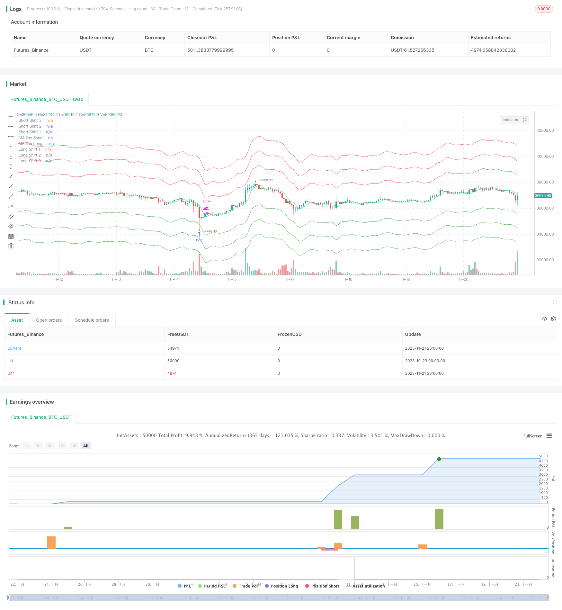

> Name

Moving-Average-Envelop-Channel-Trend-Following-Strategy
> Author

ChaoZhang

> Strategy Description



[trans]

## Overview
The Moving Average Envelop Channel Trend Following Strategy is a trend following strategy based on moving averages and channel indicators. It realizes the judgment and tracking of price trends by establishing multi-layer moving average channels. This strategy also combines the calculation of moving averages in different time periods to achieve the integration of multiple time frames and help capture larger trends.
## Strategy Principle
The core principle of this strategy is based on the trend following function of the moving average and the channel judgment of the Envelop indicator. The strategy builds a base moving average using configurable parameters such as moving average period, smoothing type, price source, and more. Then establish the upper and lower channels according to the percentage shift value set by the parameter. When the price breaks through the lower channel, go long; when the price breaks through the upper channel, go short. At the same time, the strategy introduces an independent moving average as a stop loss line.
Specifically, this strategy has the following characteristics:
1. Supports both long and short operations, and determines the trend direction through the upper and lower channels.
2. Up to 4 orders can be opened, and pyramid positions can be added through layering to pursue greater profits.
3. Independent opening moving averages and closing moving averages can be configured to achieve precise stop loss.
4. Supports moving average calculations in different time periods (1 minute to 1 day) to achieve multi-time frame integration.
5. The opening and closing moving average supports 6 different smoothing mode selections, which can be optimized for different varieties and periods.
6. Positive and negative offsets can be input for channel adjustment to pursue more precise breakthroughs.
The specific trading logic of this strategy is as follows:
1. Calculate the benchmark opening moving average, set the percentage according to the parameters, and get 4 breakthrough lines.
2. When the price breaks through the lower channel line, open long positions in sequence; when the price breaks through the upper channel line, open short positions in sequence.
3. Calculate an independent closing moving average as a stop loss line. When the price falls below the line again, the long orders will be stopped at a level-by-level basis; when the price rises below the line again, the short orders will be stopped at a level-by-level basis.
4. You can open up to 4 orders and add positions through layered pyramids to pursue greater profits.
It can be seen from the principle of this strategy that this strategy integrates elements such as trend tracking of moving averages, breakthrough signals of channel judgment, and independent stop loss line setting, forming a relatively rigorous and complete trend system.
## Advantage Analysis
According to the strategy code and logic analysis, this moving average envelope channel trend tracking strategy has the following advantages:
1. Multi-time frame fusion improves the probability of capturing large-level trends. The strategy supports the calculation of moving averages in different periods from 1 minute to 1 day, and can be configured to use different periods for opening and stop-loss moving averages. It integrates trend judgment in multiple time frames and is more conducive to capturing large-level trends.
2. Pyramid method of adding positions to pursue greater profits. The strategy can open up to 4 orders, balance the profit and loss ratio by adding positions in layers, and pursue greater profits while controlling risks.
3. 6 moving average modes are selectable and highly adaptable. The opening and stop-loss moving averages support 6 mode selections including SMA/EMA/dynamic moving average, which can be optimized for different varieties and cycles, thereby improving adaptability.
4. The channel line is adjustable and the breakthrough judgment is accurate. The strategy can input the channel movement percentage parameter and adjust the channel width, thereby optimizing for different varieties or market environments and improving the accuracy of breakthrough judgment.
5. Independent stop loss line helps risk control. The strategy calculates an independent moving average as the closing line and stops the loss of long or short orders, which can greatly reduce transaction risks and avoid chasing injections.
6. The code structure is clear and easy for secondary development. The strategy is written in Pine Script, and the code structure is clear and easy to understand and secondary development. Users can continue to optimize parameters or add other logic based on the existing framework.
## Risk Analysis
Although the overall logic of this strategy is rigorous and risk control is in place, there are still certain transaction risks that need to be paid attention to, including:
1. Risk of large-scale trend reversal. The core assumption of the strategy is that prices will continue to advance and there is a certain trend. However, when a large-level trend reverses, it will have a greater impact on strategy profitability. At this time, you need to stop the loss in time and control the loss.
2. Break through the risk of failure. In a consolidating or choppy market, prices may break below a channel line before breaking below it again. At this time, chase injection will occur, and parameters need to be optimized to reduce the occurrence of this situation.
3. Expectation management risk. The strategy sets up 4 layers of position additions in pursuit of greater profits. This results in significant gains when profits are made, but the expected value drops significantly when losses occur. This requires investors to have professional mentality management capabilities.
4. Signal tuning risks. The strategy involves the adjustment and optimization of multiple parameters, such as channel width, moving average period, etc., which requires professional quantitative analysts to have optimization experience to avoid the risk of over-fitting.
5. Special market risk. Extreme market conditions such as rapid gaps or short-term price limit days will significantly destroy the strategy logic. At this time, you need to pay attention to system risk indicators and stop losses in time.
In general, this strategy mainly relies on large-level trends to make profits, and is only suitable for varieties and market environments with long-term sustainability characteristics. In addition, multi-parameter optimization and mentality control are also keys to ensuring stable profitability of the strategy.
## Optimization direction
For this moving average envelope channel trend tracking strategy, its subsequent main optimization directions include:
1. Realize adaptive optimization of channel lines and stop loss lines based on machine learning algorithms. Algorithms such as LSTM and trajectory prediction can be used to train channel line and stop loss line models to achieve more intelligent price prediction and risk avoidance.
2. Optimize the logic of adding positions by combining sentiment indicators, portfolio position ratio and other auxiliary factors. Indicators such as absolute volatility and market sentiment can be added to judge, control portfolio risks, and optimize the logic of pyramid additions.
3. Introduce transaction cost and slippage models to improve the authenticity of backtesting. The current backtest does not consider the impact of transaction costs. This is an important factor in real trading and needs to be built into a mathematical model.
4. Expand the correlation analysis of similar varieties and build a unified risk control system. The existing single product strategy is extended to multiple similar markets such as commodities and digital currencies, and risk control is unified through correlation analysis to improve the stability of the strategy.
5. Increase strategy explanability and improve user ease of use. Use methods such as SHAP to analyze the impact of each input variable on the strategy results, and output importance rankings to make the strategy logic more transparent and explainable to users.
By introducing algorithmic means such as machine learning and multi-factor models, continuing to optimize the stability, authenticity and ease of use of the strategy will be the main direction for subsequent improvement of the strategy.
## Summarize
In general, this moving average envelope channel trend tracking strategy combines three core points: trend tracking of moving averages, trend judgment of channel indicators, and risk control of independent stop loss lines. In strictly trending markets, strategies can provide stable and certain breakthrough gains. However, users need to pay attention to the control of the large-scale market environment and do a good job in parameter tuning and risk management so that the strategy can adapt to complex and ever-changing trading markets. Overall, this strategy provides users with a relatively complete and rigorous trend tracking solution, and is a quantitative strategy framework that is very suitable for self-construction and secondary development.
||
## Overview

The moving average envelop channel trend following strategy is a trend following strategy based on moving average lines and channel indicators. It realizes the judgment and tracking of price trends by establishing multi-level moving average channel. The strategy also combines moving average calculations of different time frames to achieve multi-timeframe fusion, which helps capture larger trends.

## Strategy Logic

The core principle of this strategy is based on the trend tracking functionality of moving average lines and the channel judgment of Envelop indicators. The strategy uses configurable parameters such as moving average period, smooth type, price source, etc. to build a baseline moving average. Then the up and down channels are established according to the percentage shift values set by the parameters. When the price breaks through the lower channel, go long; when the price breaks through the upper channel, go short. At the same time, the strategy introduces an independent moving average as the stop loss line. 

Specifically, the strategy has the following characteristics:

1. Support both long and short operations, judge the trend direction through up and down channels.

2. Open up to 4 orders, implement pyramid order opening through polyline layers to pursue greater profits.

3. Configure independent opening moving average and closing moving average to achieve precise stop loss. 

4. Support moving average calculation of different time frames (1 minute to 1 day) to achieve multi-timeframe fusion.

5. The opening and closing moving averages support the selection of 6 different smoothing modes, which can be optimized for different varieties and cycles.

6. Positive and negative offsets can be entered to adjust channels and pursue more accurate breakthroughs.

The specific trading logic of the strategy is as follows:

1. Calculate the benchmark opening moving average, and obtain 4 breakthrough lines according to the set percentage of parameters.

2. When the price breaks through the lower channel line, open positions in order to go long; when the price breaks through the upper channel line, open positions in order to go short.

3. Calculate independent closing moving average as stop loss line. When the price falls below the line again, stop loss the long orders in layers; when the price rises above the line again, stop loss the short orders in layers. 

4. Up to 4 orders can be opened. Use layered pyramid order opening to pursue greater profits.

Through the principle of this strategy, it can be seen that the strategy integrates elements such as trend tracking of moving average lines, breakthrough signals of channel judgment, and setting of independent stop loss lines to form a relatively rigorous and complete trend system.

## Advantage Analysis 

According to the code and logical analysis, the moving average envelop channel trend following strategy has the following advantages:

1. Multi-timeframe fusion improves the probability of capturing large-scale trends. The strategy supports the calculation of moving averages of different cycles from 1 minute to 1 day. Configuring opening and stop-loss moving averages with different cycles achieves the fusion of multi-timeframe trend judgment power, which is more conducive to capturing large-scale trends.

2. Pyramid order opening method pursues greater profits. The strategy can open up to 4 orders. By layered order opening, it balances the profit ratio and pursues greater profits while controlling risks.

3. 6 types of moving averages are available for selection and adaptability is strong. The opening and stop-loss moving average supports the selection of 6 modes including SMA/EMA/Dynamic Moving Average, which can be optimized for different varieties and cycles to improve adaptability. 

4. Adjustable channel lines make breakthrough judgment more precise. Strategy allows input of channel moving percentage parameters to adjust channel width for optimization towards different varieties or market environments, improving the accuracy of breakthrough judgments.

5. Independent stop loss line is helpful for risk control. The strategy calculates an independent moving average line as the closing line to stop loss long or short orders, which can greatly reduce trading risks and avoid chasing by losing orders.

6. The code structure is clear and easy to develop secondly. The strategy is written in Pine Script with clear structure and easy to understand and develop secondly. Users can continue to optimize parameters or add other logic based on the existing framework.

## Risk Analysis

Although the overall strategy logic is rigorous and the risk control is in place, there are still some trading risks to be aware of, specifically including:

1. Large-scale trend reversal risk. The core assumption of the strategy is that prices will continue to advance steadily, with some trendiness. However, when large-scale trends reverse, it will have a greater impact on the profitability of the strategy. It is necessary to stop loss in time to control losses. 

2. Invalid breakthrough risk. In sideways or shock markets, prices may fall back below the channel line after breaking through, which will cause chasing by losing orders. Parameters need to be optimized to reduce such cases.

3. Expectation management risk. The strategy sets 4 layers of pyramiding orders to pursue greater profits, which results in significant returns during profit periods but also a sharp drop in expectations during loss periods. This requires investors to have professional psychological management skills.

4. Signal optimization risk. The strategy involves adjustments and optimizations across multiple parameters such as channel width and moving average cycle. This requires professional quants to have optimization experience to avoid overfitting. 

5. Special market conditions risk. Extreme market conditions like fast gaps or short line limits will greatly damage the strategy logic, so attention needs to be paid to systemic risk metrics for timely stop losses.

In general, the strategy relies mainly on large-scale trend gains for profitability, and only applies to varieties and market environments with long-term persistence characteristics. In addition, multi-parameter optimization and mentality control are also crucial to ensure stable profitability of strategies.

## Optimization Directions

For this moving average envelop channel trend following strategy, the main optimization directions include:

1. Adaptive optimization of channel lines and stop loss lines based on machine learning algorithms. Models like LSTM and trajectory prediction can be used to train channel and stop loss line models to achieve smarter price prediction and risk avoidance.

2. Incorporate auxiliary factors like sentiment indicators, portfolio weighting ratios to optimize pyramid logic. Factors like absolute volatility and market sentiment can be added to control portfolio risks and optimize pyramid order opening logic.

3. Introduce trading cost and slippage models to improve backtesting authenticity. Current backtesting does not consider the impact of trading costs, which is an important factor in real trading that needs to be incorporated into mathematical models.

4. Expand correlation analysis across similar asset classes to build unified risk control frameworks. Expand the current single asset strategy to multiple similar markets like commodities and cryptocurrencies, and unify risk control through correlation analysis to improve strategy stability. 

5. Increase strategy explanability to improve user friendless. Use methods like SHAP to analyze the importance of each input variable to strategy results, output importance rankings, and make strategy logic more transparent and interpretable to users.

Introducing algorithms like machine learning and multi-factor models to further optimize strategy stability, authenticity and usability is the main enhancement direction going forwards.

## Summary  

In summary, the moving average envelop channel trend following strategy integrates three key points: trend tracking of moving averages, trend identification of channel indicators and independent stop loss lines for risk control. In strict trending markets, the strategy can provide stable returns with reasonable amount of trend following profit. But users need to pay attention to macro market environments, optimize parameters properly and manage risks, so that the strategy can adapt to complex and ever-changing trading markets. Overall, the strategy provides users with a relatively complete and rigorous trend tracking solution, and is a very suitable quantitative strategy framework for proprietary development and secondary development.

[/trans]

> Strategy Arguments


|Argument|Default|Description|
|----|----|----|
|v_input_1|true|Calculate lot size with avgPrice shifts (HatiKO  calculate)|
|v_input_2|100|Lot short, %|
|v_input_3|100|Lot long, %|
|v_input_4|0|Timeframe Short: Current.|1m|3m|5m|10m|15m|20m|30m|45m|1H|2H|3H|4H|1D|
|v_input_5|0|MA Type Short: 1. SMA|2. PCMA|3. EMA|4. WMA|5. DEMA|6. ZLEMA|
|v_input_6|0|Data Short: 7.OHLC4|2.High|3.Low|4.Close|5.HL2|6.HLC3|1.Open|8.OC2|
|v_input_7|3|MA Length Short|
|v_input_8|false|MA offset Short|
|v_input_9|0|Timeframe Long: Current.|1m|3m|5m|10m|15m|20m|30m|45m|1H|2H|3H|4H|1D|
|v_input_10|0|MA Type Long: 1. SMA|2. PCMA|3. EMA|4. WMA|5. DEMA|6. ZLEMA|
|v_input_11|0|Data Long: 7.OHLC4|2.High|3.Low|4.Close|5.HL2|6.HLC3|1.Open|8.OC2|
|v_input_12|3|MA Length Long|
|v_input_13|false|MA offset Long|
|v_input_14|false|Mode close MA Short|
|v_input_15|0|Timeframe Short Close: Current.|1m|3m|5m|10m|15m|20m|30m|45m|1H|2H|3H|4H|1D|
|v_input_16|0|MA Type Close Short: 1. SMA|2. PCMA|3. EMA|4. WMA|5. DEMA|6. ZLEMA|
|v_input_17|0|Data Short Close: 7.OHLC4|2.High|3.Low|4.Close|5.HL2|6.HLC3|1.Open|8.OC2|
|v_input_18|3|MA Length Short Close|
|v_input_19|false|Short Deviation %|
|v_input_20|false|MA offset Short Close|
|v_input_21|false|Mode close MA Long|
|v_input_22|0|Timeframe Long Close: Current.|1m|3m|5m|10m|15m|20m|30m|45m|1H|2H|3H|4H|1D|
|v_input_23|0|MA Type Close Long: 1. SMA|2. PCMA|3. EMA|4. WMA|5. DEMA|6. ZLEMA|
|v_input_24|0|Data Long Close: 7.OHLC4|2.High|3.Low|4.Close|5.HL2|6.HLC3|1.Open|8.OC2|
|v_input_25|3|MA Length Long Close|
|v_input_26|false|Long Deviation %|
|v_input_27|false|MA offset Long Close|
|v_input_28|false|Short Shift 4|
|v_input_29|10|Short Shift 3|
|v_input_30|7|Short Shift 2|
|v_input_31|4|Short Shift 1|
|v_input_32|-4|Long Shift 1|
|v_input_33|-7|Long Shift 2|
|v_input_34|-10|Long Shift 3|
|v_input_35|false|Long Shift 4|
|v_input_36|false|Shift3 Long LotSize*2|
|v_input_37|false|Shift3 Short LotSize*2|
|v_input_38|19|From Year 20XX|
|v_input_39|99|To Year 20XX|
|v_input_40|true|From Month|
|v_input_41|12|To Month|
|v_input_42|true|From day|
|v_input_43|31|To day|


> Source (PineScript)

``` pinescript
/*backtest
start: 2023-10-23 00:00:00
end: 2023-11-22 00:00:00
period: 1h
basePeriod: 15m
exchanges: [{"eid":"Futures_Binance","currency":"BTC_USDT"}]
*/

// This source code is subject to the terms of the GNU Affero General Public License v3.0 at https://www.gnu.org/licenses/agpl-3.0.html
//@version=4
strategy(title = "HatiKO Envelopes", shorttitle = "HatiKO Envelopes", overlay = true, default_qty_type = strategy.percent_of_equity, default_qty_value = 100, pyramiding = 4, initial_capital=10, calc_on_order_fills=false)

//Settings
isLotSizeAvgShifts=input(true, title ="Calculate lot size with avgPrice shifts (HatiKO  calculate)")

lotsize_Short = input(100, defval = 100, minval = 0, maxval = 10000, title = "Lot short, %")
lotsize_Long = input(100, defval = 100, minval = 0, maxval = 10000, title = "Lot long, %")

//Shorts Open Config
timeFrame_Short =  input(defval = "Current.", options = ["Current.", "1m", "3m", "5m", "10m", "15m", "20m", "30m", "45m", "1H","2H","3H","4H","1D"], title = "Timeframe Short")
ma_type_Short = input(defval = "1. SMA", options = ["1. SMA", "2. PCMA", "3. EMA", "4. WMA", "5. DEMA", "6. ZLEMA"], title = "MA Type Short")
Short_Data_input = input(defval = "7.OHLC4", options = ["1.Open", "2.High", "3.Low", "4.Close", "5.HL2", "6.HLC3", "7.OHLC4", "8.OC2"], title = "Data Short")
len_Short = input(3, minval = 1, title = "MA Length Short")
offset_Short = input(0, minval = 0, title = "MA offset Short")

//Longs Open Config
timeFrame_Long =  input(defval = "Current.", options = ["Current.", "1m", "3m", "5m", "10m", "15m", "20m", "30m", "45m", "1H","2H","3H","4H","1D"], title = "Timeframe Long")
ma_type_Long = input(defval = "1. SMA", options = ["1. SMA", "2. PCMA", "3. EMA", "4. WMA", "5. DEMA", "6. ZLEMA"], title = "MA Type Long")
Long_Data_input = input(defval = "7.OHLC4", options = ["1.Open", "2.High", "3.Low", "4.Close", "5.HL2", "6.HLC3", "7.OHLC4", "8.OC2"], title = "Data Long")
len_Long = input(3, minval = 1, title = "MA Length Long")
offset_Long = input(0, minval = 0, title = "MA offset Long")

//Shorts Close Config
isEnableShortCustomClose=input(false, title ="Mode close MA Short")
timeFrame_close_Short = input(defval = "Current.", options = ["Current.", "1m", "3m", "5m", "10m", "15m", "20m", "30m", "45m", "1H","2H","3H","4H","1D"], title = "Timeframe Short Close")
ma_type_close_Short = input(defval = "1. SMA", options = ["1. SMA", "2. PCMA", "3. EMA", "4. WMA", "5. DEMA", "6. ZLEMA"], title = "MA Type Close Short")
Short_Data_input_close = input(defval = "7.OHLC4", options = ["1.Open", "2.High", "3.Low", "4.Close", "5.HL2", "6.HLC3", "7.OHLC4", "8.OC2"], title = "Data Short Close")
len_Short_close = input(3, minval = 1, title = "MA Length Short Close")
shortDeviation = input( 0.0, title = "Short Deviation %",step=0.1)
offset_Short_close = input(0, minval = 0, title = "MA offset Short Close")

//Longs Close Config
isEnableLongCustomClose=input(false, title ="Mode close MA Long")
timeFrame_close_Long =  input(defval = "Current.", options = ["Current.", "1m", "3m", "5m", "10m", "15m", "20m", "30m", "45m", "1H","2H","3H","4H","1D"], title = "Timeframe Long Close")
ma_type_close_Long = input(defval = "1. SMA", options = ["1. SMA", "2. PCMA", "3. EMA", "4. WMA", "5. DEMA", "6. ZLEMA"], title = "MA Type Close Long")
Long_Data_input_close = input(defval = "7.OHLC4", options = ["1.Open", "2.High", "3.Low", "4.Close", "5.HL2", "6.HLC3", "7.OHLC4", "8.OC2"], title = "Data Long Close")
len_Long_close = input(3, minval = 1, title = "MA Length Long Close")
longDeviation = input( -0.0, title = "Long Deviation %",step=0.1)
offset_Long_close = input(0, minval = 0, title = "MA offset Long Close")

shift_Short4_percent = input(0.0, title = "Short Shift 4")
shift_Short3_percent = input(10.0, title = "Short Shift 3")
shift_Short2_percent = input(7.0, title = "Short Shift 2")
shift_Short1_percent = input(4.0, title = "Short Shift 1")
shift_Long1_percent = input(-4.0, title = "Long Shift 1")
shift_Long2_percent = input(-7.0, title = "Long Shift 2")
shift_Long3_percent = input(-10.0, title = "Long Shift 3")
shift_Long4_percent = input( -0.0, title = "Long Shift 4")
isEnableDoubleLotShift3_Long=input(false, title ="Shift3 Long LotSize*2")
isEnableDoubleLotShift3_Short=input(false, title ="Shift3 Short LotSize*2")

year_Start = input(19, defval = 19, minval = 10, maxval = 99, title = "From Year 20XX")
year_End = input(99, defval = 99, minval = 10, maxval = 99, title = "To Year 20XX")
month_Start = input(01, defval = 01, minval = 01, maxval = 12, title = "From Month")
month_End = input(12, defval = 12, minval = 01, maxval = 12, title = "To Month")
day_Start = input(01, defval = 01, minval = 01, maxval = 31, title = "From day")
day_End = input(31, defval = 31, minval = 01, maxval = 31, title = "To day")

short4_isActive = shift_Short4_percent != 0 and lotsize_Short > 0
short3_isActive = shift_Short3_percent != 0 and lotsize_Short > 0
short2_isActive = shift_Short2_percent != 0 and lotsize_Short > 0
short1_isActive = shift_Short1_percent != 0 and lotsize_Short > 0
long1_isActive = shift_Long1_percent != 0 and lotsize_Long > 0
long2_isActive = shift_Long2_percent != 0 and lotsize_Long > 0
long3_isActive = shift_Long3_percent != 0 and lotsize_Long > 0
long4_isActive = shift_Long4_percent != 0 and lotsize_Long > 0

mult = 1 / syminfo.mintick
is_time_true = time > timestamp(2000+year_Start, month_Start, day_Start, 00, 00) and time < timestamp(2000+ year_End, month_End, day_End, 23, 59)

//MA
TFsecurity_Short = timeFrame_Short == "4H"?60*4:timeFrame_Short=="3H"?60*3:timeFrame_Short=="2H"?60*2:timeFrame_Short=="1H"?60:timeFrame_Short=="45m"?45:timeFrame_Short=="30m"?30:timeFrame_Short=="20m"?20:timeFrame_Short=="15m"?15:timeFrame_Short=="10m"?10:timeFrame_Short=="5m"?5:timeFrame_Short=="3m"?3:1
TFsecurity_Long = timeFrame_Long == "4H"?60*4:timeFrame_Long=="3H"?60*3:timeFrame_Long=="2H"?60*2:timeFrame_Long=="1H"?60:timeFrame_Long=="45m"?45:timeFrame_Long=="30m"?30:timeFrame_Long=="20m"?20:timeFrame_Long=="15m"?15:timeFrame_Long=="10m"?10:timeFrame_Long=="5m"?5:timeFrame_Long=="3m"?3:1

oc2 = (open + close) / 2
lag_Short = (len_Short - 1) / 2//floor((len_Short - 1) / 2)
lag_Long = (len_Long - 1) / 2 //floor((len_Long - 1) / 2)

source_Short = Short_Data_input == "1.Open" ? open : Short_Data_input == "2.High" ? high : Short_Data_input == "3.Low" ? low : Short_Data_input == "4.Close" ? close : Short_Data_input == "5.HL2" ? hl2 : Short_Data_input == "6.HLC3" ? hlc3 : Short_Data_input == "7.OHLC4" ? ohlc4 : Short_Data_input == "8.OC2" ? oc2: close
source_Long = Long_Data_input == "1.Open" ? open : Long_Data_input == "2.High" ? high : Long_Data_input == "3.Low" ? low : Long_Data_input == "4.Close" ? close : Long_Data_input == "5.HL2" ? hl2 : Long_Data_input == "6.HLC3" ? hlc3 : Long_Data_input == "7.OHLC4" ? ohlc4 : Long_Data_input == "8.OC2" ? oc2: close

preS_MA_Short = ma_type_Short == "1. SMA" ? sma(source_Short, len_Short) : ma_type_Short == "2. PCMA"? (highest(high, len_Short) + lowest(low, len_Short)) / 2 : ma_type_Short == "3. EMA" ? ema(source_Short, len_Short) : ma_type_Short == "4. WMA" ? wma(source_Short, len_Short) : ma_type_Short == "5. DEMA" ? (2 * ema(source_Short,len_Short) - ema(ema(source_Short,len_Short), len_Short)) : ma_type_Short == "6. ZLEMA" ? ema(source_Short + (source_Short - source_Short[lag_Short]), len_Short) : na
preS_MA_Long = ma_type_Long == "1. SMA" ? sma(source_Long, len_Long) :ma_type_Long == "2. PCMA"? (highest(high, len_Long) + lowest(low, len_Long)) / 2 : ma_type_Long == "3. EMA" ? ema(source_Long, len_Long) : ma_type_Long == "4. WMA" ? wma(source_Long, len_Long) : ma_type_Long == "5. DEMA" ? (2 * ema(source_Long,len_Long) - ema(ema(source_Long,len_Long), len_Long)) : ma_type_Long == "6. ZLEMA" ? ema(source_Long + (source_Long - source_Long[lag_Long]), len_Long) : na
pre_MA_Short = timeFrame_Short == "Current." ? preS_MA_Short : security(syminfo.tickerid, tostring(TFsecurity_Short), preS_MA_Short)
pre_MA_Long = timeFrame_Long == "Current." ? preS_MA_Long : security(syminfo.tickerid, tostring(TFsecurity_Long), preS_MA_Long)

MA_Short = (round(pre_MA_Short * mult) / mult)[offset_Short]
MA_Long = (round(pre_MA_Long * mult) / mult)[offset_Long]

Level_Long1 = long1_isActive ? round((MA_Long + MA_Long* shift_Long1_percent / 100) * mult) / mult : na
Level_Long2 = long2_isActive ? round((MA_Long + MA_Long* shift_Long2_percent / 100) * mult) / mult : na
Level_Long3 = long3_isActive ? round((MA_Long + MA_Long* shift_Long3_percent / 100) * mult) / mult : na
Level_Long4 = long4_isActive ? round((MA_Long + MA_Long* shift_Long4_percent / 100) * mult) / mult : na
Level_Short1 = short1_isActive ? round((MA_Short + MA_Short*shift_Short1_percent/ 100) * mult) / mult : na
Level_Short2 = short2_isActive ? round((MA_Short + MA_Short*shift_Short2_percent/ 100) * mult) / mult : na
Level_Short3 = short3_isActive ? round((MA_Short + MA_Short*shift_Short3_percent/ 100) * mult) / mult : na
Level_Short4 = short4_isActive ? round((MA_Short + MA_Short*shift_Short4_percent/ 100) * mult) / mult : na

//MA_Close
lag_Short_close = (len_Short_close - 1) / 2 //floor((len_Short_close - 1) / 2)
lag_Long_close = (len_Long_close - 1) / 2 //floor((len_Long_close - 1) / 2)

pre_PCMA_Short_close = (highest(high, len_Short_close) + lowest(low, len_Short_close)) / 2
pre_PCMA_Long_close = (highest(high, len_Long_close) + lowest(low, len_Long_close)) / 2

source_Short_close = Short_Data_input_close == "1.Open" ? open : Short_Data_input_close == "2.High" ? high : Short_Data_input_close == "3.Low" ? low : Short_Data_input_close == "4.Close" ? close : Short_Data_input_close == "5.HL2" ? hl2 : Short_Data_input_close == "6.HLC3" ? hlc3 : Short_Data_input_close == "7.OHLC4" ? ohlc4 : Short_Data_input_close == "8.OC2" ? oc2: close
source_Long_close = Long_Data_input_close == "1.Open" ? open : Long_Data_input_close == "2.High" ? high : Long_Data_input_close == "3.Low" ? low : Long_Data_input_close == "4.Close" ? close : Long_Data_input_close == "5.HL2" ? hl2 : Long_Data_input_close == "6.HLC3" ? hlc3 : Long_Data_input_close == "7.OHLC4" ? ohlc4 : Long_Data_input_close == "8.OC2" ? oc2: close

preS_MA_Short_close = ma_type_close_Short == "1. SMA" ? sma(source_Short_close, len_Short_close) : ma_type_close_Short == "2. PCMA"? (highest(high, len_Short_close) + lowest(low, len_Short_close)) / 2 : ma_type_close_Short == "3. EMA" ? ema(source_Short_close, len_Short_close) : ma_type_close_Short == "4. WMA" ? wma(source_Short_close, len_Short_close) : ma_type_close_Short == "5. DEMA" ? (2 * ema(source_Short_close,len_Short_close) - ema(ema(source_Short_close,len_Short_close), len_Short_close)) : ma_type_close_Short == "6. ZLEMA" ? ema(source_Short_close + (source_Short_close - source_Short_close[lag_Short_close]), len_Short_close) : na
preS_MA_Long_close = ma_type_close_Long == "1. SMA" ? sma(source_Long_close, len_Long_close) : ma_type_close_Long == "2. PCMA"? (highest(high, len_Long_close) + lowest(low, len_Long_close)) / 2 : ma_type_close_Long == "3. EMA" ? ema(source_Long_close, len_Long_close) : ma_type_close_Long == "4. WMA" ? wma(source_Long_close, len_Long_close) : ma_type_close_Long == "5. DEMA" ? (2 * ema(source_Long_close,len_Long_close) - ema(ema(source_Long_close,len_Long_close), len_Long_close)) : ma_type_close_Long == "6. ZLEMA" ? ema(source_Long_close + (source_Long_close - source_Long_close[lag_Long_close]), len_Long_close) : na

TFsecurity_close_Short=timeFrame_close_Short=="4H"?60*4:timeFrame_close_Short=="3H"?60*3:timeFrame_close_Short=="2H"?60*2:timeFrame_close_Short=="1H"?60:timeFrame_close_Short=="45m"?45:timeFrame_close_Short=="30m"?30:timeFrame_close_Short=="20m"?20:timeFrame_close_Short=="15m"?15:timeFrame_close_Short=="10m"?10:timeFrame_close_Short=="5m"?5:timeFrame_close_Short=="3m"?3:1
TFsecurity_close_Long=timeFrame_close_Long=="4H"?60*4:timeFrame_close_Long=="3H"?60*3:timeFrame_close_Long=="2H"?60*2:timeFrame_close_Long=="1H"?60:timeFrame_close_Long=="45m"?45:timeFrame_close_Long=="30m"?30:timeFrame_close_Long=="20m"?20:timeFrame_close_Long=="15m"?15:timeFrame_close_Long=="10m"?10:timeFrame_close_Long=="5m"?5:timeFrame_close_Long=="3m"?3:1

pre_MA_close_Short = isEnableShortCustomClose? security(syminfo.tickerid, timeFrame_close_Short=="Current."?timeframe.period:tostring(TFsecurity_close_Short), preS_MA_Short_close) : preS_MA_Short_close
pre_MA_close_Long = isEnableLongCustomClose?  security(syminfo.tickerid, timeFrame_close_Long=="Current."?timeframe.period:tostring(TFsecurity_close_Long), preS_MA_Long_close) : preS_MA_Long_close

MA_Short_close =  (round(pre_MA_close_Short * mult) / mult)[offset_Short_close]
MA_Long_close = (round(pre_MA_close_Long * mult) / mult)[offset_Long_close]

countShifts_Long = 0
countShifts_Long:=long1_isActive?countShifts_Long+1:countShifts_Long
countShifts_Long:=long2_isActive?countShifts_Long+1:countShifts_Long
countShifts_Long:=long3_isActive?countShifts_Long+1:countShifts_Long
countShifts_Long:=long4_isActive?countShifts_Long+1:countShifts_Long
avgPriceForLotShiftLong_Data_input = MA_Long+ (MA_Long*((shift_Long1_percent+shift_Long2_percent+shift_Long3_percent+shift_Long4_percent)/countShifts_Long/100))

countShifts_Short = 0
countShifts_Short:=short1_isActive?countShifts_Short+1:countShifts_Short
countShifts_Short:=short2_isActive?countShifts_Short+1:countShifts_Short
countShifts_Short:=short3_isActive?countShifts_Short+1:countShifts_Short
countShifts_Short:=short4_isActive?countShifts_Short+1:countShifts_Short
avgPriceForLotShiftShort_Data_input = MA_Short + (MA_Short*((shift_Short1_percent+shift_Short2_percent+shift_Short3_percent+shift_Short4_percent)/countShifts_Short/100))
strategy.initial_capital = 50000
balance=strategy.initial_capital + strategy.netprofit
lotlong = 0.0
lotshort = 0.0
lotlong := (balance / avgPriceForLotShiftLong_Data_input) * (lotsize_Long / 100)     //strategy.position_size == 0 ? (strategy.equity / close) * (lotsize_Long / 100) : lotlong[1]
lotshort := (balance / avgPriceForLotShiftShort_Data_input) * (lotsize_Short / 100)    //strategy.position_size == 0 ? (strategy.equity / close) * (lotsize_Short / 100) : lotshort[1]
lotlong:= lotlong>1000000000?1000000000:lotlong
lotshort:=lotshort>1000000000?1000000000:lotshort

if isLotSizeAvgShifts==false
    lotlong := (strategy.equity / open) * (lotsize_Long / 100) 
    lotshort := (strategy.equity / open) * (lotsize_Short / 100) 

value_deviationLong=0.0
value_deviationShort=0.0

if(isEnableLongCustomClose == false )
    MA_Long_close:=MA_Long
else 
    value_deviationLong := round(MA_Long_close * longDeviation /100 * mult) / mult
    
if(isEnableShortCustomClose == false )
    MA_Short_close:=MA_Short
else 
    value_deviationShort := round(MA_Short_close * shortDeviation /100 * mult) / mult

if MA_Short > 0 and lotshort > 0// and strategy.position_size<=0
    lotShort_Data_input = strategy.position_size < 0 ? round(abs(strategy.position_size) / lotshort) : 0.0
    strategy.entry("S1", strategy.short, lotshort, limit = Level_Short1, when = (lotShort_Data_input == 0  and short1_isActive and is_time_true ))

    lotShort_Data_input := strategy.position_size < 0 ? round(abs(strategy.position_size) / lotshort) : 0.0
    strategy.entry("S2", strategy.short, lotshort, limit = Level_Short2, when = (lotShort_Data_input <= 1 and short2_isActive and is_time_true ))

    lotshort3 = isEnableDoubleLotShift3_Short? lotshort*2 :lotshort
    lotShort_Data_input := strategy.position_size < 0 ? round(abs(strategy.position_size) / lotshort) : 0.0
    maxLotsshift3=isEnableDoubleLotShift3_Short?3:2
    strategy.entry("S3", strategy.short, lotshort3, limit = Level_Short3, when = (lotShort_Data_input <= maxLotsshift3 and short3_isActive and is_time_true ))

    lotShort_Data_input := strategy.position_size < 0 ? round(abs(strategy.position_size) / lotshort) : 0.0
    maxLotsshift4=isEnableDoubleLotShift3_Short?4:3
    strategy.entry("S4", strategy.short, lotshort, limit = Level_Short4, when = (lotShort_Data_input <= maxLotsshift4 and short4_isActive and is_time_true))
    
    strategy.exit("TPS", "S1" ,limit = MA_Short_close+value_deviationShort , when = is_time_true) 
    strategy.exit("TPS", "S2" ,limit = MA_Short_close+value_deviationShort , when = is_time_true) 
    strategy.exit("TPS", "S3" ,limit = MA_Short_close+value_deviationShort , when = is_time_true) 
    strategy.exit("TPS", "S4" ,limit = MA_Short_close+value_deviationShort , when = is_time_true) 
    
if MA_Long > 0 and lotlong > 0// and strategy.position_size>=0
    lotLong_Data_input = strategy.position_size > 0 ? round(strategy.position_size / lotlong) : 0.0
    strategy.entry("L1", strategy.long, lotlong, limit = Level_Long1, when = (lotLong_Data_input ==0 and long1_isActive and is_time_true))
    
    lotLong_Data_input := strategy.position_size > 0 ?  round(strategy.position_size / lotlong) : 0.0
    strategy.entry("L2", strategy.long, lotlong, limit = Level_Long2, when = ( lotLong_Data_input <= 1 and long2_isActive and is_time_true))
        
    lotlong3 = isEnableDoubleLotShift3_Long? lotlong*2 : lotlong 
    lotLong_Data_input := strategy.position_size > 0 ? round(strategy.position_size / lotlong) : 0.0
    maxLotsshift3=isEnableDoubleLotShift3_Long?3:2
    strategy.entry("L3", strategy.long, lotlong3, limit = Level_Long3, when = (lotLong_Data_input <= maxLotsshift3 and long3_isActive and is_time_true))
    
    maxLotsshift4=isEnableDoubleLotShift3_Long?4:3
    lotLong_Data_input := strategy.position_size > 0 ? round(strategy.position_size / lotlong) : 0.0
    strategy.entry("L4", strategy.long, lotlong, limit = Level_Long4, when = ( lotLong_Data_input<maxLotsshift4 and long4_isActive and is_time_true))
    
    strategy.exit( "TPL", "L1",limit = MA_Long_close+value_deviationLong, when = is_time_true) 
    strategy.exit( "TPL", "L2", limit = MA_Long_close+value_deviationLong, when = is_time_true) 
    strategy.exit( "TPL", "L3", limit = MA_Long_close+value_deviationLong, when = is_time_true) 
    strategy.exit( "TPL", "L4", limit = MA_Long_close+value_deviationLong, when = is_time_true) 
    
if (MA_Long_close < close)
    strategy.close("L1")
    strategy.close("L2")
    strategy.close("L3")
    strategy.close("L4")

if (MA_Short_close > close)
    strategy.close("S1")
    strategy.close("S2")
    strategy.close("S3")
    strategy.close("S4")
    
if time > timestamp(2000+year_End, month_End, day_End, 23, 59)
    strategy.close_all()
    strategy.cancel("L1")
    strategy.cancel("L2")
    strategy.cancel("L3")
    strategy.cancel("S1")
    strategy.cancel("S2")
    strategy.cancel("S3")
    
//Lines
colorlong = color.green
colorshort = color.red

value_long1 = long1_isActive ? Level_Long1 : na
value_long2 = long2_isActive ? Level_Long2 : na
value_long3 = long3_isActive ? Level_Long3 : na
value_long4 = long4_isActive ? Level_Long4 : na
value_short1 = short1_isActive ? Level_Short1 : na
value_short2 = short2_isActive ? Level_Short2 : na
value_short3 = short3_isActive ?Level_Short3 : na
value_short4 = short4_isActive? Level_Short4 : na

value_maShort_close= isEnableShortCustomClose ? MA_Short_close : na
value_maLong_close= isEnableLongCustomClose ? MA_Long_close : na

plot(value_maShort_close + value_deviationShort, offset = 1, color = color.orange, title = "MA line Short Close")

plot(value_short4, offset = 1, color = colorshort, title = "Short Shift 4")
plot(value_short3, offset = 1, color = colorshort, title = "Short Shift 3")
plot(value_short2, offset = 1, color = colorshort, title = "Short Shift 2")
plot(value_short1, offset = 1, color = colorshort, title = "Short Shift 1")
plot(countShifts_Short>0 and lotsize_Short>0 ? MA_Short:na, offset = 1, color = color.purple, title = "MA line Short")
plot(countShifts_Long>0 and lotsize_Long>0? MA_Long:na, offset = 1, color = color.lime, title = "MA line Long")
plot(value_long1, offset = 1, color = colorlong, title = "Long Shift 1")
plot(value_long2, offset = 1, color = colorlong, title = "Long Shift 2")
plot(value_long3, offset = 1, color = colorlong, title = "Long Shift 3")
plot(value_long4, offset = 1, color = colorlong, title = "Long Shift 4")

plot(value_maLong_close + value_deviationLong, offset = 1, color = color.blue, title = "MA line Long Close")
```

> Detail

https://www.fmz.com/strategy/433004

> Last Modified

2023-11-23 15:06:32
