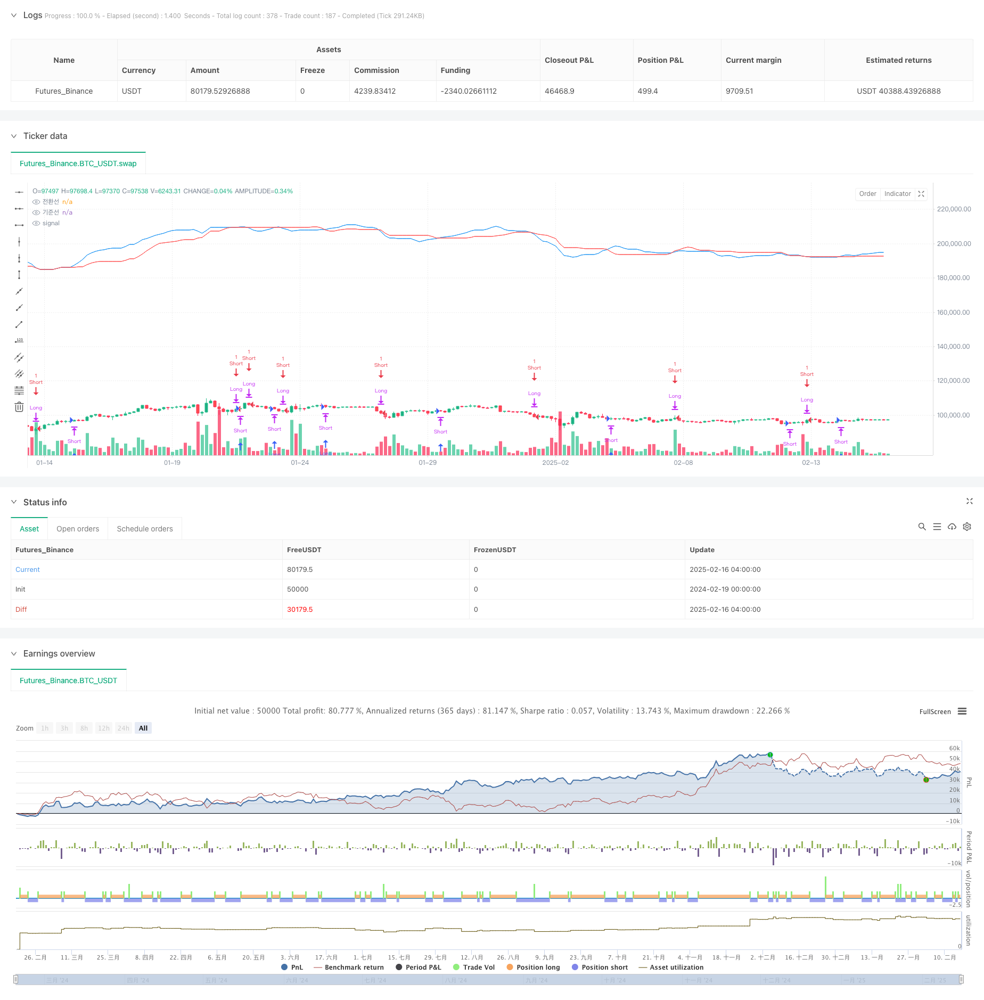

> Name

Dynamic-Ichimoku-Moving-Average-Crossover-Trend-Switching-Strategy
> Author

ChaoZhang

> Strategy Description



[trans]
#### Overview
This strategy is a dynamic trend following trading system based on the ichimoku cloud indicator. The core of the strategy is to identify changes in market trends by monitoring the intersection of the conversion line (Tenkan-sen) and the baseline (Kijun-sen), and convert long and short positions at the appropriate time. This strategy combines the reliability of the traditional ichimoku indicator with the flexibility of modern quantitative trading.
#### Strategy Principle
The working principle of the strategy is mainly based on the following key elements:
1. Calculate the conversion line and base line using the average of the highest price and lowest price of 9 periods and 26 periods.
2. Determine the market trend by judging the intersection direction of the conversion line and the base line
3. When the conversion line crosses the baseline, a golden cross signal is formed, triggering long or long position conversion.
4. When the conversion line crosses the baseline, a dead cross signal is formed, triggering short selling or short position conversion.
5. The strategy will automatically determine whether position conversion is needed based on the current position status.
#### Strategic Advantages
1. The signal system is stable and reliable: the ichimoku indicator has good reliability in trending markets
2. Dynamic position management: The strategy can automatically adjust the position direction according to market conditions.
3. Reasonable risk control: confirm the trend through moving average crossovers and reduce losses caused by false breakthroughs
4. Clear operation logic: clear entry and exit signals, convenient for backtesting and real-time operations
5. Strong adaptability: strategy parameters can be optimized and adjusted according to different market characteristics
#### Strategy Risk
1. Volatile market risk: False signals may frequently occur in a volatile market.
2. Slippage risk: You may face large slippage losses in rapid market conditions
3. Trend delay risk: there is a certain lag in the moving average crossover signal
4. Fund management risk: the size of funds for each transaction needs to be reasonably controlled
5. Market environment risk: Strategy performance may differ under different market environments.
#### Strategy optimization direction
1. Introducing trading volume indicators: the reliability of signals can be confirmed through trading volume
2. Add trend filter: combine with other technical indicators to filter out false signals
3. Optimize parameter selection: dynamically adjust the moving average period according to different market characteristics
4. Improve the stop loss mechanism: add dynamic stop loss to control risks
5. Increase market environment judgment: adjust strategy parameters based on volatility and other indicators
#### Summary
This strategy uses the intersection of the conversion line and the base line of the ichimoku indicator to capture the conversion opportunities of the market trend. It has the characteristics of clear logic and easy implementation. The advantage of the strategy is that it can automatically adapt to market changes and adjust the position direction in a timely manner. Although there are some inherent risks, through reasonable optimization and risk control measures, this strategy can obtain stable returns in trending markets. It is recommended that investors combine market characteristics and their own risk preferences in practical applications to optimize strategy parameters. ||
#### Overview
This strategy is a dynamic trend-following trading system based on the Ichimoku Cloud indicator. The core concept is to identify market trend changes by monitoring the crossover between the Conversion Line (Tenkan-sen) and Base Line (Kijun-sen), executing position switches between long and short at appropriate times. The strategy combines the reliability of traditional Ichimoku indicators with the flexibility of modern quantitative trading.

#### Strategy Principle
The strategy operates based on the following key elements:
1. Calculates Conversion and Base Lines using 9-period and 26-period high-low averages
2. Determines market trends through the direction of Conversion and Base Line crossovers
3. Generates golden cross signals for long entries or position switches when Conversion Line crosses above Base Line
4. Generates dead cross signals for short entries or position switches when Conversion Line crosses below Base Line
5. Automatically determines position switching needs based on current position status

#### Strategy Advantages
1. Stable and reliable signal system: Ichimoku indicator shows good reliability in trending markets
2. Dynamic position management: Strategy automatically adjusts position direction based on market conditions
3. Reasonable risk control: Confirms trends through moving average crossovers, reducing false breakout losses
4. Clear operational logic: Well-defined entry and exit signals, suitable for backtesting and live trading
5. High adaptability: Strategy parameters can be optimized for different market characteristics

#### Strategy Risks
1. Choppy market risk: May generate frequent false signals in sideways markets
2. Slippage risk: May face significant slippage losses in fast-moving markets
3. Trend delay risk: Moving average crossover signals have inherent lag
4. Money management risk: Requires proper control of position sizing
5. Market environment risk: Strategy performance may vary under different market conditions

#### Strategy Optimization Directions
1. Incorporate volume indicators: Confirm signal reliability using volume data
2. Add trend filters: Filter false signals by combining other technical indicators
3. Optimize parameter selection: Dynamically adjust moving average periods based on market characteristics
4. Improve stop-loss mechanism: Implement dynamic stop-losses for risk control
5. Enhanced market condition assessment: Adjust strategy parameters based on volatility metrics

#### Summary
This strategy captures market trend transitions through Ichimoku indicator's Conversion and Base Line crossovers, featuring clear logic and easy implementation. Its strength lies in automatically adapting to market changes and timely adjusting position direction. While inherent risks exist, the strategy can achieve stable returns in trending markets through proper optimization and risk control measures. Investors are advised to optimize strategy parameters based on market characteristics and individual risk preferences in practical applications.[/trans]


> Source (PineScript)

``` pinescript
/*backtest
start: 2024-02-19 00:00:00
end: 2025-02-16 08:00:00
period: 4h
basePeriod: 4h
exchanges: [{"eid":"Futures_Binance","currency":"BTC_USDT"}]
*/

// This Pine Script™ code is subject to the terms of the Mozilla Public License 2.0 at https://mozilla.org/MPL/2.0/
// © pyoungil0842

//@version=6

strategy("Ichimoku Crossover Strategy with Switching", overlay=true)

// 일목균형표의 요소 계산
tenkanLength = input(9, title="전환선 기간")
kijunLength = input(26, title="기준선 기간")

tenkan = ta.sma(ta.highest(high, tenkanLength) + ta.lowest(low, tenkanLength), 2)
kijun = ta.sma(ta.highest(high, kijunLength) + ta.lowest(low, kijunLength), 2)

// 현재 캔들에서 교차 신호 확인
goldenCross = (tenkan > kijun) and (tenkan[1] <= kijun[1]) // 전환선이 기준선을 상향 돌파
deadCross = (tenkan < kijun) and (tenkan[1] >= kijun[1]) // 전환선이 기준선을 하향 돌파

// 현재 포지션 상태
isLong = strategy.position_size > 0  // 롱 포지션 여부
isShort = strategy.position_size < 0 // 숏 포지션 여부

// 전략 매수/매도 조건
if (goldenCross)
    if (isShort) // 숏 포지션이 있을 경우 스위칭
        strategy.close("Short")
        strategy.entry("Long", strategy.long)
    else if (strategy.position_size == 0) // 포지션이 없을 경우 신규 진입
        strategy.entry("Long", strategy.long)

if (deadCross)
    if (isLong) // 롱 포지션이 있을 경우 스위칭
        strategy.close("Long")
        strategy.entry("Short", strategy.short)
    else if (strategy.position_size == 0) // 포지션이 없을 경우 신규 진입
        strategy.entry("Short", strategy.short)

// 차트에 전환선과 기준선 표시
plot(tenkan, color=color.blue, title="전환선")
plot(kijun, color=color.red, title="기준선")

```

> Detail

https://www.fmz.com/strategy/482445

> Last Modified

2025-02-18 14:51:56
