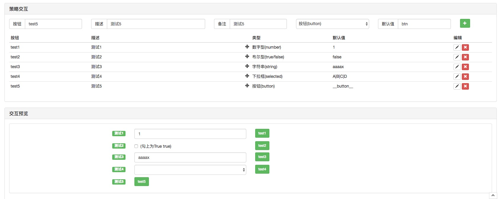

> Name

interactive template
> Author

Inventor Quantification-Little Dream
> Strategy Description

- test code
  
```
  // 测试代码
  function main() {
      $.BindingFunc("test1", function(cmd, param){                     // 绑定 控件名称为 test1 的按钮，function(cmd, param){...} 为该按钮的响应函数， 响应函数 第一个参数为 触发响应函数的控件名称即：test1
          var ticker = exchange.GetTicker()                            // 第二个 param 参数是 控件点击时 附带的 参数（数值类型、字符串类型、布尔类型、下拉框 都有附带参数，按钮类型没有附带参数）
          Log("控件：", cmd, "ticker:", ticker, " 参数:", param)
      })
      $.BindingFunc("test3", function(cmd, param){                     // 绑定 test3 ...
          var account = exchange.GetAccount()
          Log("account:", account, "cmd:", cmd, "param:", param)
      })
      $.BindingFunc("test5", function(){                               // 绑定 test5 ... 
          Log(exchange.GetName())
      })
      while(1){
          $.GetCommand()                                               // 主循环中 检测 交互命令。
          Sleep(2000)
      }
  }
  
```

- Interface functions
- Bind control response function
    $.BindingFunc(cmdControlName, function(cmd, param){...})
- Interaction detection function
    Replaces Platform API GetCommand() function
    $.GetCommand()    
- Screenshot of the control configured by the test code
  
- If you have any questions, please ask and leave a message.


> Source (javascript)

``` javascript
var _CmdMap = {}

$.BindingFunc = function(cmdName, cmdFunc) {
    _CmdMap[cmdName] = cmdFunc
}

$.GetCommand = function() {
    var cmd = GetCommand()
    if(cmd) {
        strArr = cmd.split(":")
        func = _CmdMap[strArr[0]]
        if(strArr.length == 1) {
            // 调用对应 命令的响应函数
            if(func) {
                func(strArr[0])
            }
        } else if(strArr.length == 2) {
            // 调用对应 命令的响应函数
            if(func) {
                func(strArr[0], strArr[1])
            }
        } else {
            var param = strArr[1]
            for(var i = 2; i < strArr.length; i++) {
                param += (":" + strArr[i])
            }
            
            // 调用对应 命令的响应函数
            if(func) {
                func(strArr[0], param)
            }
        }
        if(!func) {
            Log(strArr[0], "该命令未注册响应函数.", "#FF0000")
        }
    }
}

// 测试代码
function main() {
    $.BindingFunc("test1", function(cmd, param){                     // 绑定 控件名称为 test1 的按钮，function(cmd, param){...} 为该按钮的响应函数， 响应函数 第一个参数为 触发响应函数的控件名称即：test1
        var ticker = exchange.GetTicker()                            // 第二个 param 参数是 控件点击时 附带的 参数（数值类型、字符串类型、布尔类型、下拉框 都有附带参数，按钮类型没有附带参数）
        Log("控件：", cmd, "ticker:", ticker, " 参数:", param)
    })
    $.BindingFunc("test3", function(cmd, param){                     // 绑定 test3 ...
        var account = exchange.GetAccount()
        Log("account:", account, "cmd:", cmd, "param:", param)
    })
    $.BindingFunc("test5", function(){                               // 绑定 test5 ... 
        Log(exchange.GetName())
    })
    while(1){
        $.GetCommand()                                               // 主循环中 检测 交互命令。
        Sleep(2000)
    }
}
```

> Detail

https://www.fmz.com/strategy/137403

> Last Modified

2019-02-15 11:49:52
