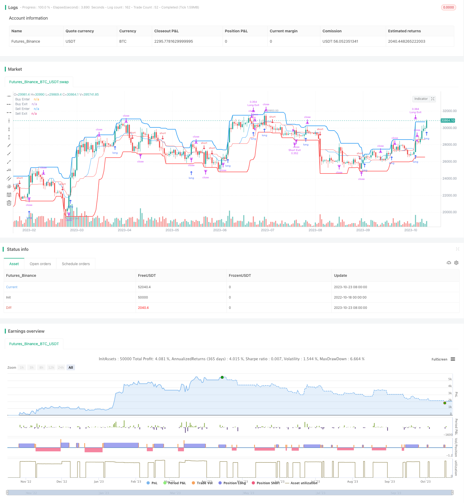

> Name

short-term-trading-strategy short-term channel breakout strategy
> Author

ChaoZhang

> Strategy Description



[trans]

## Overview
This strategy is a short-term trading strategy based on the channel indicator. It uses the breakthrough of the upper and lower rails of the channel to judge the beginning and end of the trend, and then make buying and selling decisions. In a strong trending market, this breakthrough strategy can yield better returns.
## Strategy Principle
1. This strategy first calculates the highest price and lowest price within a certain period, and constructs the upper and lower rails of the channel.
2. If the price rises and breaks through the upper track, enter the market long. If the price falls and breaks through the lower track, enter the market short.
3. Use trailing stop loss to control risk. The stop loss line is set to the center line of the channel.
4. There are two optional exit rules: return to the center line and trailing stop. The former achieves quick profit exit, while the latter controls risks.
5. You can select the channel cycle and adjust parameters such as stop loss range according to the market environment to optimize the strategy.
## Advantage Analysis
1. Simple operation and easy to implement. You only need to monitor the relationship between price and channel, and open and close positions according to the rules.
2. When trading with the trend, there is no risk of going against the trend.
3. The channel is clear and intuitive, forming a clear entry signal.
4. It has good profit potential and can usually obtain relatively satisfactory returns.
5. There are many adjustable parameters and can be optimized for different markets.
## Risk Analysis
1. Breakthrough may not be successful, and there is a risk of being trapped. Loss needs to be stopped in time.
2. Channels require a certain period of time to form and are not suitable for volatile market conditions.
3. Looking back at the midline stop loss of the channel may be too conservative to hold the trend.
4. Parameter optimization requires historical data support, and the real market may be over-optimized.
5. Mechanically buying and selling breakout points may increase the number of trades and the cost of slippage.
## Optimization direction
1. Evaluate the effects of different cycle parameters and select the best channel cycle.
2. Test the return to midline stop loss and trailing stop loss, and choose a more appropriate exit mechanism.
3. Optimize the stop loss range and reduce the probability of the stop loss being triggered.
4. Add trend filtering to avoid inappropriate breakout trades.
5. Consider increasing the position, but control the risks.
## Summarize
Overall, this strategy is a relatively mature short-term breakthrough strategy. It has clear entry rules, risk control measures in place, and good operating results. Strategy performance can be further improved through parameter optimization. However, there are still some inherent shortcomings that need to be noted and need to be adjusted for different markets. If the system uses this strategy, the overall income should be guaranteed.
|| 

## Overview

This is a short-term trading strategy based on channel breakouts. It uses the breakouts of channel's upper and lower rail to determine the start and end of trends, and make trading decisions accordingly. In strong trending markets, this breakout strategy can generate decent profits.  

## Strategy Logic

1. The strategy first calculates the highest high and lowest low over a certain period to build the upper and lower rail of the channel.

2. If price breaks out above the upper rail, go long. If price breaks below the lower rail, go short. 

3. Use a moving stop loss to control risks. The stop loss is set at the middle line of the channel.

4. There are two optional exit rules: revert to the middle line or follow the moving stop loss. The former realizes profit quickly while the latter controls risks.

5. The channel period and other parameters can be tuned to optimize the strategy for different market conditions.

## Advantage Analysis 

1. Simple to implement. Just monitor the price-channel relationship and follow the rules to trade.

2. Trade along the trend, no counter-trend risks. 

3. Clear and intuitive channel gives explicit entry signals.

4. Good profit margin, can achieve satisfactory returns in most cases.

5. Many adjustable parameters for optimization across different markets.

## Risk Analysis

1. Breakout may fail, risks of being trapped exist. Timely stop loss needed.

2. Channel needs a period to form, not suitable for range-bound markets. 

3. Revert to middle stop loss may be too conservative, unable to hold trends.

4. Parameter optimization needs historical data, overfitting possible in live trading.

5. Mechanical trading of breakout points may increase trade frequency and slippage costs.

## Optimization Directions

1. Evaluate channels of different periods and select the optimal one.

2. Test reverting to middle and moving stop loss to find a better exit mechanism. 

3. Optimize the stop loss percentage to reduce chances of being stopped out. 

4. Add trend filter to avoid inappropriate breakout trades.

5. Consider increasing position size but control risks.

## Summary

Overall this is a mature short-term breakout strategy. It has clear entry rules, proper risk control, and works well in general. Further improvement can be achieved through parameter tuning. But inherent limitations should be noted, adjustments needed for different markets. If used systematically, it should deliver consistent overall profits.

[/trans]

> Strategy Arguments


|Argument|Default|Description|
|----|----|----|
|v_input_1|13|Channel Period for Long position|
|v_input_2|18|Channel Period for Short position|
|v_input_3|true|Is exit on Base Line?|
|v_input_4|46|Take Profit (%) for position|
|v_input_5|9|Stop Loss (%) for position|
|v_input_6|2005|Test Start Year|
|v_input_7|true|Test Start Month|
|v_input_8|true|Test Start Day|
|v_input_9|2050|Test End Year|
|v_input_10|12|Test End Month|
|v_input_11|30|Test End Day|


> Source (PineScript)

``` pinescript
/*backtest
start: 2022-10-18 00:00:00
end: 2023-10-24 00:00:00
period: 1d
basePeriod: 1h
exchanges: [{"eid":"Futures_Binance","currency":"BTC_USDT"}]
*/

// This source code is subject to the terms of the Mozilla Public License 2.0 at https://mozilla.org/MPL/2.0/
// Strategy testing and optimisation for free Bitmex trading bot 
// © algotradingcc 

//@version=4
strategy("Channel Break [for free bot]", overlay=true, default_qty_type= strategy.percent_of_equity, initial_capital = 1000, default_qty_value = 20, commission_type=strategy.commission.percent, commission_value=0.075)

//Options
buyPeriod = input(13, "Channel Period for Long position")
sellPeriod = input(18, "Channel Period for Short position")
isMiddleExit = input(true, "Is exit on Base Line?")
takeProfit = input(46, "Take Profit (%) for position")
stopLoss = input(9, "Stop Loss (%) for position")

// Test Start
startYear = input(2005, "Test Start Year")
startMonth = input(1, "Test Start Month")
startDay = input(1, "Test Start Day")
startTest = timestamp(startYear,startMonth,startDay,0,0)

//Test End
endYear = input(2050, "Test End Year")
endMonth = input(12, "Test End Month")
endDay = input(30, "Test End Day")
endTest = timestamp(endYear,endMonth,endDay,23,59)

timeRange = time > startTest and time < endTest ? true : false

// Long&Short Levels
BuyEnter = highest(buyPeriod)
BuyExit = isMiddleExit ? (highest(buyPeriod) + lowest(buyPeriod)) / 2: lowest(buyPeriod)

SellEnter = lowest(sellPeriod)
SellExit = isMiddleExit ? (highest(sellPeriod) + lowest(sellPeriod)) / 2: highest(sellPeriod)

// Plot Data
plot(BuyEnter, style=plot.style_line, linewidth=2, color=color.blue, title="Buy Enter")
plot(BuyExit, style=plot.style_line, linewidth=1, color=color.blue, title="Buy Exit", transp=50)
plot(SellEnter, style=plot.style_line, linewidth=2, color=color.red, title="Sell Enter")
plot(SellExit, style=plot.style_line, linewidth=1, color=color.red, title="Sell Exit", transp=50)

// Calc Take Profits & Stop Loss
TP = 0.0
SL = 0.0
if strategy.position_size > 0
    TP := strategy.position_avg_price*(1 + takeProfit/100)
    SL := strategy.position_avg_price*(1 - stopLoss/100)

if strategy.position_size > 0 and SL > BuyExit
    BuyExit := SL
    
if strategy.position_size < 0
    TP := strategy.position_avg_price*(1 - takeProfit/100)
    SL := strategy.position_avg_price*(1 + stopLoss/100)

if strategy.position_size < 0 and SL < SellExit
    SellExit := SL
    
    
// Long Position    
if timeRange and strategy.position_size <= 0
    strategy.entry("Long", strategy.long, stop = BuyEnter)
strategy.exit("Long Exit", "Long", stop=BuyExit, limit = TP, when = strategy.position_size > 0)


// Short Position
if timeRange and strategy.position_size >= 0
    strategy.entry("Short", strategy.short, stop = SellEnter)
    
strategy.exit("Short Exit", "Short", stop=SellExit, limit = TP, when = strategy.position_size < 0)

// Close & Cancel when over End of the Test
if time > endTest
    strategy.close_all()
    strategy.cancel_all()

```

> Detail

https://www.fmz.com/strategy/430143

> Last Modified

2023-10-25 14:40:21
