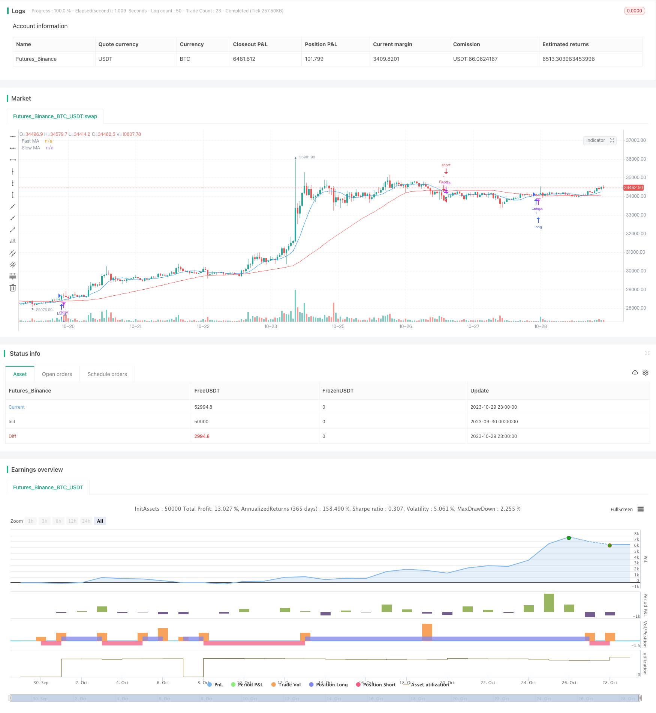

> Name

trend-following-strategy-based-on-moving-averages
> Author

ChaoZhang

> Strategy Description



[trans]

## Overview
The double moving average crossover strategy is a trend following strategy based on moving averages. This strategy determines the market trend direction by calculating moving averages of different periods to issue buy and sell signals. This strategy uses the intersection of fast moving averages and slow moving averages to form trading signals. When the fast line crosses the slow line, take a bullish stance to buy; when the fast line crosses below the slow line, take a bearish stance to sell.
## Strategy Principle
This strategy mainly relies on moving average crossovers to form trading signals. Specifically, the strategy includes the following steps:
1. Calculate fast moving average and slow moving average. The fast moving average period is 10, and the slow moving average period is 50.
2. Determine the moving average relationship. When the fast moving average crosses the slow moving average, a buy signal is generated; when the fast moving average crosses below the slow moving average, a sell signal is generated.
3. Issue buy and sell signals. When a buy signal is generated, a long position is entered; when a sell signal is generated, a short position is entered.
4. Set stop loss and take profit. After entering the trade, set the stop loss and take profit levels according to the entered stop loss percentage to achieve risk control.
This strategy compares changes in price trends in different time periods to determine whether the market is currently in an upward trend or a downward trend. It is a typical trend following strategy. Since moving averages can filter out market noise, trading signals are more reliable.
## Strategic Advantages
- Utilize the trend tracking characteristics of moving averages to effectively capture medium and long-term trends.
- Moving average crossover signals are simple, clear and easy to execute.
- You can customize the periods of fast and slow lines and optimize parameter combinations.
- Use stop-loss and stop-profit methods to limit the losses of individual orders.
## Strategy Risk
- When the market is in a volatile situation, it is easy to generate frequent trading signals, resulting in over-trading.
- The moving average is lagging and short-term opportunities may be missed.
- The impact of unexpected events, such as major bad news, is not considered.
- Without a fund management mechanism, it is easy to cause losses that exceed risk tolerance.
Risk control measures:
1. Optimize the moving average cycle and reduce false signals in volatile markets.
2. Combine with other indicators as filter conditions to avoid the problem of moving average lag. 
3. Add message surface analysis as an assistant.
4. Set stop loss and position size control to control single losses.
## Strategy optimization
- Consider using the moving average system in combination with other analysis tools, such as channels, patterns, etc., to improve the quality of trading signals.
- Optimize the parameters of fast and slow lines to find the best combination. Generally, the fast line cycle is between 10 and 30 days, and the slow line cycle is between 20 and 120 days.
- Added position management mechanism. If you adopt the fixed proportion incremental method, you can obtain better profits in the trend.
- Increase the judgment of emergencies. When major negative news is released, you may consider suspending trading to avoid unusually large losses.
- Conduct backtesting and simulated trading, evaluate strategy performance, and continuously improve the strategy system.
## Summarize
The double moving average crossover strategy determines the current trend direction of the market by comparing the intersection of fast moving averages and slow moving averages. It is a simple and practical trend following strategy. The advantage of this strategy is that the trading signal is clear and easy to implement, but it also has some limitations. We can improve this strategy by optimizing parameters, adding filter conditions, and combining other tools to obtain better returns while controlling risks.
||


## Overview

The dual moving average crossover strategy is a trend-following strategy based on moving averages. It generates trading signals by calculating moving averages of different periods and identifying crossovers. This strategy uses a fast moving average and a slow moving average to form signals. When the fast MA crosses above the slow MA, it takes a bullish stance and buys. When the fast MA crosses below the slow MA, it takes a bearish stance and sells.

## Strategy Logic

This strategy mainly relies on MA crossovers to generate trading signals. Specifically, it involves the following steps:

1. Calculate the fast MA and slow MA. The fast MA period is 10, and the slow MA period is 50. 

2. Identify MA relationships. A buy signal is generated when the fast MA crosses above the slow MA. A sell signal is generated when the fast MA crosses below the slow MA.

3. Issue buy and sell signals. Go long when a buy signal occurs. Go short when a sell signal occurs.

4. Set stop loss and take profit. After entering a trade, set the stop loss based on the input percentage and take profit to manage risks.

By comparing price trend changes across different timeframes, this strategy determines whether the market is currently in an uptrend or downtrend. It is a typical trend-following strategy. MAs filter out market noise and generate more reliable trading signals.

## Advantages

- Effectively captures mid to long-term trends using the inherent trend-following nature of MAs.

- Simple and clear crossover signals that are easy to implement. 

- Customizable fast and slow periods for parameter optimization.

- Limits losses on individual trades through stop loss.

## Risks

- Prone to whipsaws and overtrading in range-bound markets.

- MAs have lag and may miss short-term opportunities. 

- Does not account for sudden events like significant bearish news.

- Lacks risk management mechanisms and could lead to losses beyond risk tolerance.

Risk Management:

1. Optimize MA periods to reduce false signals during consolidations.

2. Add other indicators as filters to address MA lag.

3. Supplement with news analytics. 

4. Implement stop loss and position sizing to limit losses.

## Enhancements

- Combine with other analytical tools like channels and patterns to improve signal quality.

- Optimize fast and slow MA parameters to find best combinations. 10-30 days for fast MA and 20-120 days for slow MA often work well. 

- Add position sizing rules. Fixed fractional position sizing can improve profits in trends.

- Incorporate logic to handle sudden events like halting trading after major bearish news.

- Backtest and paper trade to evaluate performance and continuously improve the system.

## Summary

The dual moving average crossover strategy identifies trend direction by comparing fast and slow MA crossovers. It is a simple and practical trend-following approach. While effective, it has some limitations that can be addressed through optimizations like parameter tuning, adding filters, and incorporating other tools. With appropriate risk control, this strategy can provide good returns.

[/trans]

> Strategy Arguments


|Argument|Default|Description|
|----|----|----|
|v_input_1|10|Fast MA Length|
|v_input_2|50|Slow MA Length|
|v_input_3|true|Stop Loss Percentage|


> Source (PineScript)

``` pinescript
/*backtest
start: 2023-09-30 00:00:00
end: 2023-10-30 00:00:00
period: 1h
basePeriod: 15m
exchanges: [{"eid":"Futures_Binance","currency":"BTC_USDT"}]
*/

//@version=4
strategy("Simple Moving Average Crossover", overlay=true)

// Input parameters
fast_length = input(10, title="Fast MA Length")
slow_length = input(50, title="Slow MA Length")
stop_loss_pct = input(1, title="Stop Loss Percentage", minval=0, maxval=5) / 100

// Calculate moving averages
fast_ma = sma(close, fast_length)
slow_ma = sma(close, slow_length)

// Plot moving averages
plot(fast_ma, color=color.blue, title="Fast MA")
plot(slow_ma, color=color.red, title="Slow MA")

// Strategy logic
long_condition = crossover(fast_ma, slow_ma)
short_condition = crossunder(fast_ma, slow_ma)

// Execute trades
if (long_condition)
    strategy.entry("Long", strategy.long)

if (short_condition)
    strategy.entry("Short", strategy.short)

// Set stop loss
long_stop_price = close * (1 - stop_loss_pct)
short_stop_price = close * (1 + stop_loss_pct)

strategy.exit("Stop Loss/Profit", from_entry="Long", stop=long_stop_price)
strategy.exit("Stop Loss/Profit", from_entry="Short", stop=short_stop_price)

```

> Detail

https://www.fmz.com/strategy/430658

> Last Modified

2023-10-31 14:00:47
