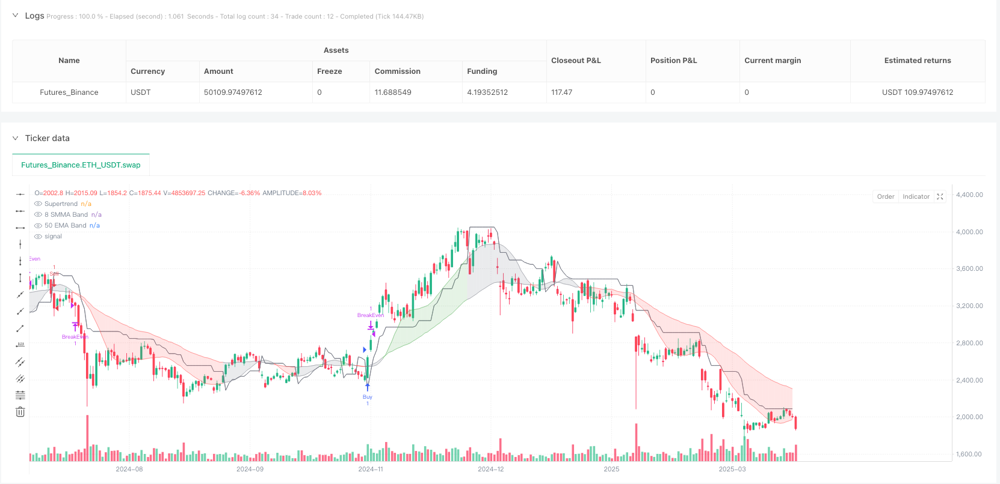
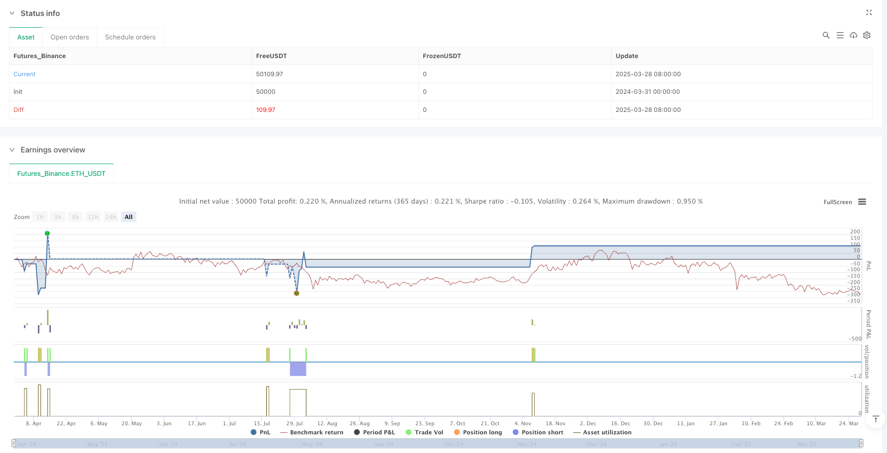

> Name

Optimized-ATR-Based-Trend-Strategy-v6-Fixed-Trend-Capture
> Author

ianzeng123

> Strategy Description





[trans]

#### Overview
This is an average true range (ATR)-based trend following strategy designed to capture high-probability trades by combining multiple technical indicators. The strategy incorporates ATR filtering, Super Trend Indicators, Exponential Moving Average (EMA) and Simple Moving Average (SMMA) trend bands, Relative Strength Index (RSI) confirmation, and a dynamic stop-loss system to provide a comprehensive and flexible trading approach.
#### Strategy Principle
The core principle of the strategy is based on the synergy of multiple technical indicators:
1. Trend identification: Use the super trend indicator (parameters: factor 2, length 5) and the 50-day EMA and 8-day SMMA trend bands to define the market trend direction. Trends are color coded:
   - Green: Bullish trend
   - Red: Bearish trend
   - Gray: Neutral stage
2. ATR smart filtering: Detect volatility expansion through the 14-period ATR and 50-period simple moving average, and only trade when the ATR rises or is above 101% of its SMA, ensuring that you only enter the market during strong trends.
3. Admission conditions:
   - Long entry: price above 50-day EMA, bullish supertrend, RSI > 45, ATR confirms trend strength
   - Short Entry: Price below 50-day EMA, supertrend bearish, RSI < 45, ATR confirms trend strength
4. Dynamic stop loss and take profit:
   - Take profit: Adaptive take profit based on 5 times ATR
   - Stop loss: trailing stop loss of 3.5 times ATR
   - Capital-guaranteed stop-loss: starts after the price moves 2 times ATR
   - Fixed Stop Loss: Use 0.8x ATR multiplier for risk management
#### Strategic Advantages
1. Effectively filter volatile markets and avoid trading in low-volatility areas
2. Prevent over-trading and avoid premature re-entry through the take-profit locking mechanism
3. Capture strong trends and trailing stops allow profits to continue
4. Reduce retracement and use ATR basic stop loss to prevent large losses.
5. Adjustable parameters, ATR multiplier, stop loss, take profit and RSI filter can be fine-tuned for different markets
#### Strategy Risk
1. Over-reliance on technical indicators can lead to false signals
2. May underperform in volatile markets
3. Improper parameter settings may increase transaction costs
4. RSI Confirmation May Miss Rapid Trend Changes
#### Strategy optimization direction
1. Introduce machine learning algorithms and dynamically adjust parameters
2. Add additional filters, such as volume confirmation
3. Explore optimal parameter combinations for different markets and time frames
4. Develop a multi-timeframe verification mechanism
#### Summarize
This is an advanced trend following strategy that provides traders with a flexible and powerful trading tool through multi-indicator synergy and dynamic risk management. Continuous backtesting and optimization are key to successfully applying this strategy.
|| #### Overview

This is an Average True Range (ATR)-based trend-following strategy designed to capture high-probability trades by combining multiple technical indicators. The strategy integrates ATR filtering, Supertrend indicator, Exponential Moving Average (EMA) and Simple Moving Average (SMMA) trend bands, Relative Strength Index (RSI) confirmation, and a dynamic stop-loss system, aiming to provide a comprehensive and flexible trading approach.

#### Strategy Principles

The core principle is based on the synergistic action of multiple technical indicators:

1. Trend Identification: Using Supertrend indicator (parameters: factor 2, length 5) and 50-day EMA with 8-day SMMA trend bands to define market trend direction. Trends are color-coded:
   - Green: Bullish trend
   - Red: Bearish trend
   - Gray: Neutral phase

2. ATR Smart Filtering: Detecting volatility expansion through 14-period ATR and 50-period Simple Moving Average, trading only when ATR is rising or above 101% of its SMA, ensuring entries only in strong trends.

3. Entry Conditions:
   - Long Entry: Price above 50-day EMA, Supertrend bullish, RSI > 45, ATR confirms trend strength
   - Short Entry: Price below 50-day EMA, Supertrend bearish, RSI < 45, ATR confirms trend strength

4. Dynamic Stop-Loss and Take-Profit:
   - Take-Profit: Adaptive based on 5x ATR
   - Stop-Loss: Trailing stop-loss at 3.5x ATR
   - Break-Even Stop: Activated after price moves 2x ATR
   - Fixed Stop-Loss: Risk management using 0.8x ATR multiplier

#### Strategy Advantages

1. Effectively filter volatile markets, avoiding trading in low volatility zones
2. Prevent over-trading through take-profit lock mechanism
3. Capture strong trends, allowing profits to run with trailing stop-loss
4. Reduce drawdowns with ATR-based stop-loss
5. Adjustable parameters for fine-tuning across different markets

#### Strategy Risks

1. Over-reliance on technical indicators may lead to false signals
2. Potential poor performance in ranging markets
3. Improper parameter settings may increase trading costs
4. RSI confirmation might miss rapid trend changes

#### Strategy Optimization Directions

1. Integrate machine learning algorithms for dynamic parameter adjustment
2. Add additional filters like volume confirmation
3. Explore optimal parameter combinations across different markets and timeframes
4. Develop multi-timeframe verification mechanisms

#### Conclusion

This is an advanced trend-following strategy that provides traders with a flexible and powerful trading tool through multi-indicator synergy and dynamic risk management. Continuous backtesting and optimization are key to successful application.[/trans]


> Source (PineScript)

``` pinescript
/*backtest
start: 2024-03-31 00:00:00
end: 2025-03-29 08:00:00
period: 1d
basePeriod: 1d
exchanges: [{"eid":"Futures_Binance","currency":"ETH_USDT"}]
*/

//@version=6
strategy("Optimized ATR-Based Trend Strategy v6 (Fixed Trend Capture)", overlay=true)

// ? Input parameters
lengthSMMA = input(8, title="SMMA Length")
lengthEMA = input(50, title="EMA Length")
supertrendFactor = input(2.0, title="Supertrend Factor")
supertrendLength = input(5, title="Supertrend Length")
atrLength = input(14, title="ATR Length")  
atrSmoothing = input(50, title="ATR Moving Average Length")  
atrMultiplierTP = input.float(5.0, title="ATR Multiplier for Take-Profit", minval=1.0, step=0.5)  
atrMultiplierTSL = input.float(3.5, title="ATR Multiplier for Trailing Stop-Loss", minval=1.0, step=0.5)  // ? Increased to ride trends
atrStopMultiplier = input.float(0.8, title="ATR Stop Multiplier", minval=0.5, step=0.1)  
breakEvenMultiplier = input.float(2.0, title="Break-Even Trigger ATR Multiplier", minval=1.0, step=0.1)
rsiLength = input(14, title="RSI Length")  

// ? Indicator calculations
smma8 = ta.sma(ta.sma(close, lengthSMMA), lengthSMMA)  
ema50 = ta.ema(close, lengthEMA)  

// ? Supertrend Calculation
[superTrend, _] = ta.supertrend(supertrendFactor, supertrendLength)

// ? Supertrend Conditions
isBullishSupertrend = close > superTrend
isBearishSupertrend = close < superTrend

// ? ATR Calculation for Smarter Filtering
atrValue = ta.atr(atrLength)
atrMA = ta.sma(atrValue, atrSmoothing)
atrRising = ta.rising(atrValue, 3)  // ? More sensitive ATR detection
isTrending = atrValue > atrMA * 1.01 or atrRising  // ? Loosened ATR filter

// ? RSI Calculation
rsi = ta.rsi(close, rsiLength)

// ? RSI Conditions (More Flexible)
isRSIBullish = rsi > 45  // ? Lowered to capture early trends
isRSIBearish = rsi < 45  

// ? TP Lock Mechanism
var bool tpHit = false  
if strategy.position_size == 0 and strategy.closedtrades > 0
    tpHit := true  

// ? Supertrend Flip Detection (Resumes Trading After Trend Change)
trendFlip = (isBullishSupertrend and not isBullishSupertrend[1]) or (isBearishSupertrend and not isBearishSupertrend[1])
if trendFlip
    tpHit := false  

// ? Entry Conditions
bullishEntry = close > ema50 and isBullishSupertrend and isRSIBullish and isTrending and not tpHit
bearishEntry = close < ema50 and isBearishSupertrend and isRSIBearish and isTrending and not tpHit

// ? Dynamic Take-Profit, Stop-Loss, and Break-Even Stop
longTakeProfit = close + (atrValue * atrMultiplierTP)  
shortTakeProfit = close - (atrValue * atrMultiplierTP)  
longTrailStop = atrValue * atrMultiplierTSL  
shortTrailStop = atrValue * atrMultiplierTSL  

// ✅ Adjusted SL to Reduce Drawdown
longStopLoss = close - (atrValue * atrMultiplierTSL * atrStopMultiplier)
shortStopLoss = close + (atrValue * atrMultiplierTSL * atrStopMultiplier)

// ✅ Break-Even Stop Trigger (More Room for Trends)
longBreakEven = strategy.position_avg_price + (atrValue * breakEvenMultiplier)
shortBreakEven = strategy.position_avg_price - (atrValue * breakEvenMultiplier)

// ? Strategy Execution (Fixed Take-Profit & Stop-Loss)
if (bullishEntry)
    strategy.entry("Buy", strategy.long)
    strategy.exit("TSL/TP", from_entry="Buy", stop=longStopLoss, trail_offset=longTrailStop, limit=longTakeProfit)
    strategy.exit("BreakEven", from_entry="Buy", stop=longBreakEven)

if (bearishEntry)
    strategy.entry("Sell", strategy.short)
    strategy.exit("TSL/TP", from_entry="Sell", stop=shortStopLoss, trail_offset=shortTrailStop, limit=shortTakeProfit)
    strategy.exit("BreakEven", from_entry="Sell", stop=shortBreakEven)

// ? Trend Band
trendColor = isBullishSupertrend and smma8 > ema50 and close > ema50 ? color.green :
             isBearishSupertrend and smma8 < ema50 and close < ema50 ? color.red : color.gray
fill(plot(smma8, color=color.new(trendColor, 60), title="8 SMMA Band"),
     plot(ema50, color=color.new(trendColor, 60), title="50 EMA Band"),
     color=color.new(trendColor, 80), title="Trend Band")

// ? Supertrend Line
plot(superTrend, color=color.gray, title="Supertrend", style=plot.style_line)

```

> Detail

https://www.fmz.com/strategy/488901

> Last Modified

2025-03-31 16:50:41
