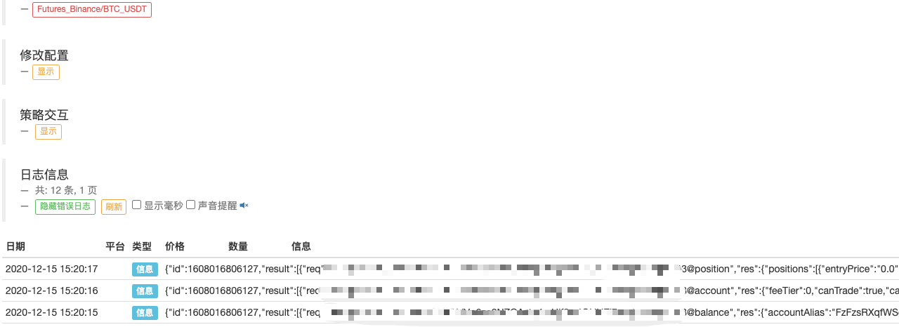

> Name

Binance Futures websocket interface query position account example
> Author

Inventor Quantification-Little Dream
> Strategy Description

## Binance Futures websocket interface query position account example
Binance Documentation: https://binance-docs.github.io/apidocs/delivery/cn/#e3ee8329c9
Add the configured Binance Futures exchange object during testing.
 


> Source (javascript)

``` javascript
function main() {
    LogReset(1)
    var ws = null
    exchange.IO("base", "https://dapi.binance.com")
    var obj = exchange.IO("api", "POST", "/dapi/v1/listenKey")
    Log(obj, typeof(obj))
    var listenKey = obj.listenKey
    Log("listenKey:", listenKey)
    var ts = new Date().getTime()
    ws = Dial("wss://dstream.binance.com/ws/" + String(listenKey))
    while (1) {
        var arr = ["balance", "account", "position"]
        for (var i in arr) {
            var info = {
                "method": "REQUEST",
                "params": [
                    listenKey + "@" + arr[i]
                ],
                "id": ts
            }
            ws.write(JSON.stringify(info))
            var ret = ws.read()
            Log(ret)
            Sleep(1000)
        }
        Sleep(1000)
    }
}
```

> Detail

https://www.fmz.com/strategy/242102

> Last Modified

2020-12-15 15:25:46
